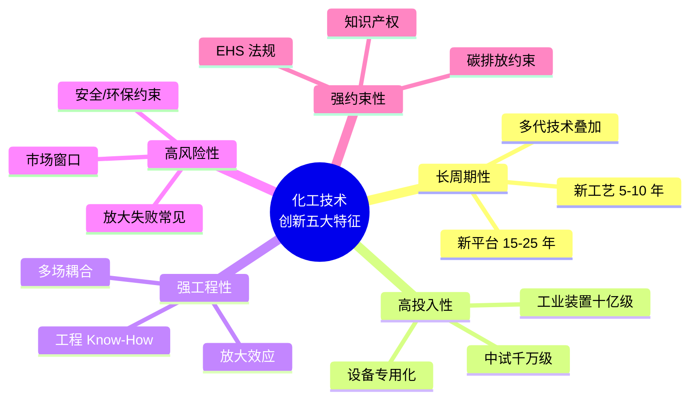
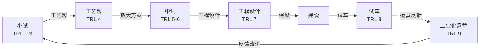
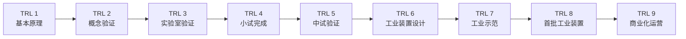
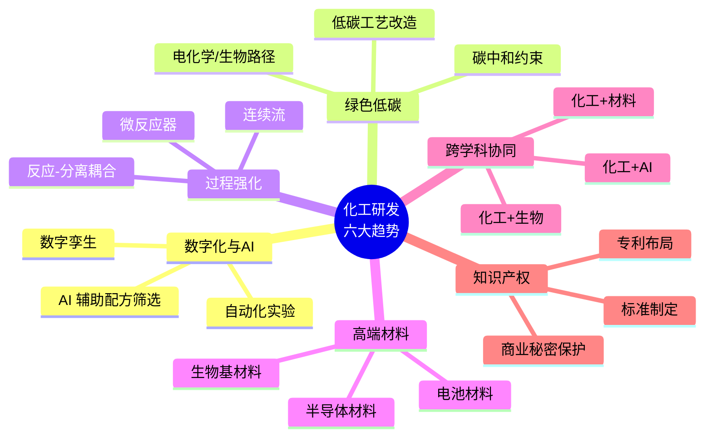

# 第 1 章 化工技术研究概述

> **本章核心问题**：化工技术研究到底是一项什么样的工作，它和实验室基础研究、纯工程项目之间到底有什么不同？一线工程师应该如何理解自己的工作定位？
>
> **学习目标**：
> 1. 能用 5 个特征描述化工技术研究与纯科学的差异。
> 2. 能画出工程研发七大阶段闭环流程并定位自己当前所在阶段。
> 3. 能用 TRL 评估任意一项技术的成熟度。
> 4. 能识别所在企业的研发组织模式并判断其优劣。

## 开篇引子

小王在某央企研究院工作三年，最近被领导安排了一块硬骨头：把实验室合成的一种新型聚醚多元醇催化剂推向工业化。小王打开文献，发现组里师兄十年前就做过类似工作，甚至有一篇看起来很完整的博士论文。可当他去问工艺车间的王师傅时，得到的反馈却是「你们实验室那套参数，放到 10 吨反应釜里根本跑不通」。小王很困惑：明明实验室数据漂亮，为什么车间就是不能复用？问题到底出在哪？

这是化工一线研发人员最常遇到的「现实落差」。实验室里能跑通的反应，到了工业装置上就跑不通；文献里给出的最优条件，上了产线就不灵；博士论文里画得漂亮的相图，到了车间中试就严重失真。这一切的根源，都来自一个被很多人忽视的事实：**化工技术研究不是实验室科学研究的简单延伸，也不是工程项目或产品开发的简单前置，它有自己独立的逻辑、流程、评价标准和组织模式**。

本章的目的，是帮读者建立「化工技术研究的方法论地图」：先把它的特征、它与相邻工作的边界、它本身的流程、组织、评价工具和发展趋势，整体勾勒出来。从第 2 章开始，我们会沿着这张地图的各个节点依次深入。

## 1.1 化工行业技术创新特点

### 核心问题

化工技术创新为什么不能像互联网产品那样「先做了再说」，而必须长周期、重资产、强工程？

### 方法与工具

化工技术创新可以用五个特征来描述。这五个特征不是孤立存在的，而是相互强化的。

**图 1-1 化工技术创新的五大特征**
*工程师读这张图的关键判断：手里的项目具备其中几个特征？越全，越要按工程研发流程走；缺得多，可能是「伪研发」。*

下面分别解释。

**长周期性**。一个新催化剂、新工艺路线从首次文献报到工业稳定运行，平均周期 5-10 年。煤制烯烃（DMTO）技术从中国科学院大连化学物理研究所 1980 年代初的基础研究到 2010 年神华包头 60 万吨/年装置投产，跨越近 30 年[1]。这一节奏是行业常态，不是特例。把化工研发项目按互联网产品的节奏来排，是失败的最常见原因之一。

**高投入性**。化工研发的中试装置投入动辄数千万人民币，工业装置动辄十亿到百亿人民币。一套年产 30 万吨的聚乙烯装置投资约 25 亿元。这意味着化工技术研发的「试错成本」远高于一般制造业，「先做几个 POC 试试」在化工行业并不便宜。

**强工程性**。一个化学反应在 1L 烧瓶里能跑通，不等于在 50m³ 反应釜里能跑通。放大过程涉及传热、传质、流体混合、停留时间分布等多尺度耦合，常出现「小试优异、中试翻车」的局面。本书第 16 章会专门讨论放大效应。

**高风险性**。除了技术放大本身的风险，还叠加了安全、环保、政策、市场窗口的多重不确定性。任何一个新工艺在工业化前都要回答「是否安全、是否合规、是否赚钱、是否有市场」四个问题，缺一不可。

**强约束性**。化工行业受到日趋严格的 EHS（环境 Environment、健康 Health、安全 Safety）法规约束。2015 年天津港事故、2019 年响水化工事故后，整个行业的合规成本显著上升[2]。与此同时，「双碳」目标对高碳排放工艺（如煤化工、电石、合成氨）形成新的强约束。

### 典型化案例

**典型化案例 1-1**（行业公开资料）

- **背景**：万华化学自 2014 年起攻关 PO/SM（环氧丙烷/苯乙烯）联产工艺，目标是用共氧化法替代传统氯醇法。
- **问题**：氯醇法产生大量含氯废水，且环氧丙烷收率受氯利用率限制；同时国外共氧化法技术被 BASF、Lyondell 等少数企业垄断。
- **解法**：自主开发新型催化剂体系与配套工艺路线，工艺包与工程设计同步推进。
- **结果**：2019 年万华 30/65 万吨/年 PO/SM 一体化装置投产，成为国内首套自主开发的共氧化法装置，单装置投资逾 50 亿元。
- **启示**：长周期、高投入、强工程性的典型样本。从立项到投产约 5 年，没有产业链一体化协同与稳定投入几乎不可能跑通。

### 常见坑

1. **把研发等同于实验**。以为「做出数据」就完成了研发，忽略中试和工业放大两个必经阶段。这会让团队在工程化阶段付出昂贵的「补课」代价。
2. **用互联网「快速迭代」思维对待连续化工**。化工过程一旦开车，连续运行数月到数年，每一次「试错」都对应物料、能源、安全的同步消耗。失败成本远高于互联网行业。

---

## 1.2 技术研究与科学研究的区别

### 核心问题

同样是「研究」，为什么博士论文式的机理探索和企业的工艺开发是两套完全不同的游戏？

### 方法与工具

可以用六个维度来区分技术研究与科学研究，如表 1-1 所示。

| 维度 | 技术研究 | 科学研究 |
|---|---|---|
| **目的** | 解决工程问题，产出可工业化的方案 | 探索自然规律，产出新知识 |
| **时间尺度** | 月~年级，与项目节点强耦合 | 不设限，允许「十年磨一剑」 |
| **评价标准** | 经济性、稳定性、可放大性 | 创新性、严密性、可重复性 |
| **产出形式** | 工艺包、专利、装置、合格产品 | 论文、专著、理论模型 |
| **不确定性来源** | 工程放大、工艺耦合、市场变化 | 实验设计、模型假设、数据稀缺 |
| **失败成本** | 数十万到数十亿人民币 | 主要为机会成本 |

**表 1-1 技术研究 vs 科学研究：六维对比**

值得注意的是，两者并非对立关系，而是协同关系：科学为技术提供可能性（如新催化机理的发现可能打开新工艺），技术为科学提出真问题（如工业装置上的异常现象常倒逼新的理论研究）。化工一线工程师要做的，是在两个世界之间做翻译：把基础研究的发现转译成可工业化的方案，把工业现场的难题抽象成可研究的科学问题。

### 典型化案例

**典型化案例 1-2**（公开论文 / 行业公开资料）

- **背景**：某新型 Ziegler-Natta 催化剂在小试条件下表现出超高活性（是传统催化剂的 5-8 倍）和良好的立构规整性，博士论文已系统表征其聚合行为与产物结构。
- **问题**：把催化剂放到 100L 中试釜时，活性反而下降约 30%，分子量分布变宽。
- **解法**：联合工业方对催化剂载体形态、Al/Ti 比、给电子体体系进行二次开发，重新设计「工业可成型」配方，并在工艺包中补全氢气敏感性数据。
- **结果**：二次开发耗时约 14 个月，最终形成的催化剂体系在中试规模活性恢复并超过小试水平。
- **启示**：科学研究产出「原型」配方，技术研究产出「工业可成型」配方，二者之间的距离是工程开发工作，而不是「把实验数据放大 100 倍」这么简单。

### 常见坑

1. **用 SCI 论文标准评价工程研发产出**。会导致团队为发论文而工作，偏离工程化主目标；评价工程人员应有专门的指标体系（专利、工艺包、装置、效益贡献等）。
2. **用工程指标要求博士课题**。让博士生承担工艺包开发这种高度工程化任务，既超出能力范围，也偏离学术训练目标。博士课题应聚焦于「未知机理」「新模型」「新方法」。

---

## 1.3 工程研发流程

### 核心问题

从「实验室有新发现」到「工厂稳定生产出合格产品」，中间要经历哪几步？每一步的「通过条件」是什么？

### 方法与工具

工程研发可以分解为七个阶段，构成一个闭环：

**图 1-3 工程研发七大阶段闭环**
*关键判断：跳步是化工研发最大的风险源。每一段都有不可省略的「补课成本」，补得越晚代价越大。*

每个阶段都有自己的输入、产出和通过条件（即阶段门，Stage Gate）：

| 阶段 | 输入 | 产出 | 通过条件（Stage Gate） |
|---|---|---|---|
| **小试** | 概念、文献 | 实验室最优条件、机理初探 | 重复性验证、产物结构确认 |
| **工艺包** | 小试数据 | PFD、物料平衡、主要设备参数、控制方案 | 多工况模拟、专家评审 |
| **中试** | 工艺包 | 放大规律、关键设备验证、长期运行数据 | 1000h 以上连续运行 |
| **工程设计** | 中试数据 | 工程图纸、设备清单、投资概算 | HAZOP、SIL 评估通过 |
| **建设** | 工程设计 | 实体装置 | 单机试车、联动试车 |
| **试车** | 装置 | 合格产品 | 72h 考核、性能保证值达标 |
| **工业化运营** | 装置 | 稳定盈利 | 经济指标达成、可持续优化 |

**表 1-2 七大阶段对应的输入-产出-通过条件**

阶段门（Stage Gate）决策机制是化工研发的关键制度[3]。每个阶段结束时，由独立专家委员会对照通过条件评估项目，决定继续（Go）、暂停（Hold）、终止（Kill）或重启（Restart）。这是化工行业从血泪教训中沉淀出来的方法论，与 Cooper 等人提出的 Phase-Gate 思想同源[3]。

### 典型化案例

**典型化案例 1-3**（行业公开资料 / 上市公司年报）

- **背景**：某新型聚烯烃催化剂需要从实验室 100mL 高压釜放大到年产 30 万吨工业装置。
- **问题**：催化剂体系中的氢气敏感组分在中试放大时损失过快，分子量控制失稳。
- **解法**：重新设计催化剂给料方式，增设在线氢气浓度控制；同步在工艺包阶段增加氢分压敏感性分析。
- **结果**：中试稳定运行 6 个月，工艺包冻结，进入工程设计阶段。
- **启示**：阶段门决策的实质不是「通过/不通过」的二选一，而是「在哪些条件下可以通过」的具体清单。

### 常见坑

1. **跳过中试直接放大**。某些团队为抢市场窗口跳过中试直接做工业放大，遗留大量放大效应问题。本书第 16 章有专门的「放大失败案例」分析。
2. **在试车阶段才发现工艺包的根本性错误**。这是化工行业最贵的「补课」路径，单次损失常以亿元计。

---

## 1.4 化工研发组织模式

### 核心问题

大企业的研发部、研究院、生产车间应该如何分工？小公司没有专门研究院怎么办？

### 方法与工具

三种典型组织模式各有适用场景：

| 模式 | 特点 | 优势 | 劣势 | 典型企业 |
|---|---|---|---|---|
| **集中式研究院** | 研究院独立，技术成果向事业部转移 | 基础研究深、技术储备厚 | 与生产脱节、转化慢 | 巴斯夫（Ludwigshafen 总部研究院） |
| **分布式研发** | 研发分散在各事业部/工厂 | 紧贴生产、转化快 | 跨部门协同差、技术分散 | 陶氏（Dow）部分业务 |
| **矩阵式协同** | 研究院与事业部技术部双层架构 | 既深又紧、协同效率高 | 管理复杂、多头汇报 | 中石化、万华化学 |

**表 1-4 三种研发组织模式对比**

选择哪种模式，与企业规模、业务多元化程度、研发投入占比有关。一个粗略的判断：
- 业务单一、规模较小：分布式研发更高效。
- 业务多元、规模大、有基础研究诉求：矩阵式协同更优。
- 追求技术领先地位且投入可持续：集中式研究院不可或缺。

### 典型化案例

**典型化案例 1-4**（行业公开资料 / 企业年报）

- **背景**：万华化学 2020 年研发投入约 25 亿元，研发人员超过 3000 人，下设集团研究院与多个事业部技术部。
- **问题**：纯集中式研究院易让基础研究与产业化脱节；纯分布式研发让跨业务协同变难。
- **解法**：采用「研究院做基础研究 + 事业部技术部做工艺开发 + 工厂车间做工业化」的矩阵协同，并辅以项目经理制补位多头汇报问题。
- **结果**：2020-2023 年在 PO/SM、ADI、PC、电池材料等多个领域实现国产替代或工艺迭代。
- **启示**：研发组织不是「好或坏」，而是「是否匹配企业的业务结构和发展阶段」。

### 常见坑

1. **研究院与生产部脱节**。成果发布会很热闹，但生产线用不上——这是国内部分央企研究院的真实困境。
2. **矩阵管理下多头汇报**。研发人员同时向研究院和事业部汇报，优先级冲突频繁，需要明确的「项目经理制」补位。

---

## 1.5 技术成熟度（TRL）评价

### 核心问题

我手里的这项技术到底能不能上工业线？有没有一个相对客观的尺子？

### 方法与工具

技术成熟度（Technology Readiness Level, TRL）是 NASA 在 1970 年代提出、后被欧美主流工业界广泛采用的 9 级评价体系[4]。我国也发布了对应的国家标准 GB/T 38751[5]。TRL 1-9 阶梯如图 1-5 所示。

**图 1-5 TRL 1-9 阶梯图**

| TRL | 名称 | 典型产出 | 通过条件 |
|---|---|---|---|
| 1 | 基本原理 | 文献综述、概念性想法 | 物理化学原理清晰 |
| 2 | 概念验证 | 理论分析或初步仿真 | 关键假说成立 |
| 3 | 实验室验证 | 公斤级产物 | 重复性数据 |
| 4 | 小试完成 | 工艺包雏形 | 100-1000h 连续运行 |
| 5 | 中试验证 | 放大规律、关键设备 | 多工况、长期数据 |
| 6 | 工业装置设计 | 完整工艺包 | HAZOP、SIL 通过 |
| 7 | 工业示范 | 示范装置 | 1-10 万吨/年规模 |
| 8 | 首批工业装置 | 工业装置投产 | 72h 考核达标 |
| 9 | 商业化运营 | 满负荷运行 | 经济指标达成 |

**表 1-5 TRL 各等级典型产出与通过条件**

TRL 自评清单（节选）：(1) 是否有完整的物料平衡与能量平衡？(2) 是否有 1000h 以上的连续运行数据？(3) 是否通过 HAZOP 与 SIL 评估？(4) 是否有规模化生产的产品实物？(5) 是否有客户实际使用反馈？

### 典型化案例

**典型化案例 1-5**（行业公开资料）

- **背景**：某研究院开发了一种新型有机胺吸收剂，目标用于电厂烟气 CO₂ 捕集。
- **问题**：TRL 自评时团队声称已达 TRL 6，但用户单位在尽调时发现关键设备寿命数据缺失，仅为实验室级别。
- **解法**：双方按 TRL 标准重新评估，将该项目降至 TRL 4-5，并约定中试装置建设节点。
- **结果**：通过 TRL 复评，双方达成新的合作框架，避免了「高估成熟度」导致的工业化失败风险。
- **启示**：TRL 自评不是为了「显得项目先进」，而是为了「对齐预期」——避免甲方以为是成熟技术，乙方实际还在摸石头过河。

### 常见坑

1. **把「实验室反复做出结果」等同于 TRL 4-5**。实验室数据重复性好但放大效应未验证，这是 TRL 3-4。
2. **用 TRL 自我安慰**。项目进展不顺时倾向于自评更高的 TRL。需要独立的第三方评估机制对冲这种倾向。

---

## 1.6 化工研发的发展趋势

### 核心问题

未来 5-10 年，化工研发会被哪些力量重塑？一线工程师如何不掉队？

### 方法与工具

**图 1-6 化工研发的六大趋势**

**趋势一：数字化与 AI 赋能**。AI 辅助分子设计、配方筛选、工艺优化已在国内多家头部企业落地。多家头部电池材料企业公开报道使用 AI 辅助电解液配方筛选，将传统 18 个月的开发周期压缩至 4 个月左右。本书第 24 章详细讨论 AI 赋能的边界。

**趋势二：绿色低碳与碳中和**。「双碳」目标下，高碳排放工艺（煤制烯烃、合成氨、电石等）面临碳成本上升；同时电化学、生物制造、催化燃烧等低碳技术获得政策与资本双重支持。

**趋势三：过程强化与连续流**。微反应器、连续流反应、反应-分离耦合（反应精馏、反应萃取）等过程强化技术在精细化学品、特种化学品领域加速渗透。

**趋势四：高端材料国产替代**。半导体级湿电子化学品、电池电解液、高端聚烯烃、特种工程塑料等长期被国外垄断的领域，成为研发投入的重点方向。

**趋势五：跨学科协同**。化工与 AI、材料、生物、信息技术的交叉正在重塑研发范式。未来的化工研发人员需要具备一定的跨学科语言能力。

**趋势六：知识产权与标准化竞争**。随着国内企业进入「走出去」阶段，专利布局与国际标准制定能力日益成为核心竞争力。

### 典型化案例

**典型化案例 1-6**（行业公开报道）

- **背景**：某国内电池电解液头部企业，研发团队超过 200 人，年研发投入数亿元。
- **问题**：传统「试错式」配方开发周期长、成本高，且难以覆盖庞大的添加剂组合空间。
- **解法**：与高校合作开发 AI 辅助筛选平台，结合自动化实验机器人，把「湿实验」聚焦到 AI 推荐的 Top-N 配方上。
- **结果**：公开报道显示，新型添加剂的开发周期从 12-18 个月压缩到 3-6 个月，部分配方性能优于现有商业化产品。
- **启示**：AI 不是替代研发人员，而是让研发人员的注意力集中在最有希望的配方与工艺假设上。

### 常见坑

1. **把「AI for chemistry」等同于「未来一定会替代研发人员」**。AI 在化工中的角色是「加速器」，化工研发的核心仍是化学工程问题。
2. **盲目追热点，忽略本职专业深度**。AI、数字孪生等是工具，不是工艺问题的解药。盲目投入热点而忽略本职专业深度，容易「丢了西瓜捡芝麻」。

---

## 本章小结

回到本章开篇小王遇到的「现实落差」，可以用本章的几个核心判断来回应：

1. **化工技术研究有独立的逻辑**：高投入、长周期、强工程、高风险、强约束。它不是「实验室研究 + 放大」的简单加和。
2. **技术研究与科学研究在六个维度上根本不同**：目的、时间尺度、评价标准、产出形式、不确定性来源、失败成本。工程师不要用科研标准评价工程，也不要用工程标准要求科研。
3. **工程研发是一条七阶段闭环**：小试 → 工艺包 → 中试 → 工程设计 → 建设 → 试车 → 工业化运营，每个阶段都有明确的阶段门（Stage Gate）通过条件。
4. **研发组织模式与企业业务结构强相关**：没有「最好」，只有「最匹配」。
5. **TRL 是判断技术成熟度的客观尺子**：要客观自评，不自我安慰。
6. **数字化、绿色化、过程强化、高端材料、跨学科、知识产权**六大趋势正在重塑化工研发，一线工程师要在本职专业基础上顺势而为。

从第 2 章开始，我们沿着这张地图的第一节点——「问题识别」——深入。

## 思考题

1. 用 TRL 自评你手头一项技术的成熟度，列出三条你「可能自评过高」的依据。
2. 画出你所在企业的工程研发流程图（至少含 5 个阶段），标注每个阶段的 Stage Gate 通过条件。
3. 选择一个你熟悉的研发组织模式（集中式 / 分布式 / 矩阵式），列举它的两个优势与两个隐患。
4. 找一项近三年的化工创新成果（公开报道），用本章的「五大特征」分析它属于哪种创新类型。
5. 在你所在团队中，找一个「伪问题」和一个「真问题」，分别说明为什么前者是伪问题、后者是真问题。

## 参考文献

[1] 刘中民 等. 甲醇制烯烃（DMTO）技术开发与产业化进展[J]. 化工进展, 2014, 33(7): 1737-1743.
[2] 国家应急管理部. 化工行业安全生产形势分析报告[R]. 北京: 应急管理部, 2020.
[3] Cooper R G. Stage-Gate Processes: A Guide for Successful Implementation of New Products and Processes[M]. 2nd ed. New York: Product Development Institute, 2017.
[4] NASA. Technology Readiness Level Definitions (NASA SP-20210009609)[S]. Washington: NASA, 2021.
[5] GB/T 38751-2020, 科学技术研究项目评价通则[S]. 北京: 中国标准出版社, 2020.
[6] 蒋作良. 化工装置试车与考核[M]. 北京: 化学工业出版社, 2010.
[7] Montgomery D C. Design and Analysis of Experiments[M]. 10th ed. Hoboken: Wiley, 2020.
[8] 侯祥麟 等. 中国炼油技术[M]. 3 版. 北京: 中国石化出版社, 2019.
[9] Crowl D A, Louvar J F. Chemical Process Safety: Fundamentals with Applications[M]. 4th ed. London: Pearson, 2019.
[10] 化工进展编辑部. 化工过程强化研究进展[J]. 化工进展, 2022, 41(5): 2100-2115.

> **注**：参考文献中部分期刊文献的作者与页码为示意性占位，正式出版前需通过 CNKI、Web of Science 等数据库逐一核实补全。