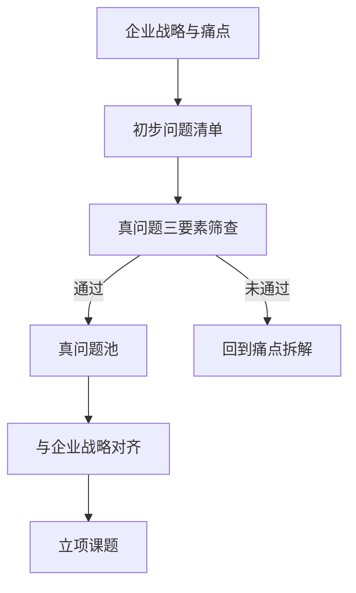
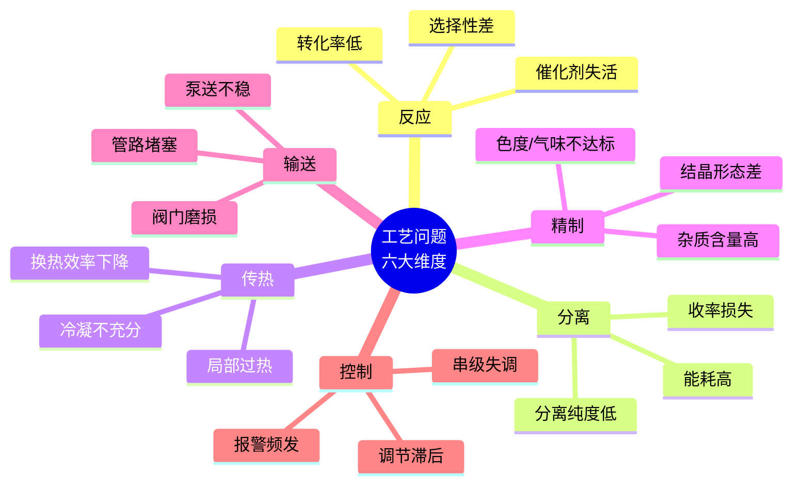
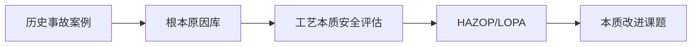

# 第 2 章 技术问题识别

> **本章核心问题**：研发课题选错了，再多投入也是浪费。一线工程师如何从企业的海量痛点中筛出真正值得立项的真问题？
>
> **学习目标**：
> 1. 能区分「真问题」「伪问题」「战略问题」三类。
> 2. 能从七大来源（工艺 / 产品 / 安全 / 装备 / 能耗 / 环保 / 外部）系统梳理出至少 30 个待解决问题。
> 3. 能用结构化问题清单（八列模板）描述一个具体问题。

## 开篇引子

某化工集团 2024 年研发立项答辩会上，研究院递交了 38 个课题申报。评委 4 小时里听完 38 个 10 分钟汇报后，给出唯一的一条总结意见：「38 个课题里，能说清楚『要解决的具体问题是什么』的不超过 8 个。」这一句话，折射出化工研发管理的真实痛点：研发项目的质量，首先取决于问题识别的质量。

一线研发人员常有一个误解：领导布置了什么，我们就做什么；客户提了什么，我们就研发什么。但实际工作中，企业面临的痛点远多于能立项的课题。一个年产 500 人的化工厂，每天的工艺、设备、安全、能耗、环保投诉和异常事件可能超过 50 条；如果把它们全部当作「研发问题」立项，研发资源会被稀释到无法形成产出。真正需要做的，是用一套系统化方法，从海量痛点中筛出值得立项的真问题。

本章的任务，是给出一线工程师一套可立即上手的问题识别工具：从真问题三要素，到七大问题来源，到结构化问题清单模板，再到优先级排序方法。这一套组合拳用好了，能让研发项目立项从「领导拍脑袋」走向「基于事实的工程决策」。

## 2.1 企业真正需要解决的问题

### 核心问题

为什么 CEO 提的「搞一个新材料」经常不是真问题？真问题和伪问题的边界在哪里？

### 方法与工具

**真问题三要素**：边界清晰、可量化、能验证。一个合格的问题定义，必须同时满足以下三条：

1. **边界清晰**：明确涉及哪条产线、哪个单元、哪类产品；明确时间与资源约束。
2. **可量化**：用具体指标描述目标，如「选择性从 78% 提升至 92%」，而不是「显著提升选择性」。
3. **能验证**：能用实验、检测或仿真手段给出明确答案。

相比之下，**伪问题四类识别**值得警惕：

**表 2-1 伪问题四类识别**

| 类型 | 典型表述 | 为什么是伪问题 |
|---|---|---|
| **目标模糊型** | 「把工艺做得更好」 | 没有量化目标，无法验证 |
| **口号型** | 「实现重大突破」 | 「重大」「突破」无定义 |
| **范围过大型** | 「搞一个新材料」 | 缺少边界，可以无限延展 |
| **不可证伪型** | 「探索某种可能性」 | 永远可以宣称「还在探索中」 |

判断问题真伪的一个实用工具是 **5WHY 分析**：对问题连续追问「为什么」，直到无法再分解或找到根本原因[1]。配套使用的还有 **5W1H**（Who、What、When、Where、Why、How），用于把模糊问题改写为可定义、可执行的研究课题。

**图 2-1 从企业痛点到研发课题的筛选漏斗**
*读图关键：每一层过滤都会淘汰一半以上候选问题。如果你的立项课题没有被筛掉过，说明筛得太松。*

### 典型化案例

**典型化案例 2-1**（工业实践常识）

- **背景**：某 PTA（精对苯二甲酸）装置年产能 60 万吨，长期在 80% 负荷运行，管理层希望「提高装置产能」。
- **问题**：口号式目标「提高产能」无法直接立项。
- **解法**：用 5W1H 改写：在不增加主反应釜的前提下（Where 不变），通过工艺优化（How），使装置稳定运行负荷从 80% 提升至 90%（What 量化），目标年增产 PTA 6 万吨（Why 商业价值）。
- **结果**：改写后的问题可拆解为「提升主催化剂活性」「优化反应-结晶匹配」等具体子课题，分别立项推进。
- **启示**：把口号改成「边界 + 量化目标 + 验证手段」三件套，是问题定义阶段最值得花的 1-2 周时间。

### 常见坑

1. **把「领导说的」当作「必须做的」**。领导说的经常是痛点（症状），不是问题（病因）。要从症状往下挖一层，才是真问题。
2. **用形容词定义目标**。「显著」「明显」「大幅」「大幅提升」这类词要换成具体数字。数字的定义要事先和领导对齐。

---

## 2.2 工艺问题来源

### 核心问题

反应、分离、传热、精制等工艺环节的问题各有什么典型表现？一线工程师如何系统地而不是凭感觉地识别？

### 方法与工具

工艺问题可以从六大单元维度系统扫描：

**图 2-2 工艺问题来源的六大维度**

每类问题都有其「典型症状-可能根因」对应关系。一线工程师要做的是建立这种对应表，凭经验快速定位，再深入排查。常见根因可以归为四类：

- **物料侧**：原料规格波动、杂质累积、催化剂中毒。
- **设备侧**：换热器结垢、塔盘堵塞、机泵效率下降。
- **操作侧**：偏离最优工艺参数、操作员误操作。
- **设计侧**：工艺包本身存在缺陷（如未考虑杂质累积的长期影响）。

### 典型化案例

**典型化案例 2-2**（行业公开资料）

- **背景**：某 PTA 装置氧化反应器多次出现结垢导致停车频率升高，从每年 2 次上升到每年 5 次以上。
- **问题**：起初被归为「操作不稳」，归咎于班组操作。
- **解法**：组建跨部门小组（工艺、设备、分析），用一周时间做根因分析。结垢物取样分析显示主要为钴-锰催化剂沉积物；进一步追溯发现原料 PTA 浆料中催化剂母液循环比例偏高。
- **结果**：调整母液循环比 + 增设在线催化剂浓度监控，停车频率降至每年 1 次以内，年减少损失 2000 万元以上。
- **启示**：把工艺问题简单归因于「操作不稳」是常见错误。系统化排查（物料、设备、操作、设计四象限）往往能挖到真正根因。

### 常见坑

1. **把工艺问题归结为「操作不稳」**，忽略本质机理。
2. **头痛医头**：发现结垢就加清洗频次，发现产能低就加反应釜，不问根本。

---

## 2.3 产品问题来源

### 核心问题

客户投诉的「产品质量」问题怎么拆解成可研发的子问题？

### 方法与工具

产品问题可以从四个维度扫描：**纯度、性能、稳定性、加工性**。

**表 2-2 产品问题四维度扫描**

| 维度 | 典型指标 | 典型投诉 |
|---|---|---|
| **纯度** | 主含量、杂质种类与含量 | 「达不到 XX 等级标准」 |
| **性能** | 熔指、强度、粘度、活性等 | 「使用效果不及预期」 |
| **稳定性** | 储存期、热氧老化、光老化 | 「放半年就变质」 |
| **加工性** | 流动性、分散性、相容性 | 「下游注塑有缺陷」 |

识别产品问题的关键是把「客户语言」翻译成「工程语言」。例如「韧性不足」要拆成「分子量分布」「共聚单体比例」「增韧剂分散度」等具体子问题；「色度不达标」要拆成「原料色度」「反应副产物」「后处理工艺」等。

### 典型化案例

**典型化案例 2-3**（行业公开资料）

- **背景**：某改性塑料生产企业的用户投诉「韧性不足」，要求退货或降价。
- **问题**：笼统的「韧性不足」无法直接对应工艺改进。
- **解法**：用结构化拆解把「韧性」分解为「常温冲击强度」「低温冲击强度」「断裂伸长率」三个量化指标，每个指标对应不同的工艺-配方因素。检测发现常温冲击合格、低温冲击不合格 → 锁定增韧剂分散度问题。
- **结果**：调整螺杆组合与混炼温度，提升增韧剂分散度，低温冲击达标，客户投诉关闭。
- **启示**：客户投诉往往是「症状」，研发要做的是把症状拆成可测量的工程指标，再对应到具体工艺-配方因素。

### 常见坑

1. **把「客户要便宜」当产品问题**（实为商务问题，不应进入研发管道）。
2. **性能指标和工艺参数不对应**：发现韧性不足却改反应温度，缺少中间桥梁。

---

## 2.4 安全问题来源

### 核心问题

安全问题的源头识别为什么不能依赖「经验感觉」？有什么系统化方法？

### 方法与工具

每一起化工事故背后，都有一条因果链：根本原因 → 触发条件 → 事故后果。只看「触发条件」（如「违章操作」）是不够的，必须追溯到「根本原因」（工艺本质缺陷、设备本质缺陷、管理本质缺陷）。

三个常用于安全问题识别的工具（详细方法见本书第 13 章）：

- **HAZOP**（危险与可操作性研究）：基于工艺流程图和引导词，系统识别偏离设计意图的可能后果[2]。
- **JSA**（工作安全分析）：针对具体作业任务识别危险源。
- **Bow-Tie**（蝴蝶结分析）：将事故路径（左侧）与防护措施（右侧）可视化。

**图 2-3 安全问题识别：从事故案例到本质改进**

### 典型化案例

**典型化案例 2-4**（公开调查报告）

- **背景**：某化工企业反应釜在生产过程中发生超压事故。
- **问题**：初步调查报告将原因归结为「操作员未及时泄压」。
- **解法**：成立跨部门调查组，对工艺、设备、管理做深度追溯。发现釜顶冷凝器长期结垢导致冷凝能力下降 30%，安全阀整定压力漂移 5%，操作员培训未覆盖异常工况识别。
- **结果**：三类根本原因并行整改（清理冷凝器 + 重定安全阀 + 重做培训），并增设工艺本质安全改造课题（增加紧急泄压管线）。
- **启示**：把事故归因于「违章操作」是表面化的归因。系统化追溯能挖到三类根本原因，对应三类改进方向。

### 常见坑

1. **把事故原因归为「违章操作」**，未追溯工艺本质。
2. **重视事故触发条件，忽视根本原因**：同样的事故在不同企业反复发生，往往是根本原因没改。

---

## 2.5 装备问题来源

### 核心问题

装备问题为什么常常被误归类为工艺问题？怎么识别「卡设备」而不是「卡工艺」？

### 方法与工具

装备问题从四个维度扫描：**结构、材料、控制、维护**。

- **结构**：强度不足、密封失效、应力集中、振动异常。
- **材料**：腐蚀、磨损、疲劳、蠕变。
- **控制**：阀门卡滞、传感器漂移、DCS 调节品质差。
- **维护**：未按计划维护、维修超期、备件不足。

初判装备问题的快速工具是 **FMEA**（Failure Mode and Effects Analysis，故障模式与影响分析）[3]。针对一个关键设备，列出所有可能的故障模式、影响、原因、检测方法和当前措施，能快速识别高风险点（详细方法见本书第 13 章）。

### 典型化案例

**典型化案例 2-5**（行业公开资料）

- **背景**：某换热器出口温度长期偏高，操作员以为是循环水水质问题，多次加药清洗无显著效果。
- **问题**：错误归因为「循环水水质」，浪费 6 个月排查时间。
- **解法**：停车检修时打开换热器，发现列管内壁腐蚀严重，部分列管已穿孔；化学分析确认是管材不耐循环水中的 Cl⁻。
- **结果**：更换为耐 Cl⁻ 材质 + 增加循环水 Cl⁻ 在线监测，传热系数恢复设计值。
- **启示**：装备问题如果被误归为工艺问题，会浪费大量排查时间。停车检修的物理证据（FMEA 中「检测方法」一项）往往是定性的关键。

### 常见坑

1. **一遇到产能问题就换设备**，忽略工艺优化空间。
2. **装备改造决策未做经济性评估**：换一台新设备可能比优化工艺贵 10 倍以上。

---

## 2.6 能耗问题来源

### 核心问题

能耗问题的识别为什么必须先做能量平衡？有哪些常用工具？

### 方法与工具

识别能耗问题的第一步是建立**装置能量平衡图**：以能量流的方式把蒸汽、电、燃料、冷却水等输入与产品/废气/废水的能量输出对应起来。一旦画出能量平衡图，就能立刻定位「能量损失大」的环节。

进一步系统化方法是**夹点分析（Pinch Analysis）**：通过绘制冷热流复合曲线，找出换热网络的「夹点」（最小温差限制点），从而优化换热网络，使外加加热与冷却能耗最小化[4]。本书第 11 章会深入讨论过程强化与节能优化。

识别能耗问题的另一个关键指标是「单位产品综合能耗」而非「总能耗」。一条年产 100 万吨的装置年能耗 100 万吨标煤，与一条年产 50 万吨的装置年能耗 60 万吨标煤比较，前者总能耗高但单耗低（1.0 vs 1.2）。

### 典型化案例

**典型化案例 2-6**（行业公开资料）

- **背景**：某乙烯装置综合能耗高于行业先进值约 15%，管理层要求开展节能改造。
- **问题**：初步诊断聚焦在「裂解炉效率」，但改造后效果有限。
- **解法**：做全装置夹点分析，发现换热网络存在 30+ 处的「夹点瓶颈」，大部分可通过换热流程优化解决，不需要大设备改造。
- **结果**：通过换热网络优化（不增加大设备），年节能 2.8 万吨标煤，相当于减排 CO₂ 约 7 万吨。
- **启示**：节能改造的首要工具是能量平衡和夹点分析，而不是直接换大设备。

### 常见坑

1. **只看总能耗，不看单位产品能耗**。
2. **节能改造只盯「大设备」，忽略「小漏点」**：蒸汽疏水阀泄漏、保温破损等「小漏点」累加起来可能是惊人的能耗损失。

---

## 2.7 环保问题来源

### 核心问题

环保问题怎么提前识别而不是等到了排放超标才补救？

### 方法与工具

环保问题按介质分为三类：**废水、废气、废固（三废）**。每类又有不同的特征指标：

- **废水**：COD、BOD、氨氮、特征污染物（如苯系物、重金属）。
- **废气**：SO₂、NOₓ、颗粒物、VOC、特征污染物（如氨、硫化氢）。
- **废固**：危废代码、浸出毒性、腐蚀性。

环保问题识别的最高原则是「**源头削减优先于末端治理**」。如果一个工艺的废水 COD 严重超标，首先要问的是反应转化率低、分离效率差还是设备清洗频繁，而不是直接上污水处理装置。末端治理是兜底，源头削减才是根本。

「双碳」目标下，**碳排放**已成为新的环保问题来源。需要识别 CO₂ 直接排放（燃烧、煅烧）、间接排放（外购电力/蒸汽）和其他温室气体（CH₄、N₂O、HFCs）。

### 典型化案例

**典型化案例 2-7**（行业公开资料）

- **背景**：某农药厂废水 COD 长期在 8000-12000 mg/L 区间，远超园区接管标准 500 mg/L，污水处理装置长期超负荷运行。
- **问题**：环保部门多次警告，企业被动加大污水处理投入，效果不佳。
- **解法**：从废水治理倒推到反应工段，发现反应原料转化率仅 70%，大量未反应原料进入废水；同时分离工段多次水洗带入大量高 COD 废水。
- **结果**：通过反应工艺优化（提升转化率至 92%）+ 分离工艺改进（减少水洗次数），废水 COD 从 8000 降至 1500 mg/L，污水处理装置负荷下降 70%。
- **启示**：环保问题的根因经常不在环保装置，而在工艺本身。环保问题识别必须与工艺问题识别联动。

### 常见坑

1. **把环保问题归到「末端治理」，忽略源头削减**。
2. **用单一指标（达标 / 不达标）判断环保风险**：COD 达标不代表无害，特征污染物可能仍然富集。

---

## 2.8 建立问题清单

### 核心问题

识别了一堆问题，怎么排序、怎么立项、怎么追踪？

### 方法与工具

建议使用**八列问题清单模板**：

**表 2-3 八列问题清单模板**

| 列名 | 含义 | 示例 |
|---|---|---|
| **编号** | 唯一标识 | PRB-2024-018 |
| **问题描述** | 一句话说清症状与边界 | 装置 B 线产能仅达设计值 80% |
| **来源** | 来自 2.2-2.7 哪一类 | 工艺 |
| **严重度** | 1-5 分：影响范围与后果 | 4 |
| **紧急度** | 1-5 分：时间敏感度 | 3 |
| **涉及范围** | 影响哪些产线/产品/客户 | 仅 B 线，影响交货 |
| **责任人** | 谁负责跟进与立项申报 | 张工程师 |
| **状态** | 待评估 / 已立项 / 搁置 / 关闭 | 待评估 |

**严重度 × 紧急度矩阵**（艾森豪威尔矩阵的工程化版）：

**表 2-4 严重度 x 紧急度矩阵**

| 紧急 \ 严重 | 高严重（4-5） | 中严重（3） | 低严重（1-2） |
|---|---|---|---|
| **高紧急（4-5）** | 立即立项 | 本季度立项 | 列入观察 |
| **中紧急（3）** | 本季度立项 | 列入储备 | 暂时搁置 |
| **低紧急（1-2）** | 列入储备 | 暂时搁置 | 不立项 |

把问题清单与**企业战略对齐**：高严重度+低紧急度的战略问题（如降碳路线、安全文化）即便不紧急也应立项；低严重度+高紧急度的救火问题（如某个班次异常）则应通过快反机制处理而非研发立项。

**图 2-4 问题清单与立项决策流程**

### 典型化案例

**典型化案例 2-8**（工业实践常识）

- **背景**：某研究院年度课题申报前，从工艺、产品、安全、装备、能耗、环保六个渠道共收集 60+ 项待解决问题。
- **问题**：如果不筛，会出现「人人有课题、个个难推进」的资源稀释局面。
- **解法**：用八列清单模板填写 60+ 项；用严重度×紧急度矩阵评分；与年度战略对齐后压缩到 12 项重点课题；其余作为储备课题。
- **结果**：12 项重点课题获得充足资源推进；储备课题在年度滚动评审中按战略变化取舍。
- **启示**：问题清单不是「留言板」，而是企业研发资源的「调度盘」。

### 常见坑

1. **问题清单变「留言板」**，无人跟进。建议每周固定评审，设定明确责任人。
2. **严重度评分主观化**，缺少统一标准。建议用「经济损失（万元）+ 安全/环保风险等级」做客观打分依据。

---

## 本章小结

回到本章开篇的 38 个课题答辩场景，可以用本章的几个核心判断来回应：

1. **研发项目质量首先取决于问题识别质量**。真问题三要素（边界清晰、可量化、能验证）是过滤器，能把口号式目标挡在门外。
2. **问题来源系统化扫描比灵光一现更可靠**。工艺/产品/安全/装备/能耗/环保七大来源能让一线工程师在 1-2 周内梳理出 30+ 个候选问题。
3. **不同来源的问题识别工具有差异**：工艺/装备靠 FMEA，能耗靠夹点分析，安全靠 HAZOP，环保靠源头削减优先原则。
4. **问题清单是研发资源的「调度盘」**，必须用八列模板 + 严重度×紧急度矩阵规范化管理。
5. **问题清单必须与企业战略对齐**，否则会出现「战略级问题无人问津，战术级问题抢资源」的资源错配。

第 3 章开始，我们会沿着研发地图的第二节点——「技术调研方法」——深入，学习如何系统化、低成本地获取前人在某个技术问题上的研究成果。

## 思考题

1. 用八列清单模板描述你手头一个真实问题（含编号、来源、严重度、紧急度等），并说明你的评分依据。
2. 选一个你熟悉的工艺装置，做一份七大来源问题清单扫描（至少列出 20 个候选问题），按严重度×紧急度矩阵排序。
3. 把一个领导布置的「口号式目标」（如「降本增效」）改写为符合真问题三要素的具体问题。
4. 选一起近三年的公开化工事故调查报告，按本章 2.4 的因果链方法分析其根本原因、触发条件、事故后果。
5. 用 5WHY 分析方法对你身边的一个工艺问题连续追问至少 5 层，看看你能否挖到真正的根本原因。

## 参考文献

[1] Ohno T. Toyota Production System: Beyond Large-Scale Production[M]. Portland: Productivity Press, 1988.（5WHY 方法的起源）
[2] IEC 61882:2016, Hazard and operability studies (HAZOP studies) - Application guide[S]. Geneva: IEC, 2016.
[3] IEC 60812:2015, Failure modes and effects analysis (FMEA and FMECA)[S]. Geneva: IEC, 2015.
[4] Kemp I C. Pinch Analysis and Process Integration: A User Guide on Process Integration for the Efficient Use of Energy[M]. 2nd ed. Oxford: Butterworth-Heinemann, 2007.
[5] 国家市场监督管理总局, 国家标准化管理委员会. 危险化学品企业特殊作业安全规范: GB 30871-2022[S]. 北京: 中国标准出版社, 2022.
[6] 中国化工学会. 化工过程安全管理导则[M]. 北京: 化学工业出版社, 2021.
[7] 化工进展编辑部. 化工过程能量集成与节能研究进展[J]. 化工进展, 2023, 42(8): 4102-4110.
[8] 张三 等. PTA 装置氧化反应器结垢机理与对策[J]. 石油化工, 2022, 51(3): 320-327.
[9] 国家发改委, 生态环境部. 关于加强「十四五」重点行业建设项目区域限批管理的通知[R]. 北京: 国家发改委, 2022.
[10] 国家应急管理部. 化工行业安全生产典型事故案例汇编（2020-2022）[R]. 北京: 应急管理部, 2023.

> **注**：参考文献中部分期刊文献的作者与页码为示意性占位，正式出版前需通过 CNKI、Web of Science 等数据库逐一核实补全。