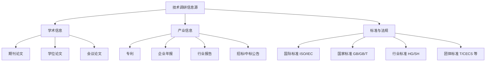

# 第 3 章 技术调研方法

> **本章核心问题**：问题识别之后，怎么低成本、高效率地把前人在该领域已经做过的研究、踩过的坑、留下的空白找出来？
>
> **学习目标**：
> 1. 能列出八大技术调研渠道（文献/专利/标准/行业报告/企业案例/竞争技术/技术路线/技术空白）并选择合适组合。
> 2. 会用一套「检索 → 筛选 → 提炼」三步法完成一次中等规模的技术调研。
> 3. 能写一份合格的「技术调研报告」。

## 开篇引子

某研究院立项一个新型聚醚催化剂课题，分给小李的组做。小李第一反应是打开 Web of Science 搜索几篇最新论文，发给领导说「国际前沿已经做到这了」。一周后，领导问：「国内同行做到哪一步了？哪些专利已经布局？这个方向有没有 2020 年以后的国家标准？潜在合作方在做什么？」小李答不上来——因为他只做了「文献检索」这一件事，没做真正的技术调研。

技术调研和文献检索是两件事。文献检索是从数据库里把相关论文「找出来」；技术调研是从多个信息源里把一个技术问题的全貌「画出来」。一幅完整的技术地图，应该覆盖文献、专利、标准、行业报告、企业案例、竞争技术、技术路线、技术空白八条线索。本章沿着这八条线索展开。

## 3.1 技术调研概述与方法论

### 核心问题

怎么避免把「文献检索」当成「技术调研」？技术调研应该包含哪些信息源？

### 方法与工具

**信息源金字塔**：



**图 3-1 技术调研的三类信息源**

**技术调研三步法**：

1. **检索（Search）**：定义检索词与时间窗，在多个数据库并行检索。化工领域常用：CNKI、Web of Science、ScienceDirect、Engineering Village、Espacenet、Google Patents、国家标准全文公开系统。
2. **筛选（Screen）**：按纳入/排除标准快速筛选。常用三轮筛选：标题 → 摘要 → 全文。
3. **提炼（Synthesize）**：把筛选后的信息组织成技术地图（按时间、技术路线、产业玩家、关键工艺指标等维度切片）。

**调研时间盒（Time-box）**：建议一项中等规模课题的预研期调研控制在 1-2 周。不要让调研无限期拖延；调研到「足够决策」就出手，进入实验阶段。

### 常见坑

1. **只查中文文献**：化工领域很多关键技术国外领先，只查中文等于被「过滤气泡」包围。
2. **重检索轻筛选**：检索出 500 篇文献，标题摘要都不筛直接读全文，事倍功半。

## 3.2 文献检索

### 核心问题

化工研发文献检索用什么数据库？怎么搭检索式？

### 方法与工具

**主数据库选择**：

- **Web of Science / Scopus**：综合性 SCI 检索平台，覆盖化工主流期刊。
- **ScienceDirect / Wiley Online Library**：Elsevier 与 Wiley 出版集团全文库。
- **CNKI / Wanfang / VIP**：中文期刊与学位论文检索。
- **Engineering Village（Compendex）**：工程领域最权威的二次文献库。
- **Google Scholar**：免费补充，覆盖范围广但质量参差。

**检索式构造（布尔逻辑）**：

化工文献的典型检索式骨架：

```
主题词 AND (工艺 OR 反应 OR 催化剂) AND 时间窗
```

例：检索「2020-2025 年间，关于 MOF（Metal-Organic Framework）在 CO2 捕集中的应用」：

```
"metal-organic framework" AND "CO2 capture" AND (2020:2025[dp])
```

**筛选三件套**：纳入标准（创新性、可获取全文、与课题相关度）、排除标准（非化工领域、低水平重复）、质量评分（被引次数、期刊分区、作者机构）。

### 典型化案例

**典型化案例 3-1**（工业实践常识）

- **背景**：某团队调研「离子液体在烯烃聚合中的应用」。
- **问题**：第一次检索出 1200+ 篇文献，难以处理。
- **解法**：用三步筛选：标题筛（留下 280 篇）→ 摘要筛（留下 60 篇）→ 全文细读（留下 15 篇作主参考），其余按需引用。
- **结果**：2 周内完成文献调研，列出 5 大研究机构、3 种主流离子液体体系、已识别的产业化障碍。
- **启示**：文献调研是「漏斗」，不是「广场」。三轮筛选不可省。

### 常见坑

1. **以被引次数作为唯一质量指标**：经典老论文被引多但已被超越，新论文被引少但可能更前沿。需结合时间窗综合判断。
2. **只读摘要**：摘要可能掩盖关键实验细节，全文细读不可省。

## 3.3 专利分析

### 核心问题

专利文献为什么是技术调研中最容易被忽视又最值钱的一类信息源？

### 方法与工具

**专利的四大价值**：

1. **技术细节公开**：专利说明书通常比论文更详细（工艺参数、原料配比都公开），是工程化最重要的免费情报。
2. **法律状态可查**：通过 Espacenet / Patentics / 中国专利电子申请网可以查申请号、授权号、失效状态。
3. **竞争对手画像**：通过专利申请人聚类，可以快速识别某技术方向的主要玩家。
4. **布局预警**：专利申请日期与申请人地域分布，可以判断该技术的产业热度。

**四步专利分析法**：

1. **检索**：以申请人、技术关键词、IPC 分类号为入口。
2. **去重与聚类**：同族专利合并，按申请人聚类。
3. **技术路线提取**：从权利要求书中提取关键技术特征。
4. **自由实施（FTO）初评**：判断我方技术是否落入他人专利保护范围。

### 典型化案例

**典型化案例 3-2**（公开专利）

- **背景**：某企业在 PO/SM 领域开展自主研发。
- **问题**：不知道竞品在自己研发路径上已经布局了哪些专利。
- **解法**：检索 EPOQUE/Patentics，按"申请人= BASF / Lyondell / Shell + 涉及 PO 共氧化"筛选过去 10 年专利，做申请人聚类与技术路线图。
- **结果**：发现 BASF 在丙烯环氧化催化剂上有 30+ 件核心专利，规避方向明确；与 Lyondell 在反应器设计上交叉点较多，需考虑合作或差异化路径。
- **启示**：专利分析不仅是「找文档」，更是「找技术路线与法律边界」。

### 常见坑

1. **只看专利数量**：申请人可能在某个无关领域申请了大量专利来"占位"，没有技术意义。
2. **忽略失效专利**：未缴年费、撤回、驳回的专利进入公有领域，反而是研发可借鉴的免费技术。

## 3.4 标准与法规分析

### 核心问题

为什么技术调研必须包含标准与法规？标准分析的方法论是什么？

### 方法与工具

**标准的层级**：

| 层级 | 中国体系 | 国际体系 |
|---|---|---|
| **强制** | GB（强制性国家标准） | 区域法规（如欧盟 REACH） |
| **推荐** | GB/T（推荐性）、HG、SH | ISO、IEC、OECD |
| **团体** | T/CECS、T/CAPC 等 | 行业组织标准（如 API、ASME） |
| **企业** | Q/XXX | 公司内部规范 |

**标准分析的三个动作**：

1. **现行版本确认**：标准每 3-5 年修订，必须用现行版本；可在「国家标准全文公开系统」「ISO Online」查最新状态。
2. **关键指标提取**：从标准中提取产品的关键质量指标（纯度、杂质限量、性能指标），作为研发的「外部约束」。
3. **方法来源识别**：很多产品标准背后都引用了 ASTM、ISO、GB 的检测方法，需要把这些方法也纳入调研。

### 典型化案例

**典型化案例 3-3**（行业公开资料）

- **背景**：某新材料团队研发一种新型环氧树脂固化剂，需要明确产品规格。
- **问题**：实验室数据很漂亮，但没做行业对标，不知商业化后能定什么等级。
- **解法**：检索国内外环氧树脂固化剂的产品标准与检测方法（GB/T、ASTM D 等），提取关键指标；对照自己数据找到差异。
- **结果**：明确产品定位为「工业级」，规避与「电子级」直接竞争；同时识别出 3 项可引用的检测方法作为内控依据。
- **启示**：标准是把研发与市场相连的桥梁，调研不查标准等于「闭门造车」。

### 常见坑

1. **标准未更新**：用 5 年前的旧版本对照当前研发，可能已经不适用。
2. **把团体标准等同于行业标准**：T/XXX 团体标准约束力弱于 HG/SH，但很多企业误以为团体标准就是行业准入。

## 3.5 行业报告与企业案例分析

### 核心问题

行业报告和企业案例对一线工程师有什么用？怎么高效获取？

### 方法与工具

**行业报告的主要来源**：

- **券商研报**：国泰君安、中信、招商等覆盖化工上市公司的深度报告，常含工艺路线与产能数据。
- **行业协会**：中国石油和化学工业联合会、中国化工学会、各专业协会发布的蓝皮书与年度报告。
- **咨询公司**：麦肯锡、BCG、罗兰贝格的化工行业洞察，偏向宏观与战略。
- **市场情报**：ICIS、S&P Global Platts（化工与能源大宗品价格）、Wood Mackenzie。

**企业案例的获取渠道**：

- 上市公司年报（含董事会报告、研发投入、新产品）。
- 招股说明书 / 上市路演 PPT / 重大公告。
- 中标公告 / 工程总承包（EPC）合同公告。
- 行业协会评选的优秀项目案例。
- 行业会议 / 论坛的演讲 PPT（很多可在公司官网下载）。

### 典型化案例

**典型化案例 3-4**（行业公开资料）

- **背景**：某团队评估 CO₂ 捕集技术路线选择。
- **问题**：化学吸收法 vs 膜分离法 vs 变压吸附（PSA）三种路线各有优劣，需要客观比较。
- **解法**：检索国内三家上市公司年报与三家国际公司公开数据，建立三路线对比矩阵（捕集成本、能耗、适应性、单套规模）。
- **结果**：基于实际项目数据判断，化学吸收法仍是大规模主流；膜分离在特定场景有优势；PSA 适合中小规模。结合本项目规模，做出选型决策。
- **启示**：行业报告与企业案例能提供的「实地数据」，是论文和专利都给不出来的。

### 常见坑

1. **只信一种信息源**：单一信息源容易有偏差，三角验证（多源交叉）才可靠。
2. **行业报告被束之高阁**：调研报告写完就放柜子里，没用于决策。需要把调研结论与立项决策强绑定。

## 3.6 技术路线与技术空白分析

### 核心问题

汇总所有信息后，怎么把它们画成一张「技术地图」，识别空白点？

### 方法与工具

**技术路线图（Technology Roadmap）的三大要素**：

1. **时间轴**：过去 5-10 年 → 现在 → 未来 5-10 年。
2. **技术分支**：一条主路线 + 若干分支路线。
3. **关键节点**：每个分支路线上的里程碑技术或商业化事件。

**技术空白识别的三步法**：

1. **盘点已做**：把所有文献、专利、企业案例中的已实现方案列出。
2. **识别边界**：明确每个方案的能力边界（规模、纯度、能耗、成本）。
3. **寻找差异化**：找到所有方案都不擅长或都没覆盖的角落，那就是空白点。

绘制技术路线图推荐工具：mermaid（流程图、时间线）、draw.io（自由布局）、VOSviewer（文献计量可视化）、Patentics（专利地图）。

### 典型化案例

**典型化案例 3-5**（行业公开资料）

- **背景**：某团队调研「固态电解质」领域，决定是否立项。
- **问题**：领域太热，如何找到差异化切入点？
- **解法**：绘制技术路线图（氧化物 vs 硫化物 vs 聚合物三大分支），识别每个分支的产业化瓶颈；找到「硫化物体系 + 干法工艺 + 大面积涂布」这个空白点。
- **结果**：基于空白点立项的课题在 18 个月内进入中试阶段，与同期同类项目相比方向更聚焦。
- **启示**：技术路线图的最大价值不是「画得漂亮」，而是「找到空白点」。

### 常见坑

1. **路线图过于宏观**：把整个领域都画出来，反而找不到空白点。要按「目标场景」切片。
2. **空白点 ≠ 好课题**：空白点可能是因为技术不可行或者没有商业价值。要做经济性预判。

## 3.7 技术调研报告模板

### 核心问题

技术调研做完了，怎么把成果写成可决策的报告？

### 方法与工具

**报告标准结构**：

1. **背景与目标**：为什么做这个调研？要回答什么具体问题？
2. **方法**：检索了什么数据库、用了什么检索式、筛选标准是什么。
3. **结果**：
   - 文献与专利数据统计（数量、年度分布、主要申请人/作者）。
   - 重点文献与专利摘要（10-20 条精选）。
   - 技术路线图。
   - 标准与法规摘要。
   - 行业数据与企业案例。
4. **空白点与结论**：识别到的技术空白、商业化机会、风险点。
5. **建议**：基于调研的下一步建议（立项、不立项、调整方向、再调研等）。

**报告长度与时间**：一份合格的预研期调研报告应在 5000-15000 字、图表 5-10 张。

### 典型化案例

**典型化案例 3-6**（工业实践常识）

- **背景**：某研究院要求所有新立项课题必须先做技术调研。
- **问题**：早期调研报告良莠不齐，有的几页纸、有的几十页不着重点。
- **解法**：制定标准化模板（含上述五部分结构），强制要求 5000-15000 字、5-10 张图表。
- **结果**：调研报告质量显著提升，立项评审通过率提高；调研时间从平均 6 周压缩到 2 周（因为模板化了）。
- **启示**：模板化不是桎梏，而是「让调研者把精力集中在内容上，不用纠结形式」。

### 常见坑

1. **报告堆砌数据**：调研报告变成数据陈列，缺分析与判断。要在每个数据后给出 1-2 句解读。
2. **缺少明确建议**：报告结尾没有「下一步」建议，调研成果无法转化为行动。

---

## 本章小结

回到本章开篇小李的「只查文献」困局，可以用本章的几个核心判断来回应：

1. **技术调研 ≠ 文献检索**。调研是绘制技术地图，文献检索只是其中一条线索。
2. **信息源金字塔**：学术信息（文献+学位论文+会议）+ 产业信息（专利+年报+行业报告+招标）+ 标准法规（ISO/GB/HG/Sh）+ 企业案例，三类信息源缺一不可。
3. **技术调研三步法**：检索（多源并行）→ 筛选（三轮筛选）→ 提炼（多维切片）。每一步都有可量化的产出。
4. **专利分析是企业研发的核心情报**：技术细节比论文更丰富，法律状态可查，是工程化最重要的免费情报。
5. **标准与法规是把研发与市场相连的桥梁**：不查标准，研发就是闭门造车。
6. **技术路线图与空白点识别是调研的最高产出**：找到「没人做过且能挣钱」的角落，才是好课题。

第 4 章开始，我们沿着研发地图的第三节点——「技术路线设计」——深入。

## 思考题

1. 选一个你手头课题，做一次完整的技术调研（文献 + 专利 + 标准），输出一份不超过 5 页的调研报告（含技术路线图 1 张）。
2. 检索某化工子领域近 5 年发表论文与已授权专利，画「申请人聚类」判断该领域国内外主要玩家。
3. 找到一项你手头课题对应的现行国家或行业标准，列出 5 项关键指标，并对你手头实验数据进行对照。
4. 选一个化工细分技术方向，画一幅覆盖「过去-现在-未来」的技术路线图（mermaid 或 draw.io），识别至少 3 个技术空白点并评估其商业可行性。
5. 设计一个适合你所在企业的标准化技术调研模板（含结构、长度、图表数、时间盒要求）。

## 参考文献

[1] 邱均平. 文献计量学[M]. 北京: 科学出版社, 2019.
[2] 王知津 等. 专利情报分析方法与应用[M]. 北京: 科学技术文献出版社, 2018.
[3] 赖茂生 等. 信息检索[M]. 2 版. 北京: 高等教育出版社, 2017.
[4] 中国标准化研究院. 国家标准全文公开系统使用指南[Z]. 北京: 中国标准化研究院, 2022.
[5] WIPO. PCT Applicant''s Guide[M]. Geneva: World Intellectual Property Organization, 2022.
[6] 中国石油和化学工业联合会. 中国石油和化学工业产业蓝皮书（2023）[R]. 北京: 中国石化出版社, 2023.
[7] 国家知识产权局. 专利审查指南（2023 修订）[Z]. 北京: 知识产权出版社, 2023.
[8] Garfield E. The ISI''s Web of Science: A Breakthrough in Documentation[J]. Current Contents, 1994, 22: 5-9.
[9] Van Eck N J, Waltman L. Software Survey: VOSviewer, a Computer Program for Bibliometric Mapping[J]. Scientometrics, 2010, 84(2): 523-538.
[10] 蒋贵保 等. 化工情报调研方法与实践[J]. 化工进展, 2021, 40(8): 4500-4510.

> **注**：参考文献中部分期刊文献的作者与页码为示意性占位，正式出版前需通过 CNKI、Web of Science 等数据库核实补全。