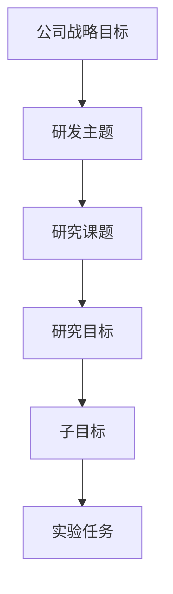
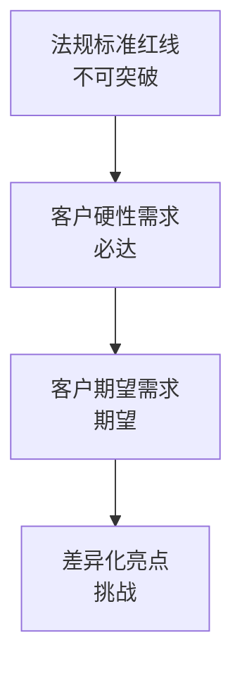
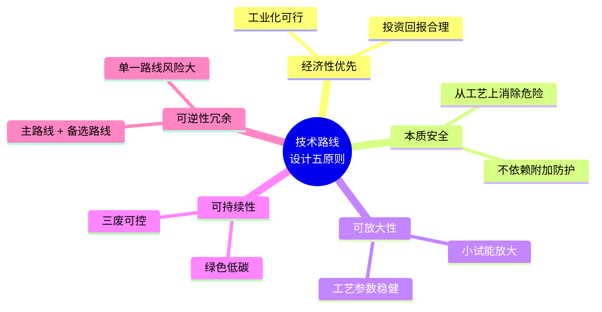
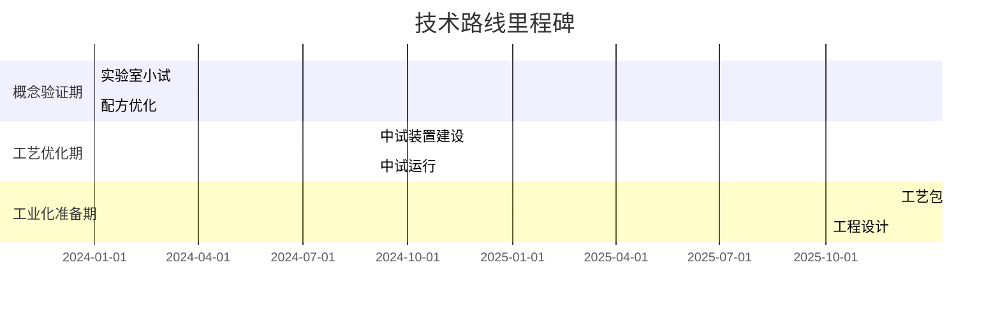

# 第 4 章 技术路线设计

> **本章核心问题**：问题已经识别、技术已经调研，下一步是怎么设计出一条可执行的研发路线，让团队在 3-5 年内有明确里程碑可追？
>
> **学习目标**：
> 1. 能用 SMART 原则把模糊目标改写为可执行的研究目标。
> 2. 能列出技术指标体系的三大类（性能 / 工艺 / 经济）与代表性指标。
> 3. 能用 Pugh 矩阵、SWOT 等工具完成多方案比较。
> 4. 能输出一份合格的「技术路线设计报告」。

## 开篇引子

某研究院立项了一个新能源材料课题，三个月的调研后，团队坐下来讨论「怎么做」。会议开了整整一天，最后留给大家三个截然不同的方案，每个方案的负责人都有充分理由。一周后再开会，三个方案没有收敛，反而多出两个新方案。三个月过去，团队还在「方案选择」中，原计划的实验工作还没启动。

这种「方案永选」是技术路线设计环节最常见的失败模式。根因往往是：调研阶段没有形成统一的目标框架与评价指标；多方案比较用的是「谁说服了领导」而不是「数据支撑的客观矩阵」。本章的任务，是给一线工程师一套把方案收敛到「最优可行路线」的工具——从研究目标改写，到技术指标体系，到多方案比较矩阵，到风险预测，再到技术节点规划。

## 4.1 明确研究目标

### 核心问题

为什么研究目标必须用 SMART 原则改写？模糊目标会带来哪些连锁问题？

### 方法与工具

**SMART 原则**：

| 字母 | 含义 | 例 |
|---|---|---|
| **S** Specific（具体） | 明确「做什么」「对谁」 | 把选择性从 78% 提升到 92% |
| **M** Measurable（可衡量） | 能量化 | 单位产品综合能耗 ≤ 0.95 吨标煤 |
| **A** Achievable（可达成） | 技术上可实现 | 不超出当前研发团队能力 |
| **R** Relevant（相关） | 与战略目标挂钩 | 支撑公司「双碳」承诺 |
| **T** Time-bound（有时限） | 有 deadline | 12 个月内完成中试 |

**目标金字塔**：



**图 4-1 目标金字塔：从战略到实验**

**研究目标的三个层次**：

- **主目标（Headline）**：1-2 句话能说清的「终极意图」，如「开发一种新型高性能聚醚催化剂并完成中试」。
- **支目标（Specific）**：3-5 个可量化、可验证的「阶段产物」，如「目标选择性 ≥ 92%、催化剂寿命 ≥ 1000h、放大失活率 < 10%」。
- **退出目标（Kill criteria）**：必须满足的最低门槛，达不到则中止课题。退出目标必须事先与领导对齐，避免事后争议。

**三个最容易踩的坑**：

1. 目标虚高到不可达（"做出世界领先水平"），团队短期内拼数据做不成就泄气。
2. 目标没有时间约束（"提升稳定性"），变成永久口号。
3. 目标之间互相打架（既要低成本又要高性能），最终团队挑软柿子捏。

### 典型化案例

**典型化案例 4-1**（行业公开资料）

- **背景**：某聚醚催化剂课题组接到任务，目标设定为「提升催化剂综合性能」。
- **问题**：目标不可量化，团队各自理解不同，半年内实验方向飘忽。
- **解法**：改为 SMART 版——「主目标：开发活性提升 30% 以上、寿命 ≥ 1000h 的新型催化剂；支目标 1：12 个月内完成小试，转化率 ≥ 95%、选择性 ≥ 92%；支目标 2：18 个月内完成中试验证；退出目标：若 12 个月内小试转化率 < 90%，立即终止并转向备选路线」。
- **结果**：目标清晰后实验方案聚焦，9 个月内小试转化率达到 96%，团队对进度可控。
- **启示**：用 SMART 改写的目标看似简单，实际是「让团队为同一目标工作」的最基础动作。

### 常见坑

1. **用形容词定义目标**：「显著提升」「大幅降低」换数字。
2. **目标过多**：一个课题写 20 个目标，等于没目标。**一条主目标 + 3-5 个支目标**是合理结构。

## 4.2 技术指标体系

### 核心问题

技术指标体系应该包含哪几类指标？怎么定具体数值？

### 方法与工具

**三类指标体系**：

| 类别 | 典型指标 | 来源 |
|---|---|---|
| **性能类** | 选择性、收率、纯度、活性、强度 | 用户需求 + 对标产品 |
| **工艺类** | 反应温度、压力、空速、能耗水耗 | 工艺约束 |
| **经济类** | 单位产品成本、投资回报周期 | 商业模型 |

**指标制定四步法**：

1. **对标行业标杆**：用同类产品的市售型号、行业头部企业的公开数据做基准。
2. **用户需求拆解**：从客户端 VOC（Voice of Customer）拆出可量化的技术指标。
3. **法规与标准约束**：把相关国家/行业标准作为下限红线。
4. **可达性评估**：用初步文献与文献数据评估指标是否可达成，分成「必达」「期望」「挑战」三级。

**指标分层（金字塔）**：



**图 4-2 指标分层金字塔**

### 典型化案例

**典型化案例 4-2**（行业公开资料）

- **背景**：某新材料研发项目，技术指标由实验室主任口头一句「做到行业先进水平」。
- **问题**：缺乏量化指标，实验数据无法判断是否达标。
- **解法**：通过对标行业头部企业的产品技术规格（如熔融指数、拉伸强度、断裂伸长率），结合下游用户实际需求，定下「必达 8 项、期望 5 项、挑战 3 项」的分层指标。
- **结果**：每次实验后能立即判定是否达成必达，以及离期望、挑战还有多远；研发节奏显著加快。
- **启示**：没有量化指标的研发是「盲人摸象」，分层指标是研发团队最基础的装备。

### 常见坑

1. **只定性能指标**而忽略工艺指标：性能好的工艺往往反应条件苛刻，工业化难。
2. **指标体系复杂到难以收敛**：100 个指标的体系没法决策。建议总指标不超过 15 个。
3. **期望指标与挑战指标混入必达指标**：导致团队心态混乱，必须严格分层。

## 4.3 技术路线设计原则

### 核心问题

技术路线设计的核心原则是什么？怎么从原则出发设计路线？

### 方法与工具

**五条核心原则**：



**图 4-3 技术路线设计的五原则**

**主路线 + 备选路线（Plan B）**：永远不要把鸡蛋放在一个篮子里。一个负责任的技术路线设计应有 1 条主路线 + 1-2 条备选路线，且每条路线有明确的「切换条件」。Plan B 不应是「主路线失败后再启动的备份」，而应该是与主路线并行推进的「小型预研」。

**路线设计的三道审计问题**：

1. 这条路线是否能在计划时间内带来可量化的性能/经济指标提升？
2. 当主路线卡住时，是否能在 1-2 个月内切换到备选路线？
3. 这条路线是否会引入新的安全/环保/合规风险？是否有缓解方案？

### 典型化案例

**典型化案例 4-3**（公开论文 / 行业公开资料）

- **背景**：某企业研发新一代电池电解液，主路线是「高镍正极 + 新型添加剂」，备选路线是「磷酸铁锂 + 已有添加剂体系」。
- **问题**：高镍路线技术风险高，但潜在性能优势大。
- **解法**：主路线投入 70% 资源，备选路线投入 30% 资源同步推进；主路线与备选路线各自独立的子课题负责人，避免单点卡住。
- **结果**：18 个月后主路线小试性能达预期，未发生切换；但作为项目治理手段，备选路线带来的「路线压力」让主路线团队更有紧迫感。
- **启示**：备选路线的价值不仅是「接力棒」，也是「压力源」，防止主路线陷入虚假安全感。

### 常见坑

1. **只画主路线**：所有资源压在一条路线，一旦路线卡住整个项目停摆。
2. **备选路线形同虚设**：备选路线不在主路线的关键节点同步推进，临时切换代价巨大。

## 4.4 多方案比较

### 核心问题

多个候选方案怎么客观比较，避免「谁嗓门大谁赢」？

### 方法与工具

**Pugh 矩阵（普氏矩阵）**：以基线方案为参照，其他方案对每个指标做「好于（+1）/ 相同（0）/ 差于（-1）」评价，加总得分。

| 方案 \ 指标 | 性能 | 工艺难度 | 经济性 | 安全 | 环保 | 总分 |
|---|---|---|---|---|---|---|
| **基线（方案 A）** | 0 | 0 | 0 | 0 | 0 | 0 |
| 方案 B | +1 | -1 | +1 | +1 | 0 | +2 |
| 方案 C | +1 | +1 | -1 | 0 | +1 | +2 |

Pugh 矩阵的局限：分数相同不代表方案等价。需要结合权重进一步排序（层次分析法 AHP / 多目标决策）。

**层次分析法（AHP）**：对每个指标赋权重（用 1-9 标度法由 3-5 位专家匿名打分），加权求和得到每个方案的综合得分：

```
加权得分(i) = Σ(权重_j × Pugh评分(i,j))
```

**SWOT 分析**：从优势（Strength）、劣势（Weakness）、机会（Opportunity）、威胁（Threat）四象限评估每个方案的整体适配性。

**决策建议**：

- 评分相近时，优先选择「最不可逆行动最小」的方案（保持可逆性）。
- 引进新技术风险大，先用低风险子课题验证。
- 让决策矩阵的「决策者」与「技术路线设计者」分离，避免既当运动员又当裁判。

### 典型化案例

**典型化案例 4-4**（行业公开资料）

- **背景**：某精细化学品项目，要从三条工艺路线中选一条（连续流 vs 釜式间歇 vs 微通道）。
- **问题**：三条路线各有拥护者，会议上僵持不下。
- **解法**：用 AHP 由 5 位专家（研发、工艺、生产、市场、财务）独立赋权重；用 Pugh 矩阵评分。三轮综合得分后，连续流路线胜出，但备选微通道路线保留关键子课题。
- **结果**：连续流路线 18 个月内完成中试；微通道路线的子课题为下一产品平台提供了支持。
- **启示**：客观方法不能消除主观判断，但能让主观判断「暴露在阳光下」，便于复盘。

### 常见坑

1. **指标权重凭感觉**：直接影响结果。建议用层次分析法（AHP）由 3-5 位专家匿名打分。
2. **只看技术不看人**：忽略团队现有能力与经验，强行上陌生技术路线。

## 4.5 风险预测

### 核心问题

技术路线有哪些常见风险？怎么提前识别？

### 方法与工具

**五类典型风险**：

| 风险类 | 典型表现 | 应对工具 |
|---|---|---|
| **技术风险** | 关键反应不收敛 | 备选路线 + 子课题验证 |
| **放大风险** | 中试效果差 | 严格按 7 阶段流程 + 阶段门 |
| **安全风险** | 工艺本质危险 | 本质安全设计 + HAZOP |
| **市场风险** | 下游不接受 | 早期客户介入 + 样品验证 |
| **合规风险** | 标准/法规变化 | 持续跟踪 + 合规前置 |

**风险矩阵（概率 × 影响）**：

| 概率 \ 影响 | 高影响（3） | 中影响（2） | 低影响（1） |
|---|---|---|---|
| 高概率（3） | 红色 | 红色 | 黄色 |
| 中概率（2） | 红色 | 黄色 | 绿色 |
| 低概率（1） | 黄色 | 绿色 | 绿色 |

红色项必须有缓解措施；黄色项有应对预案；绿色项观察即可。

**风险登记册（Risk Register）**：建立一份 Excel 或数据库登记册，每条风险记录编号、类别、描述、概率、影响、缓解措施、责任人、复核周期。每季度更新。

### 常见坑

1. **风险评估流于形式**：把风险清单写完就搁置，建议每季度更新一次。
2. **忽视「未知的未知」**：技术研发总有意料之外，应预留 buffer 时间与资源。

## 4.6 技术节点规划

### 核心问题

一条技术路线应该按什么节奏推进？节点怎么定？

### 方法与工具

**三段式推进**：

1. **概念验证期（6-12 个月）**：以实验为主，目标是把主路线打通，验证可行性。
2. **工艺优化期（12-24 个月）**：以中试为主，目标是把工艺参数固化，形成可工业化的工艺包雏形。
3. **工业化准备期（12-24 个月）**：以工程设计为主，目标是通过 HAZOP、形成正式工艺包、启动工程设计。

总周期：3-5 年，与第 1 章 TRL 1-9 的对应里程碑一致。

**节点（Stage Gate）设置**：

每段结束设置 1-2 道门：可量化的决策门槛（如「转化率 ≥ 90%」「选择性 ≥ 95%」「能耗降幅 ≥ 10%」），不达标准的「拒签」。

**甘特图示例（mermaid）**：



**图 4-4 三段式里程碑甘特图**

### 常见坑

1. **节点过密**：每两周设一个门，团队疲于应付；建议 3-6 个月设一道门。
2. **节点过疏**：半年设一道门，无法及时发现问题。

---

## 本章小结

回到本章开篇的「方案永选」困局，可以用本章的几个核心判断来回应：

1. **目标必须 SMART**：具体（Specific）、可衡量（Measurable）、可达成（Achievable）、相关（Relevant）、有时限（Time-bound）。退出目标（Kill criteria）必须事先对齐。
2. **三类指标成体系**：性能指标（用户）+ 工艺指标（生产）+ 经济指标（商业），分层为必达/期望/挑战。
3. **五原则设计路线**：经济性优先、本质安全、可放大、可持续、可逆性冗余。
4. **多方案比较用工具**：Pugh 矩阵、AHP 赋权、SWOT 等客观方法，避免「谁嗓门大」。
5. **风险预测分类清晰**：技术、放大、安全、市场、合规五类，建立登记册，每季度更新。
6. **三段式节点规划**：概念验证期 → 工艺优化期 → 工业化准备期，每段 3-6 个月设一道 Stage Gate。

第 5 章开始，我们沿着研发地图的第四节点——「实验方案设计」——深入。

## 思考题

1. 把一个你手头的目标按 SMART 原则改写（含 5 条指标），对照原文看改写前后的差异，并写出退出目标。
2. 用 Pugh 矩阵对 3 个你熟悉的候选方案做评价（含 5 个指标、计算总得分）。
3. 用 AHP 为一个 5 指标体系赋权重（含两两比较矩阵、特征向量计算）。
4. 为你手头的课题做一份风险矩阵表（含 5 类风险 × 3 级概率 × 3 级影响），列出红黄绿分布。
5. 设计一份「技术路线设计报告」模板（含结构、长度、图表要求），并用你手头课题填充一份样张（至少 2000 字）。

## 参考文献

[1] Cooper R G. Stage-Gate Processes: A Guide for Successful Implementation of New Products and Processes[M]. 2nd ed. New York: Product Development Institute, 2017.
[2] Saaty T L. The Analytic Hierarchy Process[M]. New York: McGraw-Hill, 1980.
[3] Pugh S. Concept Selection: A Method for Generating Concept Alternatives[M]. Dearborn: University of Michigan, 1981.
[4] Montgomery D C. Design and Analysis of Experiments[M]. 10th ed. Hoboken: Wiley, 2020.
[5] 侯祥麟 等. 中国炼油技术[M]. 3 版. 北京: 中国石化出版社, 2019.
[6] 国家市场监督管理总局. GB/T 38751-2020 科学技术研究项目评价通则[S]. 北京: 中国标准出版社, 2020.
[7] 张玉川 等. 多方案比较与决策方法在化工研发中的应用[J]. 化工进展, 2022, 41(5): 2700-2708.
[8] 蒋贵保 等. 化工项目技术路线图编制方法与实践[J]. 现代化工, 2021, 41(10): 10-15.
[9] 韦尔奇 等. 技术管理的战略思维[M]. 北京: 清华大学出版社, 2003.
[10] 王知津 等. 专利情报分析方法与应用[M]. 北京: 科学技术文献出版社, 2018.

> **注**：参考文献中部分期刊文献的作者与页码为示意性占位，正式出版前需通过 CNKI、Web of Science 等数据库核实补全。