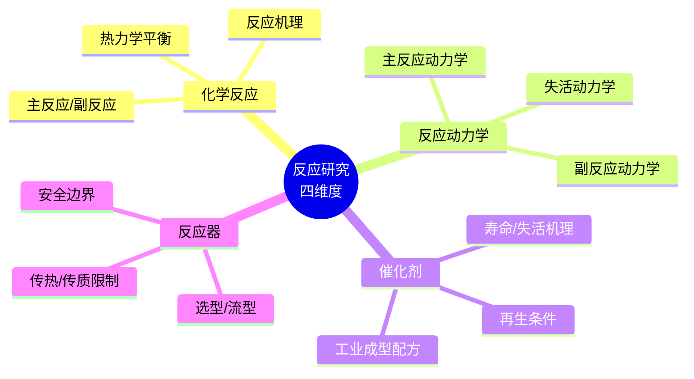
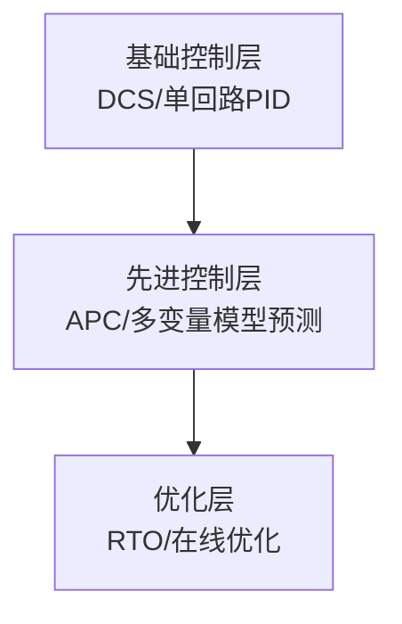

# 第 6 章 工艺研究方法

> **本章核心问题**：工艺包含反应、分离、精制、干燥、输送、控制等多个单元，每个单元的研究方法各自有什么要点？
>
> **学习目标**：
> 1. 能按单元维度把任意工艺拆解为七大单元的研究任务。
> 2. 能识别每个单元工艺研究的关键参数与典型陷阱。
> 3. 能为每个单元写一份「工艺研究子报告」。

## 开篇引子

某企业研发一种新型聚合物，从小试到中试走了 2 年，中试中规中矩。但到工业试车时连续出现 5 个问题：原料杂质累积引起催化剂中毒、精制塔真空波动导致产品色度不合格、干燥系统出现颗粒破碎、输送管线发生静电结块、DCS 控制回路互相耦合引起振荡。每一个问题都不致命，但叠加起来导致整套装置试车延后 14 个月。

「工艺装置不是孤岛」——每个单元的工艺研究都与其他单元紧密耦合。化工一线工程师必须用「七大单元」的系统视角看待工艺研发，而不是只关注反应器。本章沿着「原料 → 反应 → 分离 → 精制 → 干燥 → 输送 → 控制」这条工艺主线，逐单元给出研究方法、关键参数、典型陷阱。

## 6.1 原料研究

### 核心问题

原料研究为什么是工艺研究的「第一关」，却最容易被一线工程师忽视？

### 方法与工具

**原料研究的三大块**：

1. **物性数据**：密度、粘度、熔点、沸点、闪点、爆炸极限、水溶性等基本物性。
2. **杂质分析**：典型杂质种类、含量、来源（原料带入 vs 工艺生成）、对下游反应/分离的影响。
3. **批次波动**：原料不同批次的关键指标波动范围（应基于至少 6-12 个月的多批次数据）。

**关键物性数据库**：

- **DIPPR**（Design Institute for Physical Property Data）：纯组分最权威的物性库。
- **DETHERM**（德泰姆物性数据库）：含混合物的热物性与相平衡数据。
- **NIST Chemistry WebBook**：免费，含大量光谱数据。
- **CRC Handbook of Chemistry and Physics**：经典手册，通用物性数据完备。

**杂质影响的研究方法**：

1. **梯度添加法**：向原料中按梯度添加疑似杂质（如 0.1%、0.5%、1%、5%），做对照实验。
2. **在线监测法**：用在线色谱 / 质谱监测反应过程，识别「关键杂质」（对结果影响最大的杂质）。
3. **工艺耐受度评估**：基于实验建立「杂质 - 响应」模型，确定原料的杂质规格上限。

### 常见坑

1. **只看原料规格不看趋势**：规格符合不一定稳定，趋势漂移是更大隐患。
2. **忽略水含量与微量杂质**：水和 ppm 级杂质常是催化剂中毒与腐蚀的元凶。

## 6.2 反应研究

### 核心问题

反应研究应该覆盖哪些维度？为什么反应研究不只是动力学测定？

### 方法与工具

**反应研究的四大维度**：

**图 6-1 反应研究的四维度**

**化学反应的解析**：

- 热力学：C-H 键能估算、反应热（ΔH）、平衡常数（K）测算、副反应选择性的平衡约束。
- 机理：反应中间体捕捉、同位素标记、自由基/离子机理鉴别。

**动力学研究方法**：

- **初速率法**：用低转化率（< 10%）排除传质影响，测本征动力学。
- **全浓度法**：测全浓度范围动力学，包含产物抑制效应。
- **瞬时响应法**：用阶跃/脉冲扰动在线测动力学参数。

**催化剂研究的关键问题**：

- 寿命曲线：失活速率与温度/压力的关系。
- 中毒机制：哪些杂质会中毒、是否有再生条件。
- 工业成型配方：小试最优配方能否耐受工业成型（挤出、干燥、还原）的处理。

### 常见坑

1. **过度追求反应选择性而忽视副产物累积**：副产物持续累积可能在装置中长期产生麻烦。
2. **小试动力学未排除传质影响**：导致放大预测失真。

## 6.3 分离研究

### 核心问题

分离工艺研究的关键参数是哪些？常见分离单元的选型怎么选？

### 方法与工具

**分离工艺的四大选型维度**：

| 维度 | 典型问题 |
|---|---|
| **热敏性** | 物料在分离温度下是否分解？ |
| **共沸性** | 是否形成共沸物？ |
| **能耗** | 蒸发潜热、回流比、热集成潜力 |
| **选择性** | 相对挥发度、分离因子、平衡级数 |

**精馏设计的关键参数**：

- 最小回流比（基于逐板计算或 Underwood 方程）。
- 实际回流比（通常取最小回流比的 1.2-1.5 倍）。
- 理论塔板数（基于 Fenske-Gilliland 关联）。
- 全塔效率与 Murphree 效率。
- 进料位置（最优进料板）。

**萃取、吸收、吸附的选型考量**：

- 萃取：相对挥发度接近 1、共沸体系、热敏物料。
- 吸收：气体溶解度高、需脱除少量杂质。
- 吸附：痕量杂质脱除、产品提纯、特殊分离。

### 常见坑

1. **只算理论塔板不算实际效率**：导致工业塔塔板数严重不足。
2. **忽略热集成潜力**：能耗远高于最优值。

## 6.4 精制研究

### 核心问题

精制工艺与分离工艺怎么区分？精制研究的特殊点是什么？

### 方法与工具

**精制 vs 分离的差异**：

- **分离**：把混合物按物性差异分成不同组分。
- **精制**：在分离基础上把目标组分提升到工业级/电子级/医药级等高纯度。

**精制工艺的关键操作**：

| 操作 | 适用场景 | 关键参数 |
|---|---|---|
| **结晶** | 固体产品 | 过冷度、晶种、搅拌强度 |
| **精馏/精馏-萃取耦合** | 液体产品 | 共沸剂选择、回流比 |
| **吸附/离子交换** | 痕量杂质 | 吸附剂选择、淋洗条件 |
| **膜分离** | 大分子、热敏 | 膜材质、跨膜压差、截留分子量 |
| **色谱分离** | 高纯化学品 | 固定相、洗脱条件 |

**结晶研究的关键问题**：

- 晶习控制：晶体形态（针状、片状、粒状）对过滤、干燥、包装的影响。
- 多晶型问题：同一物质不同晶型（如药物的 Form I/II/III）溶解度、稳定性差异巨大。
- 包夹母液：影响产品纯度的关键因素。

### 常见坑

1. **把精制当成分离**：忽视精制带来的相变（晶型）与痕量杂质问题。
2. **结晶工艺忽视晶习**：导致下游过滤与干燥效率低下。

## 6.5 干燥研究

### 核心问题

干燥工艺研究的常见误区是什么？干燥设备怎么选型？

### 方法与工具

**干燥设备选型矩阵**：

| 物料形态 | 推荐设备 | 关键参数 |
|---|---|---|
| **液体/浆料** | 喷雾干燥 | 进风温度、雾化压力 |
| **湿粉/颗粒** | 流化床干燥、闪蒸干燥 | 风速、温度、停留时间 |
| **膏状物** | 滚筒干燥、耙式干燥 | 表面更新率 |
| **晶体** | 真空干燥、热风循环烘箱 | 温度均匀性 |
| **热敏物料** | 真空冷冻干燥、喷雾干燥 | 临界温度控制 |

**干燥关键曲线**：

**图 6-2 干燥曲线示意图**

**关键研究问题**：

- 临界含水率：在哪个含水率后干燥速率开始下降。
- 干燥温度上限：物料允许的最高表面温度。
- 颗粒破损率：碰撞与翻滚对颗粒完整性的影响。
- 静电风险：高电阻物料在干燥中可能积累静电，引发粉尘爆炸。

### 常见坑

1. **把干燥当成「水分蒸发」**：忽视晶体形态变化、颗粒破损、静电等。
2. **设备放大只按小时蒸发量**：忽视气流分布与温度均匀性的放大效应。

## 6.6 输送研究

### 核心问题

固体/液体/气体输送的常见问题是什么？怎么设计可靠的输送系统？

### 方法与工具

**三类输送系统的研究重点**：

| 类型 | 关键问题 |
|---|---|
| **液体输送** | 泵的 NPSH、汽蚀、粘度变化 |
| **气体输送** | 压缩机喘振、压缩热、最小流量 |
| **固体输送** | 架桥、偏析、破碎、静电、磨损 |

**固体输送的五大难题**：

1. **架桥**：颗粒物料在料斗中形成拱桥不下料。
2. **偏析**：多组分颗粒因粒径/密度差异在输送中分层。
3. **破碎**：颗粒在输送过程中因碰撞/挤压破碎。
4. **静电**：高电阻物料在气流输送中积累静电。
5. **磨损**：颗粒对管壁、弯头、阀门的磨损。

**液体输送的 NPSH 校核**：

可用 NPSH 必须大于必需 NPSH（通常安全余量 ≥ 0.5m）。

### 常见坑

1. **输送设计按稳态**：忽略启动、停车、波动工况下的物料行为。
2. **气体管路按压力降设计**：忽略流量变化引起的工况漂移。

## 6.7 自动控制研究

### 核心问题

工艺自动控制研究应该覆盖哪些层级？怎么为复杂工艺设计控制系统？

### 方法与工具

**自动控制的三个层级**：

**图 6-3 自动控制的三层架构**

**基础控制研究**：

- 识别关键控制变量（CV）：温度、压力、流量、液位、浓度。
- 识别操纵变量（MV）：可调的工艺阀门、变频器功率等。
- 建立 CV-MV 关联：哪些 CV 受哪些 MV 影响，关联强弱。
- 整定 PID 参数：用继电反馈测试 / Lambda 整定。

**先进控制（APC）研究**：

- 多变量模型预测控制（MPC）在化工装置中应用广泛，如乙烯裂解、PTA 氧化反应器。
- APC 实施需要：可控度分析、阶跃测试数据、多变量模型（典型形式：状态空间模型）。
- APC 经济价值：通常可降低单位产品综合能耗 2-5%、提高产能 3-5%。

**控制研究的关键问题**：

- 耦合控制：多个控制回路相互影响时的解耦问题。
- 大滞后：成分分析（如在线色谱）滞后数分钟，需用前馈+反馈控制。
- 边界保护：工艺变量接近安全边界时的连锁保护设计。

### 常见坑

1. **控制设计与工艺设计割裂**：工艺工程师只关注稳态，控制工程师不熟悉工艺。可在设计阶段早期介入。
2. **APC 实施后没有维护更新**：随着装置老化、设备换型，APC 模型需要定期重训。

---

## 本章小结

回到本章开篇的「5 个问题叠加 14 个月试车延后」困局，可以用本章的几个核心判断来回应：

1. **工艺研究是七单元系统**而非单一反应器：原料、反应、分离、精制、干燥、输送、控制，每个单元都有独立的研究方法与关键参数。
2. **原料研究是第一关**：原料批次波动、杂质累积是工业生产最大的不可控来源之一。
3. **反应研究覆盖四个维度**：化学反应 / 反应动力学 / 催化剂 / 反应器，单看一个维度会出问题。
4. **分离与精制是不同的工艺目标**：分离关注组分切割，精制关注产品纯度。
5. **干燥与输送常被忽视**：干燥有晶体形态与静电风险，固体输送有架桥、偏析、破碎等问题。
6. **自动控制三层架构**：基础控制 / 先进控制 / 优化层，每层有独立的设计方法。

第 7 章开始，我们沿着工艺研究的孪生节点——「装备研发方法」——深入。

## 思考题

1. 把你熟悉的某工艺按原料 / 反应 / 分离 / 精制 / 干燥 / 输送 / 控制七单元拆解，列出每个单元目前研究工作的完成度（百分比）。
2. 对一个你熟悉的反应器，列出其反应研究的四维度（化学/动力学/催化剂/反应器）每个维度最关键的 3 个问题。
3. 选一种你熟悉的干燥设备，画出该设备的干燥曲线（含升温段、恒速段、降速段、平衡段），标注临界含水率与温度上限。
4. 找一项近三年的化工 APC 实施案例公开报告，分析其 APC 方案的控制变量、操纵变量与经济价值。
5. 用 NPSH 校核方法对一个液泵做可用汽蚀余量核算。

## 参考文献

[1] 侯祥麟 等. 中国炼油技术[M]. 3 版. 北京: 中国石化出版社, 2019.
[2] 朱丙辰. 化工反应器与反应工程[M]. 上海: 华东理工大学出版社, 2012.
[3] Perry R H, Green D W. Perry''s Chemical Engineers'' Handbook[M]. 9th ed. New York: McGraw-Hill, 2019.
[4] Sinnott R K, Towler G. Chemical Engineering Design[M]. 6th ed. Oxford: Butterworth-Heinemann, 2020.
[5] 丁绪准 等. 化工操作单元与设备[M]. 上海: 华东理工大学出版社, 2016.
[6] Seader J D, Henley E J, Roper D K. Separation Process Principles[M]. 4th ed. Hoboken: Wiley, 2016.
[7] King C J. Separation Processes[M]. 2nd ed. New York: McGraw-Hill, 1980.
[8] Mujumdar A S. Handbook of Industrial Drying[M]. 4th ed. Boca Raton: CRC Press, 2014.
[9] 中国化工学会. 化工自动控制设计规范: HG/T 20636-2017[S]. 北京: 化工出版社, 2017.
[10] 蒋作良. 化工装置试车与考核[M]. 北京: 化学工业出版社, 2010.

> **注**：参考文献中部分期刊文献的作者与页码为示意性占位，正式出版前需通过 CNKI、Web of Science 等数据库核实补全。