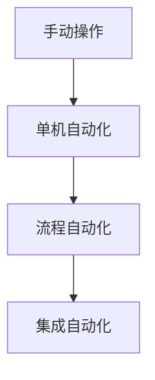

# 第 7 章 装备研发方法

> **本章核心问题**：装备和工艺是什么关系？装备研发应该遵循什么方法论？
>
> **学习目标**：
> 1. 能区分「标准装备」「非标装备」「专门装备」三种装备类别。
> 2. 能用「工艺决定设备」原则设计装备研发路线。
> 3. 能为非标装备做结构创新方案设计。

## 开篇引子

某新材料项目进入工程设计阶段，工艺工程师小张和设备工程师老李吵了三天。小张要 1 台大型反应釜，老李要 8 台小型反应釜并联；小张要特殊合金材质的换热器，老李说国产 304 就行；小张坚持连续进料，老李坚持间歇进料以减少结构复杂度。会议开了一周没有结论，最后总工拍板：「工艺决定设备，不是设备决定工艺。装备要为工艺服务，不能反过来。」

工艺与设备的关系，是化工研发中永恒的拉扯。工艺提需求，装备做响应；但装备的可行性又会反向约束工艺——再好的工艺，如果装备做不出来，也是空想。本章的任务，是给一线工程师一套「工艺 ↔ 设备」协同研发的方法论：装备分类、装备研发的五大原则、非标设备设计方法、自动化与智能化升级、模块化设计。

## 7.1 工艺决定设备

### 核心问题

为什么说「工艺决定设备，装备服务工艺」？怎么避免反向倒挂？

### 方法与工具

**工艺对设备的三类约束**：

1. **功能性约束**：设备必须实现工艺所需的功能（反应、分离、传热等）。
2. **操作性约束**：设备必须满足工艺所需的温度、压力、流量范围。
3. **可制造性约束**：设备的材质、结构、加工工艺必须可实现。

**装备研发的次序原则**：

- 先工艺条件，后设备规格。
- 先物料特性，后设备材质。
- 先控制策略，后自动化方案。

**倒挂的典型表现**：

- 用现成设备倒推工艺参数（设备型号定了再做工艺）。
- 用设备能力上限定义工艺上限（设备只能耐压 1MPa，所以工艺不能到 2MPa）。
- 用标准设备的造型约束工艺创新。

### 常见坑

1. **先选设备再做工艺**：让设备选择驱动工艺条件，丧失工艺优化空间。
2. **设备规格和工艺规模机械对应**：忽视放大效应（详见第 16 章）。

## 7.2 设备结构创新

### 核心问题

什么情况下需要进行设备结构创新？创新的边界在哪里？

### 方法与工具

**结构创新的触发条件**：

- 标准设备无法满足工艺的极端条件（高温、高压、强腐蚀）。
- 工艺有特殊传热/传质需求，需要新结构。
- 设备投资/能耗过大，需要结构性降本。

**三大创新方向**：

1. **强化传热**：螺旋板换热器、板式换热器、热管换热器。
2. **强化传质**：规整填料、丝网波纹填料、旋转填料床、超重力反应器。
3. **强化混合**：静态混合器、动态混合器、撞击流反应器。

**创新装备的成熟度评估**：

| 维度 | 评估问题 |
|---|---|
| **可制造性** | 工艺是否可行？是否有现成制造能力？ |
| **可操作性** | 工人能否安全操作？维护是否复杂？ |
| **可放大性** | 实验室验证的设备能否放大？ |
| **经济性** | 投资额、运行成本、回收期是否合理？ |

### 典型化案例

**典型化案例 7-1**（公开论文 / 行业资料）

- **背景**：某项目需要传热面积大、压降低的换热器，传统列管换热器无法满足。
- **问题**：传统列管压降 50kPa，传热系数 800 W/(m²·K)，达不到要求。
- **解法**：选用板式焊接换热器，压降降至 15kPa，传热系数达 3500 W/(m²·K)。
- **结果**：传热面积减小 60%，年节电 100 万元。
- **启示**：装备结构创新可以带来数量级的性能提升，前提是工艺条件与设备结构匹配。

### 常见坑

1. **过度创新**：用复杂结构解决本可通过工艺优化解决的问题。
2. **创新缺乏可制造性验证**：设计很先进，但国内找不到合格制造商。

## 7.3 非标设备设计

### 核心问题

非标设备的设计流程是什么？关键设计输出有哪些？

### 方法与工具

**非标设备设计八步法**：

1. 工艺条件确认：温度、压力、流量、介质、腐蚀性等。
2. 设备功能确定：反应器、换热器、塔器、容器等。
3. 材料选择：考虑介质、温度、压力、应力腐蚀、低温脆性。
4. 结构计算：强度、刚度、稳定性计算（GB 150、GB/T 165 等压力容器标准）。
5. 关键部件设计：搅拌器、传热构件、内构件、密封件。
6. 制造工艺：焊接、热处理、机加工、装配。
7. 检验与试验：压力试验、泄漏试验、无损检测。
8. 文档交付：总图、零部件图、材料清单、检验规程、操作维护手册。

**关键设计输出清单**：

| 输出 | 用途 |
|---|---|
| **设备总图** | 设计、制造、检验、安装的共同基础 |
| **零部件图** | 制造与采购 |
| **材料清单** | 采购与成本核算 |
| **强度计算书** | 设计合规与质量追溯 |
| **检验规程** | 制造过程质量控制 |
| **操作维护手册** | 用户使用与维护 |

**常用压力容器标准**：

- GB 150（钢制压力容器）
- GB/T 165（钢制压力容器材料）
- JB 4732（钢制压力容器分析设计）

### 常见坑

1. **材料选择仅看手册**：忽视实际工况下的特殊腐蚀（如 Cl⁻ 应力腐蚀开裂）。
2. **强度计算只算静强度**：忽视疲劳、低周疲劳、蠕变。

## 7.4 自动化装备开发

### 核心问题

自动化装备开发应该包含哪些内容？怎么提升自动化水平？

### 方法与工具

**自动化的四个层级**：

**图 7-1 自动化的四个层级**

**自动化装备的关键组件**：

| 组件 | 功能 | 选型考量 |
|---|---|---|
| **传感器** | 数据采集 | 精度、可靠性、响应时间 |
| **执行器** | 调节阀、变频器 | 流通能力、调节特性、密封等级 |
| **控制器** | DCS/PLC | 通道数、运算能力、抗干扰 |
| **人机界面** | HMI/SCADA | 易用性、报警完整性、历史数据 |

**自动化项目实施**：

1. 控制策略设计（P&ID、单回路图）。
2. IO 清单、仪表数据表。
3. DCS 编程与调试。
4. FAT（工厂验收测试）与 SAT（现场验收测试）。

### 常见坑

1. **自动化设备不配套**：用了先进控制器，但传感器精度差、控制阀响应慢，整体效果受限。
2. **忽视电磁兼容（EMC）**：化工厂区强电磁干扰环境，自动化设备稳定性下降。

## 7.5 智能装备开发

### 核心问题

智能装备与自动化装备的本质区别是什么？什么场景适合智能装备？

### 方法与工具

**智能装备的五大能力**：

1. 感知：在线传感器、视觉识别、声纹识别。
2. 决策：基于数据模型与机器学习的优化决策。
3. 执行：自适应调节机构、柔性执行单元。
4. 协同：装备间协同作业（MES 协调）。
5. 自学习：从运行数据中持续优化。

**适合智能装备的场景**：

- 产品多规格、小批量，柔性生产需求高的场景。
- 工艺过程复杂、参数耦合严重、依赖经验操作的场景。
- 数据可得、质量与一致性要求高的场景（如电池电解液、电子化学品）。

**智能装备实施的关键挑战**：

- **数据质量**：传感器可靠性与数据清洗决定了 AI 模型上限。
- **领域知识融合**：没有工艺工程师参与的 AI 模型常出现「数字正确、工艺荒谬」问题。
- **安全性**：AI 决策的可解释性与回退机制必须严格设计。

### 常见坑

1. **为智能而智能**：强行上 AI 但工艺问题不明确，结果不可解释。
2. **忽视数据基础**：没有数据就直接上 AI 模型。

## 7.6 模块化设计

### 核心问题

模块化设计的核心价值是什么？怎么在化工装备中实施？

### 方法与工具

**模块化的三大收益**：

1. **缩短交付周期**：并行制造、并行调试。
2. **降低工程难度**：复杂装置「分解」为可管理模块。
3. **便于升级改造**：模块替换而非全装置改造。

**模块化的两大层级**：

- **工艺模块**：反应模块、分离模块、纯化模块。
- **撬装模块（Skid）**：将工艺模块与动设备、仪控阀门集成在一个可整体运输的撬装上。

**模块化设计的工程要点**：

| 要点 | 内容 |
|---|---|
| **接口标准化** | 公用工程、信号、控制接口的标准协议 |
| **运输约束** | 模块尺寸不超过陆运/海运/吊装极限 |
| **现场连接** | 现场应只做撬块间连接而非撬内调试 |
| **维护友好性** | 模块化设计要考虑检修空间 |

**典型模块化场景**：

- 中小型化工装置（如年产万吨级以下）。
- 偏远地区装置（如海上平台、矿区化工厂）。
- 同一工艺包的多客户复制。

### 典型化案例

**典型化案例 7-2**（行业公开资料）

- **背景**：某公司开发 5 万吨/年 CO₂ 捕集装置，目标客户是电厂、水泥厂、钢厂。
- **问题**：每个客户场地条件不同，现场施工周期长、成本高。
- **解法**：把整个装置拆分为 6 个撬装模块（吸收模块、再生模块、压缩模块、干燥模块、控制模块、公用模块），工厂预制 + 现场组装。
- **结果**：现场施工周期从 12 个月压缩到 4 个月；不同客户复用撬块配置，效率显著提升。
- **启示**：模块化设计是化工装备工程化的重要方向，尤其适合复制型业务。

### 常见坑

1. **为模块化而模块化**：强行拆分导致接口复杂、效率反而下降。
2. **忽视运输约束**：设计的撬块体积过大无法运输。

---

## 本章小结

回到本章开篇的「工艺与设备争吵三天」困局，可以用本章的几个核心判断来回应：

1. **工艺决定设备**：功能性、操作性、可制造性三类约束，永远先工艺后设备。
2. **结构创新有方向**：强化传热 / 强化传质 / 强化混合三大方向，按工艺需要选择。
3. **非标设备八步设计法**：从工艺条件到文档交付，每步都有明确输入输出与可量化标准。
4. **自动化的四个层级**：手动 → 单机 → 流程 → 集成，按需逐步升级。
5. **智能装备的边界**：智能不是自动化的简单升级，而是感知 - 决策 - 执行 - 协同 - 自学习的能力跃迁。
6. **模块化的价值**：缩短交付周期、降低工程难度、便于升级改造。

第 8 章开始，我们沿着研发地图的第六节点——「数据采集」——深入，从工艺/装备转向数据驱动研发。

## 思考题

1. 选一个你熟悉的非标设备（反应釜/塔器/换热器），按八步设计法列出设计内容。
2. 选一种装备结构创新技术（板式换热器/规整填料/超重力反应器），分析其优劣与适用场景。
3. 对一个你熟悉的工序，设计从手动 → 单机自动化 → 流程自动化的升级路径，含关键技术点。
4. 评估一个你熟悉的装置是否适合模块化设计，列出实施步骤与风险。
5. 找一份你熟悉行业的「智能装备」公开案例，识别其「感知 - 决策 - 执行 - 协同 - 自学习」五个能力的具象表现。

## 参考文献

[1] Sinnott R K, Towler G. Chemical Engineering Design[M]. 6th ed. Oxford: Butterworth-Heinemann, 2020.
[2] Perry R H, Green D W. Perry''s Chemical Engineers'' Handbook[M]. 9th ed. New York: McGraw-Hill, 2019.
[3] 国家市场监督管理总局. GB 150-2011 压力容器[S]. 北京: 中国标准出版社, 2011.
[4] 国家市场监督管理总局. NB/T 47041-2014 塔式容器[S]. 北京: 中国标准出版社, 2014.
[5] 中国化工学会. HG/T 20636-2017 化工自动控制设计规范[S]. 北京: 化工出版社, 2017.
[6] 中国石油和化学工业联合会. T/CPCIF 0001-2017 化工装置模块化设计规范[S]. 北京: 中国石化出版社, 2017.
[7] 蒋作良. 化工装置试车与考核[M]. 北京: 化学工业出版社, 2010.
[8] 张荣亚 等. 化工装备智能化的关键技术与发展趋势[J]. 化工进展, 2023, 42(3): 1100-1108.
[9] 兰文升 等. 撬装化技术在化工装置中的应用[J]. 现代化工, 2022, 42(8): 25-30.
[10] 朱丙辰. 化工反应器与反应工程[M]. 上海: 华东理工大学出版社, 2012.

> **注**：参考文献中部分期刊文献的作者与页码为示意性占位，正式出版前需通过 CNKI、Web of Science 等数据库核实补全。