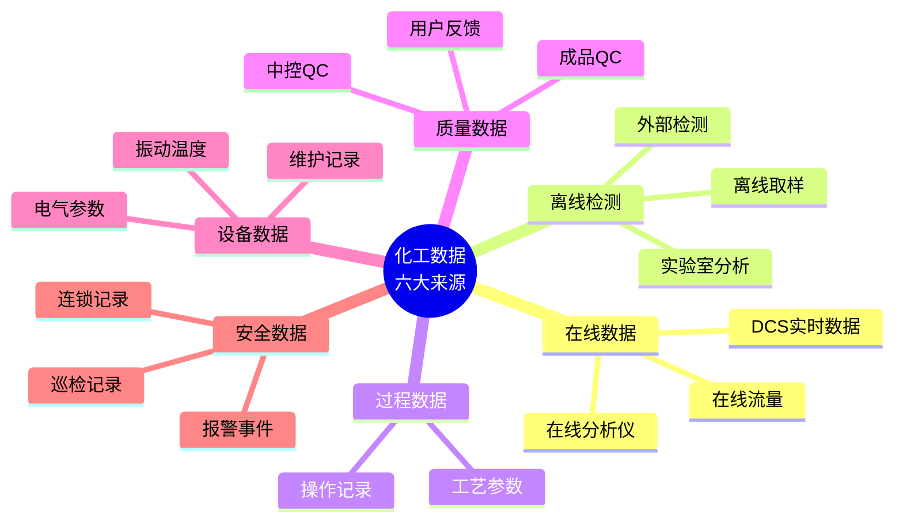
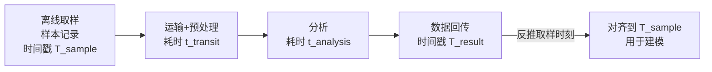

# 第 8 章 数据采集

> **本章核心问题**：数据是化工研发的基础，但化工装置的数据采集面临「海量、杂乱、不可控」三重挑战。一线工程师怎么搭建一套高质量的数据采集体系？
>
> **学习目标**：
> 1. 能列出化工企业数据采集的六大类来源（在线/离线/过程/质量/设备/安全）。
> 2. 能设计与实施一套工艺装置的数据采集方案。
> 3. 能识别数据采集的常见陷阱（丢点、噪声、时间错位）。

## 开篇引子

某中试装置运行了 12 个月，期间积累了大量数据。准备数据建模时才发现问题：温度数据有时是摄氏度的实际值，有时是仪表系统返回的 4-20mA 原始信号；压力数据有些点有重复时间戳，有些点缺失率高达 30%；在线色谱数据和分析室离线数据单位不同；记录时间按仪表时钟而控制室记录按北京时间。数据工程师花了 3 个月才把这些「脏数据」清理出可建模的版本。

数据采集是化工研发的「水电气」基础设施。没有高质量、可追溯、可时间对齐的数据，再先进的算法也只是一堆数学。本章任务，是给一线工程师一套化工数据采集的方法论：六类来源、采样策略、采集系统架构、数据质量管理。

## 8.1 数据采集体系概述

### 核心问题

化工数据采集应该包含哪些数据源？怎么搭建一个完整的数据采集体系？

### 方法与工具

**化工数据采集的六大来源**：

**图 8-1 化工数据采集的六大来源**

**数据采集的三层架构**：

| 层级 | 内容 | 典型工具 |
|---|---|---|
| **感知层** | 传感器、仪表、采样系统 | 压力变送器、热电偶、色谱仪 |
| **传输层** | 现场总线、工业以太网 | Modbus、Profibus、HART、OPC UA |
| **平台层** | 时序数据库、数据湖 | PI System、InfluxDB、AWS S3 |

### 常见坑

1. **只采工艺数据不采质量/设备数据**：无法建立工艺 - 质量关联、设备劣化趋势。
2. **忽略时序时钟同步**：装置不同子系统时间不一致，建模时无法对齐。

## 8.2 在线数据采集

### 核心问题

DCS/APC 在线数据采集的关键质量要素是什么？

### 方法与工具

**在线数据采集的五个质量要素**：

1. **正确性**：单位、量程、校准时间、补偿（温度补偿、压力补偿）。
2. **完整性**：数据缺失率（应 < 1% 关键点）。
3. **时间精度**：时间戳精度应达秒级，关键回路毫秒级。
4. **采样频率**：连续过程 1Hz、关键回路 10Hz、慢过程 0.1Hz。
5. **存储策略**：原始数据保留 5-10 年，压缩数据长期。

**常见在线传感器**：

| 传感器 | 测量对象 | 典型精度 |
|---|---|---|
| **热电偶 / 热电阻** | 温度 | ±0.5°C |
| **压力变送器** | 压力 | ±0.075% 量程 |
| **差压变送器** | 流量、液位 | ±0.1% 量程 |
| **涡街/科氏力流量计** | 流量 | ±0.5% |
| **在线色谱** | 组成 | ±0.5% |
| **在线近红外** | 物性 | ±0.3% |
| **pH/电导率** | 水质 | ±0.1 pH |

### 常见坑

1. **校准频率不足**：在线分析仪（如色谱）应每周校准一次；许多企业每季度校准一次，导致数据偏移累积。
2. **冷凝水干扰**：含水气相色谱样品易出现冷凝水干扰，需伴热保温。

## 8.3 离线检测数据

### 核心问题

为什么离线检测数据必须与在线数据严格时间对齐？怎么做？

### 方法与工具

**离线检测的挑战**：

- 检测滞后：取样 - 送样 - 上机至少滞后 30 分钟甚至数小时。
- 频次限制：人工取样频次通常 1-4 小时一次，无法捕捉瞬态。
- 人为误差：取样位置、操作、计量都可能引入误差。

**时间对齐方法**：

**图 8-2 离线数据对齐流程**

离线数据记录时应包含：取样时刻（精确到分钟）、取样位置、取样人、分析时刻、方法、仪器、操作员。这些元数据缺一不可。

### 常见坑

1. **取样时刻随手填**：导致离线数据与在线数据时间错位，建模失效。
2. **取样点变更不记录**：分析建模时发现不同时间段的取样点对应不同位置，结果不可信。

## 8.4 过程数据与质量数据

### 核心问题

过程数据和质量数据的关联建模怎么入门？

### 方法与工具

**过程数据**：

- 工艺参数（温度、压力、流量、液位等）的连续/离散数据。
- 操作记录（开停车、参数调整、配方切换）的事件类数据。

**质量数据**：

- 中控 QC：反应中间体的关键指标（如转化率、选择性、纯度）。
- 成品 QC：产品入库前的最终质量数据。
- 用户反馈：客户在使用中检测到的性能变化。

**过程质量关联建模的入门步骤**：

1. 数据对齐：按批次（BatchID）或时段（Time Slice）把过程数据与质量数据关联。
2. 关键变量筛选：用变量重要性方法（Random Forest / 互信息 / Partial Correlation）找出对质量影响最大的过程变量。
3. 模型构建：用回归（线性/PLS/XGBoost）建立过程 - 质量模型。
4. 模型验证：用留出批次（Hold-out Batches）检验模型泛化能力。

### 常见坑

1. **只关联均值不关联波动**：过程均值与质量关联不显著，但过程波动（方差/极差）与质量强相关。
2. **用 OOS 样品训练**：只训练合格批次会让模型对不合格批次外推能力差。

## 8.5 设备数据

### 核心问题

设备数据采集越来越重要，但怎么做到既全面又不过载？

### 方法与工具

**设备数据的主要类型**：

| 类型 | 采集参数 | 采集工具 |
|---|---|---|
| **振动数据** | 加速度、速度、位移 | 加速度传感器、便携式振动仪 |
| **温度数据** | 轴承温度、电机温度、表面温度 | 热电偶、红外热像仪 |
| **电气数据** | 电流、电压、功率、功率因数 | 电参数采集器 |
| **声学数据** | 异响特征 | 声学传感器 |
| **油液数据** | 金属磨粒、水分 | 油液在线监测 |

**设备数据的采集策略**：

- **关键设备实时采集**：如大型离心压缩机、反应器搅拌器、关键泵。
- **一般设备定期巡检**：人工巡检 + 移动终端上报。
- **关联工艺参数**：设备数据与工艺数据应同步存盘便于联合分析。

### 常见坑

1. **设备数据采集未与工艺数据时间对齐**：导致故障根因无法追溯。
2. **忽视「失效前兆」**：异常数据往往在事故前几天到几周出现，没有预警机制会让预警失效。

## 8.6 安全数据

### 核心问题

安全数据采集有什么特殊性？怎么把安全数据用于工艺改进？

### 方法与工具

**安全数据的特殊性**：

- **报警事件**：温度高、压力高、流量低的报警触发记录。
- **连锁记录（SIS）**：紧急停车、安全阀启跳的时序记录。
- **巡检记录**：人工点检、隐患排查。
- **事故/未遂事件记录**：事故报告、根本原因分析（RCA）档案。

**安全数据的应用**：

- 报警频次统计：识别工艺波动热点。
- 连锁触发回放：分析事故前的工艺状态。
- 隐患档案：识别工艺本质安全问题。

### 常见坑

1. **报警过于频繁**：每分钟几十条报警，「狼来了」效应让操作员忽视报警。应做报警分级与降噪。
2. **安全数据未与工艺数据关联**：事故分析时无法复盘工艺条件。

## 8.7 数据质量管理

### 核心问题

数据质量管理有哪些关键动作？

### 方法与工具

**数据质量管理的六大维度**：

1. **完整性**：缺失率 < 阈值（关键点 < 1%，一般点 < 5%）。
2. **正确性**：与已知基准对比，偏离 < 校准公差。
3. **一致性**：不同来源对同一变量的记录一致。
4. **时效性**：从产生到可用不超过 5 分钟（实时数据）。
5. **唯一性**：每个数据点有唯一标识。
6. **可追溯性**：可追溯到采集设备、操作员、时间。

**数据质量检查清单**：

| 检查项 | 频次 | 责任人 |
|---|---|---|
| 缺失值 | 实时 | 自动+仪表 |
| 异常值（3σ） | 每日 | 数据工程师 |
| 时间同步漂移 | 每周 | 仪表工程师 |
| 校准记录 | 每月 | 仪表工程师 |
| 数据字典更新 | 每季度 | 数据工程师 |

### 常见坑

1. **数据治理无人负责**：建议设立专职数据治理岗位。
2. **质量问题后处理**：建议前移到采集源头，从源头保证数据质量。

---

## 本章小结

回到本章开篇的「3 个月清理数据」困局，可以用本章的几个核心判断来回应：

1. **数据采集是基建工程**：必须从项目设计阶段就规划，不能等项目做完再补。
2. **六类来源全覆盖**：在线、离线、过程、质量、设备、安全缺一不可。
3. **在线数据五要素**：正确性、完整性、时间精度、采样频率、存储策略。
4. **离线数据要带元数据**：取样时刻、位置、人、方法是基本盘。
5. **过程 - 质量关联建模四步**：对齐、筛选、建模、验证。
6. **数据质量管理六维度**：完整性、正确性、一致性、时效性、唯一性、可追溯性。

第 9 章开始，我们沿着研发地图的第七节点——「数据分析」——深入，把采集到的数据变成研发决策的依据。

## 思考题

1. 为一个你熟悉的装置设计一份「数据采集清单」模板（含 6 类来源、关键参数、采样频率、数据责任人）。
2. 对一组实测的离线检测数据，用 Python 写一个时间对齐脚本（含取样时刻反推）。
3. 为一个你熟悉的工艺装置设计数据质量监控仪表盘（含 6 大维度的核心 KPI）。
4. 评估一个你熟悉装置的安全报警系统，给出「报警分级 + 降噪」的优化方案。
5. 设计一份「设备数据与工艺数据联合采集」方案，识别潜在故障预测场景。

## 参考文献

[1] Bassi L. Industrial Data Analytics: Data-Enabled Innovation[M]. Boca Raton: CRC Press, 2020.
[2] Shardt Y A. Data Quality in Process Industry[M]. Berlin: Springer, 2019.
[3] 国际自动控制联合会. OPC Unified Architecture Specification[S]. 2018.
[4] NAMUR. NE 91 - Factory Acceptance Test (FAT) for Process Automation Systems[S]. 2018.
[5] 中国石油和化学工业联合会. T/CPCIF 0005-2018 化工过程数据采集与传输规范[S]. 北京: 中国石化出版社, 2018.
[6] 林勇 等. 化工过程数据采集与处理技术[J]. 化工进展, 2021, 40(5): 2700-2710.
[7] 周哲 等. 化工大数据分析的关键技术与应用[J]. 化工学报, 2022, 73(5): 1800-1815.
[8] 段春青 等. 工业时序数据库在化工中的应用[J]. 现代化工, 2023, 43(3): 35-40.
[9] 王伟 等. 数据质量管理方法与实践[M]. 北京: 机械工业出版社, 2020.
[10] 国家市场监督管理总局. GB/T 22239-2019 信息安全技术 网络安全等级保护基本要求[S]. 北京: 中国标准出版社, 2019.

> **注**：参考文献中部分期刊文献的作者与页码为示意性占位，正式出版前需通过 CNKI、Web of Science 等数据库核实补全。