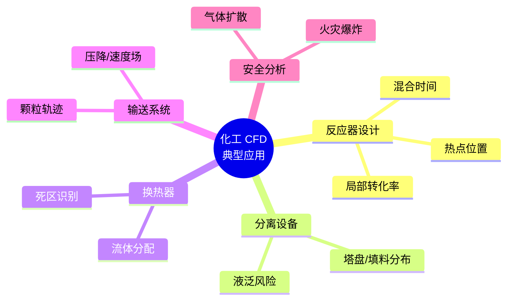

# 第 10 章 建模与模拟

> **本章核心问题**：化工建模与模拟的工具链到底怎么选？怎么用它们解决实际工程问题？
>
> **学习目标**：
> 1. 能列出化工建模工具的七类（流程模拟 / CFD / FEA / 数字孪生 / 数据建模 / AI 建模 / 优化）。
> 2. 能针对具体问题选择合适工具组合。
> 3. 能用至少一款工具（Aspen Plus / OpenModelica / Python）完成一个简化案例。

## 开篇引子

某研究院的工程师老周被领导要求「用 Aspen 跑一遍新工艺」。老周是化学专业出身，对软件一无所知；项目组里也没人会用，结果浪费了半年时间学习软件基本操作，最后发现模拟用的物性方法（EoS）选错，所有结果都失真。这个案例不是个案——化工建模工具的「会用」与「用对」之间存在着巨大的鸿沟。

化工建模与模拟是研发数字化的核心工具集。本章沿着「流程模拟 → CFD → FEA → 数字孪生 → 数据建模 → AI 建模 → 优化」的七类工具谱系，逐类介绍方法、适用场景、化工代表案例，让一线工程师建立「什么问题用什么工具」的方法论地图。

## 10.1 流程模拟（Process Simulation）

### 核心问题

流程模拟什么时候用？怎么选物性方法？

### 方法与工具

**主流流程模拟软件**：

| 软件 | 厂商 | 适用场景 |
|---|---|---|
| **Aspen Plus** | AspenTech | 全场景通用，化工主流 |
| **Aspen HYSYS** | AspenTech | 油气、炼油、动态模拟 |
| **PRO/II** | Schneider Electric | 炼油、化工 |
| **ChemCAD** | ChemStations | 中小规模、教育 |
| **DWSIM** | Daniel Medeiros | 开源、入门 |
| **OpenModelica** | Open Source | 动态仿真、建模语言 |

**物性方法选择**：

- **理想气体 / Raoult 定律**：低压、常温、简单烃类。
- **NRTL / UNIQUAC**：含醇、水、酸的极性体系。
- **SRK / PR**：含气体、高压烃类（炼油、烯烃）。
- **PC-SAFT**：高分子、聚合物体系。
- **电解质 NRTL**：含电解质的体系（MVR、废水处理）。

**典型任务**：

- 物料平衡 / 能量平衡计算。
- 灵敏度分析：考察单变量对结果的影响。
- 优化：求解最优工艺条件。
- 案例计算：物料与能量衡算报告。

### 典型化案例

**典型化案例 10-1**（行业公开资料）

- **背景**：某乙烯装置裂解炉改造，新原料配方模拟。
- **问题**：新原料中重组分比旧原料多 5%，不知道裂解炉能否承受。
- **解法**：用 Aspen Plus 建立裂解炉模型（基于 SPYRO 工业模块），用 SPYRO 算辐射段炉管产物分布，结合换热网络计算加热负荷。
- **结果**：识别出某段炉管表面温度超限，建议调整炉管材质或工艺温度；规避了一次潜在的事故风险。
- **启示**：流程模拟不仅算物料平衡，还能预防设备超限。

### 常见坑

1. **物性方法选错**：差之毫厘，谬以千里；选物性方法应基于二元交互参数验证。
2. **过度相信软件**：软件的解基于假设，假设错了结果就错；工程师必须会校核。

## 10.2 计算流体力学（CFD）

### 核心问题

CFD 在化工中最适合解决什么问题？怎么上手？

### 方法与工具

**CFD 核心软件**：

- **Fluent**（ANSYS）：多相流、化学反应、燃烧。
- **CFX**（ANSYS）：旋转机械、叶轮。
- **OpenFOAM**：开源，可定制。
- **COMSOL Multiphysics**：多物理场耦合（含反应工程）。

**CFD 典型化工应用**：

**图 10-1 CFD 在化工中的典型应用**

**CFD 实施七步法**：

1. **几何建模**：用 CAD（SolidWorks / AutoCAD）建立设备几何。
2. **网格划分**：用 ICEM / Mesh 生成（结构或非结构网格）。
3. **物理模型设置**：湍流模型、传热模型、多相流模型、反应模型。
4. **物性与边界**：流体物性、入口/出口/壁面边界。
5. **求解**：瞬态或稳态求解，调节松弛因子。
6. **后处理**：用 CFD-Post / Tecplot 出图。
7. **模型验证**：与实验数据对比。

### 常见坑

1. **网格质量差**：导致收敛困难或结果失真。
2. **湍流模型选错**：RANS 适用于充分湍流，LES 适用于瞬态大涡。

## 10.3 数值计算与 FEA

### 核心问题

结构仿真在化工装备研发中的作用是什么？

### 方法与工具

**FEA（有限元分析）核心软件**：

- **ANSYS Mechanical**：结构、热、模态分析。
- **COMSOL**：多物理场耦合。
- **Abaqus**：复杂非线性。

**典型应用**：

- 反应器、塔器、换热器的强度与稳定性分析。
- 设备开停车过程的瞬态热应力分析。
- 接管、法兰、螺栓等局部应力分析。
- 振动与共振分析。

**FEA 实施关键**：

- **材料数据**：弹性模量、屈服强度、蠕变曲线必须用实际工况数据。
- **边界条件**：实际约束、压力、温度必须真实。
- **网格收敛性**：网格密度足够后再出最终结论。
- **设计余量**：根据行业规范（如压力容器 GB 150）留足安全余量。

### 常见坑

1. **材料数据采用标准值而非实际值**：高端装备应实测材料性能。
2. **忽视非线性**：大变形、塑性、蠕变场景必须用非线性分析。

## 10.4 数字孪生（Digital Twin）

### 核心问题

数字孪生在化工中的边界是什么？现在能做什么、不能做什么？

### 方法与工具

**数字孪生的四个成熟度**：

| 等级 | 能力 | 化工典型场景 |
|---|---|---|
| **DT1** | 静态描述 | 3D 可视化 |
| **DT2** | 动态仿真 | 实时数据回放 |
| **DT3** | 预测性分析 | 趋势预测、参数优化 |
| **DT4** | 自主决策 | 全自动控制 |

**数字孪生在化工的典型应用**：

- 操作员培训仿真（OTS）。
- 工艺过程实时优化（RTO）。
- 设备状态监测与预测性维护。
- 应急演练与灾害模拟。

### 常见坑

1. **把 3D 可视化当数字孪生**：DT1 是基础，但不是真正的孪生。
2. **数字孪生项目过于宏大**：建议从单一装置、单一目标切入，逐步扩展。

## 10.5 数据驱动建模

### 核心问题

数据驱动建模与机理建模的边界在哪里？

### 方法与工具

**两类建模思路对比**：

| 维度 | 机理建模 | 数据建模 |
|---|---|---|
| **基础** | 物理化学原理 | 历史数据 |
| **可解释性** | 高 | 低 |
| **外推能力** | 强（机理范围内） | 弱 |
| **样本需求** | 少 | 多 |
| **计算效率** | 高 | 取决于模型复杂度 |
| **典型工具** | Aspen、Fluent | Python、R、MATLAB |

**化工数据建模常用模型**：

- **回归类**：OLS、PLS、Kernel Regression。
- **机器学习类**：Random Forest、XGBoost、SVM。
- **深度学习类**：CNN、LSTM、Transformer（在光谱、时序预测中效果优异）。
- **混合模型**：把机理模型作为先验，数据模型修正残差（Physics-Informed ML）。

### 常见坑

1. **数据外推风险**：模型在没有训练数据的工艺窗口内不可信。
2. **忽略物理边界**：如温度不能为负、压力不能为真空等硬约束。

## 10.6 AI 辅助建模

### 核心问题

AI 在化工建模中的主流应用场景有哪些？

### 方法与工具

**AI 辅助建模的五大应用**：

1. **分子设计**：用生成模型（VAE、Diffusion、Transformer）生成新分子。
2. **配方筛选**：用贝叶斯优化、生成对抗网络（GAN）找最优配方组合。
3. **工艺优化**：用强化学习（RL）找最优工艺轨迹。
4. **图像分析**：用 CNN 识别显微镜图像、设备表面缺陷。
5. **自然语言处理**：从专利文献提取工艺参数。

**典型化工 AI 平台**：

- **IBM RXN for Chemistry**：AI 合成路线设计。
- **Citrine Informatics**：材料信息平台。
- **Schrödinger**：量子化学 + 机器学习。
- **Alchemy Power（催化牛）** 等国内平台。

### 常见坑

1. **AI 模型缺乏领域知识**：纯数据驱动会输出物理上不合理的结果；应融合机理约束。
2. **数据量小硬上深度学习**：深度学习需要大样本；应先用传统 ML 或机理模型。

## 10.7 优化方法

### 核心问题

化工优化问题怎么分类？怎么选优化算法？

### 方法与工具

**优化问题的三类分类**：

1. **连续优化**：LP、NLP、全局优化（Pseudo-global）。
2. **离散优化**：MILP、组合优化、调度问题。
3. **多目标优化**：Pareto 优化、加权求和、ε-约束法。

**常用算法对比**：

| 类型 | 算法 | 适用场景 |
|---|---|---|
| **梯度法** | 牛顿法、BFGS、SQP | 光滑非线性 |
| **启发式** | GA、PSO、SA | 全局 / 复杂约束 |
| **代理模型** | 贝叶斯优化 | 黑盒 / 样本少 |
| **离散** | 整数规划、分支定界 | 调度、规划 |

**化工典型优化场景**：

- RTO（实时优化）：用 NLP 在线求解最优工艺条件。
- 调度优化：生产计划、批次调度用 MILP。
- 配方筛选：贝叶斯优化减少实验次数。

### 常见坑

1. **单点最优 vs 动态最优**：连续过程需要动态优化，如批次生产的最优温度曲线。
2. **忽视约束**：工艺约束（产品纯度、压力上限）必须严格满足。

---

## 本章小结

回到本章开篇的「物性方法选错」困局，可以用本章的几个核心判断来回应：

1. **化工建模工具的七类谱系**：流程模拟 / CFD / FEA / 数字孪生 / 数据建模 / AI 建模 / 优化。
2. **流程模拟优先 Aspen Plus / HYSYS**：物性方法是灵魂，必须选对。
3. **CFD 解决「局部细节」问题**：混合、热点、压降、死区。
4. **FEA 解决「装备安全」问题**：强度、稳定性、热应力。
5. **数字孪生的四个等级**：从 3D 可视化到自主决策，按需逐步升级。
6. **AI 赋能的五大场景**：分子设计、配方筛选、工艺优化、图像分析、文献抽取。
7. **优化的三类算法**：连续 / 离散 / 多目标，按问题选算法。

第 11 章开始，我们沿着研发地图的第九节点——「工艺开发方法」——深入。

## 思考题

1. 用一款流程模拟软件（Aspen Plus / DWSIM）建一个简单精馏塔模型（含物性方法选择依据）。
2. 用 COMSOL 或 OpenFOAM 模拟一个简单反应器内的流场，分析混合时间。
3. 用 Python 写一段机器学习代码，建立一个工艺-质量回归模型（含训练、验证、可视化）。
4. 选一个化工优化案例，比较 LP / NLP / GA 三种方法的适用性与结果。
5. 评估你所在企业是否需要数字孪生，从 DT1（3D 可视化）到 DT4（自主决策）应该按怎样的路线升级。

## 参考文献

[1] Aspen Technology. Aspen Plus User Guide[M]. Burlington: AspenTech, 2022.
[2] ANSYS Inc. ANSYS Fluent User''s Guide[M]. Canonsburg: ANSYS, 2023.
[3] COMSOL AB. COMSOL Multiphysics Reference Manual[M]. Stockholm: COMSOL, 2023.
[4] Versteeg H K, Malalasekera W. An Introduction to Computational Fluid Dynamics: The Finite Volume Method[M]. 2nd ed. London: Pearson, 2007.
[5] Tao F, Zhang H, Liu A, Nee A Y C. Digital Twin in Industry: State-of-the-Art[J]. IEEE Transactions on Industrial Informatics, 2019, 15(4): 2402-2411.
[6] Bishop C M. Pattern Recognition and Machine Learning[M]. New York: Springer, 2006.
[7] 周哲 等. 化工大数据分析的关键技术与应用[J]. 化工学报, 2022, 73(5): 1800-1815.
[8] 房德建 等. 基于 Aspen Plus 的化工过程模拟[M]. 北京: 化学工业出版社, 2018.
[9] 杨医博. 计算流体力学在化工中的应用[M]. 北京: 化学工业出版社, 2017.
[10] 段春青 等. 数字孪生在化工中的应用与发展[J]. 现代化工, 2023, 43(1): 5-10.

> **注**：参考文献中部分期刊文献的作者与页码为示意性占位，正式出版前需通过 CNKI、Web of Science 等数据库核实补全。