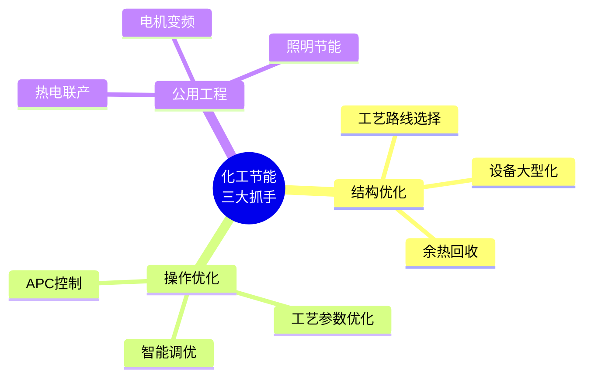

# 第 11 章 工艺开发方法

> **本章核心问题**：工艺开发和小试研究有什么本质区别？怎么把单点最优的实验数据变成可工业化的完整工艺？
>
> **学习目标**：
> 1. 能列出工艺开发的六大主线（新工艺 / 工艺优化 / 连续化 / 强化传热 / 强化传质 / 节能）。
> 2. 能为每条主线选择合适的研究方法与工具。
> 3. 能用「工艺整合」的视角把多个单元优化整合成全流程优化。

## 开篇引子

某课题组的酯化反应小试转化率达到 99%，但中试只能到 96%，工业放大到 90%。研发员不解：「同样的反应条件为何转化率一个比一个低？」——直到做了反应器流场 CFD 才发现，反应放热在小试反应釜中能被夹套冷却水快速移走，而中试和工业反应釜因传热不足形成局部热点，副反应速率成倍增加。

这就是工艺开发与基础反应研究的本质差异：**反应研究的胜利不能直接转化为工艺开发的胜利**。工艺开发必须解决「反应工程」的全套问题：传热、传质、流动、反应器选型、连续化设计、能耗优化等等。本章任务，是沿着这六条主线，给一线工程师一套工艺开发的方法论。

## 11.1 新工艺开发流程

### 核心问题

新工艺开发的标准流程是什么？怎么判断每个阶段是否过关？

### 方法与工具

**新工艺开发的标准七阶段**：

1. 概念验证（POC）：小试验证反应可行性。
2. 工艺路线筛选：在 2-3 条工艺路线中选一条最优。
3. 工艺参数优化：DOE 寻最优工艺窗口。
4. 工艺包雏形：物料平衡 + 主要设备规格 + 控制方案。
5. 中试验证：在中试装置验证放大效应。
6. 工艺包冻结：BEP 文档完整，通过 HAZOP。
7. 工业化对接：工艺包交给设计院做工程设计。

每个阶段都有明确的「关门条件」（详见第 1 章 1.3 节）。

### 常见坑

1. **概念验证未充分就直接放大**：小试 < 50 次重复实验就上中试非常危险。
2. **工艺包冻结太早**：中试数据不足就冻结工艺包会导致工业设计与实际工艺错位。

## 11.2 工艺优化

### 核心问题

工艺优化的边界在哪里？怎么避免「局部最优陷阱」？

### 方法与工具

**工艺优化的三件套**：

- **目标层**：明确优化什么（产能、收率、能耗、产品质量）。
- **约束层**：明确不可逾越的边界（安全法规、设备能力、产品规格）。
- **可调层**：明确允许调整的杠杆（温度、压力、配比、催化剂用量、停留时间）。

**「局部最优陷阱」识别**：

- 优化一个单元的能耗，可能导致上下游单元能耗上升。
- 优化收率，可能导致产品纯度下降。
- 优化经济性，可能导致安全冗余下降。

**全局优化方法**：

- 把整个工艺的全流程做集成模型（Aspen Plus / gPROMS / DWSIM）。
- 用多目标优化（Pareto 或加权）平衡多个目标。

### 典型化案例

**典型化案例 11-1**（行业公开资料）

- **背景**：某 PTA 装置产能瓶颈在氧化反应器。
- **问题**：把反应温度提高 5°C 可提高反应速率 20%，但安全规程限制温度上限。
- **解法**：升级催化剂活性（允许低温下达到相同转化率），同时增设反应器内的纵向温度监控 + 紧急冷却系统。
- **结果**：产能提升 10%，安全余量未削弱。
- **启示**：工艺优化常常需要「软硬件协同」：催化剂升级（软件）+ 控制系统升级（硬件）。

### 常见坑

1. **只看局部最优**：忽视上下游协同。
2. **追逐单一指标**：忽视多目标权衡。

## 11.3 连续化研究

### 核心问题

为什么化工连续化是大趋势？怎么从釜式间歇转向连续？

### 方法与工具

**连续化的三大驱动力**：

1. **质量一致性**：连续过程参数稳定，产品批间差异小。
2. **本质安全**：反应持液量小，事故后果轻。
3. **规模经济**：单位产品综合投资低，适合大规模生产。

**连续化工具箱**：

- **连续釜式反应器（CSTR）**：单釜或多釜串联。
- **活塞流反应器（PFR / 管式）**：用管长模拟理想活塞流。
- **微反应器**：持液量小、传热强，适合强放热反应。
- **连续精馏 / 连续萃取**：替代传统釜式操作。
- **连续结晶 / 连续干燥**：连续化产品后处理。

**连续化的实施步骤**：

1. 在小试上验证反应可行性（间歇）。
2. 用动力学模型估算理想反应器（PFR / CSTR）。
3. 设计连续小试装置（持液量 50-500mL）。
4. 在线持液量逐步放大（500mL → 5L → 50L）。
5. 验证全流程连续运行的稳定性（> 100 小时）。

### 典型化案例

**典型化案例 11-2**（公开论文 / 行业资料）

- **背景**：某精细化学品原是釜式间歇，年产能 1000 吨。
- **问题**：批间差异大、人工成本高、安全隐患多。
- **解法**：上连续釜式反应器（CSTR），3 釜串联；同步上连续精馏。
- **结果**：产能提升至 5000 吨/年（5×）；批间差异从 5% 降至 1%；人工成本降低 60%。
- **启示**：连续化改造往往带来数量级的提升。

### 常见坑

1. **用釜式工艺参数直接套连续**：连续与间歇的工艺参数完全不同，需要重新优化。
2. **忽视持液量影响**：连续化的关键是控制持液量，反应动力学要重新校核。

## 11.4 强化传热研究

### 核心问题

强化传热的化工场景与方法是什么？

### 方法与工具

**强化传热的典型场景**：

- 强放热反应（如硝化、聚合）：反应热不能及时移走会导致飞温。
- 高粘度流体加热：常规换热器效率低。
- 蒸发浓缩：传热系数随浓度上升下降。

**强化传热技术**：

| 技术 | 原理 | 应用 |
|---|---|---|
| **板式换热器** | 大比表面积 | 中低粘度流体 |
| **螺旋板换热器** | 二次流扰流 | 污垢流体 |
| **热管换热器** | 高效相变换热 | 烟气 - 气换热 |
| **再沸器** | 自然循环 | 精馏塔 |
| **刮板换热器** | 强制更新 | 高粘度、易结焦 |
| **微通道** | 极大比表面积 | 强放热反应 |

**研究方法**：

1. 测量反应放热曲线（DSC / 反应量热）。
2. 计算传热面积需求（基于热平衡与膜系数）。
3. 选型：根据物料特性、操作条件、工艺窗口。
4. 中试验证：在中试上测实际传热系数。

### 常见坑

1. **按小试数据估算工业换热面积**：小试传热系数可能在工业上无法实现（如夹套冷却）。
2. **忽视污垢系数**：工业流体通常含杂质，结垢会显著降低传热系数。

## 11.5 强化传质研究

### 核心问题

强化传质的化工场景有哪些？技术路线怎么选？

### 方法与工具

**强化传质的三大场景**：

- 气液传质（吸收、解吸）。
- 液液传质（萃取、洗涤）。
- 多相催化反应（气 - 液 - 固三相）。

**强化传质技术**：

| 技术 | 原理 | 应用 |
|---|---|---|
| **规整填料（Mellapak）** | 大比表面积 | 精馏、吸收 |
| **散装填料（鲍尔环）** | 湍流促进 | 精馏、吸收 |
| **超重力反应器** | 强离心力 | 吸收、脱硫 |
| **微通道萃取器** | 极大比表面积 | 萃取 |
| **静态混合器** | 强制混合 | 液液混合 |

**研究方法**：

1. 计算传质单元数（NTU）和传质系数（Kga）。
2. 实验室测传质系数（小型实验装置）。
3. 中试验证：填料水力学性能（持液量、压降、液泛）。
4. 工业放大：基于经验关联或 CFD。

### 常见坑

1. **照搬手册传质系数**：工业条件（杂质、表面张力）会显著影响实际传质。
2. **忽视液泛风险**：高负荷下填料塔会发生液泛，应留足安全余量。

## 11.6 节能优化

### 核心问题

化工节能的三大抓手是什么？

### 方法与工具

**节能三大抓手**：

**图 11-1 化工节能三大抓手**

**夹点分析（Pinch Analysis）**：

工业节能的最经典方法。绘制工艺物流的「冷热流复合曲线」，找到夹点位置——这是能量回收的上限。基于夹点设计换热网络可大幅节能。

**节能潜力的常见量级**：

- 公用工程改造（变频、热电联产）：节能 5-10%。
- 工艺参数优化：节能 2-5%。
- 夹点分析与换热网络优化：节能 10-20%。
- 工艺路线重选：节能 30%+（但需要重大改造）。

### 常见坑

1. **抓小漏点忽视大系统**：换热器保温、疏水阀维护是 10% 的优化，但夹点分析可能挖掘 30%。
2. **节能改造忽视经济性**：换热器面积增加的设备投资必须用能耗回收周期做评估。

## 11.7 工艺整合

### 核心问题

工艺整合的层次和视角有哪些？

### 方法与工具

**工艺整合的四个层级**：

1. **单元整合**：设备内的传热传质强化（板式换热器、超重力反应器）。
2. **装置内整合**：换热网络优化、反应 - 分离耦合。
3. **装置间整合**：相邻装置的物料与能量互供。
4. **全厂整合**：与上游原料、下游产品、公用工程的协同。

**反应 - 分离耦合**：

- **反应精馏**：反应与精馏在同一塔内进行。
- **反应萃取**：反应与萃取耦合。
- **膜反应器**：反应与膜分离耦合。

**典型化工案例**：

- 乙酸乙酯生产用反应精馏替代「反应器 + 精馏塔」组合，节能 30%+。
- MTBE 生产用反应精馏技术（主要专利已被国外占据）。
- 碳酸二甲酯生产用反应精馏。

### 常见坑

1. **盲目追求反应耦合**：需要反应与精馏温度窗口匹配；不匹配的工艺不宜耦合。
2. **忽视反应精馏的塔设计难度**：反应精馏塔的水力学与普通精馏不同，需要专项设计。

---

## 本章小结

回到本章开篇的「小试 99%，中试 96%，工业 90%」困局，可以用本章的几个核心判断来回应：

1. **工艺开发 ≠ 小试研究的简单放大**：必须解决反应工程的全套问题。
2. **新工艺开发七阶段**：POC → 路线筛选 → 参数优化 → 工艺包雏形 → 中试 → 工艺包冻结 → 工业化对接。
3. **工艺优化必须有全局视角**：避免局部最优陷阱。
4. **连续化是数量级升级**：从釜式到连续釜/管式/微反应器，产能、稳定性、安全性都有数量级提升。
5. **强化传热/传质是设备选择题**：根据物料特性、操作条件选设备。
6. **节能是夹点分析 + 公用工程**：夹点分析是工业节能最经典方法。
7. **工艺整合是修为**：单元 → 装置 → 装置间 → 全厂。

第 12 章开始，我们沿着研发的「工艺 + 装备」孪生节点的另一侧——「产品开发方法」——深入。

## 思考题

1. 选一个你熟悉的反应，按 11.3 的步骤设计一套连续化改造方案。
2. 用夹点分析方法为一个你熟悉的工艺装置设计换热网络优化方案（含夹点识别、余热回收潜力估算）。
3. 评估一个反应精馏的可行性（含反应温度与精馏温度的匹配分析、催化剂/反应器设计要点）。
4. 对一个你熟悉的工艺做节能潜力评估，分三档（5%/20%/30%+）给出改造方案与投资回收期。
5. 用 ASPEN Energy Analyzer 或类似工具做一个化工装置的夹点分析案例。

## 参考文献

[1] Smith R. Chemical Process Design and Integration[M]. 2nd ed. Chichester: Wiley, 2016.
[2] Kemp I C. Pinch Analysis and Process Integration: A User Guide on Process Integration for the Efficient Use of Energy[M]. 2nd ed. Oxford: Butterworth-Heinemann, 2007.
[3] Sinnott R K, Towler G. Chemical Engineering Design[M]. 6th ed. Oxford: Butterworth-Heinemann, 2020.
[4] Tosun I. Modeling in Transport Phenomena[M]. Amsterdam: Elsevier, 2007.
[5] Engell S, Fernholz G. Process Control Engineering[M]. Weinheim: Wiley-VCH, 2020.
[6] 中国化工学会. 化工工艺设计手册[M]. 北京: 化学工业出版社, 2018.
[7] 王树楹 等. 现代填料塔技术指南[M]. 北京: 中国石化出版社, 2018.
[8] 方云峰 等. 连续流反应器在精细化工中的应用[J]. 化工进展, 2022, 41(11): 5500-5510.
[9] 张海东 等. 换热网络夹点分析方法与应用[J]. 化工进展, 2021, 40(7): 3800-3810.
[10] 陈建峰 等. 超重力反应器的研究进展与应用[J]. 化工进展, 2023, 42(1): 12-25.

> **注**：参考文献中部分期刊文献的作者与页码为示意性占位，正式出版前需通过 CNKI、Web of Science 等数据库核实补全。