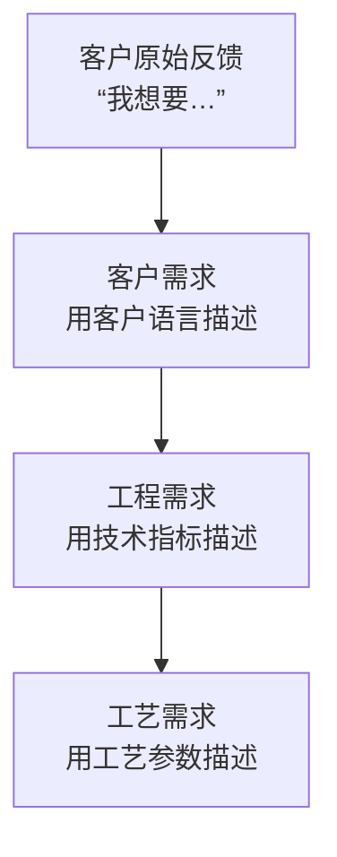
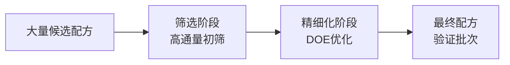

# 第 12 章 产品开发方法

> **本章核心问题**：从工艺角度开发的「能做的产品」怎么转变成市场需要的「想买的产品」？
>
> **学习目标**：
> 1. 能用 QFD（质量功能展开）方法把客户需求转化为产品指标与工艺参数。
> 2. 能为某产品设计一套完整的开发流程（需求 → 配方 → 评价 → 稳定 → 标准）。
> 3. 能识别产品开发中「实验室数据漂亮但用户不满」的常见陷阱。

## 开篇引子

某研究院开发了一种新型电子级溶剂，纯度达 99.99%，性能甚至优于国际同行。但推向市场时却发现客户不买账：客户抱怨溶剂的「包装稳定性」不足（运输后杂质增加 50ppm）；客户应用的工艺窗口与新产品不完全匹配（沸点差 3°C 让客户现产线需重新标定）。实验室里完美的数据，没有转化成客户成功的体验。

产品开发与工艺开发的根本区别：**工艺开发解决「怎么做出来」，产品开发解决「怎么让用户买单」**。工艺视角的「选择性 99%、纯度 99.99%」是手段；产品视角的「客户良率提升 2%、客户库存减少 30%」才是目的。本章任务，是给一线工程师一套从客户到产品再到标准的系统化产品开发方法。

## 12.1 产品需求分析

### 核心问题

客户表达的「我想要好用的产品」怎么拆成研发可量化、可执行的需求？

### 方法与工具

**VOC（Voice of Customer）到需求的转化框架**：

**图 12-1 VOC 到工艺需求的转化**

**Kano 模型**把客户需求分三类：

- **基本需求（Must-be）**：没有就完全不能用，如纯度。
- **期望需求（One-dimensional）**：越好越满意，如选择性、寿命。
- **兴奋需求（Attractive）**：超出预期的惊喜，如更友好的包装、更完善的认证服务。

调研基本需求是研发底线，挖掘兴奋需求是产品差异化机会。

### 常见坑

1. **客户说啥就做啥**：客户只能描述症状，研发要找根因。
2. **忽视终端用户**：经销售、经销商、二级客户的反馈往往被忽视。

## 12.2 产品性能设计

### 核心问题

怎么把客户需求转换为产品的性能指标体系？

### 方法与工具

**QFD（质量功能展开）三步法**：

1. **第 1 步：客户需求 ↔ 工程需求**：建立「需求-指标」的相关性矩阵。
2. **第 2 步：工程需求 ↔ 工艺参数**：建立「指标-工艺」的相关性矩阵。
3. **第 3 步：工艺参数优化**：基于 QFD 输出确定关键工艺参数与目标值。

**性能指标的分层（沿用第 4 章的方法）**：

- 必达指标：法规标准、客户硬性需求。
- 期望指标：对标同行就有。
- 挑战指标：差异化亮点。

### 典型化案例

**典型化案例 12-1**（行业公开资料）

- **背景**：某新材料开发团队用 QFD 方法梳理客户需求。
- **问题**：客户提到「韧性不足」「流动性差」「表面光泽度不够」等 12 个反馈。
- **解法**：用 QFD 把客户需求转化工程指标，再转化为工艺参数；发现 4 个客户反馈在分子量分布上交叉（共享一个根因）。
- **结果**：调整分子量分布参数后，4 个反馈同时改善。
- **启示**：QFD 能找出多个反馈的共同根因，避免「治标不治本」的反复修改。

### 常见坑

1. **指标过多**：QFD 输出几十个指标会让研发混乱，必须分层聚焦。
2. **忽视权重**：不同客户需求的权重不同，应通过市场调研排序。

## 12.3 配方优化

### 核心问题

怎么在众多候选配方中找到最优？

### 方法与工具

**配方优化的两阶段法**：

**图 12-2 配方优化的两阶段**

**初筛阶段**：

- 高通量实验（自动化、并行、微量反应器）。
- 数据建模（Random Forest / XGBoost 评估配方-性能关系）。
- 主成分分析（PCA）识别关键配方因素。

**DOE 优化阶段**：用第 5 章的方法在初筛基础上做 RSM / 混合设计优化。

**配方稳定性的关键考虑**：

- 批次稳定性：同一配方不同批次的产品一致性。
- 环境耐受性：温度、湿度、光照下稳定性。
- 相容性：与下游配方、添加剂的相容性。

### 常见坑

1. **只优化一次实验**：配方稳定性需要多次重复验证。
2. **忽视「工艺可重现性」**：实验室配制手法可能在工业放大时失真。

## 12.4 产品性能评价

### 核心问题

产品性能评价应该包含哪些维度？怎么避免「自评高分、客户低评」？

### 方法与工具

**产品性能评价的三层结构**：

1. **指标层**：性能指标（如纯度、选择性、寿命）。
2. **方法层**：测量方法（实验室方法、行业方法、用户方法）。
3. **应用层**：在客户端的真实工况下的表现。

**指标层**：纯度、杂质、水分、分子量分布、颗粒形态、稳定性等。

**方法层**：实验室标准方法（如 GB/T、ASTM）+ 应用模拟方法。

**应用层**：用户使用条件下的真实表现（如电池电解液在电芯中的循环性能）。

**用户验证的标准流程**：

1. 提供样品给客户试用。
2. 收集试用反馈。
3. 复盘改进。
4. 客户二次验证。
5. 进入客户合格供应商名单。

### 常见坑

1. **用实验室方法评价用户价值**：实验室方法不能代表用户真实场景，应尽量模拟用户条件。
2. **忽视边缘情况**：极端温度、长时间储存等情况需要在评价中覆盖。

## 12.5 稳定性研究

### 核心问题

稳定性研究的边界是什么？什么算完整的稳定性证据？

### 方法与工具

**稳定性研究的四大维度**：

| 维度 | 关注点 |
|---|---|
| **物理稳定性** | 形态变化、结晶、分层、沉淀 |
| **化学稳定性** | 氧化、水解、聚合、分解 |
| **生物稳定性** | 微生物生长、酶解 |
| **使用稳定性** | 在用户工艺中的稳定性 |

**稳定性实验的标准条件（参考 ICH Q1A）**：

- **长期**：25°C ± 2°C / 60% RH ± 5%，12 个月以上。
- **加速**：40°C ± 2°C / 75% RH ± 5%，6 个月。
- **极端**：60°C / 80% RH，2 周（用于预测稳定性问题）。
- **光照**：ICH 光照条件（如 ID5）。

**稳定性结果分析**：

- 用 Arrhenius 方程预测常温下保质期。
- 关注关键质量指标的变化趋势，而非只看「是否超限」。
- 退化产物的安全性评估。

### 常见坑

1. **只看超限不看趋势**：稳定性问题往往有规律性的缓慢变化，应监控趋势而非只看终值。
2. **加速条件过激**：可能引入与真实储存不同的退化机制。

## 12.6 产品标准建立

### 核心问题

为什么必须建立产品标准？产品标准的层级怎么选？

### 方法与工具

**产品标准的四大作用**：

1. **质量基线**：明确「合格」的量化定义。
2. **贸易基础**：客户验收、合同执行、市场监管的依据。
3. **法律依据**：出现质量纠纷时的判据。
4. **企业财富**：标准是高价值知识产权载体。

**产品标准的层级选择**：

| 层级 | 适用 | 优势 |
|---|---|---|
| **企业标准（Q/XXX）** | 内部产品、未公开技术 | 灵活、保密 |
| **团体标准（T/XXX）** | 行业新方向 | 快速、市场先发 |
| **行业标准（HG、SH）** | 行业普遍产品 | 公信力强 |
| **国家标准（GB/GB/T）** | 通用产品 | 强制或推荐 |
| **国际标准（ISO/IEC）** | 出口产品 | 国际化必要 |

**标准的关键内容**：

- 产品名称、分子式、用途。
- 技术指标：纯度、杂质、水分、外观等。
- 试验方法：每项指标的检测方法。
- 检验规则：批次、抽样、合格判定。
- 标志、包装、运输、储存。

### 常见坑

1. **指标定得过严**：超出可达水平，导致合格品率低、成本上升。
2. **方法不严谨**：方法描述模糊，导致不同实验室结果不一致。
3. **标准不更新**：应定期（3-5 年）修订标准。

---

## 本章小结

回到本章开篇的「纯度 99.99% 但客户不买」困局，可以用本章的几个核心判断来回应：

1. **产品开发解决「用户买单」**：不只是工艺做到最好，而是让客户成功。
2. **VOC → 工程需求 → 工艺需求**：三层转化链，让模糊反馈变成可量化指标。
3. **QFD 是核心方法**：找出多反馈的共同根因，避免反复修改。
4. **配方优化两阶段**：初筛 + DOE 精细化。
5. **产品性能评价三层结构**：指标 / 方法 / 应用；用户验证不可省。
6. **稳定性研究四维度**：物理、化学、生物、使用稳定性；长期+加速+极端+光照全覆盖。
7. **产品标准是高价值资产**：从企业标准到国际标准，按产品定位选择层级。

第 13 章开始，我们沿着研发的「产品 + 工艺」两翼的保障翼——「安全研究方法」——深入。

## 思考题

1. 选一个你熟悉的产品，用 QFD 把客户反馈转化为工程指标与工艺参数。
2. 设计一套你手头产品的稳定性研究方案（含 4 种稳定性条件、检测指标、判定规则）。
3. 选一个你熟悉的产品，比对其现行标准与同行标准，找出可优化的指标项。
4. 用 Kano 模型对一个客户做需求分类，识别基本需求、期望需求、兴奋需求。
5. 设计一份「产品开发报告」模板（含需求、性能、配方、稳定性、标准五块）。

## 参考文献

[1] Griffin A, Hauser J R. The Voice of the Customer[J]. Marketing Science Institute, 1992, 12(4): 1-20.
[2] Akao Y, Mazur G H. The Customer-Driven Approach to Quality Planning and Deployment[M]. Tokyo: QCC Institute, 2003.（QFD 经典）
[3] ICH Harmonised Tripartite Guideline. Q1A(R2): Stability Testing of New Drug Substances and Products[S]. 2003.（虽为药物领域，方法可借鉴）
[4] 国家标准化管理委员会. GB/T 1.1-2020 标准化工作导则[S]. 北京: 中国标准出版社, 2020.
[5] 中国化工学会. 化工产品技术指标与试验方法编写规范: HG/T 5830-2021[S]. 北京: 化工出版社, 2021.
[6] 刘广青 等. 化工产品研发方法与实践[M]. 北京: 化学工业出版社, 2019.
[7] 周颖 等. 质量功能展开在化工产品研发中的应用[J]. 化工进展, 2020, 39(6): 2200-2210.
[8] 张玉川 等. 配方优化的统计方法与实践[J]. 化工进展, 2021, 40(11): 5800-5810.
[9] 《化工产品质量控制》编委会. 化工产品质量控制[M]. 北京: 化学工业出版社, 2018.
[10] 王乃坤 等. ICH Q1A 稳定性研究在化工产品中的应用[J]. 化工进展, 2022, 41(3): 1500-1510.

> **注**：参考文献中部分期刊文献的作者与页码为示意性占位，正式出版前需通过 CNKI、Web of Science 等数据库核实补全。