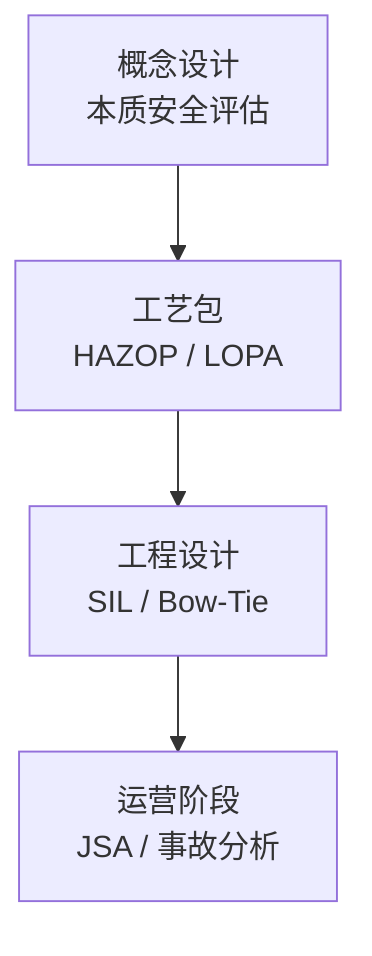
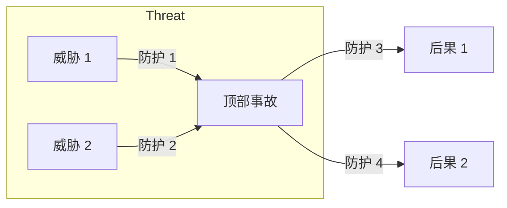
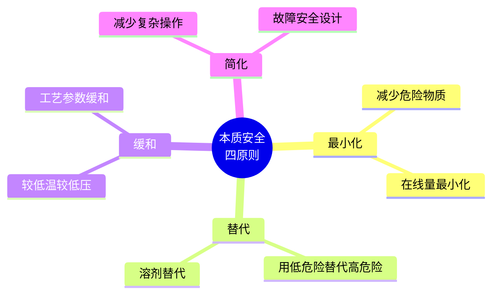

# 第 13 章 安全研究方法

> **本章核心问题**：化工安全的核心方法论是什么？怎么用系统化的方法把事故消灭在工艺设计阶段？
>
> **学习目标**：
> 1. 能区分 HAZOP / LOPA / SIL / Bow-Tie / FTA / JSA 六大安全分析工具的适用场景。
> 2. 能为某工艺装置设计一套完整的安全研究方案。
> 3. 能用本质安全设计的四条原则（最小化 / 替代 / 缓和 / 简化）评估工艺路线。

## 开篇引子

2015 年天津港事故、2019 年响水化工事故后，化工安全成为国家与企业的「生死线」。不少企业把安全研究当成「被动合规」——出事时查一查监管要求，应付检查了事。但优秀工程师知道：**安全研究应该嵌入工艺研发的每一个环节**，从概念设计阶段就把风险掐掉，而不是留给投产后的「安全整改」。

安全研究方法论的核心，是把「经验拍脑袋」升级为「系统化分析」。本章任务，是给一线工程师一套完整的安全研究工具箱：HAZOP、LOPA、SIL、Bow-Tie、FTA、JSA、本质安全设计。每种工具介绍原理、适用场景、化工典型案例。

## 13.1 安全研究方法论总论

### 核心问题

安全研究应该从什么时候介入？怎么嵌入工艺研发？

### 方法与工具

**安全研究嵌入工艺研发的四个阶段**：



**图 13-1 安全研究嵌入工艺研发的四个阶段**

**核心判断逻辑**：

- **概念设计阶段**：用本质安全评估（详见 13.7）选工艺路线。
- **工艺包阶段**：对关键节点做 HAZOP + LOPA，确定控制方案。
- **工程设计阶段**：基于 LOPA 结果做 SIL 等级确定与 Bow-Tie 防护设计。
- **运营阶段**：JSA + 事故根本原因分析（如 Bow-Tie / Tripod Beta）。

### 常见坑

1. **安全研究放在投产前**：错过了工艺路线优化机会，代价 10x 以上。
2. **安全研究只做形式审查**：不真正实施 HAZOP，只在文件上签字。

## 13.2 HAZOP 研究

### 核心问题

HAZOP 怎么组织？怎么避免「走过场」？

### 方法与工具

**HAZOP 基本要素**：

| 要素 | 内容 |
|---|---|
| **节点** | 工艺系统的最小分析单元 |
| **意图** | 节点的设计意图（如「冷却到 80°C」） |
| **引导词** | NO/NOT / MORE / LESS / AS WELL AS / PART OF / REVERSE / OTHER THAN |
| **偏差** | 引导词 + 工艺参数（如「MORE 温度」） |
| **原因** | 导致偏差的潜在事件 |
| **后果** | 偏差的实际后果 |
| **保护措施** | 已有的工程与行政防护 |
| **建议** | 需要额外采取的防护 |

**HAZOP 实施步骤**：

1. 准备：收集 P&ID、工艺包、操作规程。
2. 组建团队：工艺、设备、仪表、安全、操作、HSE 等多方专家。
3. 节点划分：按工艺段划分节点。
4. 逐节点分析：每个节点对每个工艺参数用引导词产生偏差。
5. 评估：识别需要新增/改进的保护措施。
6. 报告：HAZOP 报告 + 行动项跟踪表。

### 典型化案例

**典型化案例 13-1**（行业公开资料）

- **背景**：某 PTA 氧化反应器 HAZOP 分析。
- **问题**：高压下物料能形成爆炸性混合物，传统工艺包未充分分析。
- **解法**：HAZOP 团队识别出「MORE 空气进入」+「LESS 氧含量在线监测」两个偏差组合下，会形成爆炸极限范围内停留超 100 秒的场景。
- **结果**：增设紧急停车系统（在氧含量达 95% 上限时连锁切断进料），并增加定期清理管线内残留物料的 SOP。
- **启示**：HAZOP 能识别传统经验容易遗漏的「偏差组合」。

### 常见坑

1. **HAZOP 走过场**：让新员工会议、培训不足，应由经验丰富的专家主持。
2. **只关注节点不关注接口**：节点间接口往往隐藏风险。

## 13.3 LOPA 分析

### 核心问题

LOPA 怎么量化评估独立保护层？

### 方法与工具

**LOPA（保护层分析）的核心逻辑**：

```
事故场景频率 = 初始事件频率 × 独立保护层失效概率乘积的倒数
```

**独立保护层（IPL）**：

- 工艺设计（如高压设计在 1.5 倍安全系数）
- 基本过程控制系统（BPCS）— 通常取 PFD = 1×10⁻¹
- 报警与操作员响应 — PFD = 1×10⁻¹ ~ 1×10⁻²
- 安全仪表系统（SIS）— 见 13.4
- 物理防护（如安全阀、爆破片）— PFD = 1×10⁻¹ ~ 1×10⁻³
- 厂区应急响应 — PFD = 1×10⁻¹ ~ 1×10⁻²

**LOPA 的输出**：每个事故场景是否需要额外保护层。

### 常见坑

1. **只算一层保护层**：多个独立保护层才有效。
2. **忽视共同原因失效**：多个 IPL 是否共用传感器、阀门、人为因素。

## 13.4 SIL 评估

### 核心问题

SIL 等级怎么定？SIL 1/2/3 各自的工程含义是什么？

### 方法与工具

**SIL 等级与危险事件频率目标**：

| SIL | 目标失效概率 | 实现方式 |
|---|---|---|
| **SIL 1** | 10⁻² ~ 10⁻¹ | 单仪表，单一冗余 |
| **SIL 2** | 10⁻³ ~ 10⁻² | 双仪表，部分冗余 |
| **SIL 3** | 10⁻⁴ ~ 10⁻³ | 三仪表或 HFT=2 配置 |
| **SIL 4** | 10⁻⁵ ~ 10⁻⁴ | 几乎不用于化工 |

**SIL 等级确定流程**：

1. 用 HAZOP / LOPA 识别需要安全仪表功能（SIF）的场景。
2. 计算每个 SIF 的目标 SIL 等级。
3. 选择合适的传感器、逻辑控制器、执行器（俗称「三选」）。
4. 计算 SIF 的 PFDavg 是否满足目标。
5. 验证硬件容错（HFT）、验证测试间隔等。

### 常见坑

1. **盲目追求 SIL 3**：等级越高成本越高，应按风险降级原则「够用就好」。
2. **验证测试周期过长**：SIL 3 设备测试周期通常 ≤ 1 年，否则 PFD 增大失效。

## 13.5 Bow-Tie 与 FTA 分析

### 核心问题

Bow-Tie 和 FTA 各自最适合什么场景？

### 方法与工具

**Bow-Tie（蝴蝶结）分析**：

可视化展示一个事故场景：左侧「威胁→顶部事故」、右侧「事故→后果」；左右两侧各设置若干防护层。



**图 13-2 Bow-Tie 通用结构**

**Bow-Tie 适合**：

- 单个事故的传播路径与防护体系展示。
- 操作员培训、应急演练的依据。
- 管理层可视化的沟通工具。

**FTA（故障树）**：

从顶部事件向下，用「与门 / 或门」分解各层子事件，直到基本事件。适合：

- 复杂的、多因素组合的事故因果链分析。
- 定量分析（如航空、核工业的高可靠性系统）。
- 工程改造与评估。

### 常见坑

1. **Bow-Tie 过细**：每个防护都需要列出，会让图过密；建议 3-6 个主防护。
2. **FTA 缺基本事件概率**：纯定性 FTA 价值有限；定量分析需要可靠的事件频率数据。

## 13.6 JSA 与作业安全分析

### 核心问题

JSA 在化工生产现场怎么实施？

### 方法与工具

**JSA（Job Safety Analysis）的 4 步法**：

1. 拆解作业步骤（如更换滤芯的 8 个步骤）。
2. 识别每一步的危害（机械、化学、人因）。
3. 评估风险（后果 × 概率）。
4. 制定控制措施（消除、替代、工程控制、行政控制、PPE）。

**JSA 在化工的典型场景**：

- 开停车作业。
- 检修作业（动火、受限空间、高处作业）。
- 装卸料操作。
- 取样与分析。
- 异常处理（如堵管处理）。

### 常见坑

1. **JSA 标准化模板**：每个作业应有具体 JSA，不能用通用模板套所有作业。
2. **JSA 流于签字形式**：作业前应由作业人员、监护人共同复述。

## 13.7 本质安全设计

### 核心问题

本质安全设计为什么是「最廉价的安全」？怎么用？

### 方法与工具

**Kletz 本质安全的四条原则**：



**图 13-3 本质安全的四原则**

**典型化工本质安全改造案例**：

- 用连续反应器替代间歇釜，把反应持液量从 5000L 降到 50L，事故后果下降 100 倍。
- 用液相反应替代气相反应，消除爆炸性混合气形成可能。
- 用二级反应器替代单级反应，避免中间体累积。

**本质安全 vs 工程防护**：

- 本质安全：消除或减弱危险源本身。
- 工程防护：增加附加防护（安全阀、SIS）。
- 本质安全的成本效益通常远高于工程防护。

### 常见坑

1. **把本质安全当成「不合实际」**：本质安全往往需要工艺路线调整，但成本远低于事故损失。
2. **忽视「工艺与本质安全的权衡」**：工艺优化可能引入新危险，本质安全审查应在工艺路线阶段并行开展。

---

## 本章小结

回到本章开篇的「安全靠经验拍脑袋」困局，可以用本章的几个核心判断来回应：

1. **安全研究嵌入工艺研发全程**：从概念设计的本质安全评估到运营阶段的 JSA，每阶段都有任务。
2. **HAZOP 是最基础的安全分析**：识别工艺偏差与组合，但要走心不走形式。
3. **LOPA 量化独立保护层**：让安全决策从定性走向定量。
4. **SIL 是 SIF 的「天花板与地板」**：够用就好，不要盲目追高。
5. **Bow-Tie 和 FTA 是互补工具**：Bow-Tie 适合沟通，FTA 适合复杂因果分析。
6. **JSA 是作业现场的安全脚本**：不能套通用模板。
7. **本质安全是「最廉价的安全」**：四条原则（最小化 / 替代 / 缓和 / 简化）应在工艺路线阶段早期介入。

第 14 章开始，我们沿着工艺研发的另一翼——「环保研究方法」——深入。

## 思考题

1. 选一个你熟悉的工艺装置（节点数 ≥ 10），组织一次 HAZOP 分析会议（角色扮演），输出至少 5 个有意义的偏差。
2. 对一个具体的工艺节点做 LOPA 分析，计算事故场景频率并判断是否需要额外保护层。
3. 选一个工艺包中的 SIF，计算 PFDavg 并校验是否满足目标 SIL 等级。
4. 对一个化工事故案例画 Bow-Tie 图，识别威胁、防护与可能的防护失效模式。
5. 用本质安全四原则评估你熟悉的一个工艺装置，提出至少 3 项本质安全改进建议。

## 参考文献

[1] IEC 61882:2016, Hazard and operability studies (HAZOP studies) - Application guide[S]. Geneva: IEC, 2016.
[2] IEC 60812:2015, Failure modes and effects analysis (FMEA and FMECA)[S]. Geneva: IEC, 2015.
[3] IEC 61511:2016, Functional safety - Safety instrumented systems for the process industry sector[S]. Geneva: IEC, 2016.
[4] Crowl D A, Louvar J F. Chemical Process Safety: Fundamentals with Applications[M]. 4th ed. London: Pearson, 2019.
[5] Kletz T. Process Plants: A Handbook for Inherently Safer Design[M]. 2nd ed. Boca Raton: CRC Press, 2010.
[6] Mannan S. Lees'' Loss Prevention in the Process Industries[M]. 4th ed. Oxford: Butterworth-Heinemann, 2012.
[7] 国家安全生产监督管理总局. 化工建设项目安全设计管理导则: AQ/T 3033-2010[S]. 北京: 煤炭工业出版社, 2010.
[8] 国家市场监督管理总局. 危险化学品企业特殊作业安全规范: GB 30871-2022[S]. 北京: 中国标准出版社, 2022.
[9] 吴宗之 等. 危险化学品安全监管与应急救援[M]. 北京: 化学工业出版社, 2018.
[10] 王涛 等. 本质安全设计在化工过程中的应用[J]. 化工进展, 2022, 41(2): 550-560.

> **注**：参考文献中部分期刊文献的作者与页码为示意性占位，正式出版前需通过 CNKI、Web of Science 等数据库核实补全。