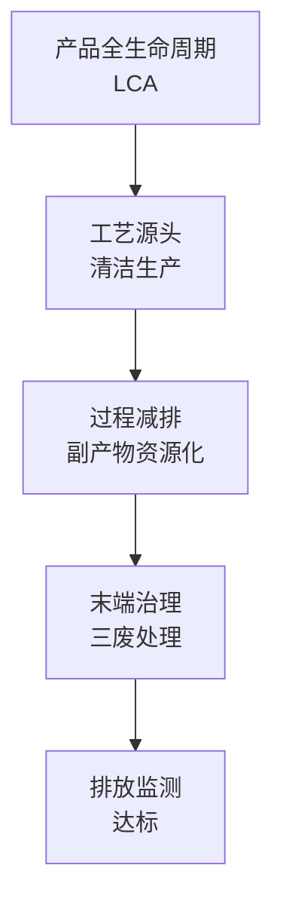
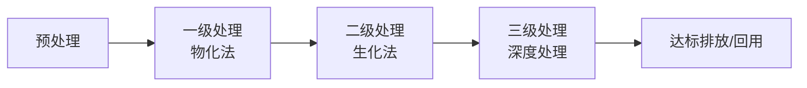
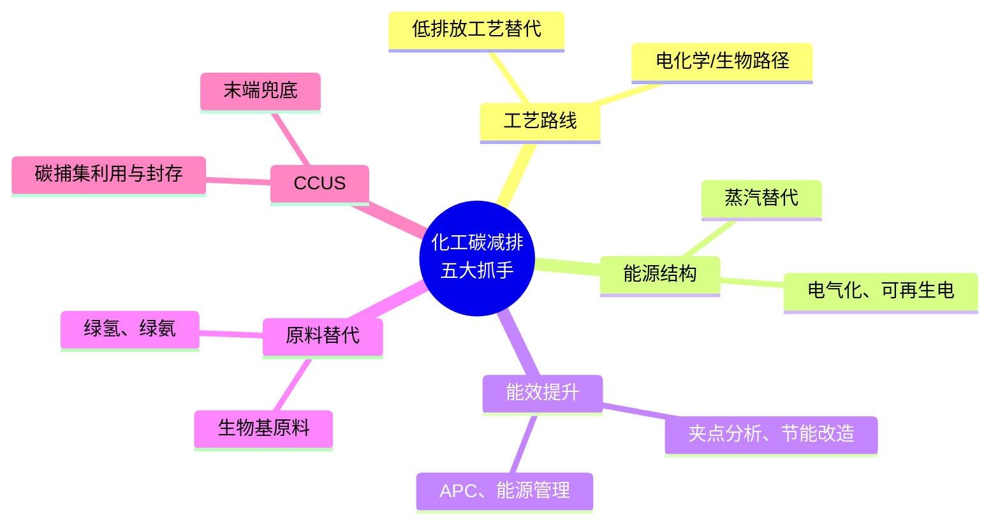

# 第 14 章 环保研究方法

> **本章核心问题**：「双碳」目标下，化工环保从「末端治理」走向「全过程减排」。一线工程师应该掌握哪些环保研究方法？
>
> **学习目标**：
> 1. 能识别三废处理（废水 / 废气 / 废固）的主流工艺路线。
> 2. 能用 LCA 方法评估产品的全生命周期环境影响。
> 3. 能从工艺源头识别碳减排机会。

## 开篇引子

某化工企业 2018 年的环保设施投资 5 亿元，2022 年降到 1.5 亿元。不是环保标准放低了，而是企业学到了「**更便宜的环保是源头减排**」。废水 COD 从 8000 降到 1500 mg/L，比末端处理省了 80% 的运营成本；碳排放强度从 1.2 吨标煤/吨产品降到 0.9 吨标煤/吨产品，每吨产品成本降低 200 元以上。

环保研究在化工研发中的角色，正在从「合规底线」升级为「竞争力源泉」。本章任务，是给一线工程师一套从源头识别到末端处置再到全生命周期评价的环保方法论。重点是「全过程减排」的视角，而不是「末端治理」的视角。

## 14.1 化工环保研究的视野

### 核心问题

为什么说「环保研究的最高境界是工艺源头减排」？

### 方法与工具

**化工环保研究的五个层次**：

**图 14-1 化工环保研究的五个层次（从 L1 最优到 L5 兜底）**

**清洁生产审计（Cleanser Production Audit）**：

按照国际认可的清洁生产程序，对工艺各环节审核：输入物料 → 工艺过程 → 输出物料 → 三废 → 减排机会。

### 常见坑

1. **「环保 = 末端治理」的思维**：花大钱买先进设备治污，不如从工艺源头减排。
2. **忽视环保与经济的协同**：源头减排往往同时带来经济效益。

## 14.2 三废分析

### 核心问题

怎么系统识别工艺过程的三废来源与特征？

### 方法与工具

**三废来源识别表**：

| 来源 | 废水 | 废气 | 废固 |
|---|---|---|---|
| **原料带入** | 高 COD 有机废水 | VOC 挥发 | 原料包装废物 |
| **工艺生成** | 副反应生成水相副产物 | 反应/分离尾气 | 釜残、催化剂失活 |
| **设备清洗** | 清洗废水 | 储罐呼吸 | 废滤芯、废填料 |
| **公用工程** | 循环水排污、锅炉水 | 锅炉烟气 | 灰渣 |
| **事故排放** | 事故水、消防水 | 火炬排放 | 事故沉积物 |

**特征污染物的来源-去向分析**：

| 污染物 | 主要来源 | 主要去向 |
|---|---|---|
| **COD/BOD** | 有机原料未反应、部分水洗 | 排水 |
| **氨氮** | 含氮原料/反应 | 排水 |
| **SO₂/NOₓ** | 燃烧、含硫原料 | 烟囱 |
| **VOC** | 有机溶剂挥发 | 排大气 |
| **重金属** | 催化剂、原料杂质 | 固废 |

### 常见坑

1. **只看排污口**：源头分析更重要。
2. **忽视事故排放**：事故状态下排放往往是正常值的 100-1000 倍。

## 14.3 废水处理

### 核心问题

化工废水的主流处理工艺有哪些？怎么选型？

### 方法与工具

**化工废水处理工艺路线**：

**图 14-2 废水处理四阶段**

**典型工艺组合**：

- **预处理**：隔油、气浮、吹脱、萃取、水解。
- **一级**：混凝沉淀、过滤。
- **二级**：活性污泥、A/O、SBR、MBR。
- **三级**：Fenton 氧化、臭氧、活性炭、反渗透。

**废水处理工艺选型**：

| 水质特征 | 推荐工艺 |
|---|---|
| **高 COD、可生化** | 生化（活性污泥、A/O） |
| **高盐、难降解** | 蒸发 + 高级氧化 |
| **含氨氮** | 吹脱 + A/O |
| **含重金属** | 化学沉淀 + 离子交换 |
| **回用需求** | 双膜法（UF + RO） |

### 常见坑

1. **工艺选型忽视水质波动**：实际废水水质波动大，应考虑调节池 + 工艺耐受性。
2. **生化处理对毒性物质耐受差**：应对进水毒性做评估与预处理。

## 14.4 VOC 治理

### 核心问题

VOC 治理的主流工艺有哪些？怎么选型？

### 方法与工具

**VOC 治理工艺矩阵**：

| 工艺 | 适用 | 优势 | 劣势 |
|---|---|---|---|
| **活性炭吸附** | 中低浓度、大风量 | 设备简单 | 吸附剂定期更换 |
| **吸收（液体）** | 水溶性 VOC | 操作简单 | 废水二次污染 |
| **冷凝法** | 高浓度、高沸点 | 回收产品 | 能耗大 |
| **RTO 蓄热氧化** | 中高浓度 | 效率高（> 99%） | 投资大 |
| **RCO 蓄热催化氧化** | 中低浓度 | 启停灵活 | 催化剂中毒 |
| **生物滤池** | 低浓度、生物降解 | 投资低 | 占地大、传质限制 |
| **膜分离** | 高浓度、特殊需求 | 选择性高 | 膜污染 |

**储罐 VOC 减排**：

- **内浮顶罐**：替代固定顶罐，减排 90%。
- **油气回收**：顶部呼吸气回收。
- **RTM 真实蒸气压管理**：控制物料温度减少挥发。

### 常见坑

1. **选型靠「设备厂家推荐」**：VOC 治理工艺应基于风量、浓度、物性综合选型。
2. **RTO/RCO 忽视安全**：高浓度 VOC 直接进 RTO 有爆炸风险，需稀释或前置预处理。

## 14.5 固废资源化

### 核心问题

化工固废怎么识别、分类、处置？

### 方法与工具

**化工固废三大类**：

| 类别 | 典型来源 | 处置路径 |
|---|---|---|
| **一般工业固废** | 包装物、净水污泥 | 综合利用或填埋 |
| **危险废物** | 釜残、废催化剂、废溶剂 | 危废处置中心 |
| **副产物** | 工艺副反应产物 | 资源化或再加工 |

**危废识别基础**：

- **HW06** 废有机溶剂与含有机溶剂废物。
- **HW11** 精（蒸）馏残渣。
- **HW34** 废酸。
- **HW35** 废碱。
- **HW50** 废催化剂。

**资源化的常见路径**：

- 釜残回到反应器做原料（回收效率 30%-90%）。
- 废催化剂送至专门的贵金属回收公司。
- 高 COD 釜残做锅炉燃料（需考虑硫、氯含量）。
- 副产物降级利用到另一产品（如某一副产物做防腐剂原料）。

### 常见坑

1. **危废分类不严谨**：危废错分会导致严重的法律风险。
2. **副产物忽视资源化**：把副产物当废物处置是隐性效益流失。

## 14.6 碳减排研究

### 核心问题

化工碳减排的「五大抓手」是什么？

### 方法与工具

**化工碳减排的五大抓手**：

**图 14-3 化工碳减排五大抓手**

**碳足迹核算**：

- **直接排放（Scope 1）**：燃料燃烧、工艺排放。
- **间接排放（Scope 2）**：外购电力/蒸汽。
- **其他间接排放（Scope 3）**：原料、运输、废弃物。

**化工碳减排技术的成熟度**：

- **TRL 9**：能效提升、热电联产、变频改造。
- **TRL 7-8**：电气化、绿电、生物质锅炉。
- **TRL 5-6**：氢能替代、电化学合成、生物制造。
- **TRL 3-4**：CCUS、全氧燃烧。

### 常见坑

1. **把碳减排等同于末端 CCUS**：能效提升与源头替代的成本远低于 CCUS。
2. **忽视绿色电力替代**：直接换绿电可大幅降低 Scope 2。

## 14.7 生命周期评价（LCA）

### 核心问题

LCA 方法学如何应用于化工产品？实际操作有什么坑？

### 方法与工具

**LCA 四阶段（ISO 14040）**：

1. **目标定义与范围界定**：产品、功能单元、系统边界。
2. **清单分析**：全生命周期输入输出数据收集。
3. **影响评估**：GWP、AP、EP 等特征化指标。
4. **解释**：识别关键环节与改进机会。

**功能单元**：必须明确（如「1 kg 高纯度 PTA」）。

**系统边界**：

- **Cradle-to-Gate**：从原料到出厂。
- **Cradle-to-Grave**：从原料到使用后处置。
- **Gate-to-Gate**：单装置分析。

**化工 LCA 的应用场景**：

- 产品碳足迹报告（出口欧美必需）。
- 工艺路线选择（不同路线的 GWP 对比）。
- 副产物/废弃物处置方案选择。
- 用户场景减排评估（产品使用阶段排放）。

**LCA 工具**：

- SimaPro、GaBi、openLCA 等专业软件。
- 中国 CLCD 数据库、Ecoinvent 数据库。

### 常见坑

1. **数据不全硬上**：LCA 输出价值与数据质量成正比，低质量数据会得出错误结论。
2. **忽视边界一致性**：不同方案对比必须用相同边界。

---

## 本章小结

回到本章开篇的「5 亿环保投资」困局，可以用本章的几个核心判断来回应：

1. **环保研究五层次**：L1 LCA 全局最优 > L2 工艺源头减排 > L3 过程副产物资源化 > L4 末端治理 > L5 排放监测。
2. **三废分析是基础**：先识别来源与去向，再选处理工艺。
3. **废水 / VOC / 固废各有专工艺**：选型基于水质 / 浓度 / 风量。
4. **碳减排五大抓手**：工艺路线、能源结构、能效提升、原料替代、CCUS。
5. **LCA 是顶层工具**：用于产品碳足迹报告与工艺路线比较。

第 15 章开始，我们从工艺 / 装备 / 数字 / 安全的研发基础，进入第五篇「中试放大研究」。

## 思考题

1. 为你熟悉的某工艺装置做一份「三废来源识别表」，含废水 / 废气 / 固废的典型来源、特征污染物、产生量估算。
2. 选一个 VOC 治理项目，比较三种工艺（RTO / RCO / 活性炭）的适用性与经济性。
3. 对一个高 COD 废水，选 2-3 种组合工艺做技术经济对比。
4. 用 ISO 14040 方法对一个化工产品做 LCA 框架设计（含目标定义、系统边界、数据来源、影响评估方法）。
5. 为你熟悉的某装置做碳减排潜力评估，分五档（5%/20%/30%/50%/80%+）列出方案与回收期。

## 参考文献

[1] ISO 14040:2006 Environmental Management - Life Cycle Assessment - Principles and Framework[S]. Geneva: ISO, 2006.
[2] ISO 14044:2006 Environmental Management - Life Cycle Assessment - Requirements and Guidelines[S]. Geneva: ISO, 2006.
[3] 国家市场监督管理总局. GB 31573-2015 石油化学工业污染物排放标准[S]. 北京: 中国标准出版社, 2015.
[4] 国家市场监督管理总局. GB 31572-2015 合成树脂工业污染物排放标准[S]. 北京: 中国标准出版社, 2015.
[5] 国家市场监督管理总局. GB 39728-2020 化工建设项目大气污染物排放标准[S]. 北京: 中国标准出版社, 2020.
[6] 中国化工学会. 化工过程污染物控制与资源化[M]. 北京: 化学工业出版社, 2019.
[7] 刘强 等. 化工废水处理技术进展与应用[J]. 化工进展, 2021, 40(2): 750-770.
[8] 张亚伟 等. VOC 治理技术的研究进展[J]. 化工进展, 2022, 41(1): 350-365.
[9] 王灿 等. 双碳目标下化工行业碳减排路径研究[J]. 化工进展, 2023, 42(1): 12-25.
[10] 杨建新 等. 生命周期评价在化工行业的应用[J]. 环境工程学报, 2022, 16(8): 2300-2310.

> **注**：参考文献中部分期刊文献的作者与页码为示意性占位，正式出版前需通过 CNKI、Web of Science 等数据库核实补全。