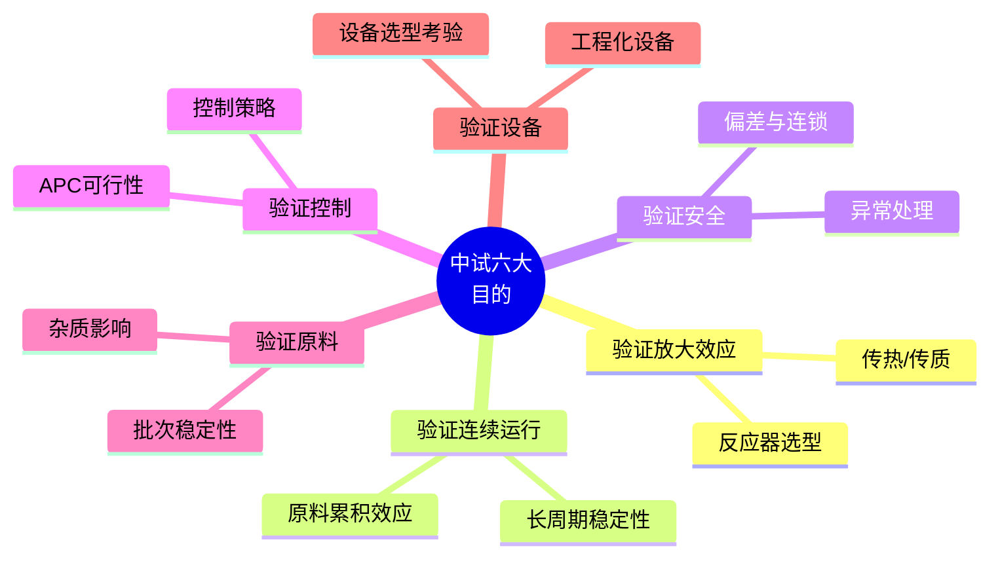
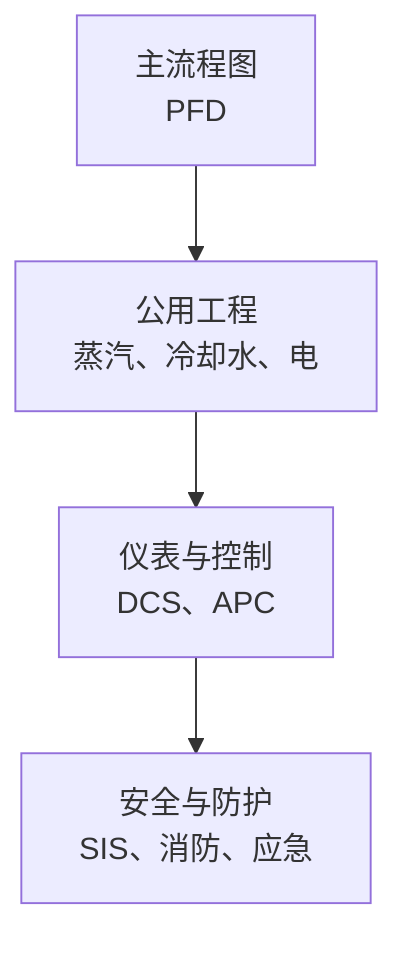
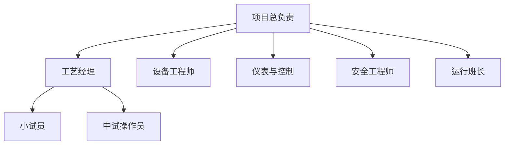
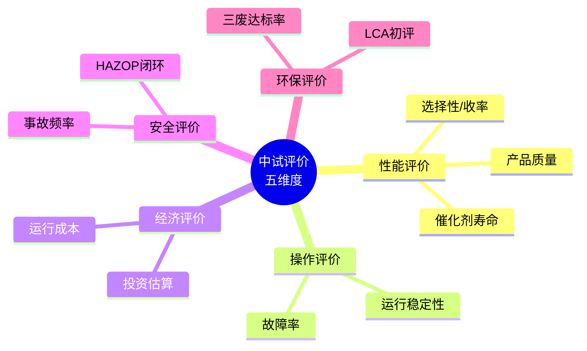

# 第 15 章 中试研究

> **本章核心问题**：从实验室到工业放大之间，为什么必须经过中试？中试设计应该遵循什么原则？
>
> **学习目标**：
> 1. 能列出中试的六大目的（验证放大效应 / 验证连续运行 / 验证安全 / 验证控制 / 验证原料 / 验证设备）。
> 2. 能设计一份中等规模的中试方案。
> 3. 能用「中试风险清单」识别并管理中试常见失败模式。

## 开篇引子

某新材料项目从实验室走到中试阶段，研发主管坚持要建一座大型中试装置（年产 1000 吨）。设计院按主装置规模的 1/10 设计了中试，但忽略了关键细节：物料循环系统、再生系统、紧急停车系统都按 1/10 比例缩小，结果中试运行后频繁发生物料倒灌、再生系统堵塞、紧急停车误触发。半年过去，中试还没稳定运行，原计划的工业装置建设不得不延迟。

中试是从实验室到工业化的「桥」。中试不是「把实验设备放大」，也不是「把工业装置缩小」，而是按特定目标设计的「独立阶段」。本章任务，是给一线工程师一套中试研究的方法论：中试目标、设计、设备、组织、风险与评价。

## 15.1 中试目标与定位

### 核心问题

中试应该回答什么问题？为什么不能跳过中试直接工业放大？

### 方法与工具

**中试的六大目的**：

**图 15-1 中试研究的六大目的**

**为什么不能跳过中试直接放大**：

- 放大效应有时非线性（如传热面积按 1/10 缩小导致热点）。
- 设备几何不能简单缩放（如高径比、壁厚）。
- 长周期问题（催化剂失活、杂质累积）短期实验发现不了。
- 安全防护在小试可能失效（持液量小 vs 工业大）。

**中试与工业化的对应**：

| 阶段 | 中试 | 工业 |
|---|---|---|
| **持液量** | 30-300 L | 30-300 m³ |
| **规模比** | 1/100 ~ 1/10 | 1 |
| **运行模式** | 多工况、短中期 | 长期、单一工况 |
| **目的** | 验证设计意图 | 商业化 |

### 常见坑

1. **中试规模过大**：在尚未确认工艺可行时建大型中试是浪费。
2. **中试规模过小**：无法暴露放大效应，失去中试意义。

## 15.2 中试设计原则

### 核心问题

中试装置的设计应该遵循什么原则？怎么平衡「准、快、省」？

### 方法与工具

**中试设计的五大原则**：

1. **目的驱动**：每个中试组件必须有明确目的，不必要的设备不设计。
2. **几何相似**：反应器高径比、桨叶类型、传热面积密度尽量与工业一致。
3. **可调性**：操作参数（温度、压力、流速）应能宽范围调节。
4. **可观测性**：关键位置预留测点（温度、压力、采样点）。
5. **可维护性**：考虑中试阶段的频繁试验需求，便于检修。

**中试装置的设计三层次**：

**图 15-2 中试装置的四层设计**

**中试设计的关键检查点**：

- 每个反应釜、换热器、塔器都有可调操作空间。
- 关键位置有在线采样口、视镜、视镜灯、紧急排放口。
- 公用工程足够且可调（蒸汽压力、冷却水温度）。
- 安全防护与潜在风险等级匹配。
- 数据采集接口齐全（与后续数据分析平台对接）。

### 常见坑

1. **设计「等同工业装置的缩小版」**：成本失控且失去中试灵活性。
2. **公用工程不足**：中试在峰值试验时常常被公用工程限制。

## 15.3 中试设备与装置

### 核心问题

中试设备应该以「可移动撬装」还是「固定安装」为主？

### 方法与工具

**两类中试装置的对比**：

| 类型 | 优势 | 劣势 |
|---|---|---|
| **撬装（Skid）** | 可移动、模块化、场地灵活 | 撬装空间限制、单撬规模小 |
| **固定安装** | 规模大、贴近工业装置、可观测试验多 | 不可移动、投资大、变更难 |

**中试设备的工程考量**：

- 反应器：可以买通用反应釜，但关键反应器最好定制以模拟工业条件。
- 换热器：可以租赁或外购；换热面积应预留 50% 安全余量。
- 分离设备：填料塔建议至少 3 个不同厂家对比测试。
- 输送设备：规格齐全（不同流量、压头）。
- 公用工程：应有冗余（双锅炉、双压缩机等）。

### 常见坑

1. **撬装设计的「极端灵活性」陷阱**：每个部件都能改反而不利于对比试验。
2. **「设备能买到就行」**：中试设备的工艺匹配性是关键。

## 15.4 中试组织与管理

### 核心问题

中试项目应该用什么样的组织结构？

### 方法与工具

**中试项目组织结构**：

**图 15-3 中试项目组织结构示例**

**中试运行的两类模式**：

- **项目制**：中试是研发项目的子任务，由项目组集中管理。
- **委托运行制**：中试装置由运行部门代管，研发项目组提试验需求。

**中试运营的关键 SOP**：

- **开车 SOP**：含物料引入、催化剂装填、系统置换、升温升压等步骤。
- **操作 SOP**：含参数调整范围、采样频次、监测指标。
- **停车 SOP**：含正常停车、紧急停车、事故停车三类。
- **安全 SOP**：含异常工况识别、紧急逃生、应急响应。

### 常见坑

1. **中试和实验室分开管理**：信息流通困难，应让研发主导中试大方向。
2. **中试和工业装置设计分开**：中试经验应及时反馈给工业装置设计。

## 15.5 中试风险与失败案例

### 核心问题

中试常见失败模式有哪些？怎么防范？

### 方法与工具

**中试失败的六大典型模式**：

| 失败模式 | 原因 | 防范措施 |
|---|---|---|
| **放大效应未识别** | 传热/传质非线性 | 中试前做放大效应预测 |
| **设备选型失误** | 中试用工程化设备与工业不同 | 中试设备尽量贴近工业 |
| **运行模式不当** | 中试用间歇、工业用连续 | 优先做连续模式验证 |
| **原料累积失效** | 长周期杂质累积 | 1000h 以上连续运行测试 |
| **控制系统失灵** | 中试控制精度不足 | DCS/APC 全配置 |
| **安全防护不足** | 中试安全事故 | HAZOP + 应急演练 |

### 典型化案例

**典型化案例 15-1**（公开论文 / 行业资料）

- **背景**：某聚合反应在小试（5L）运行良好，但中试（500L）发生「暴聚」爆炸事故。
- **问题**：中试反应器冷却能力不足 + 控温系统失效。
- **解法**：事后溯源发现中试装置未做 HAZOP，控制回路设计过于简陋。
- **结果**：装置重建，重新做 HAZOP、SIS 设计、加设多点冗余温度监控。
- **启示**：中试装置必须做 HAZOP，控制回路设计等级不应低于工业装置。

### 常见坑

1. **「中试装置不重要」**：错。中试事故也常有人员伤亡与重大财产损失。
2. **忽视中试的「试错成本」**：中试一次失败的试错成本可能达数千万元。

## 15.6 中试评价

### 核心问题

中试如何系统评价「能不能工业放大」？

### 方法与工具

**中试评价的五个维度**：

**图 15-4 中试评价五维度**

**中试交付报告标准内容**：

- 中试目的与设计概述。
- 主要设备与仪表清单。
- 试验矩阵与执行情况。
- 关键实验数据与图表。
- 放大效应分析与工业设计建议。
- 经济性初步评价。
- 安全与环保评价。
- 风险与遗留问题。

**中试综合评分（5 分制）**：

- **5 分**：可直接做工业设计。
- **4 分**：需小调整后做工业设计。
- **3 分**：需重大调整，重新中试某些部分。
- **2 分**：需大幅修改工艺路线。
- **1 分**：项目应终止。

### 常见坑

1. **过度乐观**：中试效果良好不等于工业可放大；应客观分析放大风险。
2. **遗留问题不记录**：中试过程中暴露的小问题往往是工业放大的隐患。

---

## 本章小结

回到本章开篇的「中试频繁发生物料倒灌」困局，可以用本章的几个核心判断来回应：

1. **中试六目的**：验证放大效应、连续运行、安全、控制、原料、设备。
2. **中试设计的五原则**：目的驱动、几何相似、可调性、可观测性、可维护性。
3. **撬装 vs 固定**：根据试验灵活性与规模需求选型。
4. **中试失败的六大典型**：放大效应、设备、运行模式、原料累积、控制、安全。
5. **中试评价五维度**：性能、操作、经济、安全、环保。
6. **5 分制评分**：客观判断「能不能工业放大」。

第 16 章开始，我们沿中试 → 工业化的关键节点——「放大规律」——深入。

## 思考题

1. 选一个你熟悉的反应器，画出从小试到中试到工业的「设备几何相似性检查表」。
2. 为一个你手头的课题设计一份中试方案矩阵（含试验目的、工况点、采样点、评价方法）。
3. 选一个工业放大失败的公开案例，分析其放大规律与失败根源。
4. 用 HAZOP 思路为一个中试装置做一次安全分析，识别至少 3 个值得关注的偏差场景。
5. 设计一份「中试交付报告」模板，含评价五维度。

## 参考文献

[1] Johnstone R E, Thring M W. Pilot Plants, Models, and Scale-up Methods in Chemical Engineering[M]. New York: McGraw-Hill, 1957.（中试经典）
[2] Bisio A, Kabel R L. Scaleup of Chemical Process[M]. New York: Wiley, 1985.
[3] Perry R H, Green D W. Perry''s Chemical Engineers'' Handbook[M]. 9th ed. New York: McGraw-Hill, 2019.
[4] Sinnott R K, Towler G. Chemical Engineering Design[M]. 6th ed. Oxford: Butterworth-Heinemann, 2020.
[5] 蒋作良. 化工装置试车与考核[M]. 北京: 化学工业出版社, 2010.
[6] 国家市场监督管理总局. GB/T 38751-2020 科学技术研究项目评价通则[S]. 北京: 中国标准出版社, 2020.
[7] 化工进展编辑部. 中试装置的设计与运行管理[J]. 化工进展, 2021, 40(8): 4200-4210.
[8] 张海东 等. 化工放大规律的研究与应用进展[J]. 现代化工, 2022, 42(8): 35-40.
[9] 王涛 等. 化工中试装置的安全管理[J]. 现代化工, 2023, 43(4): 15-20.
[10] 林勇 等. 中试装置的工程化管理实践[J]. 化工进展, 2023, 42(8): 4220-4228.

> **注**：参考文献中部分期刊文献的作者与页码为示意性占位，正式出版前需通过 CNKI、Web of Science 等数据库核实补全。