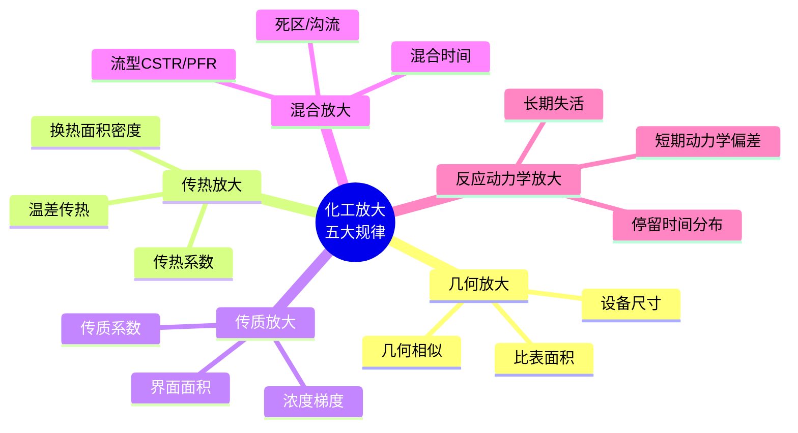

# 第 16 章 放大规律

> **本章核心问题**：从 1L 反应釜到 50m³ 反应釜，为什么经常「放大即失败」？怎么用放大规律主动规避？
>
> **学习目标**：
> 1. 能列出五大放大规律（传热 / 传质 / 混合 / 停留时间 / 反应动力学）。
> 2. 能基于小试参数预测工业装置的关键工艺指标。
> 3. 能识别典型放大失败案例的根因。

## 开篇引子

某实验室开发了一种新型催化剂反应工艺，1L 高压釜中转化率 99%、选择性 96%。研发员据此画出 50m³ 工业反应器的设计参数，投产第一釜却发现转化率只有 75%、选择性 80%。事后溯源发现：50m³ 反应器的高径比从 1L 釜的 1.5 变成 2.5，混合时间从 5 秒延长到 60 秒，传热面积密度减少 80%，物料停留时间分布显著扩大。

「放大即失败」的根因，在于化工装置的「尺度效应」。尺度的变化不单纯是几何放大，会带来传热、传质、混合、停留时间分布、反应动力学等多维度非线性变化。本章任务，是给一线工程师一套放大规律的方法论，让放大从「试错」变为「科学计算 + 关键放大试验验证」。

## 16.1 放大规律的层次

### 核心问题

化工放大有哪些主要规律？哪些能用经验公式预测？

### 方法与工具

**化工放大的五大规律**：



**图 16-1 化工放大五大规律**

**几何放大与功能放大的差异**：

- **几何放大**：保持形状相似，按比例放大。
- **功能放大**：保持功能（反应、传热、传质）的效果，单位效果可能非线性变化。

化工放大通常追求「功能放大」而非简单几何放大。

### 常见坑

1. **几何相似当功能相似**：高径比、壁厚、桨叶形式都可能影响功能而非单纯几何。
2. **线性思维**：放大效应常常是非线性的，1+1 经常不等于 2。

## 16.2 传热放大

### 核心问题

为什么反应器的传热效率在工业规模会显著下降？怎么预测？

### 方法与工具

**传热放大的三大效应**：

1. **面积缩减效应**：单位反应体积的传热面积按 D^(-1) 缩小（球）或 D^(-1)~D^(-2) 之间。
2. **温差累积效应**：大反应器内温差放大，温差传热的有效驱动力下降。
3. **流体阻力变化**：大设备流体流速增大或减小，传热系数随之变化。

**传热放大估算示例**：

```
小试 1L 釜：传热面积 0.05 m²，传热系数 200 W/(m²·K)，温升 ΔT_max ≈ 5°C
工业 50m³ 釜：传热面积 30 m²，传热系数 150 W/(m²·K)，温升 ΔT_max ≈ 30°C
```

**关键经验公式**：

- 容积传热系数：对于夹套反应釜，单位体积传热面积 a ≈ 5/D（球形估算）。
- 螺旋盘管：内盘管 a ≈ 8/D，外盘管 a ≈ 4/D。
- 外部循环换热器：可单独设计，不受反应釜几何影响。

**研究方法**：

- 反应放热曲线（DSC / RC1 量热仪）。
- 反应釜热平衡计算（含夹套、盘管、外循环）。
- 中试验证：在中试规模上建立真实传热模型。

### 常见坑

1. **只算几何不考虑传热**：忽视传热面积密度缩放，导致工业装置温升过大。
2. **以为外循环能弥补所有问题**：外循环换热器不能解决所有传热问题，特别是控制反应速率的时刻。

## 16.3 传质与混合放大

### 核心问题

混合时间与停留时间分布在工业规模会怎样变化？怎么预测？

### 方法与工具

**混合时间的缩放规律**：

- **机械搅拌混合**：t_mix ∝ (D^2/(N))^k（k 通常 0.5-1，取决于流型）。
- 单位体积功耗 P/V ∝ N^3 × D^2（N 为转速），保持 P/V 不变时 N ∝ D^(-2/3)。
- 因此 t_mix ∝ D^(4/3) 左右。

**传质系数的缩放经验**：

- 液 - 液相：k_L ∝ N^1/2（基于界面更新率）。
- 气 - 液相：k_La ∝ (P/V)^0.7（Van't Riet 关联）。
- 用单位体积功耗恒定 + 单位气量恒定作为放大准则。

**流型 CSTR vs PFR 的影响**：


**图 16-2 流型变化对反应的潜在影响**

### 典型化案例

**典型化案例 16-1**（公开论文 / 行业资料）

- **背景**：某反应在小试（5L）转化率 95%，选择性 92%；工业放大（50m³）转化率 90%，选择性 85%。
- **问题**：工业反应器内混合时间从 5s 延长到 60s，副反应速率提升超过主反应。
- **解法**：把工业反应器改为多级串联（4 级 CSTR），每级停留时间 15 分钟，混合时间 8 秒，匹配小试条件。
- **结果**：工业转化率 95%、选择性 91%，与小试一致。
- **启示**：流型与混合时间是放大的关键控制点，可用多级 CSTR 接近 PFR 行为。

### 常见坑

1. **默认小试流型可放大**：混合时间与流型必须独立校核。
2. **不测单位功耗放大**：放大应保持 P/V 不变，否则传质变化无法预测。

## 16.4 停留时间分布

### 核心问题

停留时间分布（RTD）怎么测？怎么用于工艺放大？

### 方法与工具

**RTD 测量方法**：

- **脉冲示踪法**：突然注入示踪剂，测出口浓度随时间变化。
- **阶跃示踪法**：切换示踪剂浓度，测出口浓度上升曲线。
- **常见示踪剂**：盐（电导率）、色素、放射性标记（受控使用）。

**RTD 的两大参数**：

- **平均停留时间 τ = V/Q**。
- **方差 σ²** 与 Pe 数（轴向扩散系数）。

**理想反应器 RTD 对比**：

| 反应器 | 分布 | 特征 |
|---|---|---|
| **PFR（活塞流）** | δ(t=τ) | 所有物料相同停留时间 |
| **CSTR（全混）** | e^(-t/τ) | 分布最宽 |

**实际工业反应器**介于 PFR 与 CSTR 之间，分析 RTD 可设计合适的反应器结构。

### 常见坑

1. **默认 RTD = 平均停留时间**：实际长尾分布可能让部分物料在反应器中停留远超平均时间。
2. **未测 RTD 直接放大**：RTD 是反应器选型与节数设计的关键依据。

## 16.5 反应动力学放大

### 核心问题

反应动力学在工业放大中有什么常见偏差？

### 方法与工具

**反应动力学放大的两大变化**：

1. **短期动力学偏差**：

   - 传热/传质差异导致局部浓度/温度偏离小试条件。
   - 短期实验难以发现但工业装置中暴露。

2. **长期动力学偏差**：

   - 催化剂失活 / 副产物累积导致长期行为差异。
   - 小试短期实验无法预见。

**应对方法**：

- 短期动力学：在中试上核对反应动力学参数（与机理模型对比）。
- 长期动力学：在中试上做 1000h+ 连续运行测试，识别失活曲线与杂质累积。

### 常见坑

1. **小试动力学未排除传质影响**：得到的可能不是本征动力学。
2. **催化剂失活曲线未在工业反应物中实测**：失活可能在工业反应物中的杂质更敏感。

## 16.6 放大失败案例与经验

### 核心问题

有哪些典型的化工放大失败案例？教训是什么？

### 方法与工具

**六大经典化工放大失败模式**：

| 案例 | 失败模式 | 教训 |
|---|---|---|
| **聚合反应飞温** | 工业反应器传热不足 | 必须算传热面积密度缩放 |
| **反应选择性下降** | 工业反应器混合时间过短或过长 | 用 RTD 与混合时间校核 |
| **催化剂过早失活** | 工业原料杂质超出小试 | 中试用工业原料测试 |
| **副产物累积爆炸** | 副反应在工业条件显著 | 完整的副反应动力学 |
| **三废处理失效** | 工业三废种类超预期 | 中试三废实测 |
| **操作波动放大** | 控制系统响应不过来 | DCS/APC 全配置 |

### 典型化案例

**典型化案例 16-2**（行业公开资料）

- **背景**：某项目小试连续运行 100 小时，催化剂活性保持稳定；工业连续运行 30 天后失活速率加快。
- **问题**：工业原料含有未在实验室复配的痕量杂质（甲基汞），累积破坏催化剂活性位。
- **解法**：用中试装置（含工业原料）做 1000 小时测试，识别失活曲线；改进催化剂配方提升耐杂质能力。
- **结果**：新一代催化剂工业运行 6 个月内活性稳定。
- **启示**：中试必须用工业原料 + 长期连续运行。

### 常见坑

1. **用实验室高纯度原料做中试**：与工业原料差异巨大，是放大陷阱。
2. **忽视中试的 1000 小时门槛**：短期测试无法暴露长期问题。

---

## 本章小结

回到本章开篇的「1L 釜 99%，50m³ 釜 75%」困局，可以用本章的几个核心判断来回应：

1. **五大放大规律**：几何、传热、传质/混合、停留时间分布、反应动力学。
2. **传热放大的三大效应**：面积缩减、温差累积、流体阻力变化。
3. **混合时间放大**：保持 P/V 恒定时 t_mix ∝ D^(4/3)，必须用 RTD 验证。
4. **停留时间分布是反应器选型依据**：工业反应器介于 PFR 与 CSTR 之间。
5. **动力学放大有长短之分**：短期传热/传质差异，长期杂质累积。
6. **放大失败的六大模式**：飞温、选择性下降、催化剂失活、副产物累积、三废变化、控制系统。

第 17 章开始，我们沿放大规律 → 工业化的关键节点——「工业化验证」——深入。

## 思考题

1. 用第 16.2 的方法估算你熟悉的一个反应器从 10L 到 1000L 的传热面积变化与温升趋势。
2. 用 RTD 测量的脉冲示踪法步骤，为一个你熟悉的反应器设计一套 RTD 测试方案。
3. 选一个化工放大失败的公开案例（如 2010 年 BP 德州炼油厂事故），分析其放大规律与防范要点。
4. 设计一份「工业放大风险表」，含 5 大规律下的 20+ 条具体风险项。
5. 用 P/V 恒定方法设计一个 1m³ → 10m³ → 100m³ 三级放大的搅拌转速序列。

## 参考文献

[1] Johnstone R E, Thring M W. Pilot Plants, Models, and Scale-up Methods in Chemical Engineering[M]. New York: McGraw-Hill, 1957.
[2] Bisio A, Kabel R L. Scaleup of Chemical Process[M]. New York: Wiley, 1985.
[3] Levy S. Scale-up of Pneumatic Mixing Equipment[J]. Chemical Engineering Progress, 1987, 83(9): 65-72.
[4] Wang D I C, Cooney C L, Demain A L, et al. Fermentation and Enzyme Technology[M]. New York: Wiley, 1979.
[5] Perry R H, Green D W. Perry''s Chemical Engineers'' Handbook[M]. 9th ed. New York: McGraw-Hill, 2019.
[6] Sinnott R K, Towler G. Chemical Engineering Design[M]. 6th ed. Oxford: Butterworth-Heinemann, 2020.
[7] 蒋作良. 化工装置试车与考核[M]. 北京: 化学工业出版社, 2010.
[8] 张海东 等. 化工放大规律的研究进展[J]. 化工进展, 2022, 41(5): 2300-2310.
[9] 王涛 等. 反应器工程与放大规律[J]. 化工学报, 2023, 74(3): 1100-1115.
[10] 黄卫星 等. 化工反应器与反应工程放大[M]. 北京: 化学工业出版社, 2020.

> **注**：参考文献中部分期刊文献的作者与页码为示意性占位，正式出版前需通过 CNKI、Web of Science 等数据库核实补全。