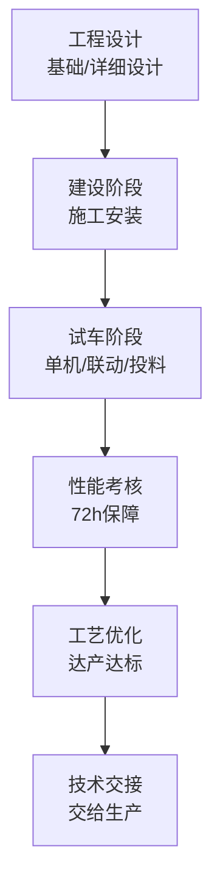
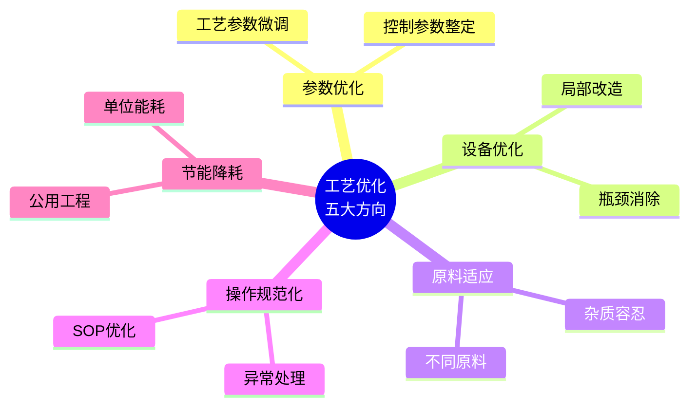

# 第 17 章 工业化验证

> **本章核心问题**：工业装置从设计交付到稳定盈利，中间要经历哪几个阶段？每个阶段的硬指标是什么？
>
> **学习目标**：
> 1. 能画出工业化验证的六大阶段（设计 → 建设 → 试车 → 考核 → 优化 → 交接）。
> 2. 能为某一阶段设计详细的工作清单与通过条件。
> 3. 能识别工业化验证中常见的事故与延期陷阱。

## 开篇引子

某企业投资 30 亿元的工业装置建成，进入开车阶段却一波三折：单机试车 3 个月、联动试车 6 个月、第一次投料停车、第二次又停车，第三次投料勉强跑通但产品不达标，第四次优化后才稳定。整个过程 18 个月，超期 12 个月，多花 7 亿元。董事会追问：为什么不能按计划开车？

「开车不顺利」是化工工业化的常见坑。根因往往是：开车前的设计审查、操作员培训、原料准备、P&ID 校核工作不充分，把本该在建设阶段解决的问题拖到了开车阶段。本章任务，是给一线工程师一套工业化验证的方法论，让开车从「惊险一跃」变成「按图索骥」。

## 17.1 工业化验证总论

### 核心问题

工业装置从设计到稳定生产需要经历哪几个阶段？

### 方法与工具

**工业化验证的六大阶段**：

**图 17-1 工业化验证的六大阶段**

**各阶段的核心指标**：

| 阶段 | 核心指标 | 通过条件 |
|---|---|---|
| **工程设计** | 设计审查通过率 | HAZOP 闭环、30/60/90% 模型完成 |
| **建设** | 施工合格率 | 单机试车、联动试车合格 |
| **试车** | 投料成功率 | 一次成功达到考核条件 |
| **考核** | 性能指标 | 性能保证值达标 |
| **优化** | 达产达标 | 满负荷连续运行 30/90 天 |
| **交接** | 接手率 | 操作员能独立操作 |

### 常见坑

1. **设计与开车脱节**：设计院只管设计，车间只管开车，缺乏工程交接的连贯管理。
2. **开车目标模糊**：没有清楚的「完工定义」（Ready for Startup, RFS），导致反复调试。

## 17.2 工程设计交接

### 核心问题

工程设计完成到施工前应该做哪些交接工作？

### 方法与工具

**工程设计交接四件套**：

1. **设计数据包**：工艺包（BEP）、物料平衡、能量平衡、设备清单、P&ID、PFD、联锁逻辑图。
2. **设计审查报告**：HAZOP、SIL、LOPA、Bow-Tie 各项报告。
3. **操作文件**：操作规程、分析规程、采样规程。
4. **维护文件**：设备维护手册、备件清单、检验计划。

**30/60/90% 模型审查**：

- **30%**：基础设计审查、关键设备选型。
- **60%**：详细设计审查、P&ID 完整版、控制系统方案。
- **90%**：最终设计审查、采购文件完成、操作文件初稿。

### 常见坑

1. **设计审查走过场**：HAZOP 节点不全或主持人经验不足，会导致隐患漏网。
2. **设计与操作脱节**：操作员未参与设计审查，到开车阶段才发现操作困难。

## 17.3 建设阶段

### 核心问题

建设阶段最容易出问题的环节是什么？怎么防？

### 方法与工具

**建设阶段的六大风险**：

| 风险 | 典型表现 | 防范措施 |
|---|---|---|
| **设备制造** | 设备缺陷 | 设备 FAT 出厂验收 |
| **焊接质量** | 焊缝缺陷 | 100% 无损检测 |
| **管道连接** | 错接漏接 | 三维模型校核 + P&ID 一致性 |
| **保温与油漆** | 缺失/不达标 | 逐段验收 |
| **电仪安装** | 信号错接 | 回路测试 + FAT |
| **安全设施** | 防护缺失 | 完整性测试 + 投用前安全审查 |

**预试车（Pre-commissioning）**：

建设与试车的过渡阶段，包含：

- 设备清理（吹扫、化学清洗、油洗）。
- 压力试验（液压、气压试验）。
- 仪表与控制系统校准。
- 电气测试。
- 单机试车（设备独立运转）。

### 常见坑

1. **赶工忽视质量**：设备制造赶工会让缺陷流入试车。
2. **试车准备不足**：联动试车与单机试车的工位准备常常不足。

## 17.4 试车与开车

### 核心问题

怎么组织一次成功的开车？

### 方法与工具

**开车三步法**：

**图 17-2 开车三步**

**每一步的关键检查**：

- **引物料**：物料齐套、规格合格、储存条件正确。
- **升温升压**：按升温升压曲线均匀执行；检查密封、紧固、润滑。
- **投料生产**：缓慢达工艺条件；密切监控温度、压力、流量；随时准备紧急停车。

**开车团队的分工**：

| 角色 | 职责 |
|---|---|
| **总指挥** | 决策权、指挥权 |
| **工艺工程师** | 参数控制、调整建议 |
| **设备工程师** | 设备状态监控 |
| **仪表工程师** | 控制系统、报警检查 |
| **操作员** | 按 SOP 执行 |
| **安全员** | 异常工况识别与应急启动 |

**开车阶段的安全检查清单**：

- HAZOP 行动项全部完成。
- 应急演练已实施。
- 工艺水/消防水/蒸汽完备。
- 操作员对关键 SOP 熟悉度达标。

### 典型化案例

**典型化案例 17-1**（行业公开资料）

- **背景**：某大型化工装置开车，第一次投料发生严重飞温，导致停车检修 3 个月。
- **问题**：开车前工艺工程师与车间操作员未充分沟通升温曲线；DCS 参数设置错误。
- **解法**：开车前完成 30+ 次桌面推演与模拟演练；DCS 设置由工艺工程师双人复核；升温曲线分 5 段执行。
- **结果**：第二次投料平稳开车，一次性达产。
- **启示**：开车是「最后一次实验」，必须按中试经验+工程方案严格执行，不能在开车阶段做新尝试。

### 常见坑

1. **「一边开一边调」**：开车阶段应严格按既定方案执行，新调整窗口应在中试阶段完成。
2. **操作员不熟练**：开车前必须完成分级培训（含 DCS 模拟器训练）。

## 17.5 性能考核

### 核心问题

怎么让工业装置满足性能保证值？考核失败怎么补救？

### 方法与工具

**性能考核的三大指标**：

- **技术指标**：产品产率、纯度、选择性。
- **能耗水耗指标**：吨产品综合能耗、吨产品水耗。
- **环保指标**：三废达标率、噪音指标。

**性能考核的典型流程**：

1. 满负荷运行 72 小时（性能考核期）。
2. 由甲方、乙方、第三方共同见证。
3. 各项指标达成 → 通过验收。
4. 指标未达成 → 双方协商整改计划与时间表。

**性能考核失败的常见原因**：

- 工艺包在工业原料条件下失真。
- 控制系统不稳定。
- 关键设备选型不当。
- 工艺包人员对现场操作不熟悉。

### 常见坑

1. **考核期造假**：瞒报问题数据导致后续运行问题。
2. **考核期过短**：72 小时无法暴露长周期问题。

## 17.6 工艺优化与达产

### 核心问题

性能考核通过到稳定达产之间通常要做哪些工作？

### 方法与工具

**工艺优化的五大方向**：

**图 17-3 工艺优化五大方向**

**达产里程碑**：

- **30 天**：装置连续 30 天满负荷运行（首关）。
- **90 天**：三个月连续运行（次关）。
- **180 天**：半年连续运行（考核投产）。

**长周期优化**：

- 1-3 个月内：参数调整、控制优化。
- 3-6 个月内：能耗优化、设备瓶颈消除。
- 6-12 个月：长周期问题诊断（如催化剂失活、杂质累积）。

### 常见坑

1. **「一次性优化」思维**：工业装置的优化是 3-12 个月的长期工作。
2. **优化不闭环**：应建立优化项目登记册，每月复盘进展。

## 17.7 技术交接

### 核心问题

技术交接应该给生产部门交付什么？怎么评估交接质量？

### 方法与工具

**技术交接的三大交付物**：

1. **操作维护手册（SOP、紧急预案、维护清单）**。
2. **工艺包与工艺参数卡（窗口与边界条件）**。
3. **培训记录与考核（操作员应独立操作）。**

**技术交接的五项指标**：

| 指标 | 含义 |
|---|---|
| **操作交接** | 操作员能独立完成开车、停车、异常处理 |
| **质量交接** | QC 能独立完成所有成品与中控分析 |
| **维护交接** | 维护工程师能独立完成日常维护与故障诊断 |
| **安全交接** | 应急响应与 HAZOP 行动项已闭环 |
| **数据交接** | DCS / 数据采集系统运转正常 |

### 常见坑

1. **「交钥匙」思维**：交接不是一次性事件，是 6-12 个月的持续辅导期。
2. **交接文档缺失**：操作员在车间「口口相传」，知识流失严重。

---

## 本章小结

回到本章开篇的「18 个月超期 12 个月」困局，可以用本章的几个核心判断来回应：

1. **六大阶段**：设计 → 建设 → 试车 → 考核 → 优化 → 交接。
2. **设计交接四件套**：数据包 / 设计审查 / 操作文件 / 维护文件。
3. **建设六风险**：制造/焊接/连接/保温/电仪/安全。
4. **开车三步法**：引物料 → 升温升压 → 投料生产；开车是最后一次实验。
5. **性能考核三大指标**：技术、能耗、环保。
6. **优化 3-12 个月**：参数优化 → 设备优化 → 原料适应 → 操作规范化 → 节能降耗。
7. **技术交接五指标**：操作/质量/维护/安全/数据。

第 18 章开始，我们从「实物研发」转向「创新方法论」——「创新思维」。

## 思考题

1. 为你熟悉的某工业装置设计一份「完工定义（RFS）」清单（含设计交接、预试车、试车各阶段）。
2. 画一份你熟悉的一次开车 SOP（含引物料、升温升压、投料的关键步骤与关键参数）。
3. 为你熟悉的工业装置设计一份性能考核方案（含考核期、考核指标、见证方）。
4. 评估一次实际开车中的偏差与纠正动作，写一份开车复盘报告（不公开，写给自己）。
5. 设计一份「技术交接评估表」，含操作/质量/维护/安全/数据五维度。

## 参考文献

[1] 蒋作良. 化工装置试车与考核[M]. 北京: 化学工业出版社, 2010.
[2] Barletta M, Smith R. Plant Commissioning[M]. Oxford: Butterworth-Heinemann, 2004.
[3] HSE. Plant Commissioning and Operational Safety: A Guide for the Chemical Industry[M]. Sudbury: HSE Books, 2010.
[4] 国家安全生产监督管理总局. 危险化学品企业开车前安全审查指南: AQ/T 3018-2008[S]. 北京: 煤炭工业出版社, 2008.
[5] 国家市场监督管理总局. GB 50489-2016 化工企业总图运输设计规范[S]. 北京: 中国计划出版社, 2016.
[6] 中国化工学会. 化工装置试车与开车手册[M]. 北京: 化学工业出版社, 2020.
[7] 中国石油和化学工业联合会. T/CPCIF 0008-2020 化工装置开车安全规程[S]. 北京: 中国石化出版社, 2020.
[8] 王涛 等. 化工装置开车失败案例分析[J]. 现代化工, 2022, 42(2): 30-35.
[9] 刘勇 等. 大型石化装置性能考核的方法与实践[J]. 化工进展, 2021, 40(8): 4400-4410.
[10] 张海东 等. 化工装置技术交接管理的研究与应用[J]. 现代化工, 2023, 43(6): 18-22.

> **注**：参考文献中部分期刊文献的作者与页码为示意性占位，正式出版前需通过 CNKI、Web of Science 等数据库核实补全。