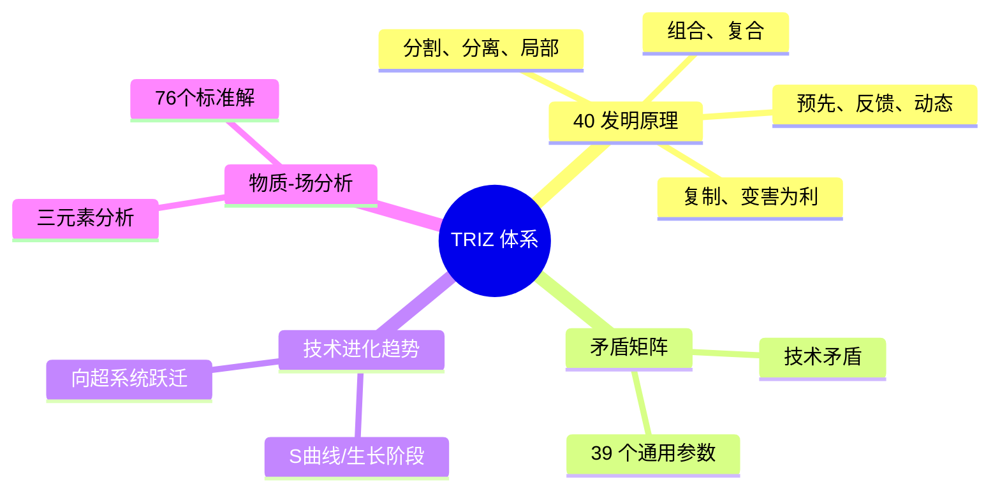
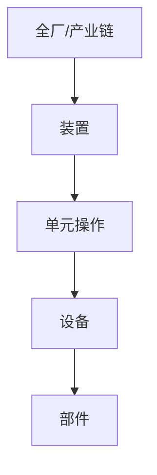

# 第 18 章 创新思维

> **本章核心问题**：化工创新到底是「灵光一现」还是有方法论？一线工程师怎么用工具化的方法提升创新能力？
>
> **学习目标**：
> 1. 能用第一性原理拆解化工问题到不可再分的要素。
> 2. 能用 TRIZ 系统的矛盾矩阵与技术进化趋势解决具体创新问题。
> 3. 能用精益研发思维减少开发浪费。

## 开篇引子

某研发团队接到一个棘手问题：客户投诉某产品反应时间长，需从 4h 缩短到 1h 以内。团队两个月的头脑风暴毫无进展。后来一位老工程师用 TRIZ 的「时间分离」原理，提议把反应移到不同温度区间进行：高温区间加快主反应、低温区间补全转化。这样反应总时间从 4h 降到 50min。工程师笑称「这不是发明，是发现的——发现别人已经总结好的方法」。

创新不是天才的专利。一线工程师完全可以通过工具化方法提升创新能力。本章任务，是给一线工程师一套系统化的创新方法论：第一性原理、TRIZ、系统工程、价值工程、六顶思考帽、精益研发。

## 18.1 第一性原理

### 核心问题

为什么第一性原理能帮我们看清问题的本质？它在化工中怎么用？

### 方法与工具

**第一性原理的核心思想**：

把问题分解到「不能再分」的基本要素，并基于这些要素重新构建解决方案，绕开传统思维中的「不可能」或「从来没人这样做」。

**化工中的第一性原理**：

- **物理化学定律**：热力学平衡、化学反应速率、质量守恒、能量守恒。
- **分子层面规律**：键能、电子分布、空间位阻。
- **工程基本约束**：传热极限、传质极限、流体阻力、压力容器极限。

**用第一性原理拆解问题**：

例：降低反应温度（节能 + 减少副反应）。

- 第一性原理层：温度 → 反应速率（Arrhenius）→ 选择性（动力学方程）→ 转化率（反应平衡）→ 设备（传热）。
- 传统思维：减少能耗 → 调低温度。
- 第一性原理：如果温度降 10°C 反应速率降 1/2，能否通过催化剂提升指前因子 A 补偿？
- 答案：能（用新催化剂），且副反应降得更显著。

### 常见坑

1. **「第一性原理」被滥用**：不是所有问题都需要从基础推演，应平衡「第一性原理 vs 经验启发」。
2. **「这事只能这样做」**：本质是受现有方法约束，第一性原理可以帮助突破。

## 18.2 TRIZ 创新方法

### 核心问题

TRIZ 怎么用？为什么 40 项发明原理可以「覆盖几乎所有创新需求」？

### 方法与工具

**TRIZ 体系的核心模块**：



**图 18-1 TRIZ 体系核心模块**

**典型 TRIZ 应用流程**：

1. 识别技术矛盾（改善某个参数 vs 恶化另一个参数）。
2. 用 39 个工程参数定位改善与恶化参数。
3. 在矛盾矩阵中查推荐使用的发明原理。
4. 应用原理思考具体方案。
5. 用物质-场分析细化和评估方案。

**化工典型案例：缩短反应时间（用「时间分离」）**：

- 改善：反应时间。
- 恶化：转化率。
- 查矛盾矩阵：得到「时间分离」「预先作用」「动态化」等原理。
- 化工应用：分段反应（不同温区不同目的），反应-分离耦合。

**TRIZ 工具的化工示例**：

- **分割**：反应器多段分布。
- **预先作用**：原料预处理（脱水、脱气、预混）。
- **反向思维**：把反应方向反转（用选择性更高但通常不用的路径）。
- **变害为利**：用副反应放热给下一段工序做热源。

### 典型化案例

**典型化案例 18-1**（行业公开资料）

- **背景**：某团队遇到难题：催化剂既要高活性（短反应时间），又要长寿命（不易失活）。传统催化剂两者难以兼得。
- **解法**：用 TRIZ 矛盾矩阵定位发现「改善：运动物体长度」与「恶化：物质损失」。
- **原理建议**：「分割」「复合物组成」「动态化」。
- **具体方案**：把催化剂载体从单一组成改为多层核-壳结构，外层保证长寿命，内层保证高活性。
- **结果**：新一代催化剂同时满足「短反应时间 + 长寿命」，性能提升 50%。
- **启示**：TRIZ 提供「方向性启发」，让团队跳出传统思维。

### 常见坑

1. **机械套用 TRIZ 原理**：原理是启发而非公式，需要工程师「翻译」到具体工艺。
2. **忽视工程约束**：TRIZ 方案忽略现实约束（如成本、可制造性），不可实施。

## 18.3 系统工程思想

### 核心问题

怎么用系统工程的视角看待化工研发？

### 方法与工具

**系统工程的核心方法**：

- **层级分析**：把系统分解为子系统。
- **接口分析**：明确子系统间的接口关系。
- **目标优化**：在多目标间权衡。

**化工工程的层级**：



**图 18-2 化工工程的层级结构**

**接口管理**：

化工开发中常见的接口问题：

- 工艺 - 装备：工艺需求不能反映到设备设计。
- 工艺 - 控制：控制系统不能适应工艺波动。
- 工艺 - 公用工程：蒸汽/冷却水等条件变化冲击工艺。

**系统工程思维的核心**：

- **整体最优 vs 局部最优**：整体方案可能对每个单元都不是「最优」，但系统效果好。
- **多目标权衡**：经济性、安全性、环保性需权衡。
- **生命周期视角**：设计阶段考虑建造、运行、维护、报废各阶段。

### 常见坑

1. **局部思维**：每个单元都「最优」但总效果不佳。
2. **忽视接口**：装配集成时发现大量返工。

## 18.4 价值工程

### 核心问题

价值工程怎么用？它在化工中能解决什么问题？

### 方法与工具

**价值工程的核心理念**：

```
价值 V = 功能 F / 成本 C
```

提升价值有 5 条路径：

1. 功能不变，成本降低。
2. 成本不变，功能提升。
3. 功能提升，成本降低。
4. 功能大幅提升，成本小升。
5. 功能略降，成本大降（针对过剩功能）。

**化工案例**：

- 某产品纯度 99.99%（功能过剩），但客户实际只需 99.5%（高纯度对应高成本）。价值工程建议：降低纯度到 99.5%，成本下降 30%，客户反而更满意。
- 某装备设计冗余过度（设备裕度 100%），价值工程建议：合理裕度 30%，设备投资降低 50%，不影响安全。

### 常见坑

1. **价值工程混淆质量与价值**：高价值不等于高质量，而是高「性价比」。
2. **忽视隐性功能**：某些功能（如品牌、合规）虽不被用户直接感知，但是必要的。

## 18.5 六顶思考帽

### 核心问题

怎么用「六顶思考帽」组织高效决策讨论？

### 方法与工具

**Edward de Bono 的六顶思考帽**：

| 帽子 | 颜色 | 视角 | 典型问题 |
|---|---|---|---|
| **事实帽** | 白色 | 客观数据 | 我们有什么信息？ |
| **情感帽** | 红色 | 主观感受 | 直觉怎么讲？ |
| **风险帽** | 黑色 | 谨慎批判 | 哪里可能出错？ |
| **乐观帽** | 黄色 | 积极价值 | 哪里可行？哪里有价值？ |
| **创意帽** | 绿色 | 创造性 | 还有什么新想法？ |
| **全局帽** | 蓝色 | 流程控制 | 如何组织讨论？ |

**化工案例**：

技术创新项目讨论：

- **蓝帽**：确定讨论流程与时间分配。
- **白帽**：呈现数据（实验室、中试结果）。
- **黄帽**：探索项目价值（技术领先性、商业价值）。
- **黑帽**：识别风险（放大效应、安全、市场）。
- **红帽**：评估项目团队热情与资源。
- **绿帽**：提出新方案（备选路线、新应用场景）。

六顶思考帽的价值在于让讨论从「无序争论」变为「有序探索」。

### 常见坑

1. **机械按顺序切换帽子**：实际讨论中可灵活切换。
2. **每人都戴同样的帽子**：每个成员应轮流模拟不同视角。

## 18.6 精益研发

### 核心问题

精益研发的理念在化工研发中能落地吗？怎么落地？

### 方法与工具

**精益研发的核心思想**：

- **客户价值**：明确什么真正给客户创造价值。
- **消除浪费（Muda）**：在研发流程中识别与消除七大浪费。
- **流动（Flow）**：让任务流程顺畅流动，减少等待。
- **拉动（Pull）**：下游拉动上游，避免过早完成。
- **持续改进（Kaizen）**：渐进式改进。

**研发的七大浪费**：

1. **过度需求**：开发客户不需要的功能。
2. **库存等待**：实验排队、设备闲置、人员等待。
3. **多余动作**：反复沟通、反复修改。
4. **缺陷返工**：实验失败需要重做。
5. **过度加工**：同一研究由多人反复做。
6. **信息传递**：跨部门沟通的失真与延迟。
7. **流程浪费**：多余审批、多余检查。

**精益研发的工具**：

- **看板（Kanban）**：用可视化板管理研发任务。
- **站立会议（Stand-up）**：每日 5-15 分钟同步进展。
- **回顾会议（Retrospective）**：每 1-2 周回顾与改进。
- **瓶颈识别（Theory of Constraints）**：聚焦瓶颈环节。

### 常见坑

1. **把精益等同于「降本」**：精益的本质是减少浪费，价值更聚焦。
2. **机械套用制造业精益**：研发有其特殊性（不确定性、探索性），需调整。

---

## 本章小结

回到本章开篇的「反应时间从 4h 缩到 1h」困局，可以用本章的几个核心判断来回应：

1. **第一性原理**：从物理化学基本规律找突破口。
2. **TRIZ 40 原理**：为技术创新提供方向性启发。
3. **系统工程**：整体最优优于局部最优，重视接口管理。
4. **价值工程**：V = F/C 提升性价比，关注过剩功能。
5. **六顶思考帽**：让讨论变得有序，避免无意义争论。
6. **精益研发**：识别和消除研发的七大浪费。
7. **创新不是天才的专利**：化工一线工程师完全可以用工具化方法提升创新能力。

第 19 章开始，我们从「创新思维」转向「创新保护」——「专利研发」。

## 思考题

1. 选一个你熟悉的工艺问题，用 TRIZ 矛盾矩阵定位改善/恶化参数，推荐 3 条发明原理。
2. 用第一性原理拆解一个你的研发问题到基础要素，找到「反常识」的突破方向。
3. 选一个你熟悉的工艺装置，做一个价值工程分析（含功能成本矩阵）。
4. 用六顶思考帽组织一次真实的技术讨论，体验不同视角的差异。
5. 用「研发的七大浪费」对你的研发团队做一次浪费识别（含 5+ 个浪费案例）。

## 参考文献

[1] Altshuller G S. The Innovation Algorithm: TRIZ, Systematic Innovation and Technical Creativity[M]. Worcester: Technical Innovation Center, 1999.
[2] Mann D. Hands-on Systematic Innovation[M]. 2nd ed. Clevedon: IFR Press, 2015.
[3] de Bono E. Six Thinking Hats[M]. Boston: Little, Brown and Company, 1985.（六顶思考帽经典）
[4] Miles L D. Techniques of Value Analysis and Engineering[M]. 3rd ed. Milwaukee: ASME Press, 2015.
[5] Popper D. Principles of Systematic Innovation[M]. 2nd ed. Clevedon: IFR Press, 2015.
[6] Womack J P, Jones D T. Lean Thinking: Banish Waste and Create Wealth in Your Corporation[M]. 2nd ed. New York: Free Press, 2003.
[7] 中国 TRIZ 协会. TRIZ 创新方法[M]. 北京: 机械工业出版社, 2018.
[8] 赵新军 等. 系统工程基础[M]. 北京: 清华大学出版社, 2017.
[9] 王昕 等. 价值工程在化工产品研发中的应用[J]. 化工进展, 2021, 40(5): 2300-2310.
[10] 张玉川 等. 精益研发在化工企业中的实践[J]. 现代化工, 2022, 42(10): 25-30.

> **注**：参考文献中部分期刊文献的作者与页码为示意性占位，正式出版前需通过 CNKI、Web of Science 等数据库核实补全。