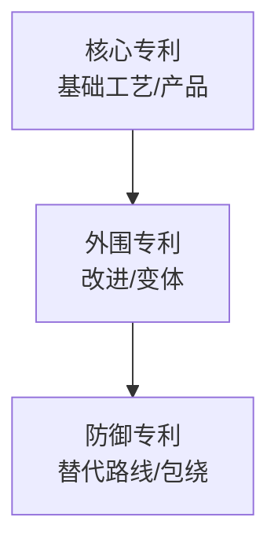

# 第 19 章 专利研发

> **本章核心问题**：专利是化工创新成果的核心保护形式。一线工程师怎么用专利思维规划创新、把创新转化为高质量专利？
>
> **学习目标**：
> 1. 能用专利布局思维规划技术路线。
> 2. 能用技术交底完整表达一个发明。
> 3. 能区分高价值专利与低质量专利。

## 开篇引子

某研究院申请了 30 件专利，但实际可维权的不超过 5 件。问题出在哪？——大多数专利是「为立项验收而申请」，没有考虑侵权诉讼时能否真正保护产品。换句话说，「**专利是拿来用的，不是拿来看的**」。

专利布局、技术交底、专利检索、专利规避、高价值专利培育，是化工研发专利工作的五大事项。本章任务，是给一线工程师一套系统化的专利工作方法论，让创新成果能真正「护得住、攻得下」。

## 19.1 专利在化工研发中的角色

### 核心问题

化工企业为什么要重视专利？专利能带来什么实际价值？

### 方法与工具

**专利的四大价值**：

1. **法律保护**：阻止竞争对手生产/销售/使用相同方案。
2. **商业价值**：专利可出售、许可、作为侵权诉讼筹码。
3. **企业无形资产**：专利数量与质量是企业技术资产的核心。
4. **标准制定基础**：高价值专利可纳入行业/国际标准。

**专利与商业秘密的关系**：

- **专利保护**：公开技术换取独占权（20 年），技术公开有助行业发展。
- **商业秘密**：技术不公开，靠保密维持（无限期），适合「反向工程不可复制」的技术。

化工研发的典型决策：

- 核心产品工艺：申请专利（让别人绕不开）。
- 关键配方：商业秘密 + 部分专利（把保护范围叠起来）。
- 设备结构：申请专利（设计与产品不可分离）。

### 常见坑

1. **「专利越多越好」**：堆数量忽视质量，让专利部门失去聚焦。
2. **「专利 = 论文」**：把专利写成「科普文」，法律保护范围太窄。

## 19.2 专利布局

### 核心问题

怎么对一个技术方向做系统化的专利布局？

### 方法与工具

**专利布局的金字塔**：

**图 19-1 专利布局金字塔**

**专利布局的五大策略**：

| 策略 | 内容 | 适用 |
|---|---|---|
| **核心专利先行** | 围绕核心发明先抢专利 | 初创、突破性产品 |
| **包绕式布局** | 在竞品专利周围布局替代路径 | 已有强敌的赛道 |
| **技术路线布局** | 沿主路线上下游系统性布局 | 技术路线长的领域 |
| **改进式布局** | 围绕核心专利布局改进 | 已有自己的核心专利 |
| **防御式布局** | 布局可能未来重要的替代路线 | 长期战略考量 |

**专利组合的「三性」**：

- **排他性（Exclusion）**：能阻止竞品实施。
- **攻击性（Offensive）**：能主动攻击竞品。
- **防御性（Defensive）**：能避免被竞品攻击。

### 常见坑

1. **只申请核心专利**：布局失败率高，被竞品「钻空子」绕过。
2. **专利布局过早**：技术尚未成熟就申请，保护范围可能过窄。

## 19.3 技术交底与专利申请

### 核心问题

一线工程师怎样把一个创新写成高质量的技术交底书？

### 方法与工具

**技术交底书的关键要素**：

| 要素 | 内容 |
|---|---|
| **发明名称** | 简洁、准确、有信息量 |
| **技术领域** | 所属技术方向 |
| **背景技术** | 现有技术现状、引证对比文件 |
| **发明内容** | 解决的技术问题、技术方案、效果 |
| **具体实施方式** | 至少 1 个具体实施例 |
| **权利要求** | 自上而下、独立与从属 |
| **附图** | 工艺流程图、设备图等 |

**技术交底书的「四个避免」**：

1. 避免「宽而空」：权利要求不能笼统（如「一种高效设备」不可）。
2. 避免「窄而漏」：权利要求不能过窄（如权利要求 1 的每个特征都限太死）。
3. 避免「未充分公开」：说明书必须让本领域技术人员能实施。
4. 避免「无新颖性」：与现有技术的差异点必须充分明确。

**化工专利的特殊点**：

- 化学反应常用温度、压力、配比范围表达保护范围。
- 聚合物常用结构、组成、分子量范围。
- 设备常用结构关系 + 工艺方法双角度申请。

### 典型化案例

**典型化案例 19-1**（行业公开资料）

- **背景**：某研究院开发了一种新型催化剂。研发员写了一份 2000 字技术交底书，专利工程师经挖掘后扩展到 7000 字、保护范围扩大 3 倍。
- **问题**：原交底书的权利要求 1 只针对特定原料和温度，不具备普遍性。
- **解法**：专利工程师与研发员多次沟通，提炼出「A 步骤 + B 步骤 + C 步骤」结构化的权利要求 1；权利要求 2-10 围绕不同原料和温度变体。
- **结果**：授权后这件专利被引用 8 次，成为该公司催化剂领域的核心专利。
- **启示**：高质量专利依赖专利工程师与研发员的紧密合作。

### 常见坑

1. **技术交底书当论文写**：保护逻辑不清。
2. **专利申请前无侵权分析**：授权后才发现竞品早已布局。

## 19.4 专利检索与分析

### 核心问题

专利检索怎么做？为什么专利分析比文献分析更重要？

### 方法与工具

**专利检索的五大入口**：

1. **关键词检索**：用技术关键词在标题、摘要、权利要求中检索。
2. **申请人/发明人检索**：查特定公司或个人的全部专利。
3. **IPC/CPC 分类号检索**：用分类系统按技术领域聚合。
4. **同族专利检索**：一件发明在全球的同族。
5. **法律状态检索**：是否授权、是否维持、是否无效。

**常用专利数据库**：

- **Espacenet**：欧洲专利局，含全球主要专利。
- **Patentics**：中文专利分析工具，含语义检索。
- **Google Patents**：免费，覆盖广，机器翻译质量参差。
- **incoPat**、**CNIPR**：中文商业专利数据库。

**专利分析的四类**：

- **申请人分析**：竞争对手专利布局。
- **技术路线分析**：技术演进路径。
- **法律状态分析**：可商用专利与失效专利。
- **图表引用分析**：引用与被引用关系。

### 常见坑

1. **只查中文专利**：化工领域国外专利往往更关键。
2. **不区分同族专利**：同一发明在全球可能有 30+ 件同族。

## 19.5 专利规避与自由实施（FTO）

### 核心问题

怎么判断一个研发方案是否落入他人专利保护范围？怎么规避？

### 方法与工具

**FTO（Free to Operate）分析四步**：

1. **专利地图绘制**：在目标市场（国家/地区）做专利检索。
2. **风险专利筛选**：识别与本研发相关的在有效专利。
3. **侵权比对**：将本研发方案与风险专利的权利要求逐项比对。
4. **规避设计**：如发现侵权风险，调整方案绕开风险专利。

**专利规避的三类策略**：

- **绕设计**：避开风险专利的具体特征。
- **覆盖设计**：研发出实质上等同但有差异的方案（注意「等同侵权」）。
- **无效设计**：通过无效宣告使风险专利失效（成本高、周期长）。

### 常见坑

1. **FTO 做得太晚**：临上市前才做 FTO，时机晚代价大。
2. **忽视等同侵权**：表面不同但实质等同，仍可能被判侵权。

## 19.6 高价值专利培育

### 核心问题

什么算「高价值专利」？怎么培育？

### 方法与工具

**高价值专利的五大特征**：

1. **保护范围合理**：权利要求宽且稳。
2. **技术先进性**：对行业有显著技术贡献。
3. **商业可应用**：能在产品中落地、可许可可诉讼。
4. **能抵抗无效**：经得起现有技术挑战。
5. **国际布局**：至少关键市场有同族。

**专利质量评估指标**：

- **技术维度**：新颖性、创造性、实用性。
- **法律维度**：权利要求稳定性、说明书质量。
- **商业维度**：可许可收入、市场覆盖、诉讼胜率。
- **战略维度**：与产品/标准/竞争策略的契合度。

**专利培育的五个动作**：

1. **立项前做专利导航**：立项阶段就识别专利风险与机会。
2. **研发布局嵌入专利地图**：每阶段的成果都进入专利布局。
3. **保护范围动态调整**：根据研发进展调整权利要求范围。
4. **国际申请联动**：核心发明在 5+ 国家同步申请。
5. **专利维护与运营**：定期评估是否继续维持、是否可许可。

### 典型化案例

**典型化案例 19-2**（公开专利 / 行业资料）

- **背景**：某高校研究院的催化剂专利授权后被海外大公司引用，但仅在中国获得保护，海外市场被抄袭。
- **问题**：缺乏 PCT（专利合作条约）申请，海外无布局。
- **解法**：申请 PCT 后指定美国、欧盟、日本、韩国等关键市场；同时积极向外宣传、招揽许可对象。
- **结果**：海外获得 3 件授权，许可给 2 家行业龙头，年许可费数百万元。
- **启示**：专利价值离不开国际布局与积极运营。

### 常见坑

1. **专利申请只为「数量 KPI」**：忽视质量与运营。
2. **不维护失效专利**：应定期评估，已不具备防御价值可主动放弃，节省年费。

---

## 本章小结

回到本章开篇的「30 件专利只 5 件可维权」困局，可以用本章的几个核心判断来回应：

1. **专利的四大价值**：法律保护 + 商业价值 + 无形资产 + 标准基础。
2. **布局金字塔**：核心专利 → 外围专利 → 防御专利，逐层布局。
3. **技术交底四大避免**：避免宽而空、避免窄而漏、避免未充分公开、避免无新颖性。
4. **专利检索五大入口**：关键词/申请人/分类号/同族/法律状态。
5. **FTO 应在立项阶段就做**：上市前再做代价大。
6. **高价值专利五大特征**：保护范围合理、技术先进、商业可用、抵抗无效、国际布局。

第 20 章开始，我们从「创新与专利」转向「如何高效组织研发」——「科研项目管理」。

## 思考题

1. 为你熟悉的一个工艺技术画一幅专利布局图（含核心/外围/防御三层）。
2. 写一份你熟悉的一个发明的技术交底书（含技术问题、技术方案、实施例）。
3. 在 Espacenet 检索你熟悉领域的近 5 年专利，做一份申请人聚类分析。
4. 为你手头的研发课题做一份 FTO 风险评估，识别可规避的潜在侵权点。
5. 用高价值专利的五大特征评估你所在企业的 5 件代表性专利，给出改进建议。

## 参考文献

[1] 中国知识产权研究会. 专利分析与专利地图方法[M]. 北京: 知识产权出版社, 2019.
[2] WIPO. PCT Applicant''s Guide[M]. Geneva: World Intellectual Property Organization, 2022.
[3] Merges R P, Duffy J F. Patent Law and Policy: Cases and Materials[M]. 7th ed. New York: LexisNexis, 2017.
[4] 国家知识产权局. 专利审查指南（2023 修订）[Z]. 北京: 知识产权出版社, 2023.
[5] 王知津 等. 专利情报分析方法与应用[M]. 北京: 科学技术文献出版社, 2018.
[6] 中国专利保护协会. 高价值专利培育指南[Z]. 2021.
[7] 张玉川 等. 化工领域高价值专利的培育路径[J]. 化工进展, 2022, 41(10): 4900-4910.
[8] 郑华 等. 专利布局在化工企业中的应用[J]. 现代化工, 2021, 41(11): 10-15.
[9] 王涛 等. 化工专利申请文件的撰写技巧[J]. 化工进展, 2023, 42(3): 1500-1510.
[10] 林勇 等. FTO 分析在化工产品研发中的应用[J]. 现代化工, 2022, 42(5): 35-40.

> **注**：参考文献中部分期刊文献的作者与页码为示意性占位，正式出版前需通过 CNKI、Web of Science 等数据库核实补全。