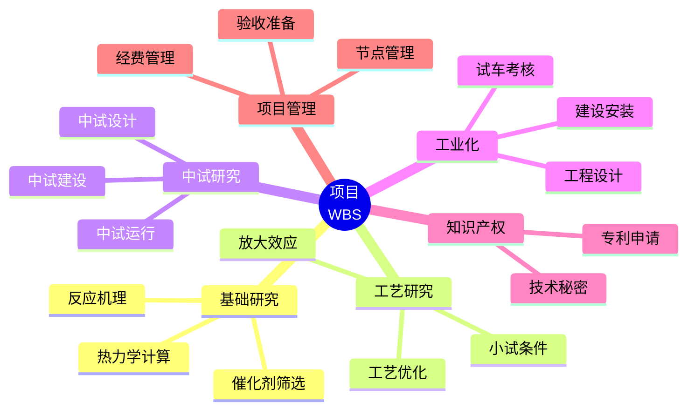
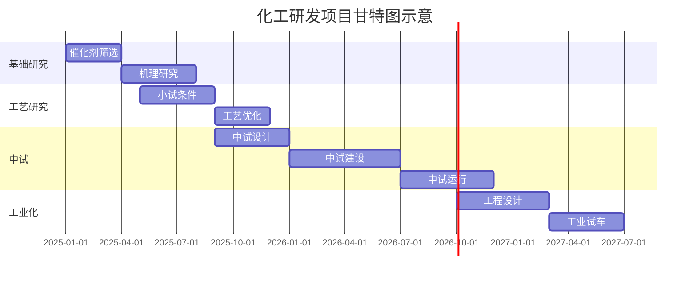
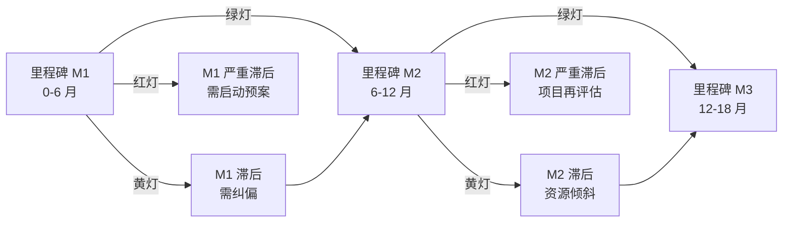
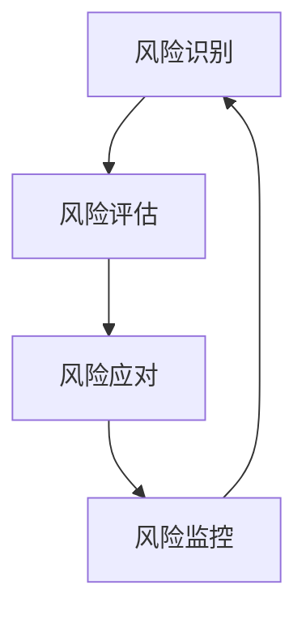
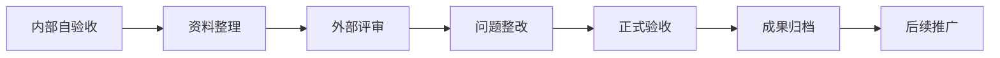

# 第 20 章 科研项目管理

> **本章核心问题**：化工研发项目从立项到验收，周期长、变量多、跨部门协作复杂。一线工程师怎么把"做研究"转成"做完一个项目"？
>
> **学习目标**：
> 1. 能用 WBS 与甘特图拆解一个研发项目。
> 2. 能用里程碑节点管理与风险分级管理。
> 3. 能区分经费科目管理与核算要点。
> 4. 能按标准化模板做项目验收。

## 开篇引子

某研究院一个 3 年期项目，临近验收时实验数据刚补齐、知识产权还没申请、经费支出比例不到 60%。根本原因不是工程师不努力，而是项目从立项那天起就没有把"项目管理"作为独立工作来抓——把"项目"等同于"实验"。化工研发项目周期长（典型 3-5 年）、环节多（基础研究→中试→工业化）、跨部门（研发+工艺+装备+安全+财务），更需要工程化的项目管理方法。

本章要回答的是：化工研发项目怎么从"立了项就开干"升级到"按节点推进、按风险预警、按数据决策"。六节分别覆盖项目立项、计划制定、经费管理、节点管理、风险控制、项目验收。

## 20.1 项目立项：把"做这件事"说清楚

### 核心问题

一份合格的化工研发项目立项书，应该回答哪几个问题？

### 方法与工具

立项是项目的"出生证"。立项阶段没想清楚的事，会在项目推进过程中以各种形式"反噬"——节点拖延、经费超支、考核标准争议。立项要解决五个根本问题：

| 立项核心问题 | 立项书对应章节 |
|---|---|
| 为什么要做？ | 背景、必要性 |
| 做出来什么样？ | 目标、指标 |
| 怎么做？ | 技术路线、研究内容 |
| 凭什么我们能做？ | 现有基础、团队 |
| 做了有什么价值？ | 预期成果、经济效益 |

**项目立项的五大要素**：

1. **必要性论证**：用产业痛点、市场缺口、技术差距三条线说明立项理由。可引用公开行业报告、用户反馈、竞争对手动态。
2. **目标与指标**：分总体目标和分阶段目标。指标尽量量化（选择性 ≥ 92%、产能 ≥ 5 万吨/年、单位产品成本 ≤ X 元/吨）。
3. **技术路线**：画出从原料到产品的关键技术路径，标出风险点和备选方案。
4. **研究内容分解**：把大目标拆为若干研究课题（典型 3-5 个）。
5. **进度与经费估算**：按里程碑排进度，按科目估经费。

**项目分类（按经费来源）**：

- **国家重大专项 / 重点研发计划**：政府主导，5-10 年长周期，强调基础研究和共性技术。
- **企业自立项目**：企业自主投入，强调经济性和转化能力。
- **横向委托项目**：受外部企业/客户委托，强调交付物明确。
- **产学研合作项目**：高校或科研院所与企业联合，强调互补优势。

### 常见坑

1. **目标不可考核**："提高催化剂性能"不可考核；"选择性 ≥ 92%、寿命 ≥ 1000 h"才可考核。
2. **技术路线画得太粗**：立项书里技术路线"原理→实验→中试→工业"三步带过，到了执行阶段才发现每步都有未解的子问题。

## 20.2 计划制定：WBS、甘特图与里程碑

### 核心问题

怎么把立项书的目标拆成可执行的计划？

### 方法与工具

化工研发项目的计划制定有三层：**WBS（Work Breakdown Structure，工作分解结构）→ 甘特图（Gantt Chart）→ 里程碑（Milestone）**。

**WBS 的拆解原则**：

- 按"可交付物"拆，不按"动作"拆。
- 拆到每个工作包能在 2-4 周内完成（约 80-200 工时）。
- 拆到能指派给具体责任人。

**图 20-1 化工研发项目 WBS 拆解示意**

**甘特图绘制要点**：

- 横轴是时间（月/周），纵轴是工作包。
- 用条块表示工期，用菱形表示里程碑。
- 关键路径（Critical Path）用红色或其他颜色高亮。
- 任务之间用箭头表示依赖关系。

**图 20-2 化工研发项目甘特图示意**

**里程碑设定**：

里程碑是项目阶段性成果的"打卡点"。化工研发项目典型里程碑包括：

| 里程碑 | 时点（相对立项） | 标志性交付物 |
|---|---|---|
| M1：项目启动 | 0 月 | 立项书、项目组成员 |
| M2：基础研究完成 | 6-12 月 | 催化剂/工艺路线确定 |
| M3：小试完成 | 12-18 月 | 小试报告、工艺包初稿 |
| M4：中试完成 | 24-36 月 | 中试报告、中试考核数据 |
| M5：工业化试车 | 36-48 月 | 工业试车报告、性能考核 |
| M6：项目验收 | 48-60 月 | 验收报告、成果汇编 |

### 典型化案例

**典型化案例 20-1**（行业公开资料）

- **背景**：某精细化工企业开发一种新型高分子材料，立项时制定的甘特图只到"小试完成"。
- **问题**：执行到第 14 个月才发现没有规划中试，导致工艺包完成后项目停摆 8 个月。
- **解法**：重新制定完整甘特图，将中试、设计、试车的关键路径用红色标出；每周例会对关键路径节点进行专项 review。
- **结果**：项目重新启动后 24 个月内完成中试与试车。
- **启示**：立项时的甘特图必须覆盖完整项目周期，不能只画到"我们熟的部分"。

### 常见坑

1. **计划不留缓冲**：关键路径上没有 buffer（缓冲），一个延期就全盘打乱。
2. **里程碑定义模糊**："完成中试"不是里程碑，"中试装置 72 h 连续运行达标"才是。

## 20.3 经费管理：从预算到决算

### 核心问题

化工研发项目经费怎么管？为什么不少项目临近验收才发现"钱花错了"？

### 方法与工具

化工研发项目经费按科目管理，常见科目如下：

| 科目 | 内容 | 化工项目占比 |
|---|---|---|
| 设备费 | 专用仪器、设备购置 | 20-40% |
| 材料费 | 原料、试剂、耗材 | 10-20% |
| 测试化验费 | 委外分析、检测 | 5-10% |
| 燃料动力费 | 水、电、气、蒸汽 | 5-10% |
| 差旅/会议/国际合作 | 调研、学术交流 | 2-5% |
| 出版/文献/信息传播 | 论文、专利、资料 | 1-3% |
| 劳务费 | 临时人员、专家咨询 | 5-15% |
| 间接费用 | 管理费、绩效 | 10-20% |

**经费管理的四个时点**：

1. **预算（立项时）**：按科目估算，明确每个科目的上限。
2. **拨付（执行中）**：按里程碑或季度拨付，留有调节空间。
3. **调整（中期）**：根据实际进展做科目间调整（需走变更流程）。
4. **决算（验收前）**：按实际支出归集，准备审计。

**化工研发经费管理的特殊点**：

- **设备费占比高**：中试装置、工业试验装置的设备费动辄千万级。
- **材料费弹性大**：实验耗材消耗受实验失败次数影响很大。
- **测试化验费不可压缩**：必要的检测与表征不能省，否则数据链断裂。
- **间接费比例受关注**：政府项目对间接费比例有明确规定，不能超。

**经费红线（政府项目）**：

- 不得列支与项目无关的支出。
- 不得虚列、虚报、冒领。
- 单笔大额支出需合同/发票齐全。
- 严禁"突击花钱"——验收前大量采购无关物资。

### 常见坑

1. **科目错配**：把测试化验费塞进材料费，账面上好看但审计通不过。
2. **预算时过度乐观**：默认设备费 500 万，实际招标下来 700 万，又不能调，最后挤占其他科目。

## 20.4 节点管理：让项目"按节奏走"

### 核心问题

怎么让一个 3-5 年的项目不至于失速或失焦？

### 方法与工具

节点管理的核心是"把项目状态可视化、把偏差暴露出来"。常见节点管理体系：

| 节点管理方法 | 频次 | 关注点 |
|---|---|---|
| 周例会 | 每周 | 任务进度、问题清单、下周计划 |
| 月度 review | 每月 | 里程碑偏差、风险预警、资源调配 |
| 季度里程碑检查 | 每季 | 关键交付物评审、技术方向校正 |
| 年度中期评估 | 每年（重大专项） | 阶段性成果、外部专家评审 |
| 项目验收 | 项目末期 | 整体交付物、指标达成、经费决算 |

**节点管理的"三色灯"**：

**图 20-3 里程碑三色灯示意**

**节点会议的标准议程**：

1. 上次会议问题清单跟踪（5 分钟）。
2. 各工作包进度汇报（15 分钟）。
3. 关键交付物 demo/审阅（15 分钟）。
4. 问题与风险讨论（15 分钟）。
5. 下阶段任务分配（10 分钟）。

**节点延误的判断标准**：

- 进度偏差 < 10%：绿灯，按原计划执行。
- 偏差 10-25%：黄灯，分析原因、调整资源。
- 偏差 > 25%：红灯，启动风险预案甚至项目再评估。

### 典型化案例

**典型化案例 20-2**（工业实践常识）

- **背景**：某研究院承担一项国家重点研发计划专项，立项周期 5 年，总经费 3000 万元。
- **问题**：项目执行第 2 年中期评估时，发现某课题进展滞后 30%，但项目总负责人"碍于情面"未及时调整。
- **解法**：建立"红黄绿灯"机制，把节点偏差量化公开化；中期评估后立即调整该课题负责人，并追加 6 个月缓冲期。
- **结果**：项目最终按时验收，关键技术指标全部达成。
- **启示**：节点偏差必须量化、公开、纠偏到位。回避问题只会让问题在验收前集中爆发。

### 常见坑

1. **"前松后紧"**：前两年慢悠悠，第三年突击赶工，质量不可控。
2. **节点会议变成"汇报会"**：只汇报不决策，问题清单越来越长。

## 20.5 风险控制：让"未知"变成"已知"

### 核心问题

化工研发项目的典型风险有哪些？怎么提前识别与应对？

### 方法与工具

化工研发项目的风险可分为六大类：

| 风险类型 | 典型表现 | 应对策略 |
|---|---|---|
| **技术风险** | 关键指标无法达成 | 备选技术路线、阶段评审 |
| **进度风险** | 关键路径延误 | 资源倾斜、并行作业 |
| **经费风险** | 实际支出超预算 | 科目调整、外部资源 |
| **人员风险** | 核心人员离职 | AB 角、知识沉淀 |
| **合规风险** | 安全/环保不达标 | HAZOP、预案 |
| **市场风险** | 产品需求变化 | 市场再评估、应用拓展 |

**风险登记册（Risk Register）**：

**图 20-4 风险 PDCA 循环**

**风险评估矩阵（概率 × 影响）**：

|  | 影响小 | 影响中 | 影响大 |
|---|---|---|---|
| **概率高** | 中风险 | 高风险 | 极高风险 |
| **概率中** | 低风险 | 中风险 | 高风险 |
| **概率低** | 极低风险 | 低风险 | 中风险 |

**风险登记册模板**：

| 风险编号 | 风险描述 | 概率 | 影响 | 等级 | 应对措施 | 责任人 |
|---|---|---|---|---|---|---|
| R-01 | 催化剂寿命不达标 | 中 | 高 | 高 | 备选催化剂并行开发 | 张三 |
| R-02 | 中试场地延期 | 中 | 中 | 中 | 备选场地预先沟通 | 李四 |
| R-03 | 核心研发人员离职 | 低 | 高 | 中 | 关键实验 AB 角 | 王五 |

**风险应对的四种策略**：

1. **规避（Avoid）**：改变计划避开风险（如换技术路线）。
2. **转移（Transfer）**：通过外包、保险、合作转移风险。
3. **降低（Mitigate）**：通过增加投入降低概率或影响。
4. **接受（Accept）**：低风险项目主动接受。

### 常见坑

1. **风险识别走过场**：立项时画一张风险表，中期评估不再更新。
2. **风险预案"事后补"**：风险已经发生才做预案，错过了最佳窗口。

## 20.6 项目验收：把"交付"做成"资产"

### 核心问题

化工研发项目验收要交付什么？怎么避免"验收即终点"？

### 方法与工具

项目验收是把研究成果"打包交付"的关键节点。验收不只是一场会议，更是成果资产化的起点。

**验收交付物清单**：

| 交付物类别 | 具体内容 |
|---|---|
| **技术文档** | 研究报告、试验报告、工艺包、技术总结 |
| **知识产权** | 专利申请号、论文、软件著作权 |
| **数据资产** | 原始数据、检测报告、图纸 |
| **样品/装置** | 留样清单、装置照片、运行记录 |
| **管理文档** | 经费决算、变更记录、人员清单 |
| **成果转化** | 工业化进展、技术转移合同、应用案例 |

**项目验收的标准流程**：

**图 20-5 项目验收流程**

**验收前的 90 天准备清单**：

- 倒推 90 天：整理全部原始数据、检测报告。
- 倒推 60 天：完成技术总结报告、知识产权归档。
- 倒推 30 天：完成经费决算、内部自验收。
- 倒推 14 天：准备验收 PPT、现场演示、外部专家评审。
- 验收当天：交付物齐全、汇报流畅、问题应答。

**验收的三类结论**：

1. **通过**：全部指标达成，准予结题。
2. **整改后通过**：部分指标未达成或文档不全，整改后通过。
3. **不通过**：重大指标未达成或文档严重缺失，项目延期或终止。

### 典型化案例

**典型化案例 20-3**（行业公开资料）

- **背景**：某企业研发项目验收时，所有指标都达标，但成果转化数据为空——技术包做完就束之高阁。
- **问题**：验收未将"工业化推进"作为考核项，研发部门只关注"做出来"，不关注"用起来"。
- **解法**：修订立项模板，新增"成果转化路径"章节；验收时必须提交 3 年内工业化推广计划。
- **结果**：后续 5 个项目均明确转化路径，2 个项目在验收后 2 年内完成工业试车。
- **启示**：验收不只是"结题"，更是成果转化的起点。

### 常见坑

1. **验收前突击补文档**：实验记录不全、检测报告缺失，临时凑数。
2. **验收即终点**：验收完就撒手，成果没转化、知识产权没维护、装置没利用。

---

## 本章小结

回到本章开篇"实验做完了项目还没完"的困局，化工研发项目管理需要抓住六条主线：

1. **立项解决"为什么要做"**：必要性、目标、技术路线、研究内容、进度与经费五要素缺一不可。
2. **计划解决"怎么做"**：WBS 拆解到 80-200 工时的工作包，甘特图覆盖全周期，里程碑设硬性交付物。
3. **经费解决"花多少钱"**：按科目管理，四时点（预算/拨付/调整/决算）规范，遵守政府项目红线。
4. **节点解决"按节奏走"**：周例会→月度 review→季度里程碑检查→年度中期评估，偏差用三色灯量化。
5. **风险解决"提前知道"**：六类风险登记在册，概率×影响矩阵评估，四策略（规避/转移/降低/接受）应对。
6. **验收解决"资产化"**：交付物清单六类、流程七步、90 天倒计时，三类结论分明。

第 21 章开始，我们从"管理"转入"表达"——怎么把项目成果写成有说服力的技术报告。

## 思考题

1. 为你熟悉的一个研发项目画一份 WBS（至少拆到 3 层）。
2. 为这个项目画一份甘特图，标出关键路径与里程碑。
3. 列出这个项目当前面临的三项风险，按概率×影响矩阵分级。
4. 为你手头项目做一份经费科目占比饼图，评估结构合理性。
5. 模拟一次验收会议：准备一份 15 分钟的项目验收 PPT 大纲。

## 参考文献

[1] 项目管理协会. PMBOK® 指南（第 7 版）[M]. 北京: 电子工业出版社, 2022.
[2] 科技部. 国家重点研发计划项目管理办法[Z]. 2022.
[3] 国家自然科学基金委员会. 国家自然科学基金项目管理办法[Z]. 2021.
[4] 财政部, 科技部. 国家重点研发计划资金管理办法[Z]. 2023.
[5] 张俊玲 等. 化工研发项目管理体系研究[J]. 化工进展, 2021, 40(8): 4500-4510.
[6] 王志明 等. 化工科研项目立项与验收管理实践[J]. 现代化工, 2022, 42(10): 25-30.
[7] 陆勇 等. WBS 在化工研发项目中的应用[J]. 化工管理, 2021, (15): 12-18.
[8] 国家科技基础条件平台. 科研项目数据汇交技术规范[Z]. 2020.
[9] 中国 21 世纪议程管理中心. 重点研发计划项目中期评估工作规范[Z]. 2022.
[10] 刘建国 等. 化工研发项目风险管理体系建设[J]. 现代化工, 2023, 43(3): 30-35.

> **注**：参考文献中部分期刊文献的作者与页码为示意性占位，正式出版前需通过 CNKI、Web of Science 等数据库核实补全。