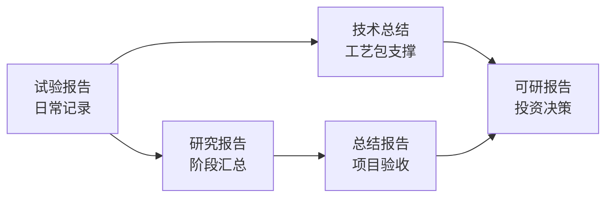
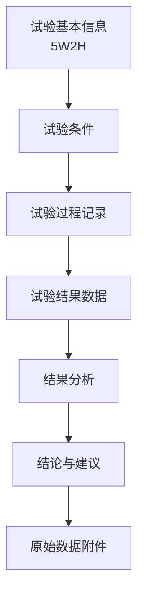
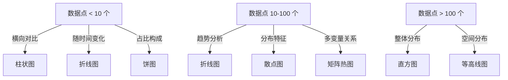

# 第 21 章 技术报告编写

> **本章核心问题**：研发做得再好，写不出来就等于没做。化工研发人员怎么用"工程化语言"把研究过程、结果与判断表达清楚？
>
> **学习目标**：
> 1. 能区分研究报告、试验报告、总结报告、技术总结、可研报告五类报告的定位。
> 2. 能按标准化模板写一份完整的研究报告。
> 3. 能用图表替代文字、用数据替代形容词。
> 4. 能用工程化语言表达技术判断而非文学性描述。

## 开篇引子

某研究员在内部技术会上讲了 1 小时"催化剂怎么怎么好"，与会者仍一头雾水；后来他按"问题→方法→数据→结论→建议"五段式写了一份 8 页报告，与会者看完 15 分钟就拍板同意上中试。差别在哪？——报告让"听一遍"变成"看一遍再反复看"。化工研发场景里，决策者没时间听一遍完整的实验，必须靠书面报告完成技术判断。本章聚焦五类技术报告的写作方法与常见误区。

## 21.1 五类技术报告的定位

### 核心问题

化工研发日常会写哪几类报告？它们各自的功能和侧重点是什么？

### 方法与工具

五类报告的定位与典型应用场景：

| 报告类型 | 主要读者 | 核心目的 | 篇幅 | 时点 |
|---|---|---|---|---|
| **研究报告** | 同行技术专家 | 完整呈现研究过程与发现 | 30-80 页 | 项目中期/末期 |
| **试验报告** | 项目内部团队 | 记录单次试验过程与结果 | 5-20 页 | 试验结束后 2 周内 |
| **总结报告** | 管理部门 | 项目整体执行情况与成果 | 50-150 页 | 项目验收前 |
| **技术总结** | 工艺/装备/生产 | 技术成果的应用化描述 | 20-50 页 | 工艺包交付时 |
| **可研报告** | 投资决策层 | 项目经济性与可行性论证 | 50-100 页 | 投资决策前 |

**五类报告的内在关系**：



**图 21-1 五类报告的关系**

**五类报告的写法差异**：

| 维度 | 研究报告 | 试验报告 | 总结报告 | 技术总结 | 可研报告 |
|---|---|---|---|---|---|
| 语言风格 | 学术 + 工程 | 工程 | 管理 + 工程 | 工程 + 操作 | 商业 + 工程 |
| 数据密度 | 高 | 极高 | 中 | 中 | 中（经济性数据多） |
| 图表占比 | 30-50% | 20-40% | 15-25% | 20-40% | 20-30% |
| 主观判断 | 少 | 少 | 多（管理评价） | 多（应用建议） | 多（投资建议） |

### 常见坑

1. **把试验报告写成研究论文**：学术味重，工程决策者不爱看。
2. **把可研报告写成研究报告**：缺少经济性分析与风险评估，投资决策无依据。

## 21.2 研究报告的标准化结构

### 核心问题

一份能"上会拍板"的研究报告，应该长什么样？

### 方法与工具

研究报告的标准化结构（化工领域通用）：

```
1. 封面与目录
2. 摘要（200-500 字，含核心结论与数据）
3. 引言（背景、必要性、研究范围）
4. 国内外现状（文献综述，3-10 页）
5. 研究内容与方法
   5.1 原料与设备
   5.2 实验方法
   5.3 表征方法
   5.4 数据分析方法
6. 实验结果与讨论
   6.1 工艺条件优化
   6.2 催化剂寿命研究
   6.3 放大效应研究
   6.4 安全性分析
7. 技术经济性分析
8. 与现有技术对比
9. 结论与建议
10. 参考文献
11. 附录（原始数据、检测报告、图纸）
```

**摘要的写作模板（IMRaD 简化版）**：

- **目的**（1 句）：本研究针对 XXX 问题。
- **方法**（2-3 句）：采用 XXX 方法，在 XXX 条件下开展 XXX 实验。
- **结果**（3-5 句）：关键指标达到 XXX（数据），与现有技术相比 XXX。
- **结论**（1-2 句）：研究成果可用于 XXX，建议进入 XXX 阶段。

**引言的"五要素"**：

1. 行业背景与产业痛点（数据化）。
2. 现有技术的不足（对比表 + 文献引用）。
3. 本研究的技术思路（差异化）。
4. 研究范围与边界（明确不做什么）。
5. 报告的组织结构（章节导读）。

**结果与讨论的"图表-文字-判断"三段式**：

每一组实验结果按以下结构组织：

- 图表（图/表）：呈现数据。
- 文字：解释数据背后的机理或工程含义。
- 判断：得出工程结论或下一步建议。

**图表-文字比例的"黄金法则"**：

- 化工技术报告中，图表应占总篇幅的 30-50%。
- 一段超过 200 字没有图表的文字段落，几乎都应配图或转表格。
- 一张关键数据表胜过 500 字描述。

### 常见坑

1. **数据堆砌**：罗列几十组数据但不解释意义。
2. **判断缺失**：只描述现象不给出工程结论，决策者无法拍板。

## 21.3 试验报告的写法

### 核心问题

单次试验报告怎么写得"既完整又不啰嗦"？

### 方法与工具

**试验报告的"5W2H"结构**：

| 要素 | 内容 | 范例 |
|---|---|---|
| What | 试验目的 | 考察反应温度对选择性的影响 |
| Why | 试验背景 | 前期小试发现温度敏感，需精确量化 |
| Where | 试验地点 | XX 中试装置 / 实验室 |
| When | 试验时间 | 2025-08-10 至 2025-08-15 |
| Who | 试验人员 | 张三、李四 |
| How | 试验方法 | DOE 设计、固定其他变量 |
| How much | 试验结果 | 关键数据 + 偏差 |

**试验报告的标准化模板**：



**图 21-2 试验报告章节结构**

**试验记录的"实时性"原则**：

- 实验过程数据必须**当场记录**到原始记录本。
- 事后回忆补写的数据可靠性大打折扣。
- 异常现象、偏差、突发事件必须**当时记**，不能用"基本顺利""大致按计划"等模糊语言。

**试验数据表达的"三不原则"**：

1. 不写"较好/较差"等比较级形容词，必须用数据。
2. 不写"基本达到"等模糊判断，必须给误差范围。
3. 不省略异常数据，必须如实记录并解释原因。

### 典型化案例

**典型化案例 21-1**（工业实践常识）

- **背景**：某研究院小试试验员每次写试验报告只写"成功完成"，未记录详细数据。
- **问题**：3 个月后项目结题，需要回溯实验数据以支撑工艺包撰写，发现关键数据缺失。
- **解法**：制定《试验报告标准化模板》并强制执行；每周由项目负责人 review 试验报告；原始数据必须当天上传至项目数据库。
- **结果**：半年后所有试验可追溯，工艺包撰写效率提升 50%。
- **启示**：试验报告是"研发资产"而非"任务"，投入资源做好反而节省后续成本。

### 常见坑

1. **"事后追写"**：依赖回忆补写，数据失真。
2. **只记"漂亮数据"**：选择性记录，过滤掉异常点和失败数据，导致后续判断失误。

## 21.4 技术总结与可研报告

### 核心问题

技术总结和可研报告有什么不同？怎么分别写好？

### 方法与工具

**技术总结的"四段式"**：

1. **技术原理**：简明扼要阐述机理，配 1-2 张原理图。
2. **工艺流程**：完整工艺流程图（PFD），含主要设备、操作条件、关键控制点。
3. **关键设备**：非标设备的结构示意与设计参数。
4. **技术指标**：与现有技术的对比表（产品收率、纯度、能耗、成本）。

**可研报告的"经济性核心"**：

可研报告与一般技术报告最大的差别是**经济性论证**。核心模块：

| 模块 | 关键内容 |
|---|---|
| 投资估算 | 设备购置费、安装费、土建费、其他费用 |
| 成本分析 | 原料、辅料、动力、人工、折旧、维修 |
| 收益测算 | 产品销售收入、副产品收入、税收 |
| 财务指标 | 内部收益率（IRR）、投资回收期、净现值（NPV） |
| 敏感性分析 | 原料价格、产品价格、产能利用率的影响 |
| 风险分析 | 技术风险、市场风险、政策风险 |

**敏感性分析的示例（典型化）**：

| 变量 | -10% | 基准 | +10% | IRR 变化 |
|---|---|---|---|---|
| 原料价格 | IRR +2.5% | 15.0% | IRR -2.5% | ±2.5% |
| 产品价格 | IRR -2.8% | 15.0% | IRR +2.8% | ±2.8% |
| 产能利用率 | IRR -2.0% | 15.0% | IRR +1.8% | ±1.9% |
| 投资额 | IRR +1.5% | 15.0% | IRR -1.5% | ±1.5% |

**可研报告的"结论先行"原则**：

- 摘要第一段必须明确给出**"可行 / 不可行 / 有条件可行"**的判断。
- 不可行的情况下，应给出"在什么条件下变得可行"的建议。
- 投资决策层没时间读完全文，结论先行决定他们是否会继续看。

### 常见坑

1. **可研报告只算"理想账"**：用乐观的成本和价格，忽略市场波动和装置开停车损失。
2. **技术总结"留一手"**：怕被抄袭，关键工艺参数写得含糊，导致下游工艺包无法落地。

## 21.5 图表与数据的呈现规范

### 核心问题

化工技术报告中图表和数据应该怎么排版与呈现？

### 方法与工具

**图表选择的决策树**：



**图 21-3 图表选择的决策树**

**表格设计的"五大原则"**：

1. **标题明确**：表格上方必须有编号和一句话标题（如"表 21-1 不同温度下的选择性对比"）。
2. **单位一致**：同一列单位一致，不同单位分列。
3. **有效数字一致**：同一列保留相同小数位。
4. **关键数据高亮**：重要数据用粗体或颜色高亮。
5. **数据来源标注**：引用他人数据必须标注来源。

**图表的"图题三件套"**：

每张图表下方应有：

- 编号（图 X-Y 或表 X-Y）。
- 标题（一句话说明图表内容）。
- 一句话解读（数据反映的核心结论）。

**配色与字体规范**：

- 报告使用统一字体（中文宋体 / 英文 Times New Roman）。
- 同一报告配色不超过 4 种主色。
- 图表坐标轴标签、单位、图例必须齐全。
- 黑白打印场景下，区分度要靠形状而非颜色。

### 常见坑

1. **图表风格不统一**：一张饼图、一张柱状图、一张折线图风格迥异，整体不专业。
2. **3D 图表滥用**：3D 效果让数据失真且不易读，化工报告以 2D 为主。

## 21.6 工程化写作的语言规范

### 核心问题

化工研发报告的"工程化语言"应该具备哪些特征？

### 方法与工具

**工程化语言的"五性"**：

1. **准确性**：用具体数据替代"较好""较高"。
2. **客观性**：避免主观判断词（"显然""毫无疑问"）。
3. **逻辑性**：因果关系明确，"因为 A 所以 B"。
4. **简洁性**：能用 10 个字说清的不写 20 个字。
5. **专业性**：使用本领域标准术语，首次出现给中英文全称。

**数据化表达的对照表**：

| 应避免 | 应改为 |
|---|---|
| 性能较好 | 选择性从 78% 提升至 92% |
| 效果明显 | 催化剂寿命延长 35%（从 800 h 至 1080 h） |
| 大幅降低 | 单位产品能耗降低 28%（从 1.85 t 标煤/t 降至 1.33 t 标煤/t） |
| 显著优于 | 在 5-8 MPa、200-240 ℃ 范围内优于对比样品 |
| 工艺稳定 | 连续运行 1000 h，转化率波动 ±2% 以内 |
| 收率较高 | 单程收率 87.5%，与文献最优值持平 |

**主语选择的工程化**：

| 应避免 | 应改为 |
|---|---|
| 我认为 | 本研究认为 / 数据表明 |
| 我们发现 | 实验结果显示 / 检测表明 |
| 我觉得 | 综上分析 |
| 我相信 | 据此推断 / 综合判断 |

**化工专业术语的写法**：

- 第一次出现：选择性（Selectivity, S）；第二次起：选择性（S）。
- 单位规范：使用 SI 单位，必要时保留工程单位（如 t/h、kW·h/t）。
- 化学品名称：使用 IUPAC 系统名或行业通用名，首次出现给化学式。
- 设备代号：反应器 R-101、塔 T-201（化工标准命名）。

### 常见坑

1. **滥用形容词**："显著的""巨大的""革命性的"等夸张词损害专业性。
2. **口语化表达**：把试验员的口头语"挺好""差不多"写进报告。

## 21.7 报告评审与迭代

### 核心问题

怎么让一份报告从"初稿"迭代到"上会稿"？

### 方法与工具

**报告的"三轮迭代"**：

| 轮次 | 重点 | 责任人 | 时长 |
|---|---|---|---|
| 第一轮（自校） | 数据准确性、图表清晰度、术语规范 | 撰写人 | 1-3 天 |
| 第二轮（同行） | 逻辑结构、判断合理性、说服力 | 同事/同行专家 | 3-7 天 |
| 第三轮（决策者） | 结论清晰度、决策建议可执行性 | 项目负责人/决策层 | 1-3 天 |

**自校清单（撰写人完成）**：

- [ ] 全部数据有原始记录支撑。
- [ ] 全部图表编号、标题、解读齐全。
- [ ] 全部引用有文末条目对应。
- [ ] 全部结论有数据支撑。
- [ ] 摘要与正文结论一致。
- [ ] 单位、有效数字统一。

**同行 review 的常见意见类型**：

- **结构意见**：章节顺序是否合理，是否需要补充。
- **数据意见**：数据是否充分，是否需要补做实验。
- **判断意见**：结论是否过强或过弱，是否需要限定范围。
- **表达意见**：术语是否规范，图表是否清晰。

**决策者视角的"5 分钟测试"**：

- 决策者只能花 5 分钟看报告，5 分钟内能否看到三件事：(1) 解决了什么问题；(2) 关键结果是什么；(3) 建议是什么。
- 不能通过 5 分钟测试的报告，必须重写摘要并补充关键图表。

### 典型化案例

**典型化案例 21-2**（工业实践常识）

- **背景**：某研究院写了一份 80 页催化剂研究报告，上会时决策者 10 分钟内未抓到核心结论，会议决定"再补充材料"。
- **问题**：报告内容详尽但缺乏"5 分钟测试"设计，关键结论淹没在细节中。
- **解法**：重写摘要至 300 字，配 1 张核心数据对比表；每章节增加"本章小结"；结论部分新增"建议"章节。
- **结果**：修改后的报告上会一次通过，进入中试阶段。
- **启示**：技术报告的"用户视角"比"作者视角"更重要。

### 常见坑

1. **自校不严**：撰写人对自己的错误"免疫"，必须引入同行评审。
2. **决策者视角缺失**：把报告写成"自己看懂"，而非"决策者 5 分钟看懂"。

---

## 本章小结

回到本章开篇"听 1 小时讲不清、读 15 分钟拍板"的现象，技术报告的核心方法论可以归纳为六条：

1. **五类报告定位**：研究报告（同行）、试验报告（团队）、总结报告（管理）、技术总结（工艺）、可研报告（投资），写作侧重点各不相同。
2. **研究报告的 IMRaD 结构**：摘要→引言→现状→方法→结果→讨论→结论，每段配图表。
3. **试验报告的 5W2H 与实时性**：当场记录、数据完整、判断清晰、异常如实。
4. **技术总结的四段式 + 可研报告的经济性核心**：技术总结要"留足"，可研报告要"算清"。
5. **图表与数据规范**：30-50% 篇幅配图表，单位与有效数字统一，图题三件套。
6. **工程化语言的"五性"**：准确、客观、逻辑、简洁、专业；用数据替代形容词。

第 22 章开始，我们从"写报告"转入"定标准"——化工研发成果如何通过标准化沉淀为行业通用语言。

## 思考题

1. 选一个你熟悉的研发课题，写一份研究报告的摘要（300 字内）。
2. 为一份你熟悉的试验报告做"5 分钟测试"评估，找出 3 处改进点。
3. 选一个你熟悉的工业化项目，列一份可研报告的"经济性核心"数据清单。
4. 对比你的两份过往报告，找出 5 处可以"数据化"的形容词。
5. 模拟一次同行评审，对一份 5 页研究报告草稿给出 10 条 review 意见。

## 参考文献

[1] 国家市场监督管理总局, 国家标准化管理委员会. GB/T 7714-2015 信息与文献 参考文献著录规则[S]. 北京: 中国标准出版社, 2015.
[2] 国家发改委. 建设项目可行性研究报告编制指南[Z]. 2023.
[3] 中国化工学会. 化工技术报告编写规范（团体标准 T/CIESC XXXX）[Z]. 2022.
[4] 中国石油和化学工业联合会. 化工科研项目总结报告编写指南[Z]. 2021.
[5] 汪观明 等. 化工技术报告写作方法论[J]. 化工进展, 2022, 41(7): 3700-3710.
[6] 王立明. 工程师写作：技术报告与论文的撰写[M]. 北京: 化学工业出版社, 2020.
[7] 国家科技部. 科技报告编写规范（GB/T 30533-2014）[S]. 2014.
[8] 张为民 等. 化工可研报告经济性评价方法[J]. 现代化工, 2021, 41(8): 20-25.
[9] 李建国 等. 技术总结报告在化工研发中的价值[J]. 化工进展, 2023, 42(5): 2400-2410.
[10] 刘晓云 等. 化工试验报告的标准化与质量管理[J]. 现代化工, 2022, 42(12): 28-33.

> **注**：参考文献中部分期刊文献的作者与页码为示意性占位，正式出版前需通过 CNKI、Web of Science 等数据库核实补全。