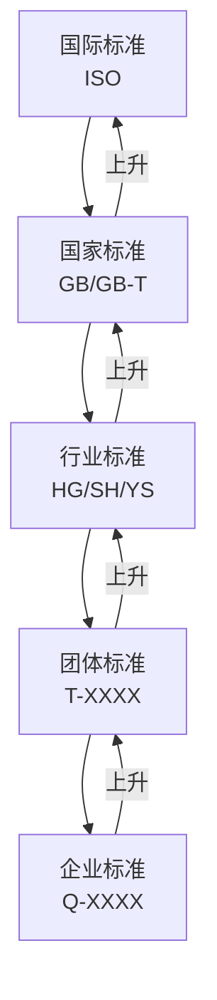
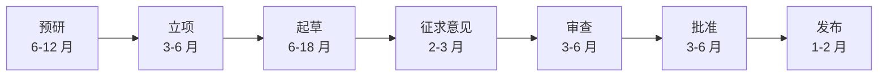
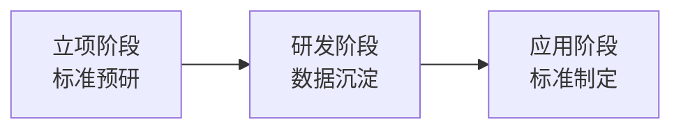
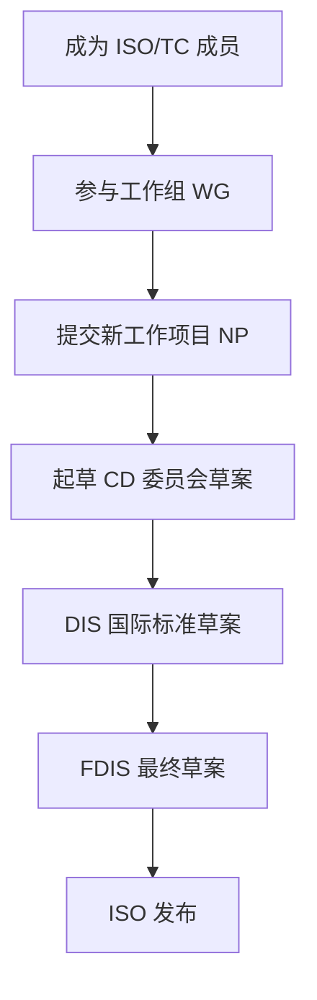
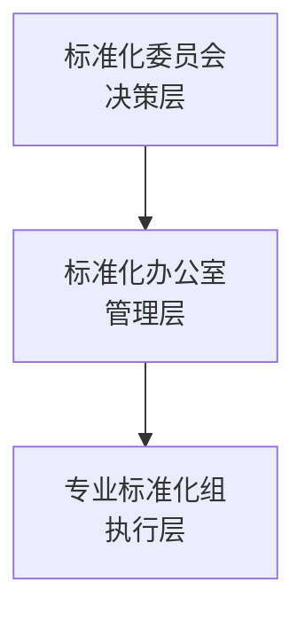

# 第 22 章 标准制定

> **本章核心问题**：化工研发的最高境界不是申请了多少专利，而是行业在用你的标准。一线工程师怎么参与标准制定、让自己的技术成果变成行业语言？
>
> **学习目标**：
> 1. 能区分企业、团体、行业、国家、国际五级标准的差异与适用范围。
> 2. 能按标准化流程参与一项标准的起草。
> 3. 能在研发过程中主动嵌入标准化思维。

## 开篇引子

某新材料公司开发了一种新型工程塑料，性能优异但市场推广缓慢。问题出在哪？——下游用户不敢用，因为"无标可用"。后来该公司主导制定了行业标准（HG/T XXXX-2024）和团体标准（T/CNPCA XXXX-2023），客户在设计选型时有了依据，3 年内该产品在国内市场份额从 5% 升至 25%。标准不仅是技术沉淀，更是市场通行证。本章聚焦化工研发人员如何参与标准制定。

## 22.1 标准的五级体系

### 核心问题

化工领域的标准分为哪几级？各自的法律地位、适用范围、制定主体是什么？

### 方法与工具

化工领域标准按发布机构与适用范围分为五级：

| 标准级别 | 代号前缀 | 制定主体 | 法律地位 | 适用范围 | 制定周期 |
|---|---|---|---|---|---|
| **国际标准** | ISO / IEC | ISO、IEC、ITU 等国际组织 | 自愿性 | 全球 | 3-5 年 |
| **国家标准** | GB（强制性 GB）、GB/T（推荐性） | 国家标准化管理委员会 | 强制性/推荐性 | 全国 | 2-4 年 |
| **行业标准** | HG（化工）、SH（石油）、YS（有色）等 | 行业标准化技术委员会 | 推荐性为主 | 行业内 | 1-3 年 |
| **团体标准** | T/XXXX | 社会团体（学会、协会） | 自愿性 | 团体成员 | 6-18 个月 |
| **企业标准** | Q/XXXX | 企业 | 自愿性（需备案） | 企业内部 | 灵活 |

**五级标准的"金字塔"**：



**图 22-1 标准的五级体系**

**强制性 vs 推荐性**：

- **强制性标准（GB）**：涉及人身健康、安全、环保的强制性要求，必须执行。如 GB 18218《危险化学品重大危险源辨识》。
- **推荐性标准（GB/T）**：自愿采用，但被法律法规或合同引用即变强制。
- **行业标准多为推荐性**：行业自律性质。
- **团体/企业标准多为自愿性**：市场化运作。

**化工标准化的"四类对象"**：

1. **产品标准**：规定产品的质量指标、试验方法、检验规则。
2. **方法标准**：规定检测、分析、试验方法。
3. **基础标准**：术语、符号、分类、编码。
4. **管理标准**：生产安全、环保、能耗、清洁生产。

### 常见坑

1. **重产品轻方法**：做了产品标准但未配套检测方法标准，导致标准不可执行。
2. **企业标准"自娱自乐"**：仅备案未与上下游对齐，市场不认可。

## 22.2 标准制定的完整流程

### 核心问题

化工标准从立项到发布要经历哪几个阶段？每个阶段的关键产出是什么？

### 方法与工具

**国家标准制定流程（GB/T）**：



**图 22-2 国家标准制定流程**

各阶段关键产出：

| 阶段 | 关键产出 | 责任人 |
|---|---|---|
| **预研** | 立项申请书、可行性论证 | 申报单位 |
| **立项** | 立项计划、国标委批复 | 国家标准化管理委员会 |
| **起草** | 标准草案（征求意见稿） | 标准起草工作组 |
| **征求意见** | 征求意见汇总处理表 | 起草组 |
| **审查** | 标准送审稿、审查会议纪要 | TC 全体委员 |
| **批准** | 标准报批稿、编制说明 | 国标委 |
| **发布** | 标准正式文本 | 国标委 |

**行业标准与团体标准的"简化流程"**：

行业标准（HG 等）：

- 立项 → 起草 → 征求意见 → 审查 → 批准 → 发布（精简至 4-6 步）。

团体标准：

- 立项 → 起草 → 征求意见 → 审查 → 发布（5 步，周期更短）。

企业标准：

- 起草 → 内部评审 → 备案（3 步，最快数月）。

**标准起草工作组的"五类成员"**：

1. **主编单位**（1 家）：牵头单位，负责总体推进。
2. **参编单位**（3-5 家）：覆盖生产、研究、检测、用户。
3. **起草人**（5-10 人）：每单位 1-2 名技术骨干。
4. **审查专家**（TC 委员）：行业内有话语权的专家。
5. **秘书处**（1 个）：挂靠单位，负责组织协调。

### 典型化案例

**典型化案例 22-1**（行业公开资料）

- **背景**：中国石化联合会牵头制定《化工园区 HSE 管理规范》团体标准，覆盖 80% 以上国家级化工园区。
- **问题**：化工园区事故频发，但缺乏统一的安全管理标准；各园区管理差异大，先进经验难推广。
- **解法**：成立 12 家起草单位组成的工作组，覆盖行业协会、设计院、龙头化工企业、安全研究院；18 个月内完成征求意见 200+ 条、修改 3 稿。
- **结果**：2024 年正式发布 T/CPCIF XXXX-2024《化工园区 HSE 管理规范》，首批 30+ 园区自愿采用。
- **启示**：团体标准编制需"产学研用"多元参与，避免单一利益倾向。

### 常见坑

1. **征求意见走过场**：征求意见稿发出后未认真处理反馈意见，导致审查阶段争议大。
2. **起草人覆盖不足**：仅 1-2 家企业起草，标准代表性不足。

## 22.3 标准的关键技术要素

### 核心问题

一份化工标准的技术要素应该包含哪些？怎么写好？

### 方法与工具

**标准文本的"标准结构"（GB/T 1.1-2020）**：

```
1. 范围
2. 规范性引用文件
3. 术语和定义
4. 缩略语
5. 总体原则 / 要求
6. 技术要求 / 试验方法 / 检验规则
7. 标志、包装、运输和贮存
8. 附录（资料性 / 规范性）
```

**化工产品标准的核心要素**：

| 要素 | 内容 | 示例 |
|---|---|---|
| **技术要求** | 必检指标与选检指标 | 纯度 ≥ 99.5%、水分 ≤ 0.2% |
| **试验方法** | 每项指标的检测方法 | 气相色谱法、卡尔费休法 |
| **检验规则** | 出厂检验、型式检验 | 批次检验、年度型式检验 |
| **标志包装** | 标识、堆放、运输要求 | 储运警示标志 |

**标准核心指标的"五个确定原则"**：

1. **必要性**：指标必须有意义（用户关注的、影响使用的）。
2. **可测性**：指标必须能用公认方法准确测量。
3. **可达性**：指标必须经努力可达（不能定得"高不可攀"）。
4. **先进性**：指标应适度高于现行平均（推动行业进步）。
5. **经济性**：检测成本不能超过产品利润的合理比例。

**指标值的"分级"策略**：

- **优等品**：行业领先水平（10-15% 企业可达）。
- **一等品**：行业先进水平（30-40% 企业可达）。
- **合格品**：行业基本水平（80% 以上企业可达）。

**化工检测方法标准的"四大要素"**：

1. **方法原理**：方法的化学/物理基础。
2. **试剂与材料**：标准物质、试剂规格。
3. **仪器设备**：精度、配置要求。
4. **操作步骤**：详细到能"照着做"。

### 常见坑

1. **指标定得过严**：把所有企业都排除在外，标准无法推广。
2. **指标未注明试验条件**：同一指标在不同温度/压力下结果差异大，导致争议。

## 22.4 标准化与研发的融合

### 核心问题

化工研发人员怎么在研发过程中就嵌入标准化思维，让成果天然适合标准化？

### 方法与工具

**"研发即标准"的三段式**：



**图 22-3 研发与标准化的三段融合**

**立项阶段的"标准预研"**：

- 立项前调研国内外同类标准，了解行业空白与差距。
- 在立项书中明确"标准产出目标"（计划制定 X 项企业/团体/行业标准）。
- 预判本研发成果的潜在标准化机会（产品标准？方法标准？管理标准？）。

**研发阶段的"数据沉淀"**：

- 实验数据按标准化要求记录（统一格式、可追溯）。
- 检测方法开发与标准方法开发同步推进。
- 关键工艺参数、设备规格按标准化格式整理。
- 形成"标准草案初稿"作为研发阶段性交付物。

**应用阶段的"标准制定"**：

- 研发完成后立即启动标准化工作（不拖延）。
- 优先制定团体标准（周期短、市场化灵活）。
- 同步布局行业/国家标准申报。
- 标准的实施与产品市场推广协同推进。

**"标准必要专利"的策略**：

- 核心工艺/产品研发时同步布局专利。
- 在标准制定时纳入企业核心专利。
- 高价值"标准必要专利（SEP）"具有许可谈判筹码。
- 警惕"专利挟持"风险：避免被竞争对手专利绑架。

### 典型化案例

**典型化案例 22-2**（行业公开资料）

- **背景**：某新材料公司开发了一种新型聚酰亚胺薄膜，性能优异但市场推广受阻。
- **问题**：下游用户在选型时无标准可依，不敢使用；同类国外产品有 IEC 标准。
- **解法**：研发阶段同步布局标准制定：先发布企业标准（Q/XXXX），再推动团体标准（T/CNPCA），最后推动行业标准（HG/T）。同时申请 PCT 专利 5 件，覆盖核心工艺与产品。
- **结果**：3 年内建立完整标准体系（1 项企标 + 1 项团标 + 1 项行标），市场占有率从 5% 升至 25%。
- **启示**：研发与标准化同步推进，可形成"技术-标准-市场"的飞轮。

### 常见坑

1. **研发完成才想标准**：标准制定滞后于产品上市，错过最佳窗口。
2. **专利与标准脱节**：研发只关注技术指标，忽视标准必要专利布局。

## 22.5 国际标准与出海

### 核心问题

中国化工企业怎么参与国际标准制定？出海过程中怎么应对国际标准壁垒？

### 方法与工具

**ISO 国际标准的"参与路径"**：



**图 22-4 ISO 标准制定路径**

**参与国际标准的"五个级别"**：

1. **P 成员（Participating）**：积极参与投票与会议。
2. **O 成员（Observing）**：仅观察、收文件。
3. **工作组专家**：加入 WG 参与具体起草。
4. **项目召集人**：负责具体项目推进。
5. **TC 主席**：负责整个技术委员会。

**国际标准壁垒的应对**：

| 壁垒类型 | 表现 | 应对策略 |
|---|---|---|
| **IEC/UL 等国际认证** | 产品出海需认证 | 提前 1-2 年规划认证 |
| **REACH 等化学品法规** | 欧盟化学品注册 | 提前 3-5 年准备数据 |
| **TSCA 等美规** | 美国环保署登记 | 美国本土代理 + 数据 |
| **碳关税（CBAM）** | 欧盟碳排放要求 | 碳足迹核算 + LCA |
| **专利 SEP 许可** | 标准必要专利许可 | 提前布局 SEP |

**国际标准化的"本土化"策略**：

- 中国标准"走出去"：把国内先进标准通过 IEC/ISO 推到国际。
- 国际标准"引进来"：把国际成熟标准转化为中国 GB/T。
- 双向参与：参与国际会议 + 引入国际专家参与中国标准。

**关键化工 TC 介绍**：

| TC 编号 | 名称 | 秘书处 |
|---|---|---|
| ISO/TC 28 | 石油产品与润滑剂 | 中国石油 |
| ISO/TC 47 | 化学 | 中国国家标准化管理局 |
| ISO/TC 61 | 塑料 | 美国 ASTM |
| ISO/TC 138 | 塑料管材 | 荷兰 |
| ISO/TC 193 | 天然气 | 中国石油 |

### 常见坑

1. **国际标准制定投入不足**：长期参与需要持续人力，企业不愿持续投入。
2. **被动应对国际法规**：欧盟 REACH 实施后才匆忙准备，错过窗口期。

## 22.6 标准化工作的组织与管理

### 核心问题

化工企业怎么建立标准化工作体系？研发人员怎么参与标准化工作？

### 方法与工具

**企业标准化组织的"三层结构"**：



**图 22-5 企业标准化组织结构**

**各层职责**：

| 层级 | 职责 | 人员构成 |
|---|---|---|
| **决策层** | 标准化战略、年度计划、重大标准审批 | 总工、副总、相关部门负责人 |
| **管理层** | 标准日常管理、外部协调、审核 | 标准化办公室 3-5 人 |
| **执行层** | 具体标准起草、参与行业/国家 TC | 各专业骨干 |

**标准化人才的"五项能力"**：

1. **技术功底**：熟悉本专业工艺、设备、检测。
2. **标准化基础**：熟悉 GB/T 1.1、GB/T 20000 等基础标准。
3. **语言能力**：能写规范化的标准文本（中英文）。
4. **协调能力**：能组织会议、协调分歧。
5. **前沿敏感**：能跟踪国际标准动态。

**研发人员的"标准化 KPI"**：

| 类别 | 指标 | 建议权重 |
|---|---|---|
| 标准制定数量 | 主导 / 参与标准数量 | 20-30% |
| 标准制定质量 | 标准先进性、被引用次数 | 30-40% |
| 标准实施推广 | 标准被采用范围、培训场次 | 20-30% |
| 标准基础研究 | 标准化论文、调研报告 | 10-20% |

### 常见坑

1. **标准化部门"边缘化"**：视为行政部门而非技术部门，缺乏话语权。
2. **研发人员"被代表"**：由标准化办公室 1-2 人包办起草，研发人员参与不足。

---

## 本章小结

回到本章开篇"无标可用"的痛点，标准化对化工研发的价值可以归纳为六条：

1. **五级标准体系**：国际→国家→行业→团体→企业，逐级覆盖范围收窄但周期缩短。
2. **标准制定流程**：预研→立项→起草→征求意见→审查→批准→发布，每环节有明确产出。
3. **标准核心要素**：技术要求、试验方法、检验规则、标志包装，"五个确定原则"定指标。
4. **研发与标准化融合**：立项预研→研发沉淀→应用标准化，三段闭环；专利与标准同步布局。
5. **国际标准化**：参与 ISO/TC、应对国际法规、本土化双向推进。
6. **标准化组织**：决策层→管理层→执行层三层结构，研发人员深度参与。

第 23 章开始，我们从"标准制定"转入"成果评价"——技术鉴定、科技奖励、新产品评价、科技成果登记、成果转化五个工具如何高效使用。

## 思考题

1. 选一个你熟悉的化工产品，列出其潜在的产品标准核心指标（不少于 8 项）。
2. 模拟为一项团体标准起草"征求意见稿"框架（10 节左右）。
3. 调研一项国际标准（ISO/TC XXXX），了解其制定流程。
4. 为你所在企业设计一份"标准化 KPI"考核表。
5. 为一个你熟悉的研发项目做一份"标准必要专利"清单。

## 参考文献

[1] 国家标准化管理委员会. GB/T 1.1-2020 标准化工作导则 第 1 部分：标准化文件的结构和起草规则[S]. 北京: 中国标准出版社, 2020.
[2] 国家市场监督管理总局. 中华人民共和国标准化法（2017 修订）[Z]. 2017.
[3] 国家标准化管理委员会. 国家标准管理办法[Z]. 2022.
[4] 中国标准化协会. 团体标准管理规定[Z]. 2019.
[5] 国务院. 国家技术转移体系建设方案[Z]. 2017.
[6] 李春田. 标准化概论[M]. 第 7 版. 北京: 中国人民大学出版社, 2022.
[7] 张勇 等. 化工行业团体标准体系建设研究[J]. 化工进展, 2023, 42(1): 500-510.
[8] 王海涛 等. 化工企业标准化管理与实践[J]. 现代化工, 2022, 42(3): 35-40.
[9] 刘建新 等. 标准化与化工技术创新的耦合机制[J]. 化工进展, 2023, 42(8): 4100-4110.
[10] ISO. ISO/IEC Directives Part 2 — Principles and rules for the structure and drafting of ISO and IEC documents[S]. Geneva: ISO, 2021.

> **注**：参考文献中部分期刊文献的作者与页码为示意性占位，正式出版前需通过 CNKI、Web of Science 等数据库核实补全。