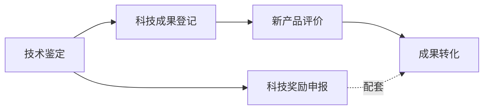
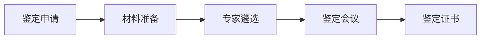
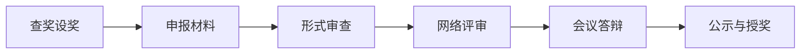
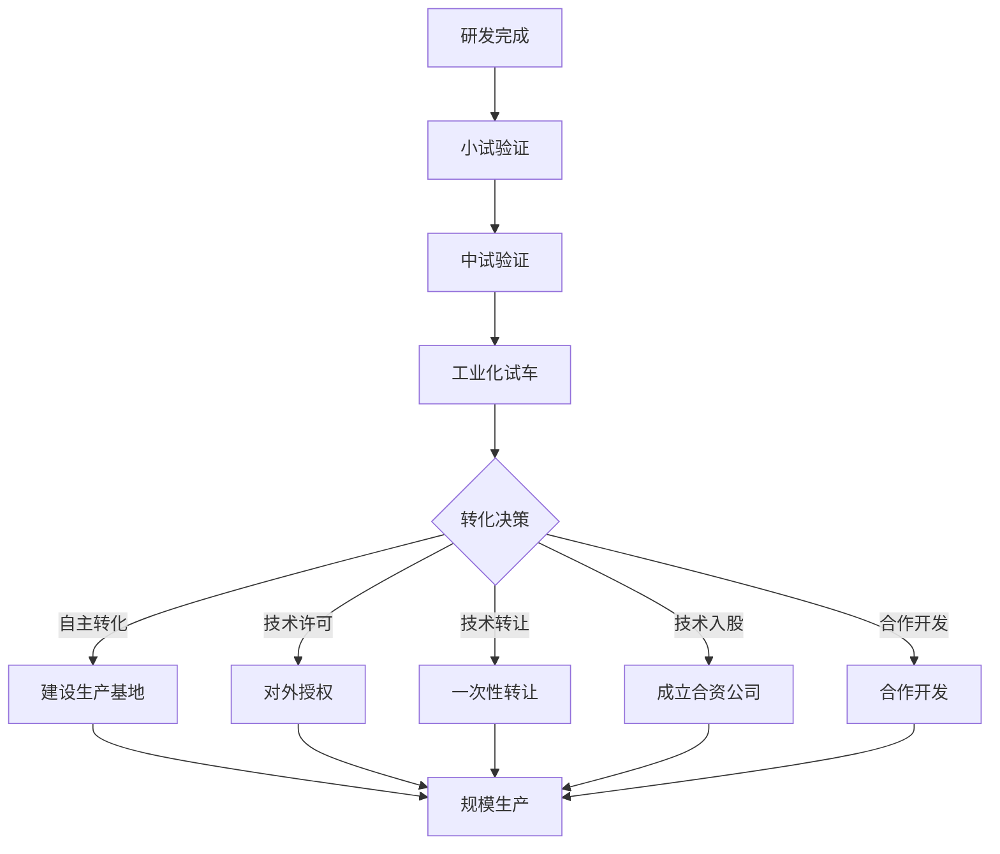
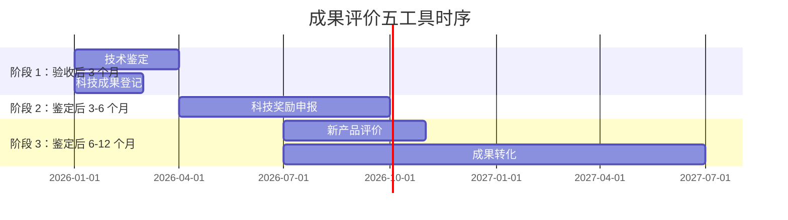

# 第 23 章 成果评价

> **本章核心问题**：研发完成后，怎么把成果"客观量化、对外可证"？技术鉴定、科技奖励、新产品评价、科技成果登记、成果转化五条路径如何高效组合？
>
> **学习目标**：
> 1. 能区分五类成果评价工具的定位与适用场景。
> 2. 能主导一项技术鉴定的材料准备与答辩。
> 3. 能按科技奖励申报模板撰写申报书。
> 4. 能设计"成果转化路径图"。

## 开篇引子

某研究院完成了一项重大技术开发，研发团队想"申报个奖、做个鉴定、推一下转化"，但不知从哪入手，结果拖了 2 年才完成所有评价，错过了最佳转化窗口。问题不是工程师不努力，而是对"成果评价"五类工具的功能差异、时序衔接、产出要求缺乏系统认知。本章聚焦技术鉴定、科技奖励、新产品评价、科技成果登记、成果转化五条路径，让成果从"做完"走向"评完、用上"。

## 23.1 五类成果评价工具的定位

### 核心问题

技术鉴定、科技奖励、新产品评价、科技成果登记、成果转化，这五件事有什么不同？

### 方法与工具

五类工具的差异：

| 工具 | 发起方 | 评价主体 | 评价内容 | 评价产出 | 适用 |
|---|---|---|---|---|---|
| **技术鉴定** | 项目承担方 | 同行专家组 | 技术先进性、成熟度、可推广性 | 鉴定意见、鉴定证书 | 政府专项项目 |
| **科技奖励** | 申报方 | 评审委员会 | 创新性、贡献度、可推广性 | 获奖证书、奖金 | 各级成果 |
| **新产品评价** | 企业 | 行业专家 | 新颖性、性能、效益 | 新产品证书、税收优惠 | 企业新产品 |
| **科技成果登记** | 项目承担方 | 登记机构 | 成果真实性、归属 | 登记证书 | 政府/国企项目 |
| **成果转化** | 企业 | 市场 | 商业价值、可产业化 | 转化合同、销售收入 | 全部成果 |

**五类工具的"时序关系"**：



**图 23-1 五类工具的时序关系**

**五类工具的"价值组合"**：

- **技术鉴定 + 科技成果登记**：拿到"官方背书"。
- **科技奖励**：拿到"行业认可"。
- **新产品评价**：拿到"政策优惠"（税收减免、专项支持）。
- **成果转化**：拿到"市场收益"。

**几类工具的"通用前置条件"**：

1. 研发任务已完成验收或达到评估节点。
2. 知识产权清晰（专利申请号、论文发表、软件著作权）。
3. 技术资料齐全（研究报告、工艺包、检测报告）。
4. 用户反馈或市场验证（如有）。

### 常见坑

1. **混淆鉴定与验收**：项目验收≠技术鉴定。验收是合同交付，鉴定是同行评价。
2. **未及时登记**：成果登记需在验收后 3-6 个月内完成，逾期可能影响后续奖励申报。

## 23.2 技术鉴定

### 核心问题

技术鉴定的完整流程是什么？怎么准备一份高质量的鉴定材料？

### 方法与工具

**技术鉴定的"五大环节"**：



**图 23-2 技术鉴定流程**

各环节要点：

| 环节 | 要点 | 时长 |
|---|---|---|
| **鉴定申请** | 向主管部门（科技厅/部委）提交申请 | 1-2 月 |
| **材料准备** | 研制报告、技术报告、应用报告、查新报告 | 2-3 月 |
| **专家遴选** | 5-9 名同行专家，产学研用覆盖 | 1 月 |
| **鉴定会议** | 现场考察 + 汇报 + 答辩 | 半天 |
| **鉴定证书** | 专家组形成鉴定意见、签发 | 1-2 月 |

**鉴定材料的"四大件"**：

1. **研制报告**：研发背景、技术路线、研究过程。
2. **技术报告**：技术原理、关键技术、创新点、技术指标。
3. **应用报告**：应用单位、应用效果、用户反馈。
4. **查新报告**：国内外同类技术对比、本成果的创新性。

**鉴定会议的"标准流程"**：

- 主持人开场（5 分钟）：介绍专家、宣布议程。
- 项目汇报（30-40 分钟）：技术报告、应用报告。
- 现场考察（30-60 分钟）：装置、数据、样品。
- 专家提问（30-45 分钟）：技术细节、应用场景。
- 专家闭门讨论（20-30 分钟）：形成鉴定意见。
- 宣布鉴定意见（10 分钟）：专家组组长宣读。

**鉴定意见的"五个组成部分"**：

1. **成果定位**：达到国内/国际先进/领先水平。
2. **技术创新点**：列出 2-5 项关键技术。
3. **技术指标达成**：与计划指标对比。
4. **应用前景**：推广价值、产业化路径。
5. **改进建议**：专家组提出的进一步优化方向。

### 典型化案例

**典型化案例 23-1**（行业公开资料）

- **背景**：某研究院开发的新型环氧树脂催化剂项目，需要进行技术鉴定。
- **问题**：第一次鉴定会议未通过，原因是专家对催化剂寿命数据提出质疑。
- **解法**：补充 3000 h 连续运行数据 + 第三方法定检测报告 + 工业试车数据；重新组织鉴定会议。
- **结果**：第二次鉴定顺利通过，专家组给出"国内领先、国际先进"的鉴定意见。
- **启示**：鉴定材料必须"经得起问"，所有数据有第三方支撑。

### 常见坑

1. **专家选聘"老熟人"**：回避利益冲突原则，建议邀请 2-3 名异单位专家。
2. **现场考察走过场**：专家只看 PPT 不下现场，对工业化数据无感。

## 23.3 科技奖励申报

### 核心问题

化工领域的科技奖励体系有哪些？怎么写好一份申报书？

### 方法与工具

**国家级科技奖励**：

| 奖项 | 主办 | 频率 | 等级 |
|---|---|---|---|
| **国家科学技术奖** | 国务院 | 每年 | 最高奖、自然/发明/进步/国际合作 |
| **国家技术发明奖** | 国务院 | 每年 | 一/二/三等奖 |
| **国家科技进步奖** | 国务院 | 每年 | 一/二/三等奖（含特等奖） |
| **中华人民共和国国际科学技术合作奖** | 国务院 | 每年 | 无等级 |

**省部级与行业奖**：

- **省级科技奖**：各省科技厅主办，省内最高奖。
- **行业奖**：如中国石油和化学工业联合会科学技术奖、中国化工学会科学技术奖、中石化科技进步奖等。
- **社会力量设奖**：如侯德榜化工科技奖、何梁何利基金等。

**奖励申报的"标准流程"**：



**图 23-3 科技奖励申报流程**

**申报书的"核心结构"**：

```
1. 项目基本信息
2. 项目简介（500-1000 字）
3. 主要技术内容（3000-5000 字）
4. 关键技术及创新点（2000-3000 字）
5. 知识产权情况（专利、论文、标准）
6. 应用与经济效益（数据化）
7. 社会效益
8. 主要完成人情况
9. 附件清单
```

**申报书写作的"五个关键"**：

1. **创新点要"亮"**：2-5 条，每条配数据支撑。
2. **技术内容要"实"**：关键技术细节完整，但避免暴露核心机密。
3. **应用效益要"准"**：直接经济效益（销售收入、税收）+ 间接经济效益（节能、降耗、减排）。
4. **知识产权要"清"**：核心专利、论文、标准列清楚。
5. **完成人要"准"**：贡献度排序有据，避免争议。

**答辩的"准备要点"**：

- 15 分钟 PPT 准备：背景（1 页）→ 技术路线（2 页）→ 创新点（3 页）→ 指标对比（2 页）→ 应用效益（2 页）→ 团队（1 页）。
- 10 分钟问答预演：技术细节、应用推广、改进方向。
- 5 分钟应急准备：争议性问题的应对预案。

### 常见坑

1. **多奖项同时报**：同一成果一年内重复报多个奖，被查出后会失信。
2. **夸大经济效益**：申报数据虚报被举报，撤销奖励并失信。

## 23.4 新产品评价

### 核心问题

化工新产品评价与一般成果评价有什么不同？怎么获得新产品相关政策支持？

### 方法与工具

**新产品评价的"三大维度"**：

| 维度 | 评价内容 |
|---|---|
| **新颖性** | 产品在结构、性能、工艺、应用上是否有突破 |
| **先进性** | 技术指标是否达到行业先进/领先 |
| **效益性** | 直接经济收益与间接社会效益 |

**新产品评价的"五种政策红利"**：

1. **税收优惠**：研发费用加计扣除 100%（部分企业 120%）、新产品增值税即征即退。
2. **专项支持**：首台套、首批次新材料保险补偿。
3. **政府采购**：节能产品、环境标志产品优先采购。
4. **贷款贴息**：重大技术装备首台套保险。
5. **市场准入**：新产品推广目录、首批次应用示范。

**新产品评价的"申报流程"**：


**图 23-4 新产品评价流程**

**新产品评价的"材料清单"**：

- 新产品计划任务书（可行性论证）。
- 技术鉴定/科技奖励证书（如有）。
- 产品标准（企业/团体/行业/国家标准）。
- 省级以上检测报告（第三方）。
- 用户使用报告（≥ 2 家）。
- 经济效益测算报告。
- 知识产权证书。

### 典型化案例

**典型化案例 23-2**（行业公开资料）

- **背景**：某新材料企业开发了一种新型锂电池电解液添加剂，性能达到日韩同类产品水平。
- **问题**：产品上市后市场推广缓慢，竞争对手已占据国内 70% 市场份额。
- **解法**：申请省级新产品评价 → 进入工信部"新材料首批次应用示范"目录 → 申请首批次新材料保险补偿（中央财政补贴 80% 保费）。
- **结果**：1 年内国内市场份额从 5% 提升至 15%，客户拓展至 30+ 锂电池厂商。
- **启示**：新产品评价的真正价值在于打开"政策工具箱"。

### 常见坑

1. **评价与转化脱节**：拿了证书但未对接政策工具，错过税收优惠。
2. **材料堆砌但无亮点**：罗列大量材料但核心创新点不突出。

## 23.5 科技成果登记

### 核心问题

科技成果登记有什么用？怎么登记？

### 方法与工具

**科技成果登记的"三大功能"**：

1. **权属确认**：登记证书是成果归属的法律证据。
2. **保密分级**：登记时同步确定密级（公开、内部、秘密、机密）。
3. **转化对接**：登记后的成果进入国家科技成果库，可被查询、转化。

**登记的"四个时点"**：

- 项目验收后 3-6 个月内完成登记。
- 与奖励申报、技术鉴定并行推进。
- 重大成果须在 2 年内登记，逾期可能影响后续奖励资格。

**登记的"五类材料"**：

| 材料 | 内容 |
|---|---|
| 成果登记表 | 项目基本信息、技术指标、应用情况 |
| 技术报告 | 完整研究过程与结果 |
| 知识产权证书 | 专利、论文、软件著作权 |
| 应用证明 | 用户使用报告 |
| 经费决算 | 项目经费使用情况 |

**登记的"分级管理"**：

- **国家级登记**：科技部直属机构受理。
- **省级登记**：各省科技厅受理。
- **行业登记**：行业部门（如中石化、中石油内部登记）。

### 常见坑

1. **延迟登记**：很多研究院 5 年前的成果仍未登记，影响奖励申报资格。
2. **密级定错**：核心机密技术登记为"公开"，导致核心技术外泄。

## 23.6 成果转化

### 核心问题

成果转化的核心路径有哪些？怎么设计转化路径图？

### 方法与工具

**成果转化的"五大路径"**：

| 路径 | 模式 | 适用 |
|---|---|---|
| **自主转化** | 企业自主产业化 | 龙头企业 |
| **技术许可** | 收取入门费 + 销售额提成 | 通用技术 |
| **技术转让** | 一次性买断 | 标准化技术 |
| **技术入股** | 成果作价入股成立公司 | 高成长技术 |
| **合作开发** | 共担风险、共享收益 | 高风险技术 |

**成果转化路径图（典型化）**：



**图 23-5 成果转化路径图**

**技术作价入股的"五个关键"**：

1. **评估作价**：第三方评估机构出具评估报告。
2. **股权设计**：研发方、转化方、运营方的股权比例。
3. **里程碑对赌**：分阶段兑现股权。
4. **知识产权归属**：明确转化后专利归属。
5. **退出机制**：研发方如何退出（IPO、回购、转让）。

**许可贸易的"四种费率"**：

| 费率类型 | 计算方式 | 适用 |
|---|---|---|
| **入门费 + 提成** | 入门费（固定）+ 销售额 3-8% 提成 | 通用技术 |
| **纯提成** | 销售额 5-15% 提成 | 高利润产品 |
| **一次性付费** | 一次性支付 | 小额技术 |
| **里程碑付款** | 按技术节点分阶段付款 | 大额技术 |

**成果转化的"政策红利"**：

- **税收优惠**：技术转让所得 ≤ 500 万元部分免征企业所得税，> 500 万元部分减半。
- **国资监管**：国有企事业单位成果转化奖励比例 ≥ 70%（2018 年《促进科技成果转化法》修订）。
- **现金奖励**：研发团队可获不低于转化净收益 50% 的现金奖励。

### 典型化案例

**典型化案例 23-3**（行业公开资料）

- **背景**：某高校开发了一项高性能膜分离技术，但高校自身不具备产业化能力。
- **问题**：技术停留在论文层面，无企业接盘。
- **解法**：高校与企业签订技术许可合同（入门费 200 万 + 销售额 5% 提成）；同时高校以技术评估作价 3000 万入股成立合资公司，持股 20%。
- **结果**：3 年内该技术在 5 家企业应用，高校累计获得许可费 800 万 + 股权增值 5000 万。
- **启示**：多种转化方式组合，可最大化成果价值。

### 常见坑

1. **低价一次性转让**：1000 万买断 vs 持续许可 5 年获益 5000 万，应选后者。
2. **转化无 KPI**：技术部门只关注技术指标，不关注转化收益，导致成果沉睡。

## 23.7 成果评价的组合策略

### 核心问题

化工研发项目完成后，怎么把技术鉴定、科技奖励、新产品评价、科技成果登记、成果转化组合起来，最大化成果价值？

### 方法与工具

**"五评组合"的时序图**：



**图 23-6 五评组合时序图**

**"五评组合"的价值叠加**：

- 技术鉴定（同行认可） + 科技成果登记（官方背书）→ 拿到"行业话语权"。
- 科技奖励（行业奖项）→ 拿到"对外宣传素材"。
- 新产品评价（政策对接）→ 拿到"市场推广加速器"。
- 成果转化（商业收益）→ 拿到"实际收益"。

**化工企业成果评价的"年度复盘"**：

| 维度 | 指标 |
|---|---|
| **成果数量** | 年度完成技术鉴定 X 项、科技奖励 X 项、新产品 X 项、登记 X 项 |
| **成果质量** | 获省部级以上奖 X 项、国际先进/领先 X 项 |
| **转化收益** | 年度技术许可/转让/入股合同额 X 万元 |
| **转化率** | 三年内成果转化率 ≥ X% |

### 常见坑

1. **五评各做各的**：技术鉴定、奖励申报、新产品评价互不衔接，材料重复准备。
2. **评价为评价，转化为转化**：评价完就束之高阁，未对接转化。

---

## 本章小结

回到本章开篇"成果拖了 2 年才完成评价"的问题，化工研发成果评价的方法论可以归纳为六条：

1. **五类工具定位**：技术鉴定（同行认可）、科技奖励（行业奖项）、新产品评价（政策对接）、科技成果登记（官方背书）、成果转化（市场收益）。
2. **技术鉴定的"五大环节"**：申请→材料→专家→会议→证书；鉴定意见五部分。
3. **科技奖励申报**：国家级 + 省部级 + 行业奖三层；申报书七结构、答辩准备三阶段。
4. **新产品评价的"政策红利"**：税收优惠、专项支持、政府采购、贷款贴息、市场准入。
5. **科技成果登记**：权属确认、保密分级、转化对接三大功能；3-6 月内完成。
6. **成果转化的"五大路径"**：自主转化、技术许可、技术转让、技术入股、合作开发；五种费率策略。

至此，第七篇"技术成果形成"已完整覆盖：**技术报告→标准制定→成果评价**，对应研发成果从"实验室"到"市场"的全链条。

第八篇开始，我们聚焦"数字化研发"——AI 赋能、数字孪生、智能制造如何重塑化工研发范式。

## 思考题

1. 选一个你熟悉的研发项目，画一份"五评组合"时序图。
2. 为一项假想的化工成果准备技术鉴定材料清单（含 4 大件）。
3. 模拟申报一份省级科技奖，写出申报书的"项目简介"（500 字内）。
4. 选一项你熟悉的化工新技术，设计成果转化路径（至少 3 种模式）。
5. 调研一项国家级科技奖（国家技术发明奖或科技进步奖），列出其申报条件与流程。

## 参考文献

[1] 中华人民共和国科学技术部. 科学技术成果鉴定办法（已废止但参考）[Z]. 1994.
[2] 国务院. 国家科学技术奖励条例（2020 修订）[Z]. 2020.
[3] 国家科学技术奖励工作办公室. 国家科学技术奖申报指南[Z]. 2023.
[4] 全国人民代表大会常务委员会. 中华人民共和国促进科技成果转化法（2015 修订）[Z]. 2015.
[5] 财政部, 国家税务总局. 关于完善研究开发费用税前加计扣除政策的通知[Z]. 2015.
[6] 工业和信息化部. 首批次新材料保险补偿机制试点政策[Z]. 2018.
[7] 王志明 等. 化工科技成果评价体系研究[J]. 化工进展, 2022, 41(3): 1500-1510.
[8] 刘建新 等. 化工企业科技成果转化路径优化[J]. 现代化工, 2023, 43(6): 35-40.
[9] 李华 等. 化工新材料新产品评价与政策红利对接[J]. 化工进展, 2023, 42(10): 5000-5010.
[10] 国家科技基础条件平台. 科技成果登记工作规范[Z]. 2021.

> **注**：参考文献中部分期刊文献的作者与页码为示意性占位，正式出版前需通过 CNKI、Web of Science 等数据库核实补全。