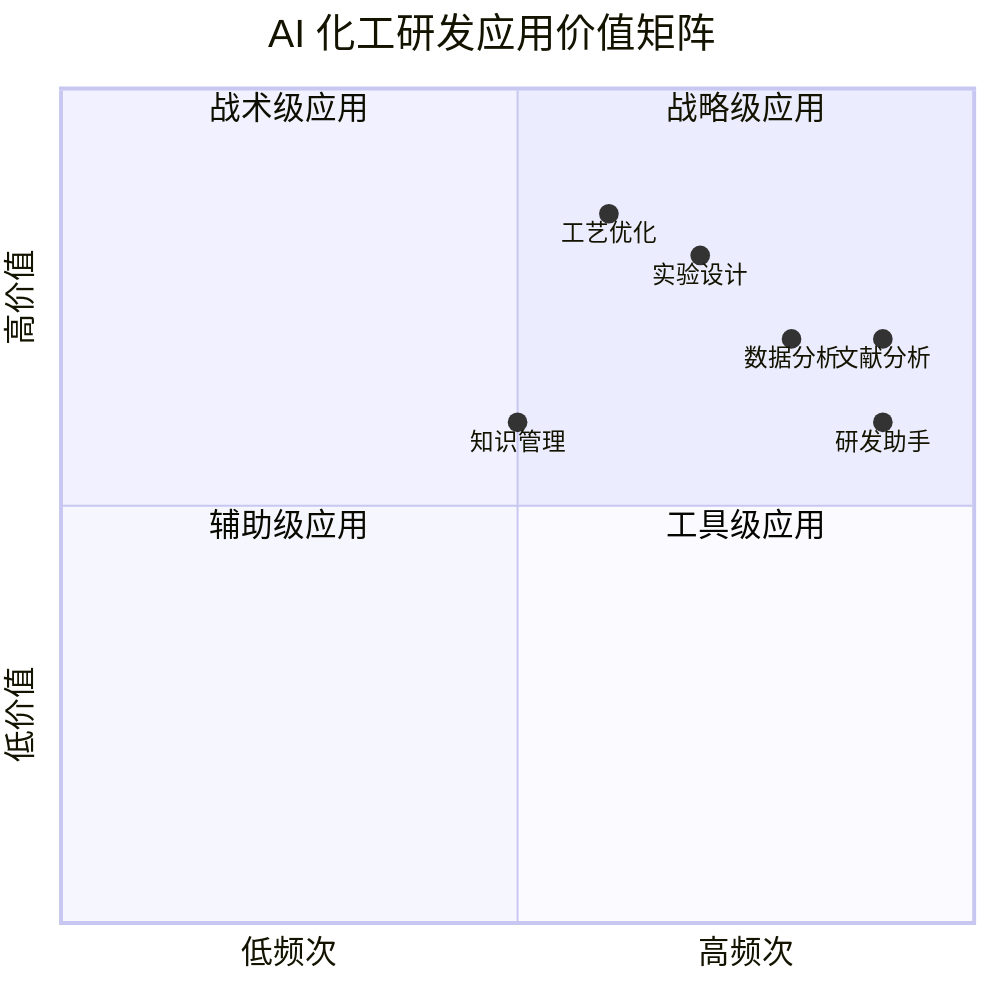
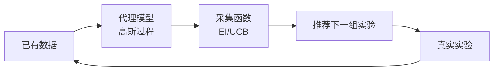
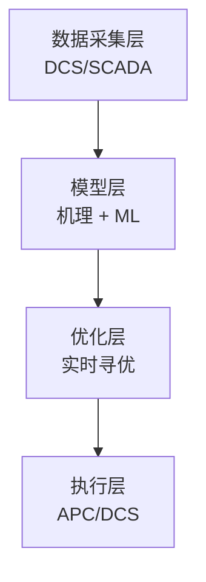
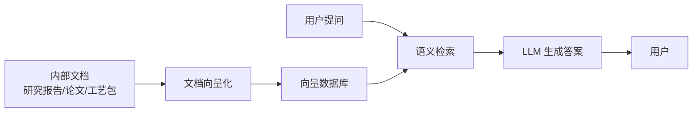
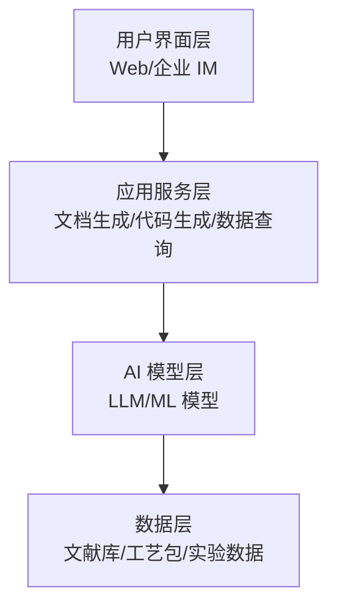

# 第 24 章 AI 赋能化工研发

> **本章核心问题**：AI 工具已经走出"概念阶段"，进入化工研发的实际工作流。一线工程师怎么用 AI 提升文献分析、实验设计、工艺优化、数据分析、知识管理的效率？
>
> **学习目标**：
> 1. 能区分 AI 在化工研发中的六大应用场景。
> 2. 能用大语言模型（LLM）辅助文献综述与情报分析。
> 3. 能用机器学习辅助实验设计与工艺优化。
> 4. 能搭建企业级 AI 研发助手的基本框架。

## 开篇引子

某研究院引入 LLM（大语言模型）后，文献综述效率提升 5 倍，催化剂配方筛选周期从 6 个月缩短至 1.5 个月。但另一个研究院投入 500 万采购 AI 工具，使用率不到 10%。差别在哪？——AI 不是"装上就好用"，而是"嵌入研发流程才有价值"。本章聚焦 AI 在化工研发的六大应用场景，给一线工程师一份可操作的 AI 工具使用指南。

## 24.1 AI 在化工研发中的六大应用

### 核心问题

AI 在化工研发中能做什么？不能做什么？

### 方法与工具

**化工研发的 AI 应用六象限**：



**图 24-1 AI 化工研发应用价值矩阵**

**六大应用的定位**：

| 应用 | 核心价值 | 典型工具 | 入门门槛 |
|---|---|---|---|
| **AI 辅助文献分析** | 缩短文献综述时间 5-10 倍 | ChatGPT、Claude、学术 GPT | 低 |
| **AI 实验设计** | 减少实验次数 30-50% | DOE + ML 工具 | 中 |
| **AI 工艺优化** | 实时寻优、降耗增效 | Aspen + ML、数字孪生 | 中高 |
| **AI 数据分析** | 模式识别、异常检测 | Python + scikit-learn、AutoML | 中 |
| **AI 知识管理** | 知识沉淀、智能问答 | RAG、企业知识库 | 中高 |
| **AI 研发助手** | 流程提速、文档生成 | LLM + 工作流集成 | 低 |

**AI 在化工研发中的"能/不能"**：

| 能做 | 不能做 |
|---|---|
| 文献快速摘要与综述 | 替代实验验证 |
| 数据模式识别与预测 | 替代机理性判断 |
| 实验设计优化 | 替代工艺工程师经验 |
| 异常数据检测 | 替代安全工程师判断 |
| 自动化报告生成 | 替代知识产权分析 |
| 工艺参数寻优 | 替代工艺包设计 |

**AI 化工研发的"四个现实"**：

1. **数据是燃料**：没有高质量数据集，AI 是"无米之炊"。
2. **领域知识是底盘**：纯通用 AI 在化工领域表现一般，必须领域化。
3. **人是关键**：AI 是助手不是替代者，工程师的判断力不可替代。
4. **ROI 要算清**：AI 投入 vs 收益要做量化分析，避免"为 AI 而 AI"。

### 常见坑

1. **"装个 ChatGPT 就完事"**：不解决实际研发问题，沦为"玩具"。
2. **盲目自研模型**：缺乏算法团队和数据基础，盲目自研大模型。

## 24.2 AI 辅助文献分析

### 核心问题

AI 怎么帮化工研发人员高效做文献综述？

### 方法与工具

**AI 文献分析的"五类任务"**：

1. **文献检索增强**：用自然语言检索替代关键词检索。
2. **文献摘要生成**：长文 → 关键结论摘要。
3. **文献对比分析**：多篇文献横向对比、提取共识与差异。
4. **文献趋势分析**：从大量文献中识别研究热点演进。
5. **文献翻译与本地化**：跨语言文献快速翻译。

**AI 文献分析的"工具矩阵"**：

| 工具 | 优势 | 局限 |
|---|---|---|
| **ChatGPT / Claude / Gemini** | 长文理解、对话式追问 | 数据时效性、引用准确度 |
| **学术 GPT（Scholar GPT）** | 学术风格输出、引用清晰 | 文献数量有限 |
| **Consensus** | 跨论文共识分析 | 化工领域覆盖不全 |
| **Elicit** | 结构化抽取、自动生成表格 | 中文文献支持弱 |
| **Semantic Scholar** | 免费、强语义检索 | 化工细分不足 |
| **Connected Papers** | 文献关系图谱 | 中文文献少 |

**AI 文献综述的"Prompt 模板"**：

```
你是一位资深化工研发专家。我需要你帮我做一份关于 [主题] 的文献综述。

任务：
1. 综述范围：[时间范围] [研究主题]
2. 主要关注：[技术路线 / 工艺指标 / 催化剂 / 设备]
3. 输出要求：
   - 关键技术演进（按时间顺序）
   - 主要技术路线对比
   - 关键指标对比表
   - 未来研究方向判断
4. 输出格式：Markdown，包含至少 3 张对比表。

注意：
- 区分学术文献与商业资料
- 区分实验数据与理论推测
- 对争议性结论标注分歧
```

**AI 文献分析的"五个质量校验"**：

1. **引用准确性**：AI 给的引用是否真实存在？需用 Google Scholar 验证。
2. **数据时效性**：训练数据截止到什么时候？新近文献可能未覆盖。
3. **内容专业性**：是否有化工领域术语错误？
4. **结论客观性**：是否过度简化或夸大？
5. **可重复性**：换个问法结论是否一致？

### 典型化案例

**典型化案例 24-1**（工业实践常识）

- **背景**：某研究院博士做 DMTO 催化剂文献综述，传统方式需 2-3 个月。
- **解法**：用 LLM 辅助检索 + 摘要 + 对比分析，配合人工校验关键数据。
- **结果**：2 周内完成 80% 文献综述工作，博士把节省时间用于深度分析。
- **启示**：AI 不替代深度思考，但能让"整理工作"提速。

### 常见坑

1. **照搬 AI 输出**：不校验引用、不结合实际，导致综述"好看但不可用"。
2. **数据时效性忽视**：用 2023 年之前的训练数据回答 2024 年最新进展。

## 24.3 AI 辅助实验设计

### 核心问题

AI 怎么帮化工研发做实验设计？传统 DOE 与 ML 增强 DOE 有什么差异？

### 方法与工具

**传统 DOE 与 AI 增强 DOE 的对比**：

| 维度 | 传统 DOE | AI 增强 DOE |
|---|---|---|
| 设计依据 | 统计原理 + 经验 | 历史数据 + 机器学习 |
| 实验次数 | 固定（正交/响应面） | 可自适应减少 |
| 模型形式 | 多项式（线性/二次） | 任意函数（高斯过程、神经网络） |
| 最优化 | 静态 | 动态寻优（贝叶斯优化） |
| 数据需求 | 少（10-50 组） | 多（50-500 组） |

**贝叶斯优化（Bayesian Optimization）的核心逻辑**：



**图 24-2 贝叶斯优化流程**

**贝叶斯优化的"四大优势"**：

1. **样本高效**：相比网格搜索，实验次数减少 50-80%。
2. **全局寻优**：避免陷入局部最优。
3. **不确定性量化**：给出预测的置信区间。
4. **支持约束**：可加入工艺约束（温度 ≤ 300℃、压力 ≤ 5 MPa）。

**AI 实验设计的"四个工具"**：

| 工具 | 类型 | 适用 |
|---|---|---|
| **Bayesian Optimization (Python BoTorch)** | 开源 | 多目标优化 |
| **Aspen Plus + ML 插件** | 商业 | 工艺参数寻优 |
| **COMSOL + MATLAB** | 商业 | 多物理场优化 |
| **Active Learning** | 开源 | 高通量筛选 |

**AI 实验设计的"五个注意"**：

1. 不能完全依赖 AI 推荐，工程师必须参与判断。
2. 初始数据要有代表性，避免"偏数据训练"。
3. 实验失败数据不能丢，失败数据也是训练信号。
4. 模型不能"过拟合"，需保留验证集。
5. AI 给出的"异常参数组合"需人工判断是否安全。

### 常见坑

1. **历史数据质量差**：用脏数据训练，模型输出不可靠。
2. **不验证 AI 推荐**：盲目执行 AI 推荐参数组合，可能造成安全风险。

## 24.4 AI 工艺优化

### 核心问题

AI 怎么帮化工装置实现实时工艺优化？

### 方法与工具

**AI 工艺优化的"三层架构"**：



**图 24-3 AI 工艺优化架构**

**第一层：数据采集层**：

- DCS/SCADA 实时数据（秒级）。
- 化验室离线数据（小时级）。
- 设备状态数据（温度、压力、流量）。
- 数据清洗与对齐是关键。

**第二层：模型层**：

- **机理模型（First-Principle）**：基于质量、能量、动量守恒。
- **数据模型（Data-Driven）**：基于历史数据训练（神经网络、随机森林）。
- **混合模型（Hybrid）**：机理 + 数据融合。
- **数字孪生（Digital Twin）**：实时模型镜像。

**第三层：优化层**：

- 实时优化（RTO, Real-Time Optimization）：每 1-8 小时重算最优设定点。
- 先进控制（APC, Advanced Control）：多变量模型预测控制。
- 自适应控制：模型在线更新。

**AI 工艺优化的"五个典型场景"**：

| 场景 | 优化目标 | 典型收益 |
|---|---|---|
| **反应器优化** | 转化率/选择性 | 选择性提升 1-3% |
| **精馏塔优化** | 能耗 | 塔顶回流比降低 5-15% |
| **换热网络优化** | 公用工程消耗 | 能耗降低 3-8% |
| **装置负荷调度** | 产量/能耗 | 单位产品能耗降低 2-5% |
| **异常检测** | 安全/质量 | 误报率降低 50%+ |

### 典型化案例

**典型化案例 24-2**（行业公开资料）

- **背景**：某大型炼化企业乙烯装置引入 AI 工艺优化（RTO + APC）。
- **问题**：装置能耗高、收率波动大；传统 APC 调优滞后。
- **解法**：建立乙烯裂解炉实时数字孪生 + 机器学习收率预测 + 实时优化系统。
- **结果**：1 年内乙烯收率提升 0.8 个百分点，年增收益 8000 万元；能耗降低 3.5%。
- **启示**：AI 工艺优化的关键不是模型本身，而是"数据-模型-执行"的闭环。

### 常见坑

1. **数据孤岛**：DCS、化验、设备数据分散，无法融合。
2. **模型"漂移"**：催化剂老化、原料变化后模型不再适用，需在线学习。

## 24.5 AI 数据分析与知识管理

### 核心问题

AI 怎么帮化工研发做数据深度分析？怎么建立企业级知识管理体系？

### 方法与工具

**AI 数据分析的"五大场景"**：

1. **模式识别**：从大量数据中发现异常模式。
2. **趋势预测**：基于历史预测未来（如催化剂寿命预测）。
3. **根因分析**：装置异常时快速定位原因。
4. **聚类分析**：将相似的实验/装置/产品自动归类。
5. **A/B 测试分析**：多组实验结果的统计推断。

**常用 ML 算法与化工应用对应**：

| 算法 | 化工应用 |
|---|---|
| 线性回归 | 工艺参数线性关系建模 |
| 随机森林 | 特征重要性排序、分类 |
| XGBoost | 收率/选择性预测 |
| 神经网络 | 复杂非线性映射 |
| 高斯过程 | 不确定性量化、贝叶斯优化 |
| LSTM | 时序预测、设备状态 |
| 自编码器 | 异常检测 |
| 强化学习 | 工艺寻优 |

**企业知识管理的"RAG 架构"**：



**图 24-4 RAG 知识管理架构**

**RAG 知识管理的"五个步骤"**：

1. **文档整理**：把研究报告、工艺包、专利、论文数字化。
2. **文档切分**：按章节/段落切分，便于检索。
3. **向量化**：用 Embedding 模型转成向量存入向量数据库。
4. **语义检索**：用户提问 → 向量检索 → 相关文档片段。
5. **LLM 生成**：基于检索到的片段生成答案。

**企业知识管理的"三大价值"**：

- **经验沉淀**：老师傅的经验被结构化沉淀，新人快速上手。
- **效率提升**：技术问答响应时间从小时级降到分钟级。
- **创新加速**：跨项目、跨专业的知识组合催生新思路。

### 常见坑

1. **文档不数字化**：纸质文档无法被 AI 利用。
2. **知识库无更新**：一次构建后无人维护，知识陈旧。

## 24.6 AI 研发助手的工程实现

### 核心问题

怎么搭建一个化工企业的 AI 研发助手？

### 方法与工具

**AI 研发助手的"四层架构"**：



**图 24-5 AI 研发助手四层架构**

**AI 研发助手的"六大功能模块"**：

| 模块 | 功能 | 典型场景 |
|---|---|---|
| **文献助手** | 检索、摘要、综述 | 文献调研 |
| **实验助手** | 实验方案生成、数据记录 | 实验室 |
| **工艺助手** | 工艺参数推荐、故障诊断 | 工艺包撰写 |
| **数据助手** | 数据查询、统计分析、可视化 | 数据分析 |
| **报告助手** | 报告模板、自动撰写 | 报告编制 |
| **翻译助手** | 跨语言翻译 | 涉外项目 |

**AI 研发助手的"三个落地阶段"**：

**阶段 1：单点工具（0-6 个月）**：

- 引入通用 LLM 工具（ChatGPT、Claude 等），允许研发人员个人使用。
- 重点：建立 AI 使用规范（信息安全、知识产权）。
- 投入：低（个人账号 + 培训）。

**阶段 2：领域定制（6-18 个月）**：

- 建立企业 RAG 知识库（基于内部文献/数据）。
- 训练领域化 LLM（微调或 RAG）。
- 重点：数据安全、本地化部署。
- 投入：中（数据治理 + 模型微调）。

**阶段 3：流程嵌入（18-36 个月）**：

- 把 AI 嵌入研发流程（立项、实验、报告、转化）。
- 与 DCS/LIMS/PLM 系统集成。
- 重点：业务流程再造、ROI 量化。
- 投入：高（系统集成 + 组织变革）。

**化工企业 AI 落地的"五个坑"**：

1. **数据安全忽视**：把内部敏感数据传到公网 LLM，导致泄密。
2. **效果过度承诺**：把 AI 当万能药，实际效果有限导致失望。
3. **缺乏领域化**：通用 LLM 在化工领域表现差，必须领域化。
4. **组织变革忽视**：AI 引入涉及岗位调整，需要组织配套。
5. **ROI 模糊**：投入大但效果难量化，导致项目被砍。

### 常见坑

1. **直接用公网 LLM 处理机密数据**：违反数据安全要求。
2. **AI 替代论**：把 AI 当成"替代工程师"的工具，引发组织抵触。

---

## 本章小结

回到本章开篇"AI 装上就好用 vs AI 嵌入流程才有用"的差别，AI 赋能化工研发的方法论可以归纳为六条：

1. **AI 化工研发六象限**：文献分析（高频高价值）、实验设计（高频高价值）、工艺优化（高频高价值）、数据分析（高频中高价值）、知识管理（中频中价值）、研发助手（高频中价值）。
2. **AI 文献分析的"五类任务"**：检索增强、摘要生成、对比分析、趋势分析、翻译本地化；用 Prompt 模板提升质量，五个校验点防止 AI 幻觉。
3. **AI 实验设计**：贝叶斯优化减少实验次数 50-80%，与传统 DOE 结合效果最佳；实验设计"五个注意"防止过度依赖。
4. **AI 工艺优化的"三层架构"**：数据采集 → 模型层（机理/数据/混合） → 优化层（RTO/APC）；典型场景：反应器、精馏、换热网络、负荷调度、异常检测。
5. **AI 数据分析与知识管理**：ML 算法与化工场景对应（XGBoost 收率预测、LSTM 时序预测等）；RAG 架构实现企业知识库。
6. **AI 研发助手的落地路径**：单点工具 → 领域定制 → 流程嵌入，三阶段逐步推进；五个常见坑（数据安全、效果承诺、领域化、组织变革、ROI）。

第 25 章开始，我们聚焦"数字孪生"——AI 在化工研发的"具象化"形态：把装置、工艺、工厂搬进虚拟世界。

## 思考题

1. 选一个你熟悉的研发场景，设计一份 AI 文献综述的 Prompt 模板。
2. 用贝叶斯优化思想，为一个 3 因素 3 水平的催化剂筛选设计实验方案。
3. 选一个你熟悉的化工装置，画一份 AI 工艺优化的三层架构图。
4. 设计一个企业 RAG 知识库的构建步骤（含数据源、切分、向量库、检索）。
5. 为你所在企业设计一份 AI 研发助手落地路线图（三阶段）。

## 参考文献

[1] Russell S, Norvig P. Artificial Intelligence: A Modern Approach[M]. 4th ed. Pearson, 2020.
[2] 张亚强 等. 人工智能在化工中的应用进展[J]. 化工进展, 2023, 42(1): 1-15.
[3] 工业和信息化部. 化工行业数字化转型行动计划[Z]. 2022.
[4] 国家发改委. 数字化转型伙伴行动倡议[Z]. 2020.
[5] 中国信息通信研究院. 人工智能发展报告（2023）[R]. 2023.
[6] 刘伟 等. 大语言模型在化工文献分析中的应用[J]. 化工进展, 2024, 43(2): 800-810.
[7] 王磊 等. 贝叶斯优化在催化剂设计中的应用[J]. 现代化工, 2023, 43(8): 20-25.
[8] Aspen Technology. Aspen Plus Optimization Suite Documentation[R]. 2023.
[9] 张勇 等. 化工企业知识图谱构建与应用[J]. 化工进展, 2023, 42(6): 3000-3010.
[10] 周明 等. AI 赋能的化工研发模式变革[J]. 现代化工, 2024, 44(3): 30-36.

> **注**：参考文献中部分期刊文献的作者与页码为示意性占位，正式出版前需通过 CNKI、Web of Science 等数据库核实补全。
