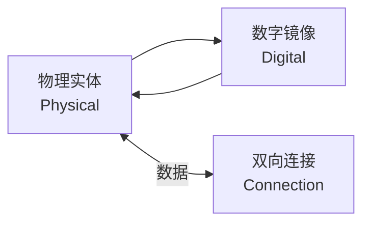
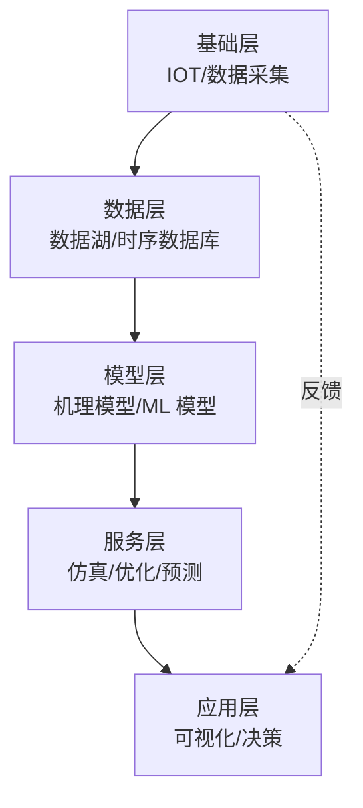
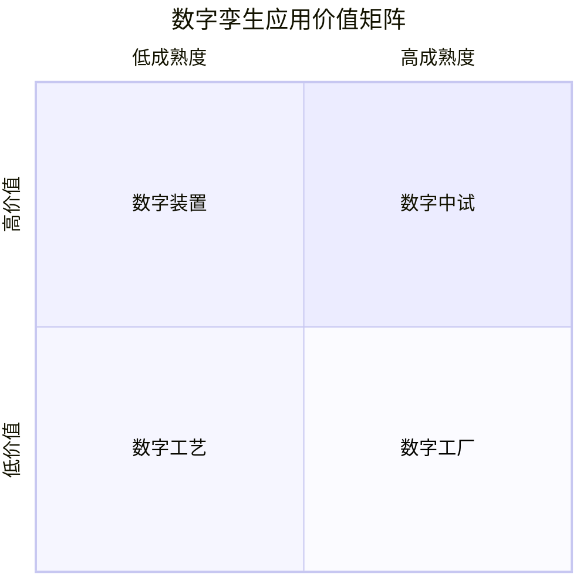

# 第 25 章 数字孪生

> **本章核心问题**：数字孪生不只是"三维模型"或"仿真软件"，而是把真实装置搬进虚拟世界。一线工程师怎么理解数字孪生在化工研发中的真实价值与落地路径？
>
> **学习目标**：
> 1. 能区分数字孪生与建模仿真、SCADA 的差异。
> 2. 能搭建数字孪生研发的五层架构。
> 3. 能用数字孪生辅助中试、工业试验、装置运维。

## 开篇引子

某大型化工企业建立了一套乙烯裂解炉数字孪生系统，把裂解炉的运行状态搬到虚拟空间，工艺工程师在"虚拟裂解炉"上做调优，把优化方案直接下发到真实装置。该系统上线 1 年，乙烯收率提升 0.8 个百分点，年增收益 8000 万元。数字孪生到底能给化工研发带来什么？本章聚焦五个层次的应用方法。

## 25.1 数字孪生的定义与边界

### 核心问题

数字孪生（Digital Twin）与建模仿真、SCADA 有何区别？

### 方法与工具

**数字孪生的"三要素"**：

**图 25-1 数字孪生三要素**

**数字孪生与建模仿真、SCADA 的区别**：

| 维度 | SCADA | 建模仿真 | 数字孪生 |
|---|---|---|---|
| **数据流向** | 单向（实→虚） | 离线、单次 | 双向同步 |
| **更新频率** | 秒级 | 月/年级（重建模型） | 实时 / 分钟级 |
| **主要用途** | 监控 | 设计 / 验证 | 实时优化 / 预测 |
| **与物理实体的关系** | 镜像 | 替代 | 共生 |
| **更新机制** | 自动 | 手动 | 自动 + 在线学习 |

**数字孪生的"五大特征"**（Gartner 定义）：

1. 与物理实体一一对应（不是泛化的"某类装置"）。
2. 实时/近实时同步数据。
3. 双向连接（可下发控制指令到物理实体）。
4. 跨生命周期设计、建造、运营、退役。
5. 集成多学科模型（机理、数据、组织、行为）。

**化工数字孪生的"五级成熟度"**：

| 等级 | 描述 | 化工典型应用 |
|---|---|---|
| L1 静态模型 | 离线仿真 | 设计验证 |
| L2 数据镜像 | 实时显示 | 数据采集可视化 |
| L3 机理 + 数据融合 | 状态估计 | 工艺参数监测 |
| L4 实时寻优 | 闭环优化 | RTO、APC |
| L5 自学习与自治 | AI 驱动 | 智能工厂 |

### 常见坑

1. **"三维模型 = 数字孪生"**：可视化不等于孪生，缺乏数据闭环等于"花瓶"。
2. **"装了软件就是数字孪生"**：没有数据驱动 + 双向连接，只是"信息化"。

## 25.2 数字孪生的技术架构

### 核心问题

化工数字孪生的系统架构应该怎么搭建？

### 方法与工具

**数字孪生的"五层架构"**：

**图 25-2 数字孪生五层架构**

**基础层（IOT 层）**：

- DCS/SCADA 实时数据。
- PLC、智能仪表数据。
- 视频/图像数据（火焰监控、液位监控）。
- 边缘计算节点（数据预处理）。

**数据层（数据平台层）**：

- 时序数据库（InfluxDB、TimescaleDB）。
- 数据湖（对象存储 + Schema 定义）。
- 数据治理：质量、清洗、对齐、标注。

**模型层（核心层）**：

- 机理模型：Aspen Plus、Aspen HYSYS、COMSOL。
- 数据模型：神经网络、随机森林、XGBoost 等。
- 混合模型：机理 + 数据融合。
- 模型版本管理（Model Registry）。

**服务层（计算层）**：

- 仿真计算服务。
- 实时优化服务（RTO）。
- 预测性维护服务。
- 异常检测与根因分析服务。

**应用层（用户层）**：

- 三维可视化驾驶舱（Web 3D）。
- 工艺工程师决策面板。
- 报警与通知（钉钉、企业微信、邮件）。
- 移动端支持（巡检、应急）。

**关键支撑技术**：

| 技术 | 化工应用 |
|---|---|
| **OPC UA** | 设备数据标准化接口 |
| **MQTT / Kafka** | 实时数据流 |
| **PI Historian** | 工业时序数据 |
| **数字主线（Digital Thread）** | 设计-建造-运营数据贯通 |
| **边缘计算** | 实时响应、隐私保护 |

### 典型化案例

**典型化案例 25-1**（行业公开资料）

- **背景**：某炼化企业建立常减压装置数字孪生系统。
- **问题**：装置操作依赖老师傅经验，年轻工艺员上手慢。
- **解法**：建立装置机理模型 + 历史数据训练 ML 模型 + 三维可视化驾驶舱；提供"工艺参数—操作—结果"的多维查询。
- **结果**：新员工培训周期从 12 个月缩短至 6 个月；装置异常定位时间从 4 小时缩短至 30 分钟。
- **启示**：数字孪生的最大价值是"经验数字化"和"决策辅助"。

### 常见坑

1. **架构"过度设计"**：直接搭建"工业互联网平台"但缺乏应用场景，沦为"形象工程"。
2. **数据治理缺位**：原始数据未清洗，模型失效。

## 25.3 数字孪生在化工研发中的应用场景

### 核心问题

化工研发的哪些环节可以用数字孪生？各自的成熟度如何？

### 方法与工具

**数字孪生在化工研发的五大场景**：

**图 25-3 数字孪生应用价值矩阵**

**场景一：数字工艺**（高成熟度、高价值）：

- 应用：工艺设计、可视化、操作培训。
- 工具：Aspen Plus、Aspen HYSYS + 自研 3D 视图。
- 价值：缩短工艺设计周期 30%、降低培训成本 50%。

**场景二：数字装置**（中高成熟度、高价值）：

- 应用：装置实时状态监控、参数异常检测、根因分析。
- 工具：机理模型 + 时序数据库 + 三维可视化。
- 价值：异常定位时间缩短 60-80%。

**场景三：数字中试**（中成熟度、高价值）：

- 应用：中试前的虚拟中试、参数寻优、故障模拟。
- 工具：Aspen + 数字孪生 + RTO。
- 价值：中试周期缩短 30%、实验次数减少 50%。

**场景四：数字工厂**（中成熟度、高价值）：

- 应用：全厂数字孪生（设计、建造、运营）。
- 工具：BIM + 工艺模型 + 实时数据。
- 价值：工厂设计效率提升 30-50%、运营成本降低 5-10%。

**场景五：数字设备**（成熟中、高价值）：

- 应用：设备设计、运维、预测性维护。
- 工具：CAD + CAE + 实时运行数据 + 维护记录。
- 价值：非计划停车减少 30-50%、设备寿命延长 10-20%。

**从场景一到场景四的演进路径**：

**图 25-4 数字孪生演进路径**

### 常见坑

1. **一口气建数字工厂**：从 0 到全厂数字孪生基本不可行，应从单装置起步。
2. **忽视物理建模**：数据模型再准，没有机理底子也走不远。

## 25.4 数字中试

### 核心问题

数字中试（虚拟中试）怎么建立？怎么与物理中试结合？

### 方法与工具

**数字中试的"四步法"**：

1. **物理中试数字化**：把物理中试装置的关键参数数字化（温度、压力、流量、组成）。
2. **建立机理模型**：用 Aspen Plus / Aspen HYSYS / COMSOL 建立机理模型。
3. **参数标定**：用历史数据校正模型参数。
4. **虚拟实验**：在模型上做大规模参数扫描、故障模拟、工艺优化。

**数字中试的"五个优势"**：

| 优势 | 内容 |
|---|---|
| **样本高效** | 一次建模可模拟千万级工况 |
| **实验安全** | 危险工况可在虚拟空间模拟，无需真实操作 |
| **速度快** | 1 次模拟从几秒到几小时，远快于真实实验 |
| **成本低** | 不消耗物料、不占用装置时间 |
| **可重复** | 相同参数可反复模拟，实验可重复 |

**数字中试的"四个局限"**：

| 局限 | 内容 |
|---|---|
| **模型不准** | 复杂反应或传质难以准确建模 |
| **边界条件** | 模型外推存在风险，特别是新工况 |
| **数据需求** | 需要大量历史数据标定模型 |
| **二次开发** | 现有商业软件不能完全满足，需自研 |

**数字中试的"两个闭环"**：

- **闭环 1**：物理中试 → 数据 → 模型 → 参数标定 → 模型校准。
- **闭环 2**：模型 → 虚拟中试 → 推荐参数 → 物理中试验证。

**数字中试的"五个边界条件"**：

1. 物性数据完整（部分物质在数据库中缺失）。
2. 反应动力学已知（动力学实验数据）。
3. 传质参数可获取（基础物性 + 实验标定）。
4. 操作范围明确（不能跨工况外推）。
5. 模型可信度验证（盲测验证）。

### 典型化案例

**典型化案例 25-2**（行业公开资料）

- **背景**：某催化剂企业开发新型 MTO 催化剂，传统中试周期 12-18 个月。
- **问题**：中试装置台套数有限，无法满足多配方并行筛选。
- **解法**：建立 MTO 数字中试平台（Aspen + 反应动力学 + 失活动力学），实现"虚拟筛选 + 关键配方物理中试验证"模式。
- **结果**：1 年内完成 50+ 配方虚拟筛选，关键 8 个配方进物理中试；催化剂开发周期缩短 40%。
- **启示**：数字中试不是替代物理中试，而是为物理中试"挑选最有希望的候选"。

### 常见坑

1. **把数字中试当万能药**：忽视模型外推风险，盲目信任虚拟结果。
2. **不投入物理中试验证**：仅靠数字中试结果推进工业化，导致工业试车失败。

## 25.5 数字孪生在工业化的应用

### 核心问题

数字孪生怎么支撑化工装置的工业化全过程？

### 方法与工具

**工业化全过程的数字孪生支撑**：

**图 25-5 工业化全过程**

各环节的数字孪生支撑：

| 环节 | 数字孪生支撑 |
|---|---|
| **工艺设计** | 工艺流程仿真、操作参数优化、培训模拟 |
| **工程设计** | 三维设计、设备布置、管道应力分析 |
| **建设安装** | 4D 施工模拟、施工进度管理、质量追溯 |
| **试车调试** | 操作模拟、故障演练、HSE 培训 |
| **运行优化** | 实时优化、先进控制、预测维护 |
| **改造退役** | 改造方案模拟、退役方案评估 |

**数字孪生在工业试车中的应用**：

- 试车前：操作员在数字孪生上模拟操作流程。
- 试车中：实时数据回流数字孪生，监控偏离。
- 试车后：对比设计值与实测值，识别放大效应。

**数字孪生驱动的 RTO（实时优化）**：

- 每 1-8 小时基于实时数据重算最优工艺设定点。
- 用 NLP（Nonlinear Programming）求解器求解优化问题。
- 把优化结果下发到 APC / DCS 执行。
- 典型收益：能耗降低 2-5%、收率提升 0.5-2%。

**预测性维护（Predictive Maintenance）**：

- 设备传感器数据 + 历史故障数据 + ML 模型。
- 预测故障时间窗口，提前安排检修。
- 收益：非计划停车减少 30-50%、维修成本降低 10-20%。

### 常见坑

1. **试车后才建数字孪生**：错过设计阶段节约成本的最佳时机。
2. **数字孪生与控制系统隔离**：决策建议无法下发到装置，价值折扣。

## 25.6 数字孪生项目实施方法

### 核心问题

化工企业怎么启动一个数字孪生项目？应该按什么步骤推进？

### 方法与工具

**数字孪生项目的"六个阶段"**：

**图 25-6 数字孪生项目实施六阶段**

**阶段 1：价值定位**（1-2 个月）：

- 选取高价值场景（节能、提收、降耗、提质）。
- 量化预期收益（年化 1000 万？5000 万？）。
- 明确项目边界（单装置起步，不搞全厂）。

**阶段 2：数据治理**（2-4 个月）：

- 数据源盘点（DCS、LIMS、ERP、MES）。
- 数据采集标准化（OPC UA 接口改造）。
- 数据清洗、对齐、存储。
- 历史数据归档（≥ 2 年）。

**阶段 3：模型构建**（3-6 个月）：

- 机理模型（Aspen / COMSOL）。
- 数据模型（Python / R）。
- 模型参数标定与验证。
- 模型版本管理。

**阶段 4：应用开发**（3-6 个月）：

- 三维可视化（Web 3D / UE4 / Unity）。
- 工艺工程师工作台。
- 报警与通知集成。
- 移动端支持。

**阶段 5：集成部署**（1-3 个月）：

- 与 DCS / APC / LIMS 集成。
- 安全合规（等保 2.0、网络安全）。
- 用户培训。
- 试运行与反馈。

**阶段 6：持续运营**（长期）：

- 模型在线更新。
- 用户反馈迭代。
- 价值复盘（每年评估 ROI）。

**数字孪生项目的"五个常见失败"**：

1. **目标模糊**：未量化收益，项目难推进。
2. **数据不足**：DCS 数据保留期短，无历史数据训练模型。
3. **模型脱离业务**：算法团队自娱自乐，业务部门无感。
4. **集成不到位**：与现有系统（MES/DCS）隔离，使用率低。
5. **运维缺失**：上线即弃用，无人维护。

**数字孪生项目的"五个成功要素"**：

1. **高层支持**：需要企业高层推动跨部门协作。
2. **场景聚焦**：从单装置、单场景切入，逐步扩展。
3. **数据治理**：基础不牢，地动山摇。
4. **业务主导**：业务部门是项目主导方，技术部门是支撑。
5. **持续迭代**：数字孪生是"长跑"而非"冲刺"。

---

## 本章小结

回到本章开篇"乙烯裂解炉数字孪生年增 8000 万"的案例，化工研发数字孪生的方法论可以归纳为六条：

1. **数字孪生的三要素**：物理实体 + 数字镜像 + 双向连接；与 SCADA、仿真软件的关键差异。
2. **数字孪生的五级成熟度**：L1 静态模型 → L2 数据镜像 → L3 机理融合 → L4 实时寻优 → L5 自学习。
3. **数字孪生的五层架构**：基础层（IOT）→ 数据层（数据湖）→ 模型层（机理+数据）→ 服务层（仿真/优化）→ 应用层（可视化）。
4. **五大应用场景**：数字设备、数字工艺、数字装置、数字中试、数字工厂，演进路径明确。
5. **数字中试的"四步法"**：物理中试数字化 → 机理模型 → 参数标定 → 虚拟实验；五个优势 + 四个局限 + 两个闭环。
6. **数字孪生项目六阶段**：价值定位 → 数据治理 → 模型构建 → 应用开发 → 集成部署 → 持续运营；五个常见失败与五个成功要素。

第 26 章开始，我们聚焦"智能制造"——数字孪生的"产业化"形态：工厂级的智能化。

## 思考题

1. 选一个你熟悉的化工装置，设计一份数字孪生五层架构图。
2. 为一项高价值场景（如节能）做数字孪生项目的可行性论证（含收益估算）。
3. 列出你所在企业可数字孪生化的 5 个高价值场景，并按"成熟度-价值"矩阵排序。
4. 调研一个化工数字孪生案例（公开报道），分析其成功/失败的五个关键因素。
5. 为你所在企业设计一份"数字孪生三年路线图"（含场景选择、阶段划分、收益预测）。

## 参考文献

[1] Tao F, Zhang H, Liu A, et al. Digital Twin in Industry: State-of-the-Art[J]. IEEE Transactions on Industrial Informatics, 2019, 15(4): 2405-2415.
[2] 工业和信息化部. 化工行业数字化转型三年行动计划（2024-2026）[Z]. 2024.
[3] 国家发改委, 工业和信息化部. 关于加快推动"工业互联网 + 化工"发展的指导意见[Z]. 2023.
[4] 张亚强 等. 数字孪生在化工过程中的应用[J]. 化工进展, 2023, 42(5): 2500-2510.
[5] 王立明 等. 数字孪生驱动的化工装置实时优化[J]. 现代化工, 2024, 44(2): 25-30.
[6] Aspen Technology. Digital Twin for Chemicals Industry[R]. 2023.
[7] 中国信息通信研究院. 工业数字孪生白皮书（2023）[R]. 2023.
[8] 周明 等. 数字中试在催化剂研发中的应用[J]. 化工进展, 2024, 43(3): 1200-1210.
[9] 刘伟 等. 化工装置数字孪生项目实施方法论[J]. 现代化工, 2024, 44(5): 30-36.
[10] GE Digital. Digital Twin Industrial Reference Architecture[R]. 2022.

> **注**：参考文献中部分期刊文献的作者与页码为示意性占位，正式出版前需通过 CNKI、Web of Science 等数据库核实补全。