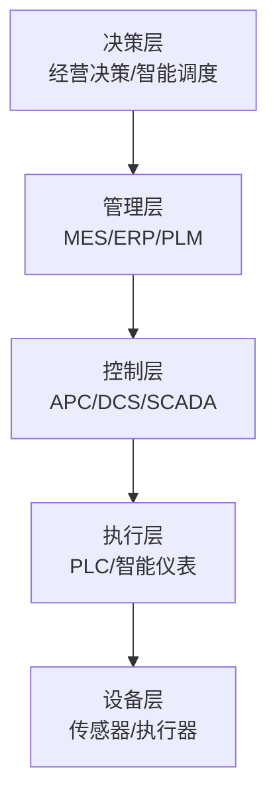
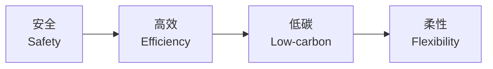
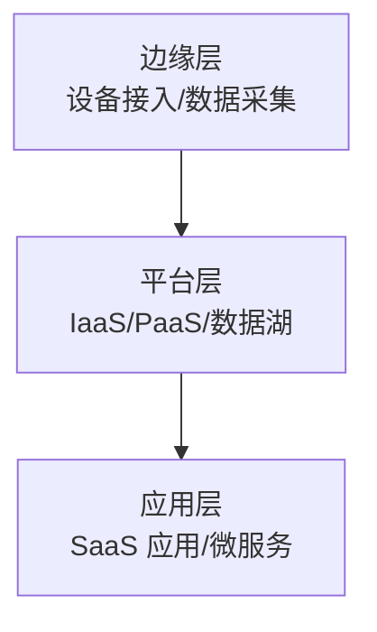
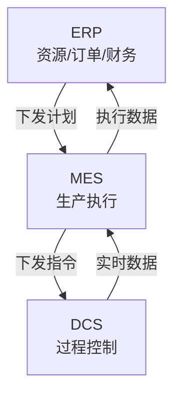
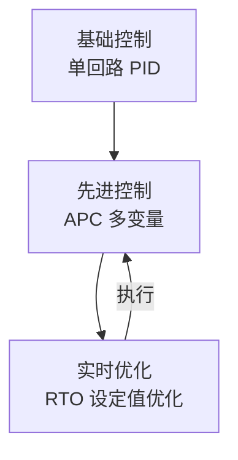
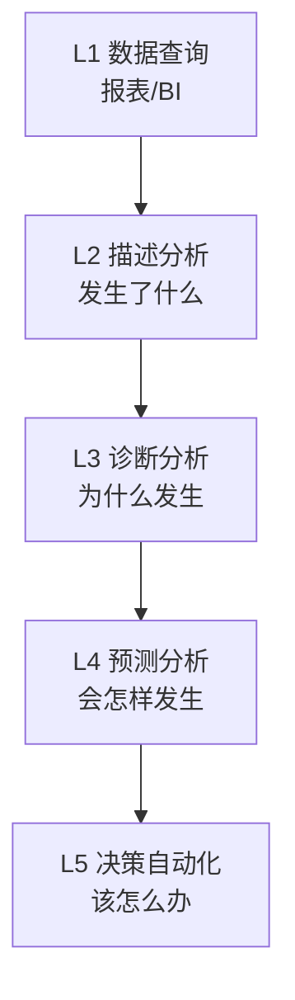
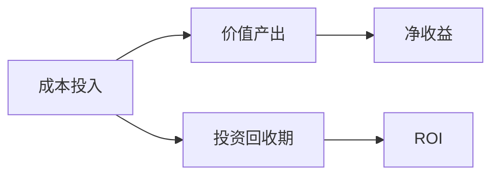

# 第 26 章 智能制造

> **本章核心问题**：智能制造不只是"自动化升级"，而是把生产、运营、决策的全过程智能化。一线工程师怎么理解智能制造在化工行业的落地路径与价值边界？
>
> **学习目标**：
> 1. 能区分智能制造与自动化、信息化、数字化的差异。
> 2. 能搭建智能工厂的六大系统架构。
> 3. 能在车间开展 MES、APC、DCS 优化的实施工作。

## 开篇引子

某大型化工集团推进"灯塔工厂"建设，3 年内累计投入 15 亿元建设智能制造系统；同期某中型化工厂投资 2 亿做了 MES + 部分 APC，整体单位产品成本下降 3-5%。两组企业的差别在哪？智能制造的本质不是"上系统"而是"重塑生产运营体系"。本章聚焦化工智能制造的六大系统——工业互联网、MES、APC、DCS 优化、预测维护、智能决策。

## 26.1 智能制造的五层架构

### 核心问题

智能制造与传统自动化的本质区别是什么？

### 方法与工具

**智能制造的"五层金字塔"**：

**图 26-1 智能制造五层金字塔**

**自动化、信息化、数字化、智能化的差异**：

| 维度 | 自动化 | 信息化 | 数字化 | 智能化 |
|---|---|---|---|---|
| **核心** | 设备替代人工 | 数据电子化 | 数据流通融合 | 数据驱动决策 |
| **典型工具** | PLC、DCS | ERP、OA | 数字孪生、工业互联网 | AI、大模型 |
| **决策方式** | 人工决策 | 人工决策 | 人工决策 | 部分机器决策 |
| **价值** | 提升效率 | 提升效率、规范流程 | 提升效率、改善决策 | 重塑业务模式 |

**化工智能制造的"四个特殊性"**：

1. **连续性强**：化工流程多为连续生产，难以停机升级。
2. **安全性高**：安全要求严，智能系统必须具备失效保护。
3. **强非线性**：反应、传质、传热耦合复杂，数学建模难。
4. **价值密度高**：单位产品价值高，智能化 ROI 显著。

**智能制造的"四大目标"**：

**图 26-2 智能制造四大目标**

### 常见坑

1. **"上了 ERP 就是智能制造"**：ERP 只是管理系统，不是智能化。
2. **"无人化 = 智能"**：智能化是"少人化 + 决策智能化"，不是"无人化"。

## 26.2 工业互联网平台

### 核心问题

工业互联网平台在化工智能制造中扮演什么角色？

### 方法与工具

**工业互联网平台的三层架构**：

**图 26-3 工业互联网平台架构**

**化工行业工业互联网平台的"六个能力"**：

| 能力 | 内容 |
|---|---|
| **设备接入** | 接入 DCS、PLC、仪表、智能传感器 |
| **数据治理** | 数据清洗、归一化、时序对齐 |
| **模型管理** | 机理模型 / 机器学习模型版本管理 |
| **应用编排** | 可视化搭建业务流程 |
| **安全合规** | 网络安全、数据安全（等保 2.0） |
| **生态对接** | 第三方应用接入、上下游协同 |

**主流工业互联网平台**：

| 平台 | 类型 | 化工适用 |
|---|---|---|
| **根云（树根互联）** | 国内头部 | 设备运维 |
| **COSMOPlat（海尔）** | 国内头部 | 大型化工 |
| **石化智云（中国石化）** | 行业专用 | 大型炼化 |
| **Predix（GE）** | 国外通用 | 设备数字孪生 |
| **Siemens MindSphere** | 国外通用 | 工厂一体化 |
| **Honeywell Forge** | 国外通用 | 炼化深度集成 |

**化工工业互联网的"五个应用场景"**：

1. 装置运行监控：实时可视化、异常预警。
2. 设备预测维护：基于振动、温度的故障预警。
3. 工艺参数优化：全厂 RTO + APC 协同。
4. 能耗管理：能源调度优化、碳足迹核算。
5. 供应链协同：从原料到产品的全链路协同。

### 典型化案例

**典型化案例 26-1**（行业公开资料）

- **背景**：某大型化工集团建立"石化工业互联网"，覆盖下属 30+ 家工厂的 200+ 套装置。
- **问题**：下属工厂信息化建设标准不一，数据格式多样，难以集团统一管理。
- **解法**：建设集团级工业互联网平台，统一数据采集标准（OPC UA）、建设集团数据湖、统一模型管理、提供 SaaS 应用市场。
- **结果**：3 年内实现集团级能耗对标、重点装置 APC 覆盖率达 80%、集团年节约能耗成本 5 亿元。
- **启示**：工业互联网必须"集团级统一建设 + 工厂级灵活应用"。

### 常见坑

1. **重平台轻应用**：平台建设投入大但应用稀少，沦为"空架子"。
2. **数据未标准化**：各厂数据格式不统一，平台无法融合。

## 26.3 MES 系统（制造执行系统）

### 核心问题

MES 系统在化工生产中起什么作用？比 DCS 高一级的"管理协同"价值在哪？

### 方法与工具

**MES 与 DCS、ERP 的关系**：

**图 26-4 MES 与 DCS、ERP 关系**

**MES 的"七大核心模块"**（ISA-95 标准）：

1. **资源管理**：人员、设备、物料的可视化。
2. **操作调度**：生产排程、下达生产订单。
3. **详细排产**：装置级短期排产、工序级排程。
4. **生产执行**：生产订单执行、过程记录。
5. **质量管理**：质量检验、SPC、合规追溯。
6. **绩效分析**：OEE、能耗、收率等 KPI 分析。
7. **文档管理**：工艺文件、作业指导书的电子化。

**化工 MES 的特殊要求**：

- **批次管理**：批次号贯穿原料、生产、检验、放行。
- **SPC 集成**：与在线/离线质量数据集成。
- **HSE 集成**：与隐患排查、应急响应集成。
- **能源管理**：水、电、气、蒸汽的实时计量。
- **配方管理**：产品配方的版本化管理。

**MES 选型的"五条原则"**：

1. **行业经验**：优先选有化工行业 MES 案例的供应商。
2. **集成能力**：能与 DCS、ERP、LIMS、SCM 集成。
3. **可配置性**：业务变化时能快速配置而非二次开发。
4. **移动化**：支持车间移动终端（PAD、手机）。
5. **数据开放**：支持自有 BI / 数据分析工具接入。

### 典型化案例

**典型化案例 26-2**（行业公开资料）

- **背景**：某大型精细化工厂建设 MES，3 年内投资 2 亿元。
- **问题**：实施前生产订单执行靠 Excel + 微信群，质量数据靠纸质记录，跨部门协同效率低。
- **解法**：建设 MES，覆盖订单、排产、生产执行、质量、能源、设备六大模块；与 DCS、LIMS、ERP 全集成。
- **结果**：订单交付周期缩短 30%、质量追溯时间从 4 h 缩短至 15 min、综合能耗下降 5%。
- **启示**：MES 的核心价值是"打通数据链 + 重塑业务流"，而非"线上化"。

### 常见坑

1. **MES = 报表系统**：把 MES 当报表系统用，未实现生产执行管控。
2. **MES 与 DCS 未集成**：数据孤岛，MES 看不懂装置运行细节。

## 26.4 APC 先进控制

### 核心问题

APC 与 DCS 传统控制有什么区别？APC 怎么提升化工装置的控制品质？

### 方法与工具

**APC（Advanced Process Control）的"三层定位"**：

**图 26-5 基础控制-先进控制-实时优化**

**APC 与 DCS 传统控制的对比**：

| 维度 | DCS 传统控制 | APC 先进控制 |
|---|---|---|
| 控制结构 | 单回路 | 多变量耦合 |
| 模型形式 | PID | MPC（模型预测控制） |
| 约束处理 | 报警停车 | 软约束 + 卡边控制 |
| 平稳度 | ±2-5% | ±0.5-1% |
| 典型收益 | 基准 | 收率 +1-3%、能耗 -3-10% |

**MPC（Model Predictive Control）的核心逻辑**：

**图 26-6 MPC 滚动优化**

**化工 APC 的"五大应用场景"**：

1. **精馏塔**：多变量约束控制，提升产品质量卡边能力。
2. **反应器**：温度/压力/进料协同控制，提升选择性。
3. **裂解炉**：炉膛温度平衡控制，提升收率。
4. **换热网络**：基于热量平衡的网络优化。
5. **公用工程**：蒸汽、制冷、循环水协同优化。

**APC 项目的"六个阶段"**：

1. 可行性论证（3-6 月）：选装置、估收益。
2. 阶跃测试（2-4 月）：获取装置动态特性。
3. 模型辨识（1-2 月）：建立 MPC 模型。
4. 控制器设计（2-3 月）：约束、权重、调优。
5. 仿真测试（1-2 月）：离/在线仿真。
6. 投运与维护（长期）：投运、性能跟踪、模型更新。

### 常见坑

1. **装置波动大、强非线性**：不适宜直接上 APC，应先做基础控制改善。
2. **APC 投运后无维护**：装置特性变化后模型失效，APC 失效。

## 26.5 DCS 优化与预测性维护

### 核心问题

传统 DCS 怎么升级到"智能化"？预测性维护如何落地？

### 方法与工具

**DCS 优化的"四个方向"**：

| 方向 | 内容 |
|---|---|
| **硬件升级** | 控制器升级、网络升级、I/O 扩展 |
| **控制系统升级** | 软件版本升级、新功能启用 |
| **通信升级** | OPC UA、工业以太网标准化 |
| **集成升级** | 与 APC、MES、工业互联网集成 |

**新一代 DCS 的"六大特征"**：

1. **虚拟化**：服务器虚拟化部署。
2. **移动化**：PAD/手机访问现场数据。
3. **智能化**：内置设备诊断、工艺异常检测。
4. **开放化**：标准 API、跨系统集成。
5. **云化**：云端部署 + 边缘协同。
6. **网络安全化**：满足等保 2.0、网络安全法。

**预测性维护的"五大类设备"**：

| 设备类型 | 监测参数 | 故障预警 |
|---|---|---|
| **旋转设备（泵/压缩机）** | 振动、温度、油液 | 轴承、密封、平衡故障 |
| **静止设备（换热器/塔器）** | 压力、温度、流量、腐蚀 | 堵塞、泄漏、结垢 |
| **电气设备（电机/变压器）** | 电流、电压、温度、局放 | 绝缘老化、过载 |
| **仪表设备** | 信号稳定性、校验偏差 | 漂移、失准 |
| **特种设备（安全阀）** | 启动压力、密封性 | 卡阻、泄漏 |

**预测性维护的"五个步骤"**：

1. **数据采集**：振动、温度、电流等传感器数据。
2. **数据预处理**：去噪、特征提取、对齐。
3. **模型训练**：基于历史故障数据训练 ML 模型。
4. **在线预测**：实时监测、异常告警。
5. **维护执行**：基于预测结果安排检修。

### 常见坑

1. **DCS 升级按"最新最贵"选**：未评估装置实际需求，造成过度投资。
2. **预测性维护只装传感器**：忽视数据治理和模型训练，沦为"数据采集器"。

## 26.6 智能决策与运营管理

### 核心问题

智能决策在化工运营中如何落地？AI 决策与人决策如何分工？

### 方法与工具

**智能决策的"五个层级"**：

**图 26-7 智能决策成熟度五级**

**化工智能决策的"五大应用场景"**：

| 场景 | 决策类型 | 价值 |
|---|---|---|
| **生产调度** | 当日/周生产计划优化 | 提升产能利用率 2-5% |
| **能源调度** | 蒸汽/电力/燃料协同 | 降低能耗成本 3-8% |
| **原料采购** | 价格预测 + 库存优化 | 降低采购成本 2-5% |
| **装置开停车** | 工艺路径 + 操作时序 | 减少开停车时间 10-20% |
| **供应链协同** | 上下游协同优化 | 降低库存 + 提升响应速度 |

**人机决策的"三原则"**：

1. **AI 建议、人决策**：重大决策由人拍板，AI 提供参考。
2. **AI 执行、人监控**：重复性高、规则明确的由 AI 执行，人抽检。
3. **AI 报警、人响应**：异常场景 AI 报警，人介入分析。

**AI 决策的"五个边界"**：

| 不能让 AI 决策的场景 | 原因 |
|---|---|
| 涉及重大安全事件（停产、撤离） | 人身安全不可逆 |
| 涉及合规与法律问题 | 法律主体责任 |
| 涉及商业机密决策 | 商业风险 |
| 涉及外部利益相关方 | 社会影响 |
| 涉及企业战略方向 | 战略不确定性 |

**化工智能制造的"ROI 测算"**：

**图 26-8 智能制造 ROI 测算框架**

ROI 测算的典型输入：

- 系统建设投入：500-3000 万元（含硬件、软件、实施）。
- 年化运维成本：建设投入的 10-20%。
- 年化价值收益：能耗下降 + 收率提升 + 人工节约 + 维护节约。

**某案例的 ROI 测算**：

| 项目 | 金额 |
|---|---|
| 系统建设投入 | 2000 万 |
| 年化运维成本 | 300 万 |
| 年化能耗下降收益 | 800 万 |
| 年化收率提升收益 | 600 万 |
| 年化人工节约收益 | 200 万 |
| 年化总收益 | 1600 万 |
| 投资回收期 | 1.5 年 |
| 5 年 ROI | 250% |

### 常见坑

1. **AI 决策盲目信任**：把不可逆决策交给 AI，导致重大损失。
2. **ROI 严重高估**：以"理论上限"作为预期收益，验收时落空。

---

## 本章小结

回到本章开篇"投入 2 亿做 MES 能带来 3-5% 成本下降"的案例，化工智能制造的方法论可以归纳为六条：

1. **智能制造的五层金字塔**：设备层（传感）→ 执行层（PLC）→ 控制层（APC/DCS）→ 管理层（MES）→ 决策层（AI）。
2. **工业互联网平台三层架构**：边缘层（数据采集）→ 平台层（数据治理）→ 应用层（SaaS）；六个核心能力。
3. **MES 的七大模块**：资源、操作调度、详细排产、生产执行、质量管理、绩效分析、文档管理；化工五大特殊要求。
4. **APC 与 DCS 的差异**：多变量耦合、卡边控制、平稳度更高；典型收益：收率 +1-3%、能耗 -3-10%；六阶段实施方法。
5. **DCS 优化四方向**：硬件、控制软件、通信、集成；预测性维护五大设备类型与五步法。
6. **智能决策的五个层级**：查询 → 描述 → 诊断 → 预测 → 决策自动化；化工五大应用场景、AI 决策的五个边界。

第九篇开始，我们用四大类典型案例，把前 26 章的方法论落地到具体场景——新产品开发、工艺优化、装备创新、工业化案例。

## 思考题

1. 为一个你熟悉的化工装置设计 MES 系统架构图（含七大模块）。
2. 选一个反应器，分析其适合 APC 的关键被控变量与操纵变量。
3. 列出 5 项适合做预测性维护的设备，写出每项的关键监测参数。
4. 设计一个化工生产调度的 AI 辅助决策框架（含数据、模型、决策机制）。
5. 为你所在企业做一份"智能制造三年路线图"，分阶段、分价值场景。

## 参考文献

[1] 国家发改委, 工业和信息化部. 关于加快推动"工业互联网 + 化工"发展的指导意见[Z]. 2023.
[2] 工业和信息化部. 智能制造发展规划（2025）[Z]. 2021.
[3] 国务院. 深化"互联网 + 先进制造业"发展工业互联网的指导意见[Z]. 2017.
[4] ISA. ANSI/ISA-95 Enterprise-Control System Integration Standard[S]. 2023.
[5] 张亚强 等. 化工智能制造发展现状与趋势[J]. 化工进展, 2024, 43(1): 1-15.
[6] 王立明 等. 化工 APC 先进控制实施方法[J]. 现代化工, 2023, 43(9): 25-30.
[7] Aspen Technology. DMCplus Advanced Process Control[R]. 2023.
[8] 周明 等. 化工 MES 系统实施方法论[J]. 现代化工, 2024, 44(4): 30-35.
[9] Honeywell. Honeywell Forge Industrial AI Solutions[R]. 2023.
[10] 刘伟 等. 化工智能工厂建设的路径与实践[J]. 化工进展, 2024, 43(5): 2000-2010.

> **注**：参考文献中部分期刊文献的作者与页码为示意性占位，正式出版前需通过 CNKI、Web of Science 等数据库核实补全。