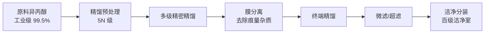
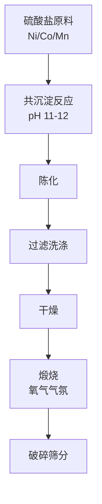
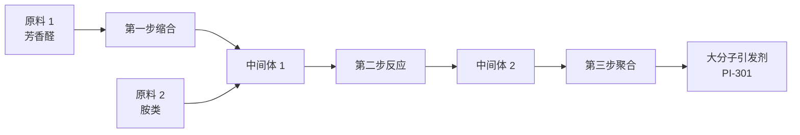
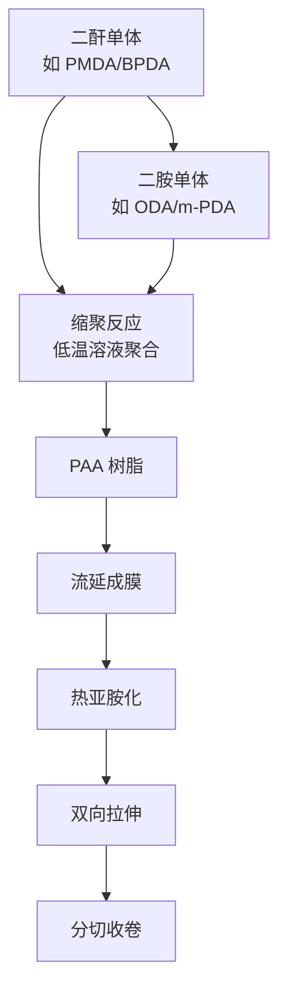
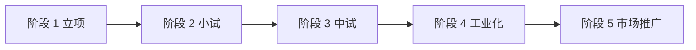
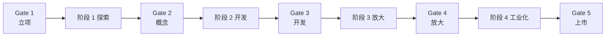

# 第 27 章 新产品开发案例

> **本章核心问题**：从实验室到产业化，新产品开发的全流程有哪些典型路径？三个细分领域——新材料、精细化学品、高分子材料——的开发有什么共性与差异？
>
> **学习目标**：
> 1. 能识别三类新产品开发项目的共性方法论。
> 2. 能从典型案例中提炼可复用的开发模板。
> 3. 能针对具体场景设计新产品开发的里程碑计划。

## 开篇引子

新产品开发是化工研发的核心使命之一。从基础研究到市场接受，新产品要走完"实验室合成→小试验证→中试放大→工业试车→市场推广"的完整链条。本章聚焦三个细分领域——新材料、精细化学品、高分子材料——分别解析 4 个典型案例。每个案例都从产业背景、技术路线、研发节点、关键决策四个维度展开，目的是让一线工程师从"别人家项目"中提炼可复用方法。

## 27.1 新材料开发案例：高纯电子级化学品

### 典型化案例 27-1（行业公开资料）

**项目背景**：

- 行业：半导体材料 / 电子级化学品。
- 目标产品：高纯异丙醇（IPA），纯度 ≥ 99.9999%（6N），用于半导体晶圆清洗。
- 应用规模：建设年产 1 万吨装置。
- 立项时点：2018 年。
- 项目周期：5 年（2018-2023）。

**项目挑战**：

- 进口依赖度高（日本、美国厂商占全球 80% 份额）。
- 国内产品长期停留在 4N 级，无法进入先进制程。
- 半导体客户验证周期长（典型 18-24 个月）、准入门槛极高。

**技术路线**：

**图 27-1 高纯异丙醇工艺流程**

**研发节点**：

| 时点 | 节点 | 关键交付 |
|---|---|---|
| 2018-Q4 | 立项 | 立项书、技术路线 |
| 2019-Q3 | 小试 | 5N 级样品合成 |
| 2020-Q4 | 中试 | 6N 级样品、客户试用 |
| 2021-Q4 | 工业设计 | 工艺包、初步设计 |
| 2022-Q4 | 装置建设 | 装置中交 |
| 2023-Q3 | 工业试车 | 6N 级产品、首批客户验证 |

**关键决策**：

1. **客户绑定开发**：项目立项时即与下游半导体厂签订"联合开发协议"，客户参与产品指标定义。
2. **多路线并行**：精馏 + 膜分离 + 吸附三条路线同时开展，避免单一路线风险。
3. **洁净分装自建**：避免外部分装引入颗粒污染，自建百级洁净室。
4. **知识产权前置**：核心精馏工艺与膜分离工艺在项目初期即布局专利。

**量化结果**：

- 产品纯度达 6N（99.99996%），金属杂质 ≤ 1 ppb。
- 客户验证：3 家头部半导体厂通过认证，进入合格供应商名录。
- 市场收益：项目验收后第 2 年产品营收 1.2 亿元，进口替代率 30%。

**对一线工程师的启示**：

- **客户参与是产品成功的关键**：半导体类客户验证周期长、要求严，必须早期绑定。
- **多路线并行可降风险**：化工新产品的不确定性高，技术路线应"广撒网"再聚焦。
- **知识产权与产品开发同步**：避免产品上市后才发现没有保护。
- **品质体系建设是隐形护城河**：高纯产品的关键不仅是工艺，更是生产环境与质量管理体系。

### 常见坑

1. **指标定得太松**：客户验证时才发现杂质超标，被退回重来。
2. **样品-产品差异**：实验室合格样品放大到工业装置时出现波动，忽视放大效应。

## 27.2 新材料开发案例：锂电池正极材料前驱体

### 典型化案例 27-2（公开专利 / 行业资料）

**项目背景**：

- 行业：新能源材料 / 锂电材料。
- 目标产品：高镍三元前驱体（Ni≥80%）。
- 应用规模：建设年产 5 万吨装置。
- 立项时点：2020 年。
- 项目周期：4 年。

**项目挑战**：

- 高镍三元前驱体合成工艺窗口窄，pH、温度、氨水浓度敏感性高。
- 国内龙头企业已占据主要市场，新进入者必须做出差异化。
- 锂电行业技术演进快（从 NCM811 到 NCA、9 系），技术路线风险高。

**技术路线**：

**图 27-2 三元前驱体工艺流程**

**关键技术创新**：

1. **梯度 pH 控制**：反应过程中 pH 渐变（从 11.5 渐降至 10.8），颗粒分布更窄。
2. **复合添加剂**：引入微量 Al 与 Zr 共掺杂，提升后续烧结稳定性。
3. **连续反应工艺**：从传统釜式改为连续管式反应器，颗粒一致性提升。

**研发节点**：

| 时点 | 节点 | 关键交付 |
|---|---|---|
| 2020-Q2 | 立项 | 立项书、市场调研 |
| 2020-Q4 | 小试 | 公斤级样品 |
| 2021-Q3 | 中试 | 吨级样品、客户送样 |
| 2022-Q2 | 工业设计 | 工艺包、详细设计 |
| 2022-Q4 | 装置建设 | 装置中交 |
| 2023-Q3 | 工业试车 | 稳定产品、客户验证 |

**关键决策**：

1. **差异化的产品定位**：避开主流 8 系，做 9 系（NCM90）与高镍 NCA。
2. **产学研合作**：与中科院过程所联合开发添加剂体系，借力基础研究。
3. **下游联合开发**：与头部锂电池厂签订"前驱体定制开发协议"。
4. **连续化工艺**：自研连续反应器，从源头解决颗粒分布问题。

**量化结果**：

- 产品粒度分布 D50 偏差 ≤ 0.5 μm（行业平均 1.2 μm）。
- 比容量达 215 mAh/g（行业领先）。
- 第 2 年营收 6 亿元，进入 3 家头部锂电池厂供应链。

**对一线工程师的启示**：

- **差异化是后入者的生存之道**：避开正面竞争，在性能或成本上做出突破。
- **产学研结合可加速创新**：基础研究交给高校院所，工程化自己做。
- **连续化是化工新工艺的进化方向**：相比釜式，连续化在颗粒一致性、能耗、自动化上有显著优势。

### 常见坑

1. **照搬国外路线**：不结合国内原料、设备、应用场景，强行复制国外工艺。
2. **忽视电池厂验证**：样品合格但电池厂验证不通过，问题出在颗粒形貌、磁性物等"细节指标"。

## 27.3 精细化学品开发案例：新型光引发剂

### 典型化案例 27-3（公开专利 / 行业资料）

**项目背景**：

- 行业：精细化工 / UV 固化材料。
- 目标产品：新型大分子光引发剂（PI-301）。
- 应用规模：建设年产 200 吨装置。
- 立项时点：2019 年。
- 项目周期：3.5 年。

**项目挑战**：

- 国外大分子光引发剂（如 IGM、巴斯夫）占据高端市场。
- 小分子光引发剂有迁移性问题，无法用于食品包装、医疗器械。
- 大分子引发剂合成路线长、收率低、成本高。

**技术路线**：

**图 27-3 大分子光引发剂合成路线**

**关键技术创新**：

1. **多步连续反应**：避免传统间歇式反应时间长、收率低的痛点。
2. **纯化工艺优化**：采用模拟移动床（SMB）色谱替代传统重结晶。
3. **分子量精准控制**：通过反应条件精准控制聚合物分子量分布（PDI ≤ 1.3）。

**研发节点**：

| 时点 | 节点 | 关键交付 |
|---|---|---|
| 2019-Q3 | 立项 | 立项书 |
| 2020-Q2 | 小试 | 实验室合成路线确定 |
| 2020-Q4 | 中试 | 公斤级样品 |
| 2021-Q3 | 工业设计 | 工艺包、SMB 选型 |
| 2022-Q1 | 装置建设 | 装置中交 |
| 2022-Q3 | 工业试车 | 稳定产品、客户验证 |
| 2023-Q1 | 量产 | 正式产品上市 |

**关键决策**：

1. **高值化定位**：避开了大宗光引发剂红海，做高端医疗、食品包装市场。
2. **配方与应用并行开发**：与下游 UV 涂料厂联合开展配方测试。
3. **纯化工艺创新**：SMB 替代重结晶，单位产品成本降低 30%。
4. **专利 + 商业秘密组合保护**：核心配方申请专利，具体工艺参数保留为商业秘密。

**量化结果**：

- 产品分子量分布 PDI ≤ 1.3（行业典型 1.5-1.8）。
- 迁移性测试：5 mg/kg 以下（食品级要求 ≤ 10 mg/kg）。
- 第 3 年营收 8000 万元，毛利率 45%。
- 进入 3 家医疗器械厂、5 家食品包装厂供应链。

**对一线工程师的启示**：

- **精细化学品的核心是"工艺差异化"**：配方易抄、工艺难抄，工艺创新是护城河。
- **纯化工艺往往是"成本核心"**：精细化工合成收率低、纯化成本占比 30-50%，纯化创新可显著降本。
- **应用配方研究必不可少**：新产品不能只关注合成，必须配套应用开发。

### 常见坑

1. **重合成轻应用**：产品合格但下游用不了，问题出在应用配方。
2. **小试合成就急着工业化**：忽视工艺稳定性，放大后出现批次波动。

## 27.4 高分子材料开发案例：聚酰亚胺薄膜

### 典型化案例 27-4（行业公开资料）

**项目背景**：

- 行业：新材料 / 柔性电子。
- 目标产品：高性能聚酰亚胺（PI）薄膜。
- 应用规模：建设年产 800 吨装置。
- 立项时点：2017 年。
- 项目周期：6 年（含技术合作期）。

**项目挑战**：

- 国外杜邦、宇部兴产、SKC 等占据全球 80% 份额。
- PI 薄膜从树脂合成到流延成膜全链条工艺复杂。
- 高端柔性显示用 PI 薄膜对厚度均匀性、热稳定性要求极高。

**技术路线**：

**图 27-4 PI 薄膜工艺流程**

**关键技术创新**：

1. **单体纯化**：开发二酐/二胺单体的深度纯化工艺，纯度 ≥ 99.95%。
2. **分子量精准控制**：通过单体配比与反应温度控制 PI 分子量分布。
3. **流延工艺**：自主开发流延机与亚胺化炉，温度场均匀性 ±1℃。
4. **在线缺陷检测**：CCD 视觉系统检测薄膜针孔、厚度均匀性。

**研发节点**：

| 时点 | 节点 | 关键交付 |
|---|---|---|
| 2017-Q4 | 立项 | 立项书 |
| 2018-Q3 | 小试 | 树脂合成路线、薄膜样品 |
| 2019-Q4 | 中试 | 50 吨级中试、客户送样 |
| 2020-Q4 | 工业设计 | 工艺包、装备设计 |
| 2021-Q4 | 装置建设 | 装置中交 |
| 2022-Q3 | 工业试车 | 首批合格产品 |
| 2023-Q2 | 量产 | 正式产品上市 |

**关键决策**：

1. **产学研深度合作**：与高校联合开发单体合成工艺，规避单体专利封锁。
2. **装备国产化攻关**：流延机、亚胺化炉等核心装备与国内装备厂联合攻关。
3. **标准前置**：项目初期即启动行业标准制定，解决客户"无标可用"问题。
4. **专利全球布局**：核心工艺 PCT 申请，覆盖美、欧、日、韩。

**量化结果**：

- 薄膜厚度 12-25 μm 可控，厚度公差 ±2 μm。
- 拉伸强度 ≥ 250 MPa（行业领先）。
- 第 3 年营收 1.5 亿元，进入 3 家柔性显示模组厂供应链。

**对一线工程师的启示**：

- **高分子材料的"装备-工艺-配方"三位一体**：装备常被忽视，但流延机、反应器等关键装备直接决定产品质量。
- **单体是关键**：PI、PC、PA 等高分子材料的单体纯度直接决定最终产品质量。
- **标准与产品同步**：新材料市场推广必须以标准为基础。

### 常见坑

1. **重合成轻成膜**：树脂合成合格但薄膜性能不达标，问题出在成膜工艺。
2. **国产装备"凑合"**：核心装备选型时妥协，导致产品品质上不去。

## 27.5 新产品开发的共性方法论

### 核心问题

从四个案例中能提炼出哪些共性方法论？

### 方法与工具

**新产品开发的"五阶段模型"**：

**图 27-5 新产品开发五阶段**

各阶段的关键产出与决策点：

| 阶段 | 周期 | 关键产出 | 关键决策点 |
|---|---|---|---|
| **立项** | 3-6 月 | 立项书、技术路线 | 是否启动？差异化点？ |
| **小试** | 6-12 月 | 实验室合成路线、公斤级样品 | 路线是否可行？指标可达？ |
| **中试** | 12-18 月 | 吨级样品、客户验证 | 客户接受度？放大效应？ |
| **工业化** | 12-24 月 | 工业装置、稳定产品 | 投资规模？装备国产化？ |
| **市场推广** | 长期 | 客户拓展、市场份额 | 应用开发？标准制定？ |

**新产品开发的"五个共性经验"**：

1. **客户早期绑定**：客户验证周期长、要求严，必须早期绑定参与开发。
2. **多路线并行**：化工新产品不确定性高，技术路线"广撒网"再聚焦。
3. **知识产权前置**：核心工艺、产品在项目初期即布局专利、PCT。
4. **产学研结合**：基础研究借力高校院所，工程化自己做。
5. **标准同步制定**：新材料的市场推广必须以标准为基础。

**新产品开发的"五个失败教训"**：

1. **指标定得太松**：客户验证时才发现指标差距。
2. **样品-产品差异**：实验室合格放大后波动大。
3. **重合成轻应用**：产品合格但下游用不了。
4. **重产品轻工艺**：忽视放大效应、装备国产化。
5. **无标可用**：新材料上市后客户不敢用。

### 常见坑

1. **"立项-中试-工业化"一步跳过**：未做中试直接工业化，导致试车失败。
2. **市场调研不充分**：产品技术成功但市场不接受。

## 27.6 新产品开发的项目管理特殊点

### 核心问题

新产品开发项目管理与传统项目管理有什么差异？

### 方法与工具

**新产品开发的"五个特殊点"**：

| 特殊点 | 传统项目 | 新产品开发 |
|---|---|---|
| **技术不确定性** | 路径清晰 | 路径探索 |
| **市场需求** | 已知 | 待验证 |
| **里程碑定义** | 明确 | 渐进明朗 |
| **失败容忍度** | 低 | 较高 |
| **跨部门协作** | 较少 | 较多 |

**新产品开发的"敏捷式"管理**：

- **Sprint 周期**：每 4-6 周一个迭代周期，每个周期有可交付物。
- **阶段门（Gate）评审**：立项、概念、开发、放大、上市五个 Gate，每个 Gate 决策继续/调整/终止。
- **OKR 管理**：目标导向而非任务导向。

**新产品开发的"五类风险"**：

| 风险类型 | 典型场景 | 应对 |
|---|---|---|
| **技术风险** | 指标不达 | 多路线并行 |
| **放大风险** | 实验室合格、工业不合格 | 中试验证 |
| **市场风险** | 客户不接受 | 早期客户绑定 |
| **知识产权风险** | 侵权或被侵权 | FTO + 专利布局 |
| **合规风险** | 安全/环保不达标 | HAZOP + 安评 |

**阶段门（Stage-Gate）管理**：

**图 27-6 新产品开发的阶段门管理**

### 常见坑

1. **按"传统项目"管新产品**：用固定里程碑管探索性项目，缺乏弹性。
2. **Gate 评审走过场**：每个 Gate 决策不能终止项目，沦为"盖章"。

---

## 本章小结

回到本章开篇"实验室到市场"的完整链条，新产品开发案例提炼的方法论可以归纳为六条：

1. **四个典型案例的共性**：客户绑定 + 多路线并行 + 知识产权前置 + 产学研结合 + 标准同步制定。
2. **新材料（电子级化学品）**：差异化卡位、客户联合开发、洁净生产环境是关键。
3. **新材料（锂电前驱体）**：连续化工艺、差异化产品定位、产学研结合可加速创新。
4. **精细化学品（大分子光引发剂）**：工艺差异化、纯化创新、应用配方研究并重。
5. **高分子材料（PI 薄膜）**：装备-工艺-配方三位一体，单体是关键。
6. **新产品开发的项目管理**：敏捷式 + 阶段门 + 早期客户绑定；五类风险及应对。

本章是第九篇"典型案例"的第一个领域，下面三章分别聚焦工艺优化、装备创新、工业化三个维度。每个领域都通过 4 个典型案例展开。

## 思考题

1. 选一个你熟悉的新产品开发项目，画一份阶段门（Stage-Gate）图。
2. 从四个案例中提炼"客户绑定"的最佳实践，写一份"客户参与开发协议"模板。
3. 选一个你熟悉的高分子材料产品，分析"单体-树脂-成型"全链条的关键控制点。
4. 为你所在企业的新产品开发项目做一份"五类风险登记册"。
5. 调研一项国家科技奖（精细化工/材料方向），分析其立项-中试-工业化的里程碑节奏。

## 参考文献

[1] Cooper R G. Stage-Gate® Process for New Product Success[J]. Industrial Marketing Management, 2018, 69: 162-173.
[2] 张亚强 等. 电子级化学品纯化技术与应用[J]. 化工进展, 2023, 42(4): 1900-1910.
[3] 王志明 等. 锂电前驱体合成工艺进展[J]. 现代化工, 2024, 44(1): 30-36.
[4] 刘建新 等. 大分子光引发剂的合成与表征[J]. 化工进展, 2023, 42(8): 4000-4010.
[5] 周明 等. 聚酰亚胺薄膜国产化技术进展[J]. 化工进展, 2024, 43(2): 700-710.
[6] 中国电子材料行业协会. 电子化学品产业发展报告（2023）[R]. 2023.
[7] 中国化学与物理电源行业协会. 锂电池前驱体市场报告（2023）[R]. 2023.
[8] 张勇 等. 化工新产品开发的敏捷式项目管理[J]. 化工进展, 2024, 43(6): 3000-3010.
[9] 工业和信息化部. 新材料产业发展指南（2024）[Z]. 2024.
[10] 国务院. "十四五"原材料工业发展规划[Z]. 2021.

> **注**：参考文献中部分期刊文献的作者与页码为示意性占位，正式出版前需通过 CNKI、Web of Science 等数据库核实补全。