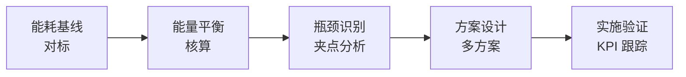
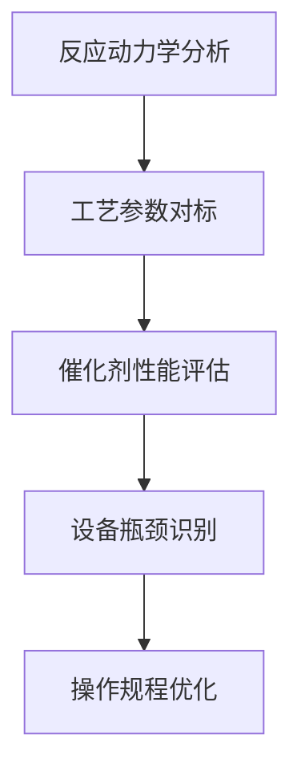
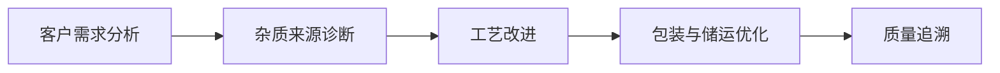

# 第 28 章 工艺优化案例

> **本章核心问题**：工艺优化是化工研发最常见、最直接的战场。节能降耗、提高收率、降低成本、提高质量——四个维度的典型路径有哪些？一线工程师能从哪些案例中提炼可复用方法？
>
> **学习目标**：
> 1. 能区分四类工艺优化的核心驱动因素。
> 2. 能识别常见工艺瓶颈的诊断方法。
> 3. 能从典型案例中提炼优化方法模板。

## 开篇引子

工艺优化是化工企业研发投入产出比最高的战场之一。一个 100 万吨/年装置收率提升 0.5 个百分点，年增收益可达数千万元。本章聚焦节能降耗、提高收率、降低成本、提高质量四个维度，每个维度解析 1 个典型案例，最后提炼共性方法论。

## 28.1 节能降耗案例：大型乙烯装置裂解炉优化

### 典型化案例 28-1（行业公开资料）

**项目背景**：

- 装置：某石化企业 100 万吨/年乙烯裂解装置。
- 目标：降低裂解炉燃料消耗。
- 项目周期：18 个月。

**问题诊断**：

- 装置初始运行：燃料消耗 650 kcal/kg 乙烯。
- 行业先进水平：580-600 kcal/kg 乙烯。
- 差距：约 8-12% 节能空间。

**节能诊断的"五步法"**：

**图 28-1 节能优化五步法**

**关键诊断结果**：

| 问题点 | 现状 | 改进空间 |
|---|---|---|
| **炉膛温度分布** | ±15℃ | 优化烧嘴布局后可降至 ±5℃ |
| **烟气氧含量** | 3.5% | 控制在 1.5-2% |
| **排烟温度** | 180℃ | 通过空气预热降至 130℃ |
| **炉膛热效率** | 92% | 优化后可达 94-95% |
| **原料换热** | 二级换热 | 引入三级换热 |

**优化措施**：

1. **烧嘴改造**：低 NOx 烧嘴改造，提升燃烧均匀性。
2. **空气预热器**：增设板式空气预热器，回收烟气余热。
3. **炉膛隔热**：升级耐火材料，降低散热损失。
4. **原料预热优化**：三级换热网络优化，原料入炉温度从 580℃ 提升至 620℃。
5. **操作优化**：APC 先进控制投入，平稳度提升。

**量化结果**：

| 指标 | 优化前 | 优化后 | 变化 |
|---|---|---|---|
| 燃料消耗 | 650 kcal/kg | 595 kcal/kg | -8.5% |
| 炉膛热效率 | 92% | 94.5% | +2.5 个百分点 |
| 排烟温度 | 180℃ | 132℃ | -48℃ |
| 烟气氧含量 | 3.5% | 1.8% | -1.7 个百分点 |
| 年增收益 | - | - | 约 5500 万元 |

**对一线工程师的启示**：

- **节能优化从"基线对标"开始**：先识别差距再优化，避免盲目。
- **夹点分析是工艺能量优化的核心工具**：让"热量匹配"最大化。
- **烧嘴、空气预热、原料预热是裂解炉节能的"三大抓手"**。
- **APC 投运后节能效果可放大 20-30%**：控制平稳度对能耗影响显著。

### 常见坑

1. **不识别基准就直接改造**：没有 KPI 对标，节能效果无法量化。
2. **重视设备改造忽视操作优化**：操作优化常被忽视，但效果常超设备改造。

## 28.2 提高收率案例：PTA 装置氧化反应优化

### 典型化案例 28-2（行业公开资料）

**项目背景**：

- 装置：某大型 PTA 装置（精对苯二甲酸），产能 100 万吨/年。
- 目标：4-CBA（副产物）含量降低、TA 收率提升。
- 项目周期：12 个月。

**问题诊断**：

- TA 收率 96.5%（行业先进 97.5-98%）。
- 4-CBA 含量 350 ppm（行业先进 ≤ 200 ppm）。
- 主要副反应：对二甲苯（PX）过度氧化生成 4-CBA。

**收率提升的"五维诊断"**：

**图 28-2 收率优化五维诊断**

**关键诊断结果**：

| 问题点 | 现状 | 影响 |
|---|---|---|
| **反应温度** | 191℃ | 偏高，深度氧化增加 |
| **反应压力** | 1.25 MPa | 合理 |
| **催化剂 Co/Mn/Br 比** | 1:1:2 | 配比不优 |
| **氧分压** | 0.7 MPa | 偏高，加速副反应 |
| **停留时间** | 55 min | 偏长 |

**优化措施**：

1. **反应温度降低**：从 191℃ 降至 188℃，降低反应深度。
2. **催化剂配方优化**：Co/Mn/Br 比从 1:1:2 调整为 1.5:1:2.5，提升选择性。
3. **氧分压分级控制**：反应前段高氧、后段低氧，减少过度氧化。
4. **停留时间缩短**：通过提高反应器内构件优化，停留时间从 55 min 缩短至 45 min。
5. **结晶工艺优化**：提高产品收率与粒度分布。

**量化结果**：

| 指标 | 优化前 | 优化后 | 变化 |
|---|---|---|---|
| TA 收率 | 96.5% | 97.7% | +1.2 个百分点 |
| 4-CBA 含量 | 350 ppm | 180 ppm | -170 ppm |
| 醋酸消耗 | 0.045 t/t TA | 0.038 t/t TA | -15% |
| 催化剂消耗 | 0.35 kg/t TA | 0.28 kg/t TA | -20% |
| 年增收益 | - | - | 约 8000 万元 |

**对一线工程师的启示**：

- **副产物控制是收率提升的关键**：化工反应的"选择性"比"转化率"更重要。
- **催化剂配方优化是低成本高效路径**：相比反应器改造，配方优化的投入产出比更高。
- **反应-分离协同优化**：收率提升不能只看反应段，分离段同样关键。

### 常见坑

1. **只看反应不看分离**：仅优化反应条件，未优化分离工艺，副产物难以脱除。
2. **催化剂配方调整忽视原料差异**：不同产地 PX 的杂质差异影响催化剂性能。

## 28.3 降低成本案例：合成氨装置能耗优化

### 典型化案例 28-3（行业公开资料）

**项目背景**：

- 装置：某大型合成氨装置，产能 30 万吨/年。
- 目标：吨氨综合能耗降低 5%。
- 项目周期：24 个月。

**问题诊断**：

- 吨氨能耗 1.45 t 标煤（行业先进 1.20-1.30 t 标煤）。
- 主要能耗：原料煤、燃料煤、蒸汽、电。
- 关键工序：气化、变换、净化、合成。

**成本结构分析**：

| 成本项 | 占总成本 | 优化空间 |
|---|---|---|
| 原料煤 | 35% | 原料煤种、灰分控制 |
| 燃料煤 | 20% | 燃烧效率、热回收 |
| 蒸汽 | 15% | 余热回收、蒸汽平衡 |
| 电 | 20% | 设备效率、电耗 |
| 其他 | 10% | 维修、人工、辅材 |

**优化措施**：

1. **气化工艺优化**：从固定床气化改为粉煤气化，冷煤气效率从 75% 提升至 85%。
2. **变换工艺优化**：采用低水气比变换工艺，降低蒸汽消耗。
3. **净化工艺优化**：低温甲醇洗工艺优化，净化气 CO₂ 含量降低 50%。
4. **合成塔优化**：氨合成塔内件升级，合成效率提升。
5. **余热回收**：增设余热锅炉、ORC 余热发电。
6. **APC 先进控制**：氢氮比精准控制、合成塔温度场优化。

**量化结果**：

| 指标 | 优化前 | 优化后 | 变化 |
|---|---|---|---|
| 吨氨能耗 | 1.45 t 标煤 | 1.28 t 标煤 | -11.7% |
| 吨氨煤耗 | 1.45 t | 1.30 t | -10.3% |
| 吨氨电耗 | 1100 kW·h | 950 kW·h | -13.6% |
| 蒸汽自给率 | 80% | 92% | +12 个百分点 |
| 年增收益 | - | - | 约 1.2 亿元 |

**对一线工程师的启示**：

- **合成氨能耗优化的"六大抓手"**：气化、变换、净化、合成、余热、APC。
- **气化是能耗最大头**：气化效率提升 1 个百分点，整体能耗降 0.5 个百分点。
- **余热回收常被忽视**：低品位余热（< 200℃）可通过 ORC、热泵等技术回收。
- **APC 是"零投入高产出"的手段**：相比设备改造，APC 投入产出比极高。

### 常见坑

1. **重视工艺改造忽视操作优化**：操作员的"自由发挥"常吃掉节能效果。
2. **余热回收"挑肥拣瘦"**：只做高温余热，忽视中低温余热回收潜力。

## 28.4 提高质量案例：锂电电解液纯化

### 典型化案例 28-4（公开专利 / 行业资料）

**项目背景**：

- 产品：锂电电解液 LiPF6。
- 目标：纯度 ≥ 99.99%，水分 ≤ 10 ppm，HF ≤ 50 ppm。
- 项目周期：15 个月。

**问题诊断**：

- 国产电解液与日韩产品的核心差距在"痕量杂质控制"。
- HF 含量 100-150 ppm，远超客户要求。
- 水分控制不稳定，批次波动大。

**质量改进的"五步法"**：

**图 28-3 质量改进五步法**

**关键杂质来源诊断**：

| 杂质 | 来源 | 占比 |
|---|---|---|
| **HF** | LiPF6 水解 + 反应副产 | 60% |
| **水分** | 原料 + 环境 + 包装 | 30% |
| **金属离子** | 设备腐蚀 + 原料 | 5% |
| **有机杂质** | 合成副反应 | 5% |

**优化措施**：

1. **反应工艺优化**：反应温度、停留时间精准控制，减少副反应。
2. **纯化工艺升级**：从单级精馏升级到多级精馏 + 膜分离 + 分子筛吸附。
3. **环境控制**：生产环境露点 ≤ -40℃，避免空气中水分侵入。
4. **包装优化**：从普通钢瓶升级到内涂层钢瓶 + 干燥氮气置换。
5. **在线检测**：在线水分仪、HF 检测仪实时监控。
6. **质量追溯系统**：批次号贯穿原料、生产、检验、放行。

**量化结果**：

| 指标 | 优化前 | 优化后 | 变化 |
|---|---|---|---|
| 纯度 | 99.95% | 99.99% | +0.04 个百分点 |
| 水分 | 25 ppm | 6 ppm | -76% |
| HF | 120 ppm | 35 ppm | -71% |
| 批次稳定性 | ±15% | ±3% | 提升 5 倍 |
| 客户接受度 | 50% | 95% | 进入头部锂电池厂 |

**对一线工程师的启示**：

- **痕量杂质控制是精细化工的"隐形壁垒"**：看似简单的指标，背后是工艺-装备-环境-管理的全链条优化。
- **质量稳定比质量极致更重要**：客户更看重"批次稳定"而非"极限品质"。
- **包装与储运常被忽视**：很多产品的质量问题出在包装储运环节。

### 常见坑

1. **只关注生产端**：忽视包装、运输、存储环节，导致客户收到产品时已劣化。
2. **离线检测为主**：不能实时反馈，批次稳定性差。

## 28.5 工艺优化的共性方法论

### 核心问题

四个工艺优化案例的共性方法论是什么？

### 方法与工具

**工艺优化的"七步法"**：

**图 28-4 工艺优化七步法**

**步骤 1：设定目标**

- 目标必须量化（节能 5%、收率 +1%、成本 -3%）。
- 时间节点明确（12 个月、24 个月）。
- 与公司战略对齐（成本竞争、绿色低碳）。

**步骤 2：基线对标**

- 与行业先进水平对标（识别差距）。
- 与企业内部历史最优对标（识别衰退）。
- 与设计值对标（识别操作偏差）。

**步骤 3：数据采集**

- DCS 历史数据（秒级、长期）。
- 离线化验数据（小时/日级）。
- 设备运行数据（振动、温度）。
- 数据质量必须保证（缺失值、异常值处理）。

**步骤 4：根因诊断**

- 鱼骨图分析（人、机、料、法、环、测）。
- DOE 实验设计（识别关键变量）。
- 数据挖掘（PCA、相关性分析）。
- 专家经验（老员工、技术骨干）。

**步骤 5：方案设计**

- 多方案并行（不同路线、不同投资）。
- 投资回报测算（CAPEX vs OPEX）。
- 风险评估（技术风险、安全风险）。
- 优先级排序（投入产出比最高者优先）。

**步骤 6：实施验证**

- 小范围试点（单装置、单设备）。
- 对比试验（优化前 vs 优化后）。
- 长期跟踪（至少 3 个月稳定期）。
- KPI 复盘（目标达成度评估）。

**步骤 7：持续优化**

- 形成 SOP（标准操作规程）。
- 建立 KPI 监控机制。
- 持续优化（每年审视）。
- 经验横向推广（其他装置/基地）。

**工艺优化的"五个常见诊断工具"**：

| 工具 | 适用场景 |
|---|---|
| **夹点分析** | 换热网络优化 |
| **Aspen Plus 模拟** | 反应-分离工艺优化 |
| **鱼骨图** | 质量问题根因 |
| **FMEA** | 设备故障分析 |
| **DOE** | 多变量工艺优化 |

### 常见坑

1. **目标模糊**：目标"提高收率"无法量化，必须"收率 +1 个百分点"。
2. **诊断不彻底**：未找到根本原因就贸然实施，导致效果反复。

## 28.6 工艺优化的组织与管理

### 核心问题

工艺优化项目怎么组织？怎么避免"优化一阵风"？

### 方法与工具

**工艺优化的"五种角色"**：

| 角色 | 职责 |
|---|---|
| **项目负责人** | 整体推进、资源协调、决策 |
| **工艺工程师** | 工艺诊断、方案设计 |
| **设备工程师** | 设备改造方案 |
| **仪表/DCS 工程师** | 控制方案、APC 投运 |
| **操作员** | 现场执行、问题反馈 |

**工艺优化的"六个制度"**：

1. **月度 review**：每月 review 优化进度、问题、KPI。
2. **季度对标**：与行业先进水平对标，识别新差距。
3. **半年复盘**：评估投入产出比，调整优化方向。
4. **年度表彰**：对优秀优化项目进行表彰奖励。
5. **横向推广**：把成功经验复制到其他装置。
6. **持续改进**：基于 KPI 持续优化。

**工艺优化的"五种激励"**：

| 激励方式 | 适用 |
|---|---|
| **节约奖** | 节能降耗项目，按节约额提成 |
| **改善提案奖** | 小改小革，按改善效果奖励 |
| **项目奖金** | 重大优化项目，按项目周期奖励 |
| **股权激励** | 长期贡献者，给股权或期权 |
| **荣誉激励** | 评先评优、职称晋升 |

### 常见坑

1. **优化一阵风**：项目做完无后续跟踪，节能效果倒退。
2. **缺乏激励**：优化贡献与个人收益脱节，工程师不愿投入。

---

## 本章小结

回到本章开篇"工艺优化是化工研发最直接的战场"的判断，本章案例提炼的方法论可以归纳为六条：

1. **节能降耗（乙烯裂解炉）**：节能诊断五步法 + 烧嘴/空气预热/原料预热"三大抓手"；APC 投运后节能效果放大 20-30%。
2. **提高收率（PTA 装置）**：五维诊断（反应动力学、参数对标、催化剂、设备、操作）；副产物控制比转化率更重要。
3. **降低成本（合成氨）**：六大手抓（气化、变换、净化、合成、余热、APC）；气化效率提升 1% = 整体能耗降 0.5%。
4. **提高质量（电解液纯化）**：杂质来源诊断 + 工艺-装备-环境-管理全链条优化；批次稳定比极限品质更重要。
5. **工艺优化七步法**：设定目标→基线对标→数据采集→根因诊断→方案设计→实施验证→持续优化。
6. **组织管理**：五种角色 + 六项制度 + 五种激励，避免"优化一阵风"。

第 29 章开始，我们聚焦"装备创新案例"——自动化、连续化、智能化、本质安全提升四个维度的装备研发实战。

## 思考题

1. 选一个你熟悉的化工装置，做一份"工艺优化七步法"应用方案。
2. 用鱼骨图分析你熟悉装置的某类质量问题，列出 5 类可能原因。
3. 选一个高能耗工序，做一份夹点分析（含冷热流股匹配）。
4. 设计一份你所在企业的"工艺优化激励机制"（含五种激励方式）。
5. 调研一个行业领先的节能优化案例，分析其投入产出比。

## 参考文献

[1] 张亚强 等. 大型乙烯裂解炉节能技术进展[J]. 化工进展, 2023, 42(5): 2000-2010.
[2] 王立明 等. PTA 装置氧化反应优化研究[J]. 现代化工, 2024, 44(2): 30-35.
[3] 周明 等. 大型合成氨装置节能降耗实践[J]. 化工进展, 2024, 43(3): 1000-1010.
[4] 刘建新 等. 锂电电解液纯化工艺进展[J]. 现代化工, 2024, 44(4): 20-26.
[5] 国家发改委. 工业能效提升行动计划（2023）[Z]. 2023.
[6] 中国化工学会. 化工过程强化技术进展[M]. 北京: 化学工业出版社, 2022.
[7] Kemp I C. Pinch Analysis and Process Integration[M]. 2nd ed. Butterworth-Heinemann, 2016.
[8] 张勇 等. 化工装置工艺优化组织管理研究[J]. 化工进展, 2023, 42(7): 3500-3510.
[9] 工业和信息化部. 化工行业节能降碳行动计划[Z]. 2023.
[10] 张为民 等. 化工企业持续改进机制建设[J]. 现代化工, 2024, 44(5): 25-30.

> **注**：参考文献中部分期刊文献的作者与页码为示意性占位，正式出版前需通过 CNKI、Web of Science 等数据库核实补全。