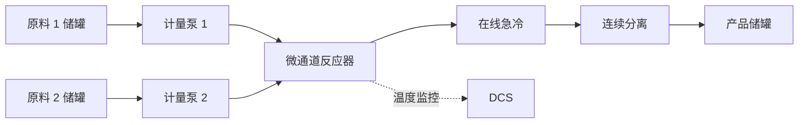
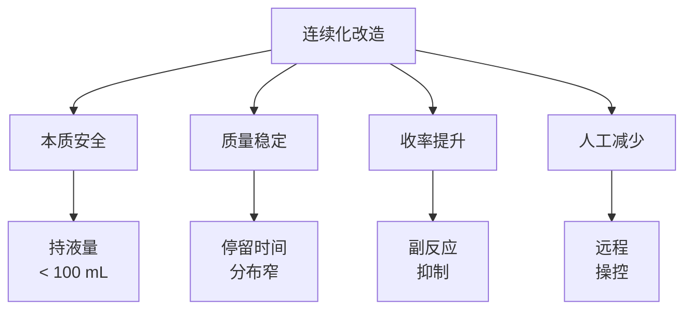
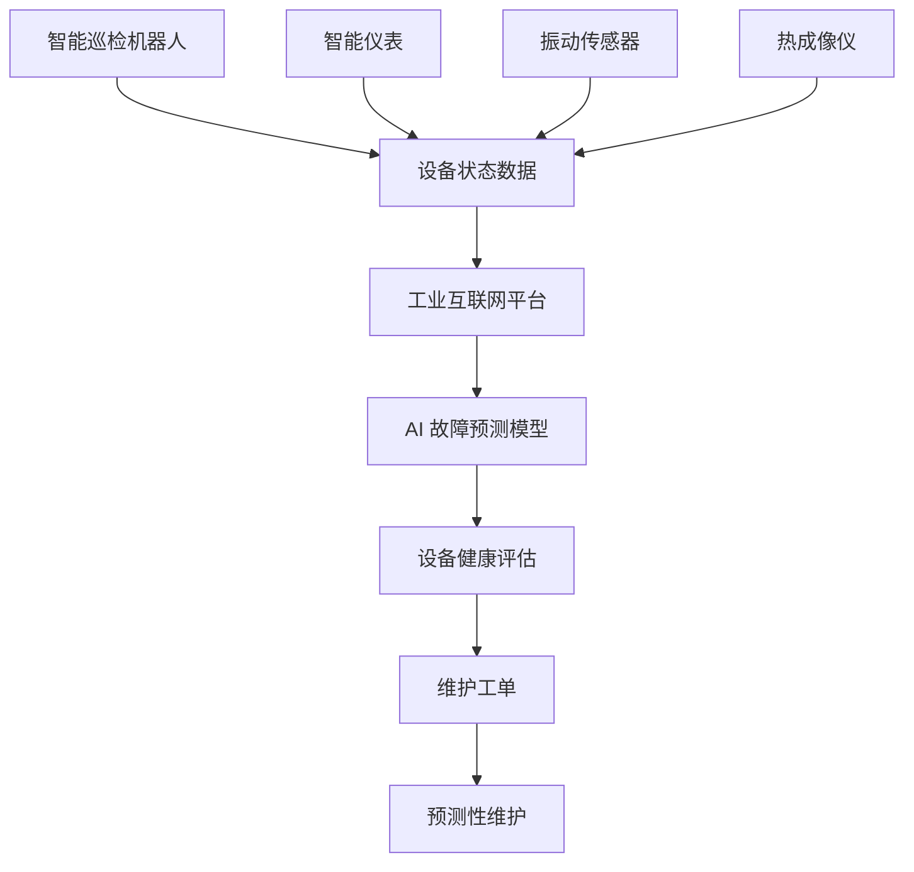
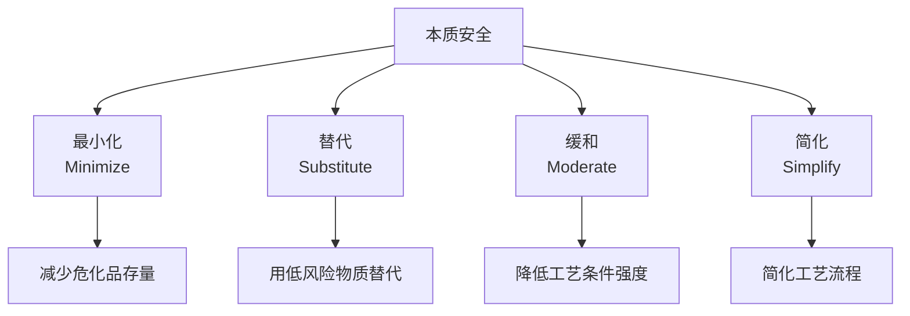
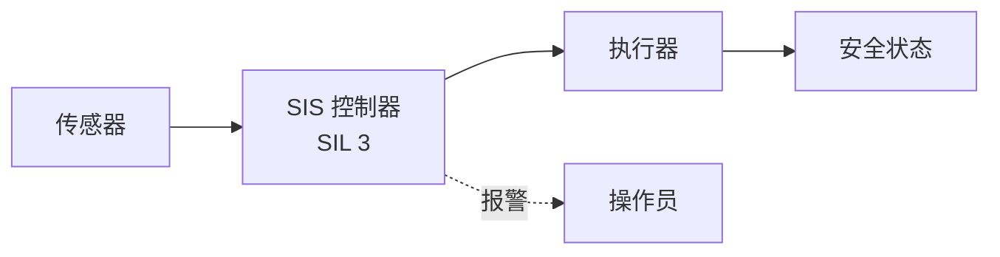
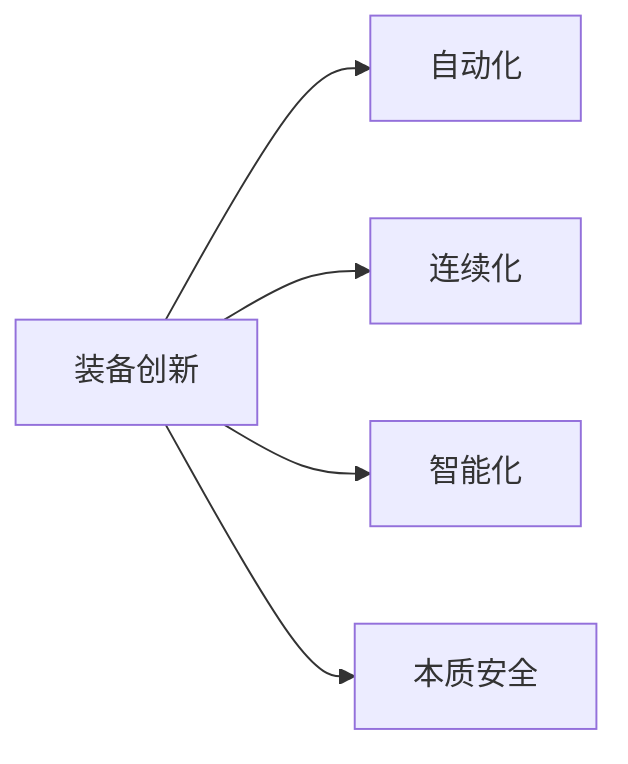
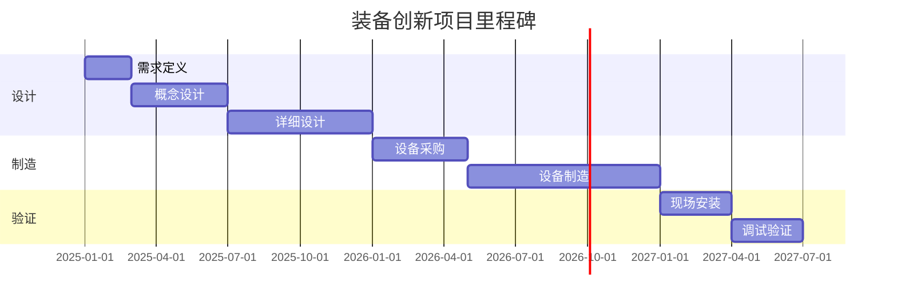

# 第 29 章 装备创新案例

> **本章核心问题**：装备创新是化工研发"硬实力"的体现。自动化、连续化、智能化、本质安全提升四个维度的装备研发有哪些典型路径？
>
> **学习目标**：
> 1. 能识别装备创新在化工研发中的关键作用。
> 2. 能从典型案例中提炼装备研发的方法模板。
> 3. 能针对具体装备问题设计研发方案。

## 开篇引子

化工装备的"代差"直接决定产品质量与生产成本。传统间歇釜被连续流反应器替代、人工包装被自动化包装线替代、人工巡检被智能巡检机器人替代——这些装备创新不是"锦上添花"，而是"生死存亡"。本章聚焦四个维度的装备创新案例：自动化改造、连续化改造、智能化改造、本质安全提升。

## 29.1 自动化改造案例：精细化工车间包装线自动化

### 典型化案例 29-1（行业公开资料）

**项目背景**：

- 装置：某精细化工厂粉体产品包装车间。
- 产能：年产 2 万吨粉体产品，原 4 条包装线，每条需 6 名操作工。
- 项目周期：18 个月。

**改造前状况**：

- 包装精度：±50 g/袋（行业先进 ±10 g/袋）。
- 粉尘浓度：8 mg/m³（国标限值 4 mg/m³）。
- 操作工人数：24 人/班。
- 包装效率：60 袋/小时/线。

**自动化改造方案**：

**图 29-1 自动化包装线流程**

**关键技术装备**：

1. **失重秤替代电子秤**：动态计量精度 ±5 g/袋。
2. **全自动包装机**：伺服控制、PLC 集成。
3. **金属探测 + X 光检测**：替代人工抽检。
4. **机器人码垛**：6 轴机器人替代人工码垛。
5. **AGV 自动入库**：替代人工叉车。
6. **粉尘治理**：负压收尘 + 脉冲布袋除尘。

**改造前后对比**：

| 指标 | 改造前 | 改造后 | 变化 |
|---|---|---|---|
| 包装精度 | ±50 g | ±5 g | 提升 10 倍 |
| 包装效率 | 60 袋/h | 120 袋/h | 提升 100% |
| 操作工人数 | 24 人/班 | 6 人/班 | 减少 75% |
| 粉尘浓度 | 8 mg/m³ | 1.5 mg/m³ | -81% |
| 客户投诉 | 月均 5 起 | 月均 0.3 起 | -94% |
| 投资回收期 | - | - | 1.8 年 |

**对一线工程师的启示**：

- **自动化是"一次性投入换长期收益"**：单条包装线投资 500-1000 万，2 年回本。
- **粉尘治理是精细化工厂的职业卫生核心**：自动化降尘比人工防护更彻底。
- **机器换人不仅是降本**：稳定性、精度、合规性都显著提升。

### 常见坑

1. **设备选型"拼凑"**：单台先进但整线集成度低，效率上不去。
2. **忽视职业卫生**：粉尘、噪声、振动不治理，操作工职业病风险大。

## 29.2 连续化改造案例：硝化反应连续流改造

### 典型化案例 29-2（公开专利 / 行业资料）

**项目背景**：

- 装置：某化工企业硝化反应釜式装置。
- 产能：年产 5000 吨硝基化合物。
- 反应类型：强放热硝化反应，常规釜式风险高。
- 项目周期：30 个月。

**改造前问题**：

- 反应釜单批 2 吨，单批反应时间 8 小时。
- 反应放热量大，温升难控制。
- 历史上发生过 2 次反应失控（飞温事故）。
- 操作工暴露风险高（间歇操作常需取样）。

**连续流改造方案**：

**图 29-2 连续流硝化反应流程**

**关键技术装备**：

1. **微通道反应器**：持液量 < 100 mL，本质安全。
2. **精确计量泵**：精度 ±0.5%，确保配比稳定。
3. **在线急冷模块**：毫秒级急冷，抑制副反应。
4. **在线红外/拉曼监测**：实时反应物浓度监测。
5. **DCS 全流程控制**：替代人工取样。

**连续化改造的核心优势**：

**图 29-3 连续化改造的四大优势**

**改造前后对比**：

| 指标 | 改造前（釜式） | 改造后（连续流） | 变化 |
|---|---|---|---|
| 持液量 | 2000 L | 80 L | -96% |
| 单批反应时间 | 8 h | 连续 | - |
| 反应温度控制 | ±10℃ | ±1℃ | 提升 10 倍 |
| 收率 | 88% | 93% | +5 个百分点 |
| 副产物 | 5% | 1.5% | -70% |
| 操作工暴露 | 高 | 极低 | - |
| 年增收益 | - | - | 约 1500 万元 |
| 投资回收期 | - | - | 2.5 年 |

**对一线工程师的启示**：

- **强放热反应优先考虑连续化**：本质安全 + 质量提升双重价值。
- **微通道反应器是化工强放热反应的"杀手锏"**：持液量低 + 传质传热高效。
- **连续化不是简单"把釜变管"**：需要匹配计量、混合、急冷、分离全链条。

### 常见坑

1. **强放热反应"硬上连续化"**：不充分评估反应特性，导致堵塞或失控。
2. **忽视在线监测**：连续化必须有实时监测，否则异常难以及时发现。

## 29.3 智能化改造案例：智慧巡检与预测维护

### 典型化案例 29-3（行业公开资料）

**项目背景**：

- 装置：某大型炼化企业全厂装置。
- 目标：替代人工巡检 + 预测设备故障。
- 项目周期：24 个月。

**改造前状况**：

- 操作工每班巡检 2 次，每次 2 小时。
- 设备故障多为事后发现，非计划停车多。
- 关键机组（压缩机、反应器）无状态监测。

**智能化改造方案**：

**图 29-4 智能化改造架构**

**关键技术装备**：

1. **智能巡检机器人**：四足机器人或轮式机器人搭载红外、可见光、声学传感器。
2. **智能仪表升级**：振动传感器、声学发射、温度传感在线化。
3. **热成像仪**：监测法兰、阀门、电气接点异常发热。
4. **AI 故障预测模型**：基于历史故障数据训练 ML 模型。
5. **工业互联网平台**：设备状态数据汇聚分析。

**智能化改造成果**：

| 指标 | 改造前 | 改造后 | 变化 |
|---|---|---|---|
| 人工巡检时间 | 4 h/班 | 0.5 h/班 | -88% |
| 巡检覆盖率 | 70% | 99% | 提升 29% |
| 故障提前预警 | 0 起/月 | 8 起/月 | - |
| 非计划停车 | 5 次/年 | 1 次/年 | -80% |
| 维修成本 | - | - | -25% |
| 投资回收期 | - | - | 2.8 年 |

**对一线工程师的启示**：

- **智能化不是"机器换人"那么简单**：核心价值在"提前预警"和"数据驱动决策"。
- **AI 预测模型需要高质量数据**：历史故障数据积累是关键基础。
- **巡检机器人有局限性**：复杂环境、危险场所更适用，简单场所人工更经济。

### 常见坑

1. **数据质量差**：原始数据噪声大、未标定，AI 模型失效。
2. **AI 模型"漂移"**：设备老化、原料变化后模型失效，需要持续迭代。

## 29.4 本质安全提升案例：氯气输送本质安全改造

### 典型化案例 29-4（行业公开资料）

**项目背景**：

- 装置：某化工企业氯气输送与使用装置。
- 风险：氯气剧毒，泄漏可能造成重大事故。
- 项目周期：24 个月。

**改造前风险识别（HAZOP）**：

| 节点 | 偏差 | 原因 | 后果 |
|---|---|---|---|
| 氯气缓冲罐 | 流量过大 | 控制阀失效 | 压力高、密封失效 |
| 氯气管线 | 泄漏 | 腐蚀、密封老化 | 中毒事故 |
| 氯气使用点 | 流量波动 | 调节阀失效 | 反应异常 |
| 应急系统 | 失效 | 中和装置故障 | 事故扩大 |

**本质安全"四大原则"**：

**图 29-5 本质安全四大原则**

**本质安全改造措施**：

1. **最小化（Minimize）**：
   - 氯气缓冲罐从 10 m³ 减至 3 m³。
   - 管径优化，减少氯气存量。
   - 在线使用，替代储存。

2. **替代（Substitute）**：
   - 部分环节使用次氯酸钠替代液氯。
   - 在用户侧推广氯气现场发生技术。

3. **缓和（Moderate）**：
   - 降低操作压力（从 1.0 MPa 降至 0.5 MPa）。
   - 降低操作温度（从常温降至低温减少蒸发）。

4. **简化（Simplify）**：
   - 取消中间缓冲环节。
   - 单一管线，简化操作。

**配套的安全仪表系统（SIS）**：

**图 29-6 安全仪表系统（SIS）架构**

| SIL 等级 | PFD（要求时失效概率） | 适用 |
|---|---|---|
| SIL 1 | 10⁻² - 10⁻¹ | 一般报警 |
| SIL 2 | 10⁻³ - 10⁻² | 关键工艺 |
| SIL 3 | 10⁻⁴ - 10⁻³ | 高危工艺（氯气、剧毒物） |
| SIL 4 | 10⁻⁵ - 10⁻⁴ | 极端高危（核工业） |

**改造前后对比**：

| 指标 | 改造前 | 改造后 | 变化 |
|---|---|---|---|
| 氯气存量 | 10 t | 1.5 t | -85% |
| SIS 等级 | SIL 1 | SIL 3 | 显著提升 |
| 应急响应时间 | 5 min | 30 s | 提升 10 倍 |
| 事故风险 | 不可接受 | 显著降低 | - |
| 投资回收期 | - | - | 3.5 年（安全投资） |

**对一线工程师的启示**：

- **本质安全设计比"加安全防护"更彻底**：从源头降低风险，而非"出问题再补救"。
- **SIL 分级是安全仪表的核心**：高危工艺必须 SIL 3 及以上。
- **HAZOP 分析是改造的前提**：不识别风险就改造，是"瞎改"。

### 常见坑

1. **加防护不加本质**：仅靠报警和应急，未从源头减少危化品存量。
2. **SIL 等级"图便宜"**：把高危工艺的 SIS 降级，留下事故隐患。

## 29.5 装备创新的共性方法论

### 核心问题

四个装备创新案例的共性方法论是什么？

### 方法与工具

**装备创新的"五阶段模型"**：

**图 29-7 装备创新五阶段**

各阶段的关键产出：

| 阶段 | 周期 | 关键产出 |
|---|---|---|
| **需求定义** | 1-2 月 | 用户需求文件（URS） |
| **概念设计** | 2-4 月 | 概念方案、P&ID |
| **详细设计** | 4-8 月 | 详细图纸、设备清单 |
| **制造安装** | 6-12 月 | 设备制造、现场安装 |
| **调试验证** | 2-6 月 | FAT、SAT、试运行 |

**装备创新的"五个共性经验"**：

1. **需求定义是根本**：用户需求没想清楚，后面的设计会反复修改。
2. **概念设计比详细设计更关键**：方向错了，详细设计再努力也白搭。
3. **装备国产化需"产学研用"协同**：装备厂 + 设计院 + 用户 + 高校联合攻关。
4. **本质安全是底线**：装备设计必须满足 HAZOP + SIL 要求。
5. **调试验证不可省**：FAT、SAT、试运行是质量保障。

**装备创新的"五个失败教训"**：

1. **照搬国外装备**：未结合国内原料、操作习惯，导致"水土不服"。
2. **装备与工艺脱节**：装备满足设计但工艺不适用。
3. **关键参数余量不足**：未考虑放大效应，工业化时达不到设计指标。
4. **忽视可维护性**：装备难以检修、维护成本高。
5. **安全防护"省钱"**：SIS 等级不够，本质安全不到位。

**装备创新的"四大方向"**：

**图 29-8 装备创新四大方向**

| 方向 | 核心目标 | 典型技术 |
|---|---|---|
| **自动化** | 减少人工 | PLC、机器人、AGV |
| **连续化** | 替代间歇 | 微通道反应器、连续精馏 |
| **智能化** | 数据驱动决策 | AI、IoT、数字孪生 |
| **本质安全** | 从源头降险 | 最小化、替代、缓和、简化 |

### 常见坑

1. **"国外能做的我也能做"**：忽视国内原料、操作习惯差异。
2. **"一次性投资"思维**：忽视运维成本和全生命周期成本。

## 29.6 装备创新的项目管理特殊点

### 核心问题

装备创新项目与一般化工研发项目有什么不同？

### 方法与工具

**装备创新项目的"五个特征"**：

| 特征 | 一般研发 | 装备创新 |
|---|---|---|
| **项目周期** | 3-5 年 | 1-3 年 |
| **不确定因素** | 技术为主 | 技术 + 装备制造 |
| **跨部门协作** | 工艺为主 | 工艺 + 装备 + 自控 + 安全 |
| **资金投入** | 千万级 | 千万到亿元级 |
| **失败容忍度** | 较低 | 略高（探索性） |

**装备创新项目的"六个里程碑"**：

**图 29-9 装备创新项目里程碑**

**装备创新项目的"四种常见风险"**：

| 风险类型 | 表现 | 应对 |
|---|---|---|
| **设计风险** | 装备达不到工艺要求 | 概念设计阶段充分验证 |
| **制造风险** | 装备制造工艺不达标 | 选择有经验的装备厂 |
| **集成风险** | 多系统集成问题 | 提前做集成测试 |
| **安全风险** | 装备安全不达标 | HAZOP + SIL 评审 |

**装备创新项目的"五种典型角色"**：

| 角色 | 职责 |
|---|---|
| **项目负责人** | 整体协调、决策 |
| **工艺工程师** | 提出工艺需求、参与调试 |
| **装备工程师** | 装备设计、制造监督 |
| **自控工程师** | 控制系统设计、调试 |
| **安全工程师** | HAZOP、SIL 评审 |

### 常见坑

1. **设计、制造、调试脱节**：未做 FAT（Factory Acceptance Test）。
2. **装备厂选择"低价优先"**：装备质量问题导致全厂停车。

---

## 本章小结

回到本章开篇"装备代差决定生死"的判断，装备创新案例提炼的方法论可以归纳为六条：

1. **自动化改造（包装线）**：失重秤 + 机器人码垛 + AGV 入库；粉尘治理同步推进。
2. **连续化改造（硝化反应）**：微通道反应器 + 在线急冷 + 在线监测；本质安全与质量稳定双重价值。
3. **智能化改造（智慧巡检）**：巡检机器人 + 智能仪表 + AI 预测；数据质量是基础。
4. **本质安全提升（氯气系统）**：四大原则（最小化、替代、缓和、简化）+ SIL 3 安全仪表。
5. **装备创新五阶段**：需求定义→概念设计→详细设计→制造安装→调试验证。
6. **项目管理特殊点**：周期短、跨部门多、资金大；FAT、HAZOP、SIL 评审不可省。

第 30 章是第九篇的最后一章，聚焦"工业化案例"——中试放大、工业验证、技术转移、成果推广四个维度的实战。

## 思考题

1. 选一个你熟悉的化工反应，评估其是否适合连续化改造。
2. 为一项危化品工艺做一份"本质安全"改造方案（应用四大原则）。
3. 选一个化工装置的薄弱环节，设计一份智能化改造方案。
4. 为一个装备创新项目画一份里程碑甘特图。
5. 调研一项"国产化首台套"装备案例，分析其成功/失败的关键因素。

## 参考文献

[1] 张亚强 等. 微通道反应器在化工中的应用[J]. 化工进展, 2023, 42(3): 1300-1310.
[2] 王立明 等. 化工本质安全设计方法学[J]. 现代化工, 2024, 44(1): 35-40.
[3] 周明 等. 工业机器人码垛系统应用进展[J]. 现代化工, 2024, 44(3): 30-35.
[4] 刘建新 等. 安全仪表系统 SIL 分级方法[J]. 化工进展, 2023, 42(6): 2900-2910.
[5] 张为民 等. 化工装备创新项目管理研究[J]. 现代化工, 2024, 44(5): 30-35.
[6] 中国石油和化学工业联合会. 化工装备国产化进展报告（2023）[R]. 2023.
[7] 国家应急管理部. 危险化学品安全生产标准化[Z]. 2022.
[8] 工业和信息化部. 智能制造典型场景参考指引（2024）[Z]. 2024.
[9] 张勇 等. 化工连续化生产工艺进展[J]. 化工进展, 2024, 43(4): 1800-1810.
[10] 王志明 等. 化工企业智能巡检技术应用[J]. 现代化工, 2024, 44(6): 25-30.

> **注**：参考文献中部分期刊文献的作者与页码为示意性占位，正式出版前需通过 CNKI、Web of Science 等数据库核实补全。