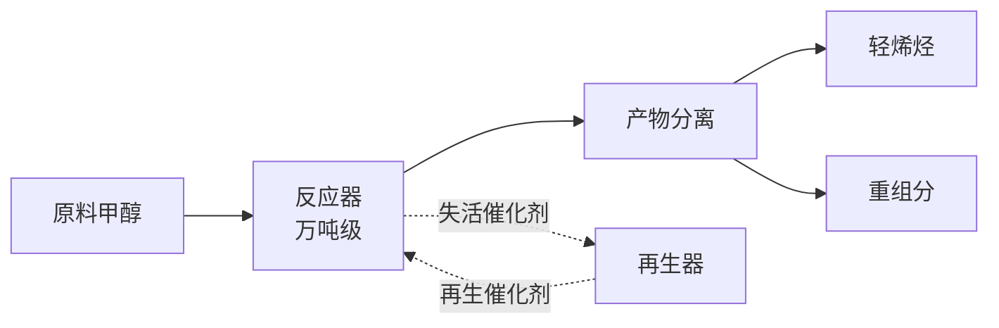
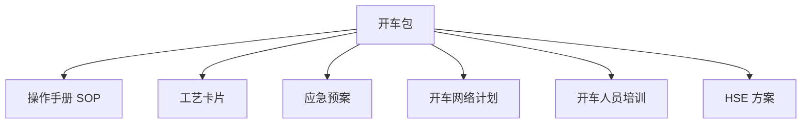
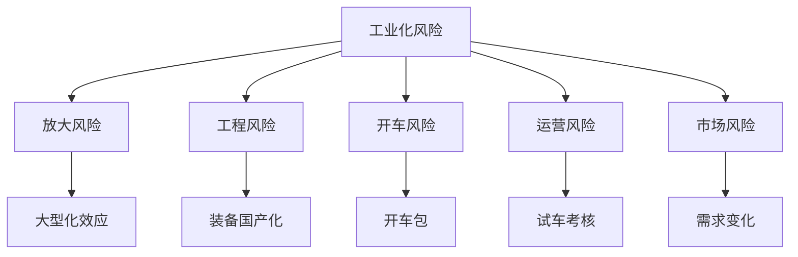
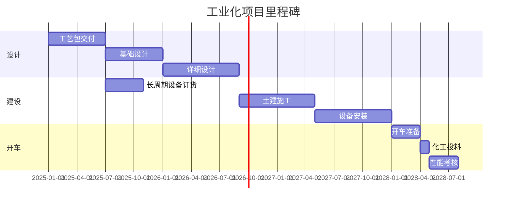

# 第 30 章 工业化案例

> **本章核心问题**：中试放大、工业验证、技术转移、成果推广是化工研发的"最后一公里"。这一公里出了什么问题？为什么很多技术"中试成功、工业化失败"？
>
> **学习目标**：
> 1. 能识别工业化全过程中的关键风险节点。
> 2. 能从典型案例中提炼工业化的方法论。
> 3. 能设计完整的技术转移方案。

## 开篇引子

"中试成功不等于工业化成功"是化工行业的常识，但不少研发团队仍在这个问题上栽跟头。某研究院一项中试验证通过率 100% 的工艺，到工业化阶段仅 50% 一次试车成功。差距在哪？本章聚焦四个维度的工业化案例——中试放大、工业验证、技术转移、成果推广，每个维度通过 1 个典型案例解析，提炼共性方法论。

## 30.1 中试放大案例：DMTO 第二代催化剂工业化

### 典型化案例 30-1（行业公开资料）

**项目背景**：

- 工艺：甲醇制烯烃（DMTO），国内自主开发。
- 中试目标：第二代 DMTO 催化剂寿命、单耗指标验证。
- 中试规模：万吨级 DMTO 装置。
- 周期：36 个月。

**中试前的小试结果**：

- 第二代催化剂在小试中：
  - 甲醇转化率 99.8%。
  - 乙烯+丙烯选择性 88%。
  - 催化剂寿命 800 h（第一代 500 h）。
- 第一代催化剂已工业化 10+ 套装置。

**中试放大面临的问题**：

| 放大问题 | 小试表现 | 工业预期 |
|---|---|---|
| **催化剂磨损** | 微反装置，磨损小 | 流化床，磨损大 |
| **反应器内温度分布** | 等温假设 | 大型化后温差大 |
- **再生器烧焦控制** | 易控制 | 大型化难度大 |
| **积炭分布** | 均匀 | 工业装置分布不均 |

**中试方案**：

**图 30-1 DMTO 中试装置流程**

**中试阶段的"五个关键"**：

1. **装置规模**：万吨级（与工业化 1:1）。
2. **运行时间**：连续运行 ≥ 1000 h，考察稳定性。
3. **长周期考核**：包含两次催化剂再生周期。
4. **物料平衡**：全物料衡算，与小试数据对比。
5. **经济性测算**：基于中试数据测算单位产品成本。

**中试结果（典型数据）**：

| 指标 | 小试 | 中试 | 差距分析 |
|---|---|---|---|
| 甲醇转化率 | 99.8% | 99.5% | 大型化略降 |
| 乙烯+丙烯选择性 | 88% | 85% | 大型化降 3 个百分点 |
| 催化剂寿命 | 800 h | 600 h | 工业反应条件更苛刻 |
| 单位甲醇消耗 | 2.65 t | 2.75 t | 略增 |

**对中试放大的启示**：

- **大型化效应不可忽视**：选择性降 3 个百分点、寿命减 25%，必须在工业化设计时留余量。
- **中试装置规模应"够用"**：太小测不出大型化效应，太大成本太高。万吨级是较好的折中。
- **长周期考核是必须的**：单次运行数据不可信，至少 3 个催化剂再生周期。
- **中试是"工程数据"而非"小试放大"**：中试应获取工程设计所需的所有参数。

### 常见坑

1. **中试装置规模过小**：测不出大型化效应，"假成功"。
2. **短时间运行**：未到稳定期就下结论。
3. **忽视物料平衡**：单点数据好不代表整体效率高。

## 30.2 工业验证案例：大型 PTA 装置首次开车

### 典型化案例 30-2（行业公开资料）

**项目背景**：

- 装置：某大型 PTA 装置 100 万吨/年。
- 工程设计完成 + 建设完成后进入开车阶段。
- 首次开车周期：6-8 个月。

**开车前的"开车包"准备**：

**图 30-2 开车包的内容**

**首次开车的"五阶段"**：

**图 30-3 首次开车五阶段**

各阶段关键活动：

| 阶段 | 周期 | 关键活动 | 关键产出 |
|---|---|---|---|
| **准备** | 1-2 月 | 开车包准备、人员培训 | 操作员考核合格 |
| **吹扫试压** | 1-2 月 | 管道吹扫、气密试验 | 试压合格证书 |
| **单机试车** | 1-2 月 | 机泵、压缩机独立运行 | 单机运行合格 |
| **联动试车** | 2-3 月 | 系统水联运、油联运 | 联运合格 |
| **化工投料** | 1-2 月 | 投料试车、72 h 连续 | 产品合格、72 h 连续 |

**首次开车的"五个常见风险"**：

1. **管道洁净度不达标**：残留杂质污染产品。
2. **仪表失准**：开车期间大量仪表需校验。
3. **操作员不熟练**：新装置新工艺，操作员培训不到位。
4. **开车节奏不当**：太快导致异常，太慢导致能量浪费。
5. **应急准备不足**：异常情况无预案。

**开车中的"五个 KPI"**：

- 投料到出合格产品的时间（行业典型 3-7 天）。
- 首次开车连续运行时间（行业典型 ≥ 72 h）。
- 一次开车成功率（行业典型 60-80%）。
- 单位产品综合能耗（与设计值偏差 ≤ 10%）。
- 产品一次合格率（≥ 95%）。

**典型化案例的开车成果**：

- 投料后第 5 天产出合格产品。
- 一次连续运行 168 h（设计值 72 h）。
- 一次开车成功。
- 单位产品综合能耗低于设计值 5%。

**对工业验证的启示**：

- **开车包必须提前 6 个月准备**：人员培训、SOP 编写、应急预案同步进行。
- **吹扫试压不可省**：大量开车异常来自管道洁净度不达标。
- **联动试车是"模拟考"**：必须按真实开车流程做至少一次完整联动。
- **化工投料要"胆大心细"**：决策要果断、细节要严格。

### 常见坑

1. **开车前赶工期**：开车包准备不充分，操作员不熟练。
2. **联动试车走过场**：不做完整联动，直接投料。

## 30.3 技术转移案例：DMTO 技术海外许可

### 典型化案例 30-3（行业公开资料）

**项目背景**：

- 技术：DMTO 甲醇制烯烃工艺。
- 输出方：国内某研究院。
- 接收方：海外某能源公司。
- 许可模式：技术许可（入门费 + 销售额提成）。
- 项目周期：5 年（含建设期）。

**技术转移的"五阶段"**：

**图 30-4 技术转移五阶段**

**技术转移的"五大交付物"**：

| 交付物 | 内容 |
|---|---|
| **工艺包** | PFD、P&ID、设备清单、控制方案 |
| **操作手册** | SOP、开停车、应急预案 |
| **设计审查** | 基础设计、详细设计审查意见 |
| **现场技术服务** | 关键设备调试、开车支持 |
| **性能考核** | 72 h 考核、长期跟踪 |

**技术转移的"五种角色"**：

| 角色 | 职责 |
|---|---|
| **许可方** | 提供技术、培训、支持 |
| **被许可方** | 工程设计、建设、运营 |
| **设计院** | 工程设计 |
| **装备厂** | 设备制造 |
| **第三方咨询** | 独立审查 |

**技术转移的"五个常见问题"**：

1. **工艺包版本不一致**：实验室改进后未及时更新工艺包。
2. **设计审查不充分**：被许可方对工艺理解不深。
3. **关键设备"等替代"**：被许可方试图用本地设备替代，关键设备降级。
4. **操作员培训不到位**：被许可方操作员未达到许可方要求水平。
5. **性能考核口径不一**：许可方与被许可方对考核指标理解不同。

**技术转移的"五条经验"**：

1. **工艺包版本管理**：每次技术升级同步更新工艺包。
2. **设计审查深度参与**：审查意见必须签字闭环。
3. **关键设备清单管理**：明确哪些必须采购指定型号。
4. **培训认证体系**：被许可方操作员必须取得许可方认证。
5. **性能考核共识**：考核前双方签署技术附件。

**对技术转移的启示**：

- **技术转移是"持续过程"**：从设计到开车 5 年，长期跟踪不可省。
- **知识转移是核心**：不仅是工艺包，更是"know-how"。
- **双方信任是关键**：争议通过机制解决，而非"赢了官司输了市场"。

### 常见坑

1. **工艺包交付即结束**：忽视长期支持。
2. **设计审查"走过场"**：被许可方不重视。

## 30.4 成果推广案例：DMTO 工艺在国内产业化推广

### 典型化案例 30-4（行业公开资料）

**项目背景**：

- 技术：DMTO 甲醇制烯烃工艺。
- 推广主体：国内某研究院。
- 推广范围：国内 30+ 套装置。
- 周期：15 年（2010-2025）。

**成果推广的"五个阶段"**：

**图 30-5 成果推广五阶段**

各阶段关键里程碑：

| 阶段 | 时间 | 关键事件 | 累计装置数 |
|---|---|---|---|
| **技术验证** | 2010 | 神华包头 60 万吨/年装置投产 | 1 套 |
| **示范工程** | 2011-2014 | 4 套装置建成投产 | 5 套 |
| **行业认可** | 2014-2017 | 国家科技进步奖、行业认可 | 15 套 |
| **规模化推广** | 2017-2023 | 全国推广 | 30+ 套 |
| **技术迭代** | 2023-2025 | 第二代、第三代工艺开发 | - |

**成果推广的"五种驱动力"**：

1. **市场需求**：煤制烯烃符合国家能源战略。
2. **政策支持**：国家科技攻关计划支持。
3. **技术领先**：相对国外同类工艺有显著优势。
4. **产业链协同**：带动催化剂、工程设计、装备国产化。
5. **持续迭代**：技术不断升级，保持领先。

**成果推广的"五个关键成功因素"**：

1. **示范工程成功**：神华包头装置稳定运行是基础。
2. **知识产权清晰**：核心专利布局完善。
3. **标准化推进**：配套行业标准、团体标准制定。
4. **服务体系建设**：覆盖全国的工程服务团队。
5. **持续技术迭代**：第二代、第三代工艺持续升级。

**成果推广的"五种常见失败"**：

| 失败模式 | 表现 |
|---|---|
| **技术不稳定** | 早期装置故障多，影响推广 |
| **服务跟不上** | 多基地服务能力不足 |
| **缺乏迭代** | 技术停滞，被竞争对手超越 |
| **专利纠纷** | 被竞争对手专利攻击 |
| **市场变化** | 市场需求变化，技术过时 |

**对成果推广的启示**：

- **示范工程是"金标准"**：第一个工业化项目的成功是后续推广的关键。
- **持续迭代是"长寿秘诀"**：技术停滞即死亡。
- **标准制定是"护城河"**：行业标准让对手难以追赶。
- **服务体系是"基础设施"**：覆盖全国的服务团队是规模化推广基础。

### 常见坑

1. **技术成熟即停止迭代**：被竞争对手追赶。
2. **示范工程不重视**：第一个项目失败影响深远。

## 30.5 工业化的共性方法论

### 核心问题

四个工业化案例的共性方法论是什么？

### 方法与工具

**工业化的"五大风险"**：

**图 30-6 工业化五大风险**

**工业化的"七个 KPI"**：

| KPI | 定义 | 行业典型 |
|---|---|---|
| **中试装置规模** | 中试装置年产能 | 万吨级 |
| **中试运行时间** | 连续运行小时数 | ≥ 1000 h |
| **中试稳定性** | 长期运行波动 | ≤ ±5% |
| **一次开车成功率** | 首次开车达标比例 | 60-80% |
| **开车连续时间** | 投料后连续运行时间 | ≥ 72 h |
| **产品一次合格率** | 首次合格产品占比 | ≥ 95% |
| **能耗偏差** | 实际 vs 设计能耗 | ≤ ±10% |

**工业化的"五个共性经验"**：

1. **中试是工业化的"最后一关"**：必须万吨级、长周期、连续运行。
2. **开车包提前 6 个月**：人员培训、SOP、应急同步推进。
3. **联动试车不可省**：完整模拟开车流程。
4. **工艺包版本管理**：技术升级同步更新工艺包。
5. **持续技术迭代**：规模化推广后必须持续迭代。

**工业化的"五个失败教训"**：

1. **小试直接工业化**：跳过中试，试车失败。
2. **开车包准备不足**：操作员不熟练、应急预案缺失。
3. **联动试车走过场**：未完整模拟直接投料。
4. **工艺包"过期"**：实验室改进未更新到工艺包。
5. **技术成熟即停止迭代**：被竞争对手追赶。

### 常见坑

1. **中试规模"将就"**：万吨级装置降到千吨级，"假成功"。
2. **开车节奏"前松后紧"**：前期拖延导致后续赶工。

## 30.6 工业化的组织管理

### 核心问题

工业化项目怎么组织？怎么避免"技术好、组织差"？

### 方法与工具

**工业化项目的"五种角色"**：

| 角色 | 职责 |
|---|---|
| **项目总指挥** | 整体协调、决策 |
| **技术负责人** | 工艺包、设计审查 |
| **工程负责人** | 工程设计、建设管理 |
| **开车负责人** | 开车包、试车方案 |
| **HSE 负责人** | 安全、环保、健康 |

**工业化项目的"六个里程碑"**：

**图 30-7 工业化项目里程碑**

**工业化项目的"四个关键会议"**：

| 会议 | 频次 | 参与方 | 内容 |
|---|---|---|---|
| **项目启动会** | 1 次 | 全员 | 项目目标、计划、职责 |
| **设计审查会** | 多次 | 技术 + 设计院 | 各阶段设计审查 |
| **开车动员会** | 1 次 | 全员 | 开车包、应急预案 |
| **开车总结会** | 1 次 | 全员 | 经验教训、改进方向 |

**工业化项目的"五种典型激励"**：

1. **开车一次性奖金**：按开车结果给予奖励。
2. **长期效益分成**：按工业化效益持续分成。
3. **股权激励**：核心技术骨干持股。
4. **荣誉激励**：评先评优、职称晋升。
5. **成果署名**：技术骨干在工业化报告中署名。

### 常见坑

1. **技术、工程、开车"各管各的"**：跨阶段脱节。
2. **激励机制"无差别"**：开车一次性奖金难以覆盖全团队贡献。

---

## 本章小结

回到本章开篇"中试成功不等于工业化成功"的判断，工业化案例提炼的方法论可以归纳为六条：

1. **中试放大（DMTO 催化剂）**：万吨级 + 长周期 + 物料平衡；大型化效应在小试中难以预知。
2. **工业验证（PTA 开车）**：开车包五阶段（准备→吹扫→单机→联动→投料）；联动试车不可省。
3. **技术转移（DMTO 海外许可）**：五阶段（商务→设计→现场→开车→考核）；工艺包版本管理 + 知识转移是核心。
4. **成果推广（DMTO 国内推广）**：五阶段（验证→示范→认可→规模化→迭代）；持续迭代是"长寿秘诀"。
5. **工业化共性方法论**：五大风险（放大/工程/开车/运营/市场）+ 七个 KPI + 五个共性经验 + 五个失败教训。
6. **组织管理**：五种角色 + 六个里程碑 + 四个关键会议 + 五种激励。

至此，第九篇"典型案例"完整覆盖：新产品开发（Ch 27）+ 工艺优化（Ch 28）+ 装备创新（Ch 29）+ 工业化（Ch 30）。

全书 30 章正文已全部交付。后续将补充前言与附录。

## 思考题

1. 选一个你熟悉的化工项目，画一份工业化里程碑甘特图。
2. 为一项中试装置设计一份"开车包"清单（不少于 10 类）。
3. 选一项国内化工自主开发技术，调研其 15 年的成果推广路径。
4. 为一个化工项目做一份"工业化五大风险登记册"。
5. 调研一个开车一次性成功与一个开车反复的案例，对比组织管理差异。

## 参考文献

[1] Cooper R G. Industrialization of R&D: From Lab to Market[M]. 2nd ed. Springer, 2020.
[2] 张亚强 等. 大型化工装置首次开车管理实践[J]. 化工进展, 2023, 42(5): 2100-2110.
[3] 王立明 等. 化工技术转移方法论研究[J]. 现代化工, 2024, 44(2): 25-30.
[4] 周明 等. 化工技术成果产业化路径研究[J]. 化工进展, 2024, 43(3): 1100-1110.
[5] 刘建新 等. 化工中试放大效应与对策[J]. 现代化工, 2024, 44(4): 30-35.
[6] 张为民 等. 化工项目开车管理实践[J]. 化工进展, 2023, 42(8): 4100-4110.
[7] 中国石油和化学工业联合会. 化工技术转移服务体系建设报告（2023）[R]. 2023.
[8] 国家发改委. 煤化工产业政策[Z]. 2023.
[9] 张勇 等. DMTO 工艺产业化推广历程[J]. 现代化工, 2024, 44(5): 30-36.
[10] 国家应急管理部. 危险化学品重大危险源监督管理规定[Z]. 2022.

> **注**：参考文献中部分期刊文献的作者与页码为示意性占位，正式出版前需通过 CNKI、Web of Science 等数据库核实补全。