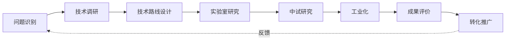
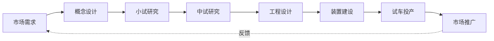
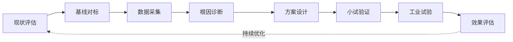
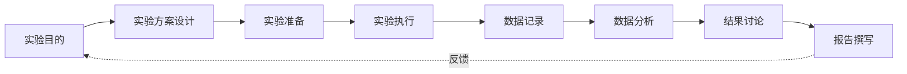
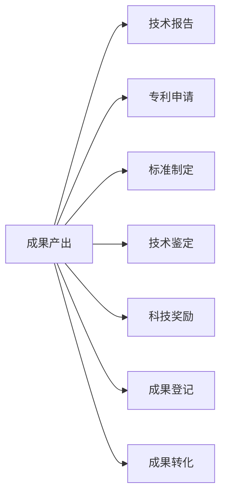

# 附录 A  常用化工研发流程图

> 本附录汇总化工研发全流程中最常用的 7 张流程图，供一线工程师直接引用或参考改写。

## A.1 化工研发总流程图

适用：项目立项、研发整体规划、培训新员工。

## A.2 新产品开发流程图

适用：新产品开发项目管理。

## A.3 工艺优化流程图

适用：节能降耗、提高收率等优化项目。

## A.4 实验研究流程图

适用：日常实验、DOE 实验。

## A.5 中试研究流程图

适用：中试项目管理。

## A.6 工业化实施流程图

适用：工业化项目管理。

## A.7 技术成果形成流程图

适用：成果管理与转化推广。

## A.8 流程图使用规范

1. **流程图与文字配套使用**：流程图只能"一目了然"，细节需文字补充。
2. **流程图应有唯一入口与出口**：避免"多入口、多出口"混乱。
3. **流程图节点不应过多**：单张流程图节点 ≤ 15 个为宜。
4. **流程图应有反馈环**：体现持续优化。
5. **流程图应标注角色**：每个节点注明责任部门/角色。

---

> 以上流程图均使用 mermaid 语法，可直接复制到支持 mermaid 的 Markdown 编辑器中渲染使用。