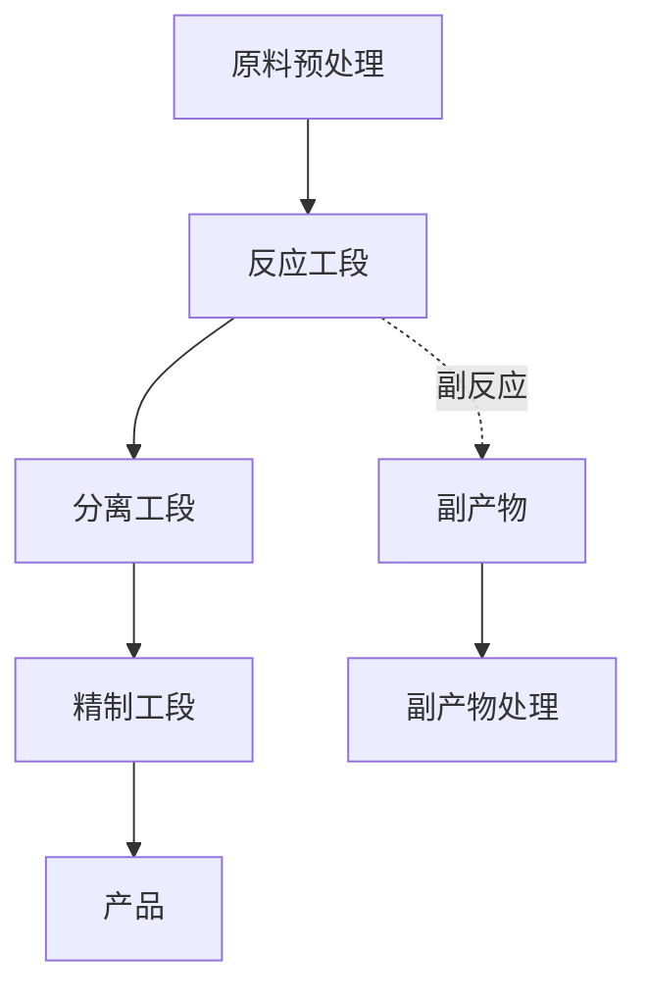
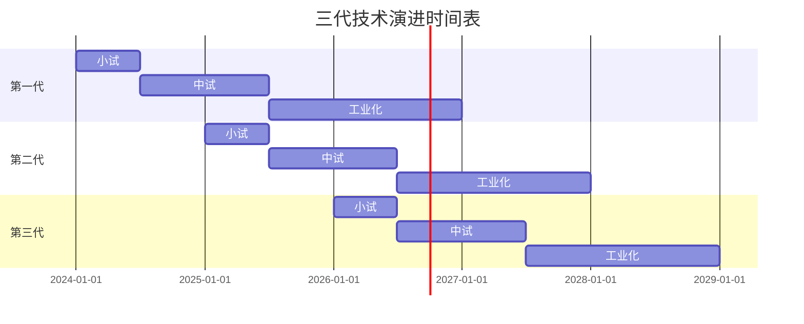
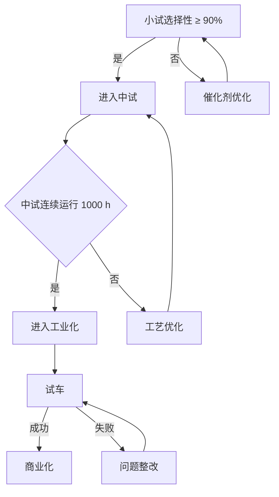

# 附录 D  技术路线图模板

> 本附录提供化工研发项目的技术路线图模板，含技术架构、技术演进、里程碑、风险预案四个核心模块。

## D.1 技术路线图基本信息

| 项目 | 内容 |
|---|---|
| 项目名称 | |
| 编制人 | |
| 审核人 | |
| 编制日期 | |
| 版本号 | |
| 项目周期 | |

## D.2 技术架构图

### D.2.1 总体技术架构

### D.2.2 关键工艺参数

| 工序 | 温度 | 压力 | 关键设备 | 控制指标 |
|---|---|---|---|---|
| 原料预处理 | 25-50℃ | 常压 | 储罐、过滤器 | 水分 ≤ 0.1% |
| 反应 | 200-250℃ | 3-5 MPa | 反应器 R-101 | 转化率 ≥ 95% |
| 分离 | 80-120℃ | 0.1 MPa | 塔 T-201 | 纯度 ≥ 99% |
| 精制 | 50-80℃ | 0.01 MPa | 精馏塔 T-301 | 纯度 ≥ 99.9% |

## D.3 技术演进路线

### D.3.1 三代技术演进（示例）

### D.3.2 技术指标对比

| 指标 | 第一代 | 第二代 | 第三代 | 行业先进 |
|---|---|---|---|---|
| 选择性 | 85% | 90% | 93% | 92% |
| 催化剂寿命 | 500 h | 800 h | 1200 h | 1000 h |
| 能耗 | 1.5 t/t | 1.3 t/t | 1.1 t/t | 1.2 t/t |
| 投资强度 | 高 | 中 | 中 | - |

## D.4 里程碑节点

| 编号 | 里程碑 | 时点 | 标志性交付物 | 责任人 |
|---|---|---|---|---|
| M1 | 项目启动 | T+0 | 立项书、项目组 | 项目经理 |
| M2 | 技术路线确定 | T+3m | 技术路线图 | 技术负责人 |
| M3 | 小试完成 | T+12m | 小试报告 | 工艺工程师 |
| M4 | 中试完成 | T+24m | 中试报告 | 中试负责人 |
| M5 | 工业化设计 | T+30m | 工艺包 | 设计院 |
| M6 | 装置建成 | T+42m | 中交证书 | 项目经理 |
| M7 | 工业试车 | T+45m | 试车报告 | 开车负责人 |
| M8 | 性能考核 | T+48m | 考核报告 | 项目经理 |
| M9 | 项目验收 | T+54m | 验收报告 | 项目经理 |

## D.5 风险预案

### D.5.1 风险登记册

| 风险编号 | 风险描述 | 概率 | 影响 | 等级 | 应对措施 |
|---|---|---|---|---|---|
| R-01 | 催化剂寿命不达标 | 中 | 高 | 高 | 备选催化剂并行开发 |
| R-02 | 中试装置延期 | 中 | 中 | 中 | 备选场地预先沟通 |
| R-03 | 核心研发人员离职 | 低 | 高 | 中 | AB 角、知识沉淀 |
| R-04 | 原料价格大幅波动 | 高 | 中 | 高 | 长协采购 + 套保 |
| R-05 | 客户需求变化 | 低 | 中 | 低 | 应用拓展 |

### D.5.2 应急预案

针对每个"高风险"项，应制定应急预案：

- 风险 R-01 应急预案：6 个月未达到选择性 90%，启动备选催化剂路径。
- 风险 R-04 应急预案：原料价格上涨 30% 以上，启动长协谈判 + 套保。

## D.6 技术路线决策树

## D.7 技术路线图编写规范

1. **架构图清晰**：用 mermaid 或 Visio 绘制，分层级。
2. **指标量化**：所有技术指标必须量化（数值 + 单位）。
3. **里程碑硬约束**：每个里程碑有明确交付物，避免"过程里程碑"。
4. **风险量化**：风险按概率×影响分级，避免主观判断。
5. **决策树清晰**：关键技术决策点明确，避免"暗箱决策"。

---

> 详细方法论可参见第 4 章"技术路线设计"。