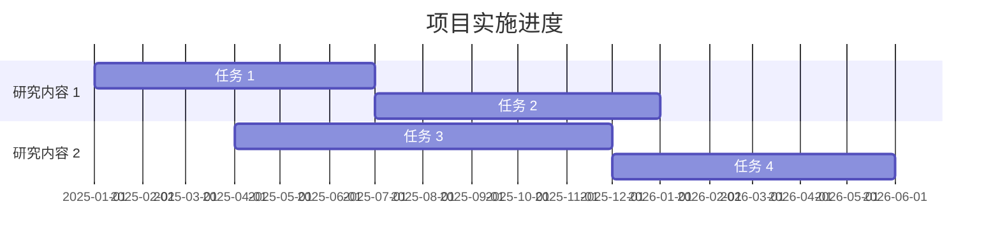
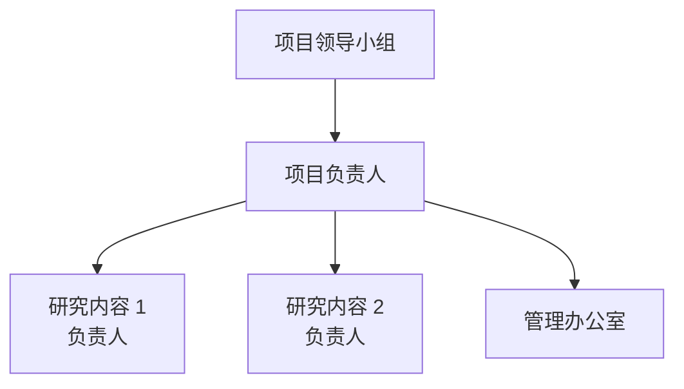

# 附录 E  科研项目计划书模板

> 本附录提供科研项目计划书的标准化模板，含基本信息、必要性论证、技术方案、进度计划、经费预算、风险评估等核心章节。

## E.1 封面信息

| 项目 | 内容 |
|---|---|
| 项目名称 | |
| 项目类别 | □国家专项 □省部级 □企业自立 □横向 □产学研 |
| 申报单位 | |
| 协作单位 | |
| 项目负责人 | |
| 申报日期 | |
| 申报金额 | |

## E.2 项目摘要（500-800 字）

模板：

```
本项目针对 [行业/领域] 中 [具体问题]，开展 [研究内容] 研究。
项目目标是 [总体目标]，预期达到 [量化指标]。
项目技术路线是 [核心思路]。
项目实施周期 [X 年]，预期产出 [成果]。
项目的实施将为 [应用场景] 提供 [解决方案]，对 [产业] 发展具有 [意义]。
```

## E.3 项目背景与必要性

### E.3.1 产业背景

- 行业规模、增速、市场结构。
- 痛点与机遇（数据化）。

### E.3.2 现有技术分析

- 国内外现状。
- 现有技术不足（对比表）。

### E.3.3 项目必要性

- 国家战略契合度。
- 企业发展需求。
- 行业突破意义。

## E.4 项目目标与指标

### E.4.1 总体目标

项目最终要实现的目标（1 段话）。

### E.4.2 量化指标

| 指标类型 | 当前水平 | 项目目标 | 行业先进 |
|---|---|---|---|
| 技术指标 | | | |
| 经济指标 | | | |
| 知识产权 | | | |
| 人才培养 | | | |

### E.4.3 分阶段目标

| 阶段 | 时点 | 阶段目标 |
|---|---|---|
| 第一阶段 | 0-12 月 | 小试研究 |
| 第二阶段 | 12-24 月 | 中试研究 |
| 第三阶段 | 24-36 月 | 工业化 |

## E.5 技术方案

### E.5.1 技术路线

参见附录 D 的技术路线图模板。

### E.5.2 研究内容

分解为 3-5 个研究课题，每个课题含：

- 研究目标。
- 研究方法。
- 预期成果。
- 责任人。

### E.5.3 技术关键与创新点

- 关键技术（3-5 项）。
- 创新点（2-3 项）。
- 知识产权策略。

## E.6 项目实施进度

### E.6.1 项目甘特图



### E.6.2 里程碑节点

参见附录 D 的里程碑模板。

## E.7 项目经费预算

| 科目 | 预算（万元） | 占比 | 说明 |
|---|---|---|---|
| 设备费 | | | |
| 材料费 | | | |
| 测试化验费 | | | |
| 燃料动力费 | | | |
| 差旅/会议 | | | |
| 出版/文献 | | | |
| 劳务费 | | | |
| 间接费用 | | | |
| **合计** | | 100% | |

## E.8 项目组织与管理

### E.8.1 项目组织架构



### E.8.2 管理机制

- 节点管理：周例会、月度 review、季度检查。
- 经费管理：预算、拨付、调整、决算。
- 风险管理：识别、评估、应对、监控。

## E.9 项目风险与对策

| 风险类型 | 具体风险 | 概率 | 影响 | 应对措施 |
|---|---|---|---|---|
| 技术风险 | | | | |
| 进度风险 | | | | |
| 经费风险 | | | | |
| 人员风险 | | | | |

## E.10 预期成果

### E.10.1 技术成果

- 关键技术指标达成。
- 知识产权申请（专利、论文、标准）。
- 工艺包、技术报告。

### E.10.2 经济效益

- 直接经济效益（产品销售收入、税收）。
- 间接经济效益（节能、降耗、减排）。

### E.10.3 社会效益

- 行业带动作用。
- 国产化突破。
- 人才培养。

### E.10.4 成果转化

- 自主转化、技术许可、技术转让。
- 后续工业化路径。

## E.11 附件清单

- 项目组成员简历。
- 现有基础证明（专利、论文、设备）。
- 协作单位合作协议。
- 经费预算明细。

---

> 详细方法论可参见第 20 章"科研项目管理"。