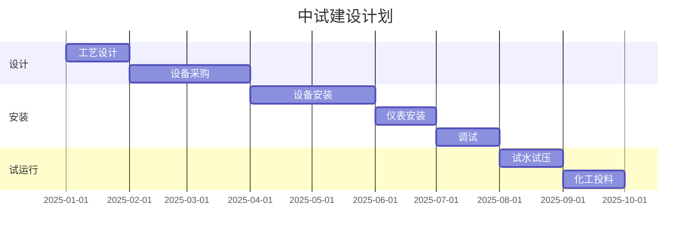

# 附录 G  中试方案模板

> 本附录提供化工中试研究方案的标准化模板，含中试目标、设计、建设、运行、评价等核心环节。

## G.1 中试方案基本信息

| 项目 | 内容 |
|---|---|
| 项目名称 | |
| 中试目标 | |
| 中试规模 | |
| 中试地点 | |
| 中试周期 | |
| 编制人 | |
| 审核人 | |

## G.2 中试目标

### G.2.1 总体目标

中试要验证的 1-2 个核心问题。

### G.2.2 具体目标

| 序号 | 目标 | 量化指标 |
|---|---|---|
| 1 | 验证工艺指标 | 选择性 ≥ 90% |
| 2 | 验证连续运行 | 1000 h 连续 |
| 3 | 考察放大效应 | 转化率偏差 ≤ 5% |
| 4 | 提供工业设计数据 | 物料平衡、能耗 |

## G.3 中试设计

### G.3.1 中试装置规模选择

- 规模选择依据：放大效应、原料消耗、安全性、数据可靠性。
- 典型规模：实验室 × 100-1000 倍。

### G.3.2 工艺流程设计

### G.3.3 关键设备清单

| 序号 | 设备 | 规格 | 材质 | 数量 |
|---|---|---|---|---|
| 1 | 反应器 | XX L | 316L | 1 |
| 2 | 计量泵 | XX L/h | - | 2 |
| 3 | 换热器 | XX m² | 316L | 1 |

## G.4 中试建设

### G.4.1 建设计划

### G.4.2 中试建设预算

| 科目 | 预算（万元） |
|---|---|
| 设备费 | |
| 安装费 | |
| 仪表费 | |
| 材料费 | |
| 化验费 | |
| 人工费 | |
| **合计** | |

## G.5 中试运行

### G.5.1 运行计划

- 试水试压：1-2 周。
- 化工投料试运行：1 周。
- 正常运行：1000 h。
- 催化剂再生周期：1-2 次。

### G.5.2 运行数据采集

- DCS 数据：温度、压力、流量、液位（秒级）。
- 离线化验：原料、产品、副产物（小时/日级）。
- 设备数据：振动、温度、电流。

### G.5.3 运行风险

| 风险 | 应对 |
|---|---|
| 反应失控 | 紧急冷却、紧急停车 |
| 设备故障 | 备用设备、应急维修 |
| 安全事故 | HAZOP + 应急方案 |

## G.6 中试评价

### G.6.1 评价指标

| 指标 | 小试值 | 中试值 | 偏差 |
|---|---|---|---|
| 转化率 | | | |
| 选择性 | | | |
| 收率 | | | |
| 能耗 | | | |
| 催化剂寿命 | | | |

### G.6.2 评价结论

中试是否达到预期目标？放大效应如何？是否可进入工业化？

### G.6.3 工业化建议

- 工业装置规模建议。
- 关键工艺参数建议。
- 关键设备选型建议。
- 风险预警与建议。

## G.7 中试报告模板

### G.7.1 报告信息

- 项目名称、装置规模、运行时间。

### G.7.2 中试目的

明确中试要回答的问题。

### G.7.3 装置概述

- 工艺流程。
- 设备清单。
- 控制方案。

### G.7.4 试验结果

- 各工况数据。
- 物料平衡。
- 关键指标对比。

### G.7.5 讨论与建议

- 放大效应分析。
- 工业化建议。
- 进一步研究方向。

---

> 详细方法论可参见第 15 章"中试研究"。