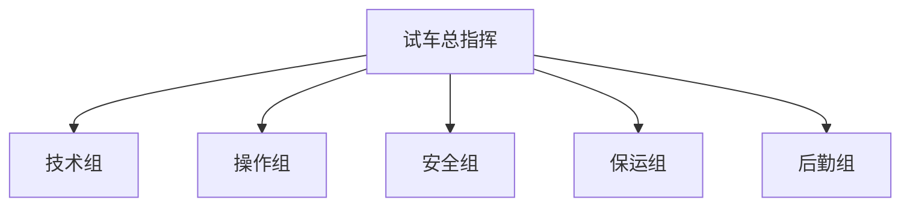
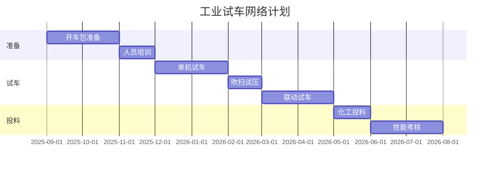
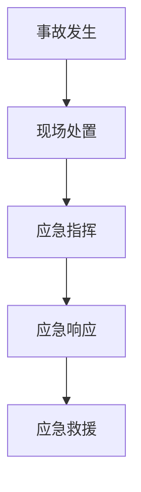

# 附录 H  工业试车方案模板

> 本附录提供化工装置工业试车方案的标准化模板，含开车准备、单机试车、联动试车、化工投料、性能考核等核心环节。

## H.1 试车方案基本信息

| 项目 | 内容 |
|---|---|
| 装置名称 | |
| 建设规模 | |
| 试车周期 | |
| 试车指挥 | |
| 编制人 | |
| 审核人 | |
| 批准人 | |

## H.2 试车目标

### H.2.1 总体目标

试车要达成的总体目标（如：72 h 连续运行合格、产能 80% 设计值）。

### H.2.2 具体目标

| 序号 | 目标 | 量化指标 |
|---|---|---|
| 1 | 一次投料成功 | 投料到出合格产品 ≤ 7 天 |
| 2 | 连续运行 | 72 h 连续运行合格 |
| 3 | 达到设计产能 | ≥ 80% |
| 4 | 产品质量合格 | ≥ 95% 一次合格率 |
| 5 | 性能考核达标 | 各项指标满足设计 |

## H.3 试车组织

### H.3.1 试车组织架构

### H.3.2 各组职责

| 组 | 职责 |
|---|---|
| 试车总指挥 | 整体协调、决策 |
| 技术组 | 工艺、设备、仪表技术支持 |
| 操作组 | 现场操作 |
| 安全组 | HSE 管理、应急响应 |
| 保运组 | 设备维护、检修 |
| 后勤组 | 餐饮、保洁、车辆 |

## H.4 试车准备

### H.4.1 开车包清单

| 序号 | 文档 | 状态 |
|---|---|---|
| 1 | 操作手册 SOP | □完成 |
| 2 | 工艺卡片 | □完成 |
| 3 | 应急预案 | □完成 |
| 4 | 开车网络计划 | □完成 |
| 5 | 操作员培训 | □完成 |
| 6 | HSE 方案 | □完成 |
| 7 | 设备清单 | □完成 |
| 8 | 仪表清单 | □完成 |
| 9 | 联锁试验报告 | □完成 |
| 10 | 三废处置方案 | □完成 |

### H.4.2 开车准备清单

| 类别 | 项目 | 状态 |
|---|---|---|
| 人员 | 操作员到位 | □ |
| 人员 | 工艺培训完成 | □ |
| 人员 | 安全培训完成 | □ |
| 物料 | 原料到位 | □ |
| 物料 | 催化剂到位 | □ |
| 公用工程 | 水电气到位 | □ |
| 公用工程 | 仪表空气到位 | □ |
| 安全 | 消防系统投用 | □ |
| 安全 | 可燃气体报警投用 | □ |
| 安全 | 应急物资到位 | □ |

## H.5 试车阶段

### H.5.1 阶段 1：单机试车（2-3 月）

- 设备单体试车：泵、压缩机、风机、搅拌器。
- 关键设备：试车时间、试车记录、性能测试。

### H.5.2 阶段 2：吹扫试压（1-2 月）

- 管道吹扫：按系统、分段。
- 气密试验：保压时间、压力降、泄漏点。
- 仪表回路测试：每个回路。

### H.5.3 阶段 3：联动试车（2-3 月）

- 水联运：以水代料，全流程跑通。
- 油联运：润滑油循环、密封油系统。
- 仪表联锁：模拟信号测试。
- 公用工程系统：蒸汽、循环水、压缩空气。

### H.5.4 阶段 4：化工投料（1-2 月）

- 投料前的最终检查。
- 按操作规程投料。
- 逐步提升负荷至设计值。
- 产品分析与调整。

### H.5.5 阶段 5：性能考核（1-3 月）

- 72 h 连续运行考核。
- 各项指标对比设计值。
- 验收文件准备。

## H.6 试车网络计划

## H.7 应急预案

### H.7.1 应急组织

### H.7.2 典型事故应急

| 事故类型 | 应急措施 |
|---|---|
| 反应失控 | 紧急停车、冷却、泄压 |
| 物料泄漏 | 隔离、收集、中和 |
| 火灾爆炸 | 灭火、隔离、人员撤离 |
| 人员伤害 | 急救、转运、医院 |
| 停电 | 备用电源、紧急停车 |
| 停水 | 减负荷、紧急停车 |

## H.8 试车验收

### H.8.1 验收清单

| 序号 | 验收项目 | 状态 | 备注 |
|---|---|---|---|
| 1 | 72 h 连续运行 | | |
| 2 | 产能达标 | | |
| 3 | 产品质量达标 | | |
| 4 | 各项工艺指标 | | |
| 5 | 能耗达标 | | |
| 6 | HSE 设施齐全 | | |
| 7 | 文档齐全 | | |

### H.8.2 验收结论

- □通过 □整改后通过 □不通过
- 整改项：
- 后续工作：

---

> 详细方法论可参见第 17 章"工业化验证"。